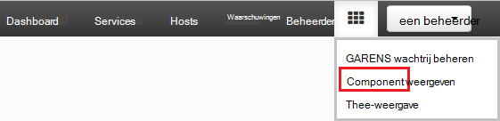
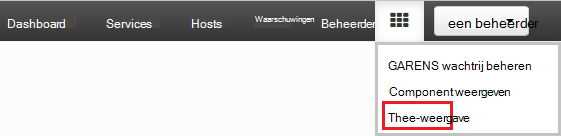
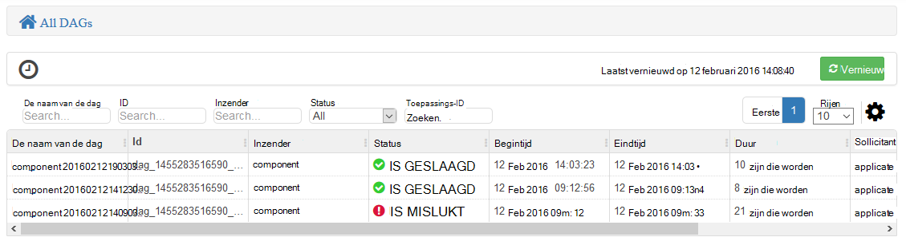
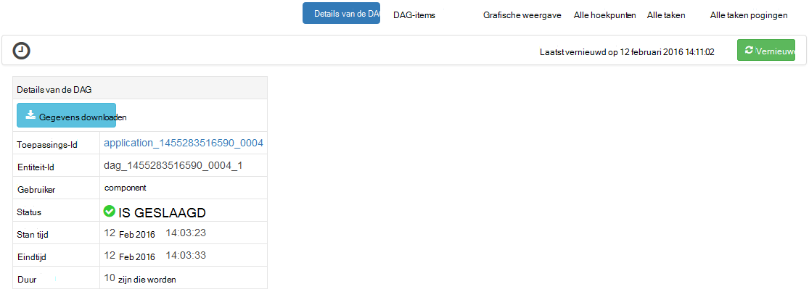
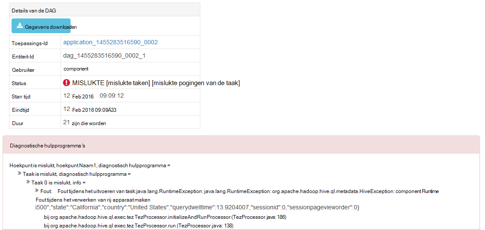
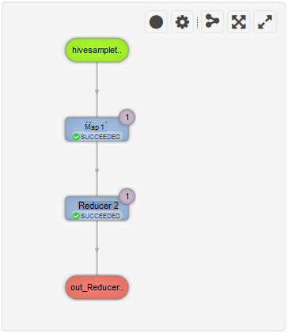
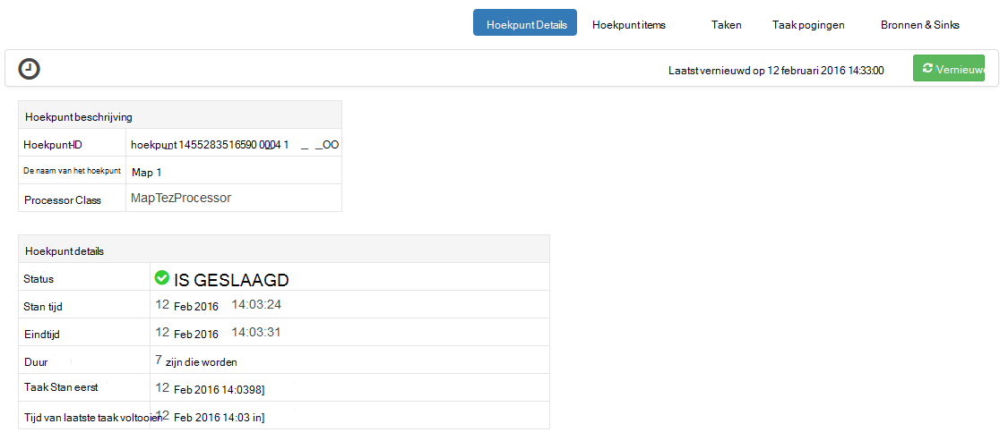
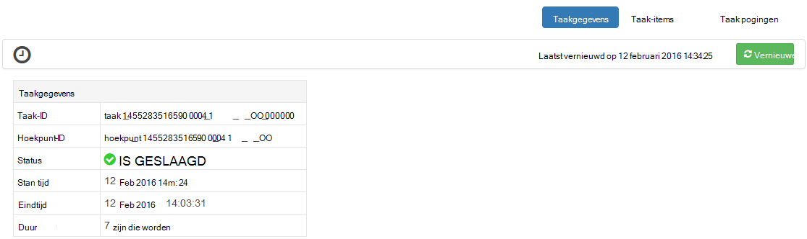

<properties
pageTitle="Gebruik Ambari Tez weergave met HDInsight | Azure"
description="Informatie over het gebruik van de weergave Ambari Tez voor foutopsporing Tez taken op HDInsight."
services="hdinsight"
documentationCenter=""
authors="Blackmist"
manager="jhubbard"
editor="cgronlun"/>

<tags
ms.service="hdinsight"
ms.devlang="na"
ms.topic="article"
ms.tgt_pltfrm="na"
ms.workload="big-data"
ms.date="10/04/2016"
ms.author="larryfr"/>

# Fouten opsporen in Tez taken op HDInsight via Ambari weergaven

De gebruikersinterface van de Web Ambari voor HDInsight bevat de weergave van een Tez die kan worden gebruikt om te begrijpen en fouten opsporen in taken die Tez als de engine worden uitgevoerd gebruiken. De weergave Tez kunt u de taak als een grafiek van verbonden items visualiseren, zoom in op elk item en statistieken en logboekinformatie ophalen.

> [AZURE.NOTE] De informatie in dit document is specifiek voor HDInsight Linux gebaseerde clusters. Voor informatie over foutopsporing Tez taken met HDInsight op basis van Windows, Zie [gebruik van de gebruikersinterface Tez voor foutopsporing Tez taken op Windows gebaseerde HDInsight](hdinsight-debug-tez-ui.md).

## Vereisten voor

* Een cluster Linux gebaseerde HDInsight. Zie [aan de slag met Linux gebaseerde HDInsight](hdinsight-hadoop-linux-tutorial-get-started.md)voor informatie over het maken van een nieuw cluster.

* Een modern webbrowser die ondersteuning biedt voor HTML5.

## Lidmaatschap Tez

Tez is een uitgebreid framework voor gegevensverwerking in Hadoop waarmee groter snelheden dan traditionele MapReduce verwerking. Voor Linux gebaseerde HDInsight kolomgroepen is dit de standaard-engine voor component.

Wanneer het werk is verzonden naar Tez, wordt een doorgestuurd acyclische Graph (DAG) waarmee de volgorde van de uitvoering van de acties die is vereist door de taak wordt beschreven. Afzonderlijke acties hoekpunten worden genoemd, en een deel van de algehele taak uitvoeren. De werkelijke uitvoering van het werk dat wordt beschreven door een hoekpunt een taak wordt genoemd, en mogelijk worden verdeeld over meerdere knooppunten in het cluster.

### Wat is de weergave Tez?

De weergave Tez vindt u informatie over processen die worden uitgevoerd, of een ouder Tez gebruiken. U kunt het weergeven van de DAG gegenereerd door Tez, hoe deze wordt verdeeld over de kolomgroepen items zoals geheugen die wordt gebruikt door taken en hoekpunten en foutgegevens. Deze mogelijk nuttige informatie in de volgende scenario's bieden:

* Monitoring langdurige verwerkt, de voortgang van map weergeven en taken te verkleinen.

* Het analyseren van historische gegevens geslaagde of mislukte processen voor meer informatie over hoe verwerking kan worden verbeterd of waarom dit is mislukt.

## Een DAG genereren

De weergave Tez bevat alleen de gegevens als een taak die wordt gebruikt de engine Tez al bezig is of is uitgevoerd in het verleden. Eenvoudige component-query's kunnen meestal worden opgelost zonder Tez, echter meer complexe query's die filteren, groeperen, ordening, joins, enzovoort meestal moeten worden Tez uitvoeren.

Gebruik de volgende stappen uit een query component die wordt uitgevoerd met Tez uit te voeren.

1. Ga in een webbrowser naar https://CLUSTERNAME.azurehdinsight.net, waar __CLUSTERNAAM__ de naam van uw cluster HDInsight is.

2. Selecteer het pictogram __weergaven__ in het menu boven aan de pagina. Dit ziet eruit als een reeks van de kwadraten. Selecteer de __component weergave__in de vervolgkeuzelijst die wordt weergegeven. 

    

3. Wanneer de component bekijkt laadtijd, plak de volgende handelingen uit in de Query-Editor en klik vervolgens op __uitvoeren__.

        select market, state, country from hivesampletable where deviceplatform='Android' group by market, country, state;
    
    Wanneer de taak is voltooid, ziet u de uitvoer weergegeven in de sectie __Queryresultaten proces__ . De resultaten moeten er ongeveer als volgt te werk
    
        market  state       country
        en-GB   Hessen      Germany
        en-GB   Kingston    Jamaica
        
4. Selecteer het tabblad __logboek__ . Hier ziet u informatie ongeveer als volgt uit:
    
        INFO : Session is already open
        INFO :

        INFO : Status: Running (Executing on YARN cluster with App id application_1454546500517_0063)

    Sla de __App-id__ -waarde, zoals deze wordt gebruikt in het volgende gedeelte.

## De weergave Tez gebruiken

1. Selecteer het pictogram __weergaven__ in het menu boven aan de pagina. Selecteer in de vervolgkeuzelijst die wordt weergegeven, __Tez weergave__.

    

2. Wanneer de weergave Tez wordt geladen, ziet u een lijst met DAGs die momenteel worden uitgevoerd, of zijn uitgevoerd op het cluster. De standaardweergave bevat de Dag Name, -Id, Inzender, Status, begintijd, eindtijd, duur, toepassings-ID en wachtrij. Meer kolommen kunnen worden toegevoegd met het tandwielpictogram aan de rechterkant van de pagina.

    

3. Als u slechts één item hebt, zijn deze voor de query die u in de vorige sectie hebt uitgevoerd. Als u meerdere items hebt, kunt u zoeken door op te geven van de toepassings-ID in het veld __Toepassings-ID__ en druk vervolgens op enter.

4. Selecteer de __Naam van de Dag__. Hiermee worden gegevens over de DAG, en de optie voor het downloaden van een zip van JSON-bestanden met informatie over de DAG weergegeven.

    

5. Boven de __Details van de DAG__ zijn in verschillende koppelingen die kunnen worden gebruikt om informatie over de DAG weer te geven.

    * __DAG items__ worden items van dit DAG.
    
    * __Grafische weergave__ ziet een grafische weergave van deze DAG.
    
    * __Alle hoekpunten__ bevat een overzicht van de hoekpunten in deze DAG.
    
    * __Alle taken__ bevat een overzicht van de taken die voor alle hoekpunten in deze DAG.
    
    * __Alle TaskAttempts__ wordt informatie over de probeert te taken uitvoeren voor deze DAG.
    
    > [AZURE.NOTE] Als u naar de kolomweergave voor hoekpunten, taken en TaskAttempts schuift, ziet u dat er koppelingen naar __items__ en __bekijken of downloaden van Logboeken__ voor elke rij weergeven.

    Als er een fout aan de taak is, wordt de DAG-Details een status mislukt, samen met koppelingen naar informatie over de mislukte taak weergegeven. Diagnostische informatie wordt weergegeven onder de DAG-details.
    
    

7. __Grafische weergave__selecteren. Hiermee worden een grafische weergave van de DAG weergegeven. U kunt de muis plaatsen op elke hoekpunt in de weergave om informatie over deze weer te geven.

    

8. Klikken op een hoekpunt laadt het __Hoekpunt Details__ voor dat item. Klik op het hoekpunt __1 van de kaart__ om details voor dit item weer te geven.

    

9. Houd er rekening mee dat u hebt nu koppelingen boven aan de pagina die betrekking hebben op hoekpunten en taken.

    > [AZURE.NOTE] U kunt ook op deze pagina bereikt door gaat u terug naar __De Details van de DAG__, __Hoekpunt Details__selecteren en vervolgens te klikken op het hoekpunt __kaart 1__ .

    * __Hoekpunt items__ weergegeven item informatie voor deze hoekpunt.
    
    * __Taken__ weergegeven taken voor deze hoekpunt.
    
    * __Taak probeert__ wordt informatie over pogingen om uit te voeren taken voor deze hoekpunt.
    
    * __Bronnen & Sinks__ gegevensbronnen weergeeft en sinks voor deze hoekpunt.

    > [AZURE.NOTE] Als met het vorige menu, kunt u de kolomweergave voor taken, taak pogingen, en bronnen & Sinks__ weer te geven van koppelingen voor meer informatie voor elk item schuiven.

10. Selecteer __taken__en selecteer vervolgens het item met de naam __00_000000__. __Taakgegevens__ wordt voor deze taak weergegeven. In dit scherm kunt u __Items van de taak__ en __Taak pogingen__weergeven.

    

## Volgende stappen

U hebt geleerd hoe u de weergave Tez gebruiken, meer u informatie over het [Gebruik van component op HDInsight](hdinsight-use-hive.md).

Zie voor meer gedetailleerde technische informatie over Tez, de [Tez pagina aan Hortonworks](http://hortonworks.com/hadoop/tez/).

Zie voor meer informatie over het gebruik van Ambari met HDInsight, [HDInsight beheren clusters met de gebruikersinterface van de Web Ambari](hdinsight-hadoop-manage-ambari.md)
