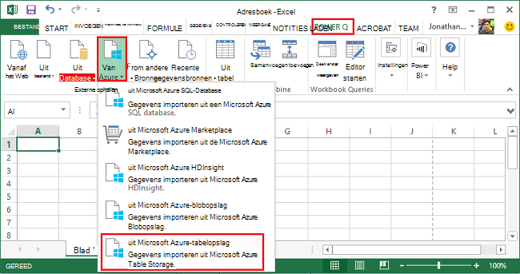
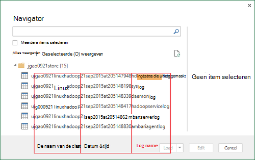
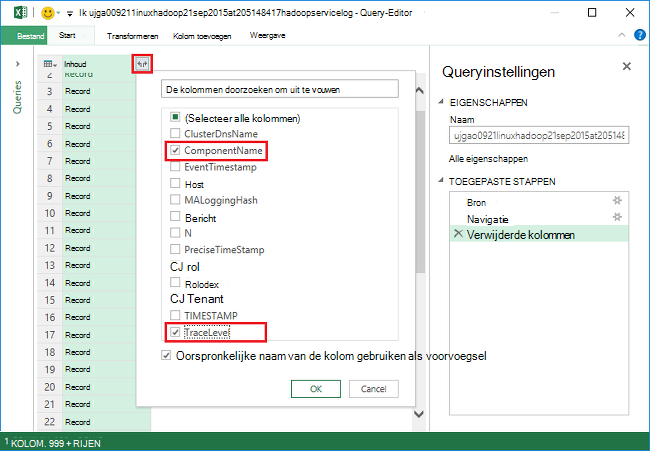
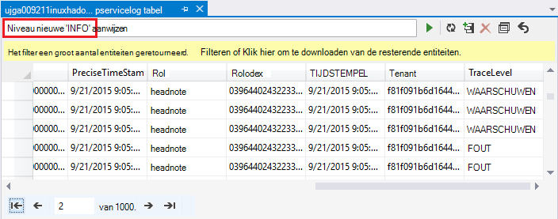
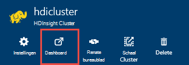
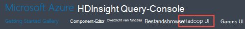
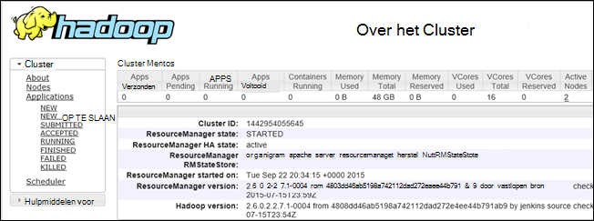

<properties
    pageTitle="Fouten opsporen in Hadoop in HDInsight: logboeken weergeven en interpreteren van foutberichten | Microsoft Azure"
    description="Meer informatie over de foutberichten die u mogelijk ontvangt wanneer HDInsight via PowerShell beheren, en u kunt doen om te herstellen."
    services="hdinsight"
    tags="azure-portal"
    editor="cgronlun"
    manager="jhubbard"
    authors="mumian"
    documentationCenter=""/>

<tags
    ms.service="hdinsight"
    ms.workload="big-data"
    ms.tgt_pltfrm="na"
    ms.devlang="na"
    ms.topic="article"
    ms.date="09/02/2016"
    ms.author="jgao"/>

# HDInsight logboeken analyseren

Elk Hadoop-cluster in Azure HDInsight heeft een Azure opslag-account gebruikt als het standaard-bestandssysteem. Het account opslag wordt verwezen als het standaardaccount voor de opslag. Cluster gebruik van de Azure-tabelopslag en de blobopslag op het standaardaccount voor de opslag naar de logboeken opslaan.  Als u het standaardaccount voor de opslagruimte voor uw cluster wilt, raadpleegt u [Hadoop beheren clusters in HDInsight](hdinsight-administer-use-management-portal.md#find-the-default-storage-account). De logboeken blijven behouden in het account opslag zelfs nadat het cluster wordt verwijderd.

##Logboeken naar Azure tabellen geschreven

De logboeken naar Azure tabellen geschreven bieden Eén inspringniveau inzicht in wat gebeurt er met een cluster HDInsight.

Wanneer u een cluster HDInsight maakt, worden automatisch 6 tabellen gemaakt voor Linux gebaseerde clusters in de standaard Table storage:

- hdinsightagentlog
- Syslog
- daemonlog
- hadoopservicelog
- ambariserverlog
- ambariagentlog

3 tabellen worden gemaakt voor clusters op basis van Windows:

- bestand: logboek met gebeurtenissen/uitzonderingen heeft voorgedaan in inrichting/instellen van HDInsight clusters.
- hadoopinstalllog: logboek met gebeurtenissen/uitzonderingen opgetreden tijdens de installatie van Hadoop op het cluster. In deze tabel zijn mogelijk nuttig zijn bij foutopsporing met betrekking tot clusters die zijn gemaakt met aangepaste parameters.
- hadoopservicelog: van gebeurtenissen/uitzonderingen logboekregistratie door alle Hadoop-services. In deze tabel zijn mogelijk nuttig zijn bij foutopsporing met betrekking tot taak: fouten HDInsight clusters.

De namen van de tabel zijn **u<ClusterName>DDMonYYYYatHHMMSSsss<TableName>**.

Deze tabel bevat de volgende velden:

- ClusterDnsName
- NaamOnderdeel
- EventTimestamp
- Host
- MALoggingHash
- Bericht
- N
- PreciseTimeStamp
- Rol
- Rij-index
- Tenant
- TIJDSTEMPEL
- TraceLevel

### Hulpmiddelen voor toegang tot de logboeken

Er bestaan veel hulpprogramma's beschikbaar zijn voor toegang tot gegevens in deze tabellen:

-  Visual Studio
-  Azure opslag Explorer
-  Power Query voor Excel

#### Gebruik van Power Query voor Excel

Power Query kan worden geïnstalleerd vanaf [www.microsoft.com/en-us/download/details.aspx?id=39379]( http://www.microsoft.com/en-us/download/details.aspx?id=39379). Zie de downloadpagina voor de systeemvereisten

**Bij het gebruik van Power Query te openen en te analyseren logboek voor de service**

1. Open **Microsoft Excel beschreven**.
2. Klik in het menu **Power Query** op **Van Azure**en klik vervolgens op **uit Microsoft Azure Table storage**.
 
    
3. Voer de naam van het opslag-account. Dit is de korte naam of de FQDN-naam.
4. Voer de accountsleutel opslag. Er wordt een lijst met tabellen:

    
5. Met de rechtermuisknop op de tabel hadoopservicelog in het deelvenster **Navigator** en selecteer **bewerken**. Er wordt 4 kolommen. (Optioneel) de **Sleutel Partition**, **Rij-toets**en **tijdstempel** kolommen verwijderen door ze te selecteren en vervolgens te klikken op **Kolommen verwijderen** uit de opties op het lint.
6. Klik op het uitvouwpictogram op de kolom inhoud om te kiezen de kolommen die u wilt importeren in het Excel-werkblad. Voor deze demo, ik heb gekozen TraceLevel en NaamOnderdeel: deze mij basisgegevens waarop onderdelen problemen had kunt geven.

    
7. Klik op **OK** om de gegevens te importeren.
8. Selecteer de kolommen **TraceLevel**, rol en **NaamOnderdeel** en klik vervolgens op **Groeperen op** besturingselement in het lint.
9. Klik op **OK** in het dialoogvenster Groeperen op
10. Klik op** toepassen en sluiten**.
 
U kunt nu Excel gebruiken om te filteren en sorteren indien nodig. U wilt natuurlijk andere kolommen (bijvoorbeeld bericht) opnemen om te kunnen inzoomen op problemen wanneer ze voorkomen, maar selecteren en groeperen van de kolommen die hierboven beschreven biedt een goede afbeelding van wat er met Hadoop-services gebeurt. De dezelfde idee kan worden toegepast op de tabellen bestand en hadoopinstalllog.

#### Gebruik Visual Studio

**Gebruik van Visual Studio**

1. Open Visual Studio.
2. Klik in het menu **Beeld** op **Cloud Explorer**. Of klik op **CTRL +\, CTRL + X**.
3. Selecteer in de **Cloud Explorer** **Resourcetypen**.  De andere beschikbare methode is **Resourcegroepen**.
4. Vouw **Opslag Accounts**, het standaardaccount voor de opslagruimte voor uw cluster en **tabellen**.
5. Dubbelklik op **hadoopservicelog**.
6. Een filter toevoegen. Bijvoorbeeld:
    
        TraceLevel eq 'ERROR'

    

    Zie voor meer informatie over het bouwen van filters, [Tekenreeksen met de Filter maken voor de ontwerpfunctie voor tabellen](../vs-azure-tools-table-designer-construct-filter-strings.md).
 
##Logboeken geschreven met Azure-blobopslag

[De logboeken naar Azure tabellen geschreven](#log-written-to-azure-tables) bieden Eén inspringniveau inzicht in wat gebeurt er met een cluster HDInsight. Deze tabellen niet bieden echter logboeken aan de taak op gebruikersniveau, wat in boren handig kunnen zijn verdere optreden wanneer ze voorkomen. Deze volgende detailniveau, HDInsight clusters geconfigureerd als u wilt schrijven logboeken aan de taak aan uw account Blob Storage voor elke taak die is verzonden via Templeton. Vrijwel, betekent dit dat taken die zijn ingediend met behulp van de Microsoft Azure PowerShell-cmdlets of de .NET taak indiening API's, niet de taken die zijn verzonden via RDP/vanaf de opdrachtregel-line toegang tot het cluster. 

De logboeken, Zie [garens van Access-toepassing aanmeldt Linux gebaseerde HDInsight](hdinsight-hadoop-access-yarn-app-logs-linux.md).

Zie voor meer informatie over de toepassingslogboeken [Simplifying logboeken aan de gebruiker beheer en toegang in garens](http://hortonworks.com/blog/simplifying-user-logs-management-and-access-in-yarn/).
 
 
## Cluster gezondheid en taak logboeken weergeven

###Toegang tot Hadoop-gebruikersinterface

Klik op de naam van een HDInsight cluster openen van het blad cluster in de Portal Azure. Klik op **Dashboard**van het blad cluster.

Wanneer u wordt gevraagd, voert u de beheerdersreferenties cluster. In de Query-Console dat wordt geopend, klikt u op **Hadoop UI**.

###Toegang tot het garen UI

Klik op de naam van een HDInsight cluster openen van het blad cluster in de Portal Azure. Klik op **Dashboard**van het blad cluster. Wanneer u wordt gevraagd, voert u de beheerdersreferenties cluster. In de Query-Console dat wordt geopend, klikt u op **Garens UI**.

U kunt de gebruikersinterface garens als volgt te werk:

* **Cluster status ophalen**. In het linkerdeelvenster Vouw **Cluster**en klikt u op **over**. Deze presenteren cluster statusgegevens zoals Totaal geheugen, cores hebt gebruikt, toegewezen status van de manager van de resource cluster, cluster versie enzovoort.

    

* **De status van het knooppunt ophalen**. In het linkerdeelvenster **Cluster**uitvouwen en **knooppunten**op. Hier ziet u alle knooppunten in het cluster, HTTP-adres van elk knooppunt resources die zijn toegewezen aan elke knooppunt, enzovoort.

* **Taakstatus monitor**. In het linkerdeelvenster **Cluster**uitvouwen en klik vervolgens op **toepassingen** om alle taken in het cluster. Als u wilt bekijken taken in een specifieke staat (zoals nieuw, verzonden, voorlopig, enz.), klikt u op de desbetreffende koppeling onder **toepassingen**. Verder kunt u de naam van de taak naar meer informatie over de taak dergelijke inclusief de uitvoer, Logboeken, enzovoort.

###Toegang tot de HBase-gebruikersinterface

Klik op de naam van een HDInsight HBase cluster openen van het blad cluster in de Portal Azure. Klik op **Dashboard**van het blad cluster. Wanneer u wordt gevraagd, voert u de beheerdersreferenties cluster. In de Query-Console dat wordt geopend, klikt u op **HBase UI**.

## Foutcodes HDInsight

De foutberichten gespecificeerde in deze sectie worden gegeven aan de gebruikers van Hadoop in Azure HDInsight mogelijke fouten die ze ondervinden kunnen bij het beheren van de service via Azure PowerShell begrijpen en en geef aan hoe ze op de stappen die kunnen herstellen uit de fout worden genomen.

Sommige van deze foutberichten kan ook zichtbaar in de Portal Azure wanneer deze wordt gebruikt voor het beheren van clusters HDInsight. Andere foutberichten die kunnen optreden, maar er zijn een minder gedetailleerde vanwege de beperkingen voor de mogelijke in deze context corrigerende acties. Andere foutberichten worden gegeven in de context waarin de risicobeperking duidelijk is. 

### AtleastOneSqlMetastoreMustBeProvided
- **Beschrijving**: Geef Azure SQL databasedetails voor ten minste één onderdeel pas aangepaste instellingen gebruiken voor component en Oozie metastores.
- **Risicobeperking**: de gebruiker moet een geldige SQL Azure-metastore opgeven en probeer het verzoek.  

### AzureRegionNotSupported
- **Beschrijving**: cluster kan niet worden gemaakt in de regio *nameOfYourRegion*. Gebruik een geldige HDInsight regio en probeer opnieuw verzoek.
- **Risicobeperking**: klant moet maken het cluster gebied dat ze worden momenteel ondersteund: Zuidoost-Azië, West Europa, Noord Europa, Oost Amerikaans of West VS.  

### ClusterContainerRecordNotFound
- **Beschrijving**: de server kan de gevraagde cluster-record niet vinden.  
- **Risicobeperking**: probeer het opnieuw.

### ClusterDnsNameInvalidReservedWord
- **Beschrijving**: Cluster DNS naam *yourDnsName* is ongeldig. Controleer of de naam begint en eindigt met alfanumerieke en mogen alleen '-' speciaal teken  
- **Risicobeperking**: Zorg ervoor dat u een geldige DNS-naam hebt gebruikt voor uw cluster die begint en eindigt met alfanumerieke en bevat geen speciale tekens andere dan het streepje '-' en probeer de bewerking.

### ClusterNameUnavailable
- **Beschrijving**: Cluster naam *yourClusterName* is niet beschikbaar. Kies een andere naam.  
- **Risicobeperking**: de gebruiker moet een clusternaam die uniek is opgeven en niet bestaat en probeer het opnieuw. Als de gebruiker de Portal gebruikt wordt, melding de gebruikersinterface ze als de naam van een cluster al tijdens de stappen maken gebruikt wordt.

### ClusterPasswordInvalid
- **Beschrijving**: Cluster wachtwoord is ongeldig. Wachtwoord moet ten minste 10 tekens en moet ten minste één cijfer, hoofdletter, kleine letter en speciale teken zonder spaties bevatten en moet de gebruikersnaam als onderdeel van deze niet bevatten.  
- **Risicobeperking**: Geef het wachtwoord van een geldige cluster en probeer het opnieuw.

### ClusterUserNameInvalid
- **Beschrijving**: Cluster gebruikersnaam is ongeldig. Controleer of de gebruikersnaam geen speciale tekens of spaties bevat.  
- **Risicobeperking**: Geef een geldige cluster-gebruikersnaam en probeer het opnieuw.

### ClusterUserNameInvalidReservedWord
- **Beschrijving**: Cluster DNS naam *yourDnsClusterName* is ongeldig. Controleer of de naam begint en eindigt met alfanumerieke en mogen alleen '-' speciaal teken  
- **Risicobeperking**: Geef een geldige DNS-cluster gebruikersnaam en probeer het opnieuw.

### ContainerNameMisMatchWithDnsName
- **Beschrijving**: de naam van de Container in URI *yourcontainerURI* en DNS-naam *yourDnsName* in het hoofdgedeelte van de aanvraag moeten hetzelfde zijn.  
- **Risicobeperking**: Zorg ervoor dat de naam van de container en de naam van uw DNS-hetzelfde zijn en probeer het opnieuw.

### DataNodeDefinitionNotFound
- **Beschrijving**: ongeldig clusterconfiguratie. Kan niet alle gegevens Knooppuntdefinities vinden in de grootte van knooppunt.  
- **Risicobeperking**: probeer het opnieuw.

### DeploymentDeletionFailure
- **Beschrijving**: verwijderen van implementatie is mislukt voor het Cluster  
- **Risicobeperking**: probeer het opnieuw verwijderen.

### DnsMappingNotFound
- **Beschrijving**: configuratiefout Service. Vereiste DNS-toewijzingsgegevens niet gevonden.  
- **Risicobeperking**: cluster verwijderen en maak een nieuw cluster.

### DuplicateClusterContainerRequest
- **Beschrijving**: cluster container maken poging dupliceren. Er bestaat record voor *nameOfYourContainer* maar Etags komen niet overeen.
- **Risicobeperking**: Geef een unieke naam voor de container en probeer het opnieuw maken.

### DuplicateClusterInHostedService
- **Beschrijving**: gehoste service *nameOfYourHostedService* al een cluster bevat. Een gehoste service kan niet meerdere clusters bevatten  
- **Risicobeperking**: het cluster in een andere gehoste service hosten.

### FailureToUpdateDeploymentStatus
- **Beschrijving**: de server kan de status van de implementatie cluster niet bijwerken.  
- **Risicobeperking**: probeer het opnieuw. Als dit meerdere keren gebeurt, neemt u contact op met CSS.

### HdiRestoreClusterAltered
- **Beschrijving**: Cluster *yourClusterName* als onderdeel van onderhoud is verwijderd. Neem opnieuw het cluster.
- **Risicobeperking**: het cluster opnieuw te maken.

### HeadNodeConfigNotFound
- **Beschrijving**: ongeldig clusterconfiguratie. Vereiste hoofd knooppuntconfiguratie niet gevonden in knooppunt grootte.
- **Risicobeperking**: probeer het opnieuw.

### HostedServiceCreationFailure
- **Beschrijving**: kan niet gehoste service *nameOfYourHostedService*maken. Probeer het verzoek.  
- **Risicobeperking**: probeer het verzoek.

### HostedServiceHasProductionDeployment
- **Beschrijving**: gehoste Service *nameOfYourHostedService* heeft al een productie-implementatie. Een gehoste service kan geen meerdere productie implementaties bevatten. Probeer het verzoek met de naam van een ander cluster.
- **Risicobeperking**: Gebruik de naam van een ander cluster en probeer het verzoek.

### HostedServiceNotFound
- **Beschrijving**: Service *nameOfYourHostedService* voor het cluster kan niet worden gevonden die worden gehost.  
- **Risicobeperking**: als het cluster foutstatus, verwijdert u deze en probeer het opnieuw.

### HostedServiceWithNoDeployment
- **Beschrijving**: gehoste Service *nameOfYourHostedService* heeft geen gekoppeld implementatie.  
- **Risicobeperking**: als het cluster foutstatus, verwijdert u deze en probeer het opnieuw.

### InsufficientResourcesCores
- **Beschrijving**: het SubscriptionId *yourSubscriptionId* heeft geen cores links cluster *yourClusterName*maken. Vereist: *resourcesRequired*, beschikbaar: *resourcesAvailable*.  
- **Risicobeperking**: bronnen van uw abonnement vrij te maken of verhogen van de bronnen die beschikbaar zijn voor het abonnement en probeer opnieuw te maken het cluster.

### InsufficientResourcesHostedServices
- **Beschrijving**: abonnements-ID *yourSubscriptionId* heeft geen quotum voor een nieuwe HostedService cluster *yourClusterName*maken.  
- **Risicobeperking**: bronnen van uw abonnement vrij te maken of verhogen van de bronnen die beschikbaar zijn voor het abonnement en probeer opnieuw te maken het cluster.

### InternalErrorRetryRequest
- **Beschrijving**: de server is een interne fout opgetreden. Probeer het verzoek.  
- **Risicobeperking**: probeer het verzoek.

### InvalidAzureStorageLocation
- **Beschrijving**: Azure opslag locatie *dataRegionName* is geen geldige locatie. Controleer of dat de regio klopt en probeer opnieuw verzoek.
- **Risicobeperking**: Selecteer een opslaglocatie van die ondersteuning biedt voor HDInsight, Controleer of uw cluster reserveren is en probeer het opnieuw.

### InvalidNodeSizeForDataNode
- **Beschrijving**: ongeldige VM-grootte voor gegevensknooppunten. Alleen de grootte van de 'Grote VM' wordt ondersteund voor alle gegevensknooppunten.  
- **Risicobeperking**: de grootte van het ondersteunde knooppunt voor het gegevensknooppunt opgeven en probeer het opnieuw.

### InvalidNodeSizeForHeadNode
- **Beschrijving**: ongeldige VM-grootte voor hoofd knooppunt. Alleen de grootte van de 'Zijn VM' wordt ondersteund voor hoofd knooppunt.  
- **Risicobeperking**: de grootte van de ondersteunde knooppunt voor het hoofd knooppunt aan te geven en probeer het opnieuw

### InvalidRightsForDeploymentDeletion
- **Beschrijving**: abonnements-ID *yourSubscriptionId* gebruikte beschikt niet over voldoende machtigingen verwijderbewerking voor cluster *yourClusterName*uit te voeren.  
- **Risicobeperking**: als het cluster foutstatus, zet deze neer op en probeer het opnieuw.  

### InvalidStorageAccountBlobContainerName
- **Beschrijving**: externe opslag account blob container naam *yourContainerName* is ongeldig. Controleer of de naam begint met een letter en bevat alleen kleine letters, cijfers en -streepje.  
- **Risicobeperking**: Geef een geldige blob container opslagaccountnaam en probeer het opnieuw.

### InvalidStorageAccountConfigurationSecretKey
- **Beschrijving**: configuratie voor externe opslag account *yourStorageAccountName* is vereist om te laten geheime belangrijke informatie worden ingesteld.  
- **Risicobeperking**: Geef een geldige geheime sleutel voor de opslag-account en probeer het opnieuw.

### InvalidVersionHeaderFormat
- **Beschrijving**: versie koptekst *yourVersionHeader* is niet geldig notatie jjjj-mm-dd  
- **Risicobeperking**: Geef een geldige indeling voor de versie-kop en probeer het verzoek.

### MoreThanOneHeadNode
- **Beschrijving**: ongeldig clusterconfiguratie. Configuratie van meer dan één hoofd knooppunt gevonden.  
- **Risicobeperking**: bewerk de configuratie zo dat onloy één hoofd knooppunt is opgegeven.

### OperationTimedOutRetryRequest
- **Beschrijving**: de bewerking kan niet worden voltooid binnen de toegestane tijd of het maximum aantal nieuwe pogingen mogelijk. Probeer het verzoek.  
- **Risicobeperking**: probeer het verzoek.

### ParameterNullOrEmpty
- **Beschrijving**: Parameter *yourParameterName* kan niet null of leeg.  
- **Risicobeperking**: Geef een geldige waarde voor de parameter.

### PreClusterCreationValidationFailure
- **Beschrijving**: een of meer van de invoer van cluster maken aanvraag is niet geldig. Controleer of de invoerwaarden in orde zijn en probeer opnieuw te verzoek.  
- **Risicobeperking**: Zorg ervoor dat de invoerwaarden in orde zijn en probeer opnieuw te verzoek.

### RegionCapabilityNotAvailable
- **Beschrijving**: de mogelijkheid van de regio is niet beschikbaar voor de regio *yourRegionName* en abonnements-ID *yourSubscriptionId*.  
- **Risicobeperking**: Geef een regio die ondersteuning biedt voor HDInsight clusters. De openbaar ondersteunde regio's zijn: Zuidoost-Azië, West Europa, Noord Europa, Oost Amerikaans of West VS.

### StorageAccountNotColocated
- **Beschrijving**: opslag account *yourStorageAccountName* is in de regio *currentRegionName*. Dit komt overeen met de cluster regio *yourClusterRegionName*.  
- **Risicobeperking**: Geef een opslag-account in hetzelfde gebied waarop uw cluster zich bevindt of als uw gegevens zich al in de opslagruimte-account, maakt u een nieuw cluster in hetzelfde gebied, als de bestaande opslag-account. Als u de Portal gebruikt, wordt de gebruikersinterface van dit probleem vooraf melden.

### SubscriptionIdNotActive
- **Beschrijving**: opgegeven abonnements-ID *yourSubscriptionId* is niet actief.  
- **Risicobeperking**: uw abonnement opnieuw activeren of krijg een geldig abonnement op Nieuw.

### SubscriptionIdNotFound
- **Beschrijving**: abonnements-ID *yourSubscriptionId* kan niet worden gevonden.  
- **Oplossing**: Controleer of uw abonnements-ID geldig is en probeer het opnieuw.

### UnableToResolveDNS
- **Beschrijving**: kan niet omzetten DNS- *yourDnsUrl*. Controleer of dat de volledig gekwalificeerde URL voor het eindpunt blob is opgegeven.  
- **Risicobeperking**: geldige blob URL opgeeft. De URL moet volledig geldig, inclusief begint met *http://* en eindigt op *.com*.

### UnableToVerifyLocationOfResource
- **Beschrijving**: kan niet controleren van de locatie van de resource *yourDnsUrl*. Controleer of dat de volledig gekwalificeerde URL voor het eindpunt blob is opgegeven.  
- **Risicobeperking**: geldige blob URL opgeeft. De URL moet volledig geldig, inclusief begint met *http://* en eindigt op *.com*.

### VersionCapabilityNotAvailable
- **Beschrijving**: de mogelijkheid van de versie is niet beschikbaar voor de versie *specifiedVersion* en abonnements-ID *yourSubscriptionId*.  
- **Risicobeperking**: Kies een versie die beschikbaar is en probeer het opnieuw.

### VersionNotSupported
- **Beschrijving**: versie *specifiedVersion* niet ondersteund.
- **Risicobeperking**: Kies een versie die wordt ondersteund en probeer het opnieuw.

### VersionNotSupportedInRegion
- **Beschrijving**: versie *specifiedVersion* is niet beschikbaar in Azure regio *specifiedRegion*.  
- **Risicobeperking**: Kies een versie die wordt ondersteund in de opgegeven regio en probeer het opnieuw.

### WasbAccountConfigNotFound
- **Beschrijving**: ongeldig clusterconfiguratie. Vereiste WASB accountconfiguratie niet gevonden in externe accounts.  
- **Oplossing**: Controleer of het account bestaat en is juist is opgegeven in configuratie en probeer het opnieuw.

## Volgende stappen

- [Fouten opsporen in Tez taken op HDInsight via Ambari weergaven](hdinsight-debug-ambari-tez-view.md)
- [Opslagruimte dumps voor Hadoop-services op Linux gebaseerde HDInsight inschakelen](hdinsight-hadoop-collect-debug-heap-dump-linux.md)
- [HDInsight clusters beheren met behulp van de gebruikersinterface van de Web Ambari](hdinsight-hadoop-manage-ambari.md)
