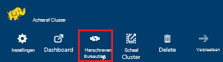
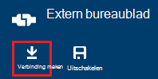
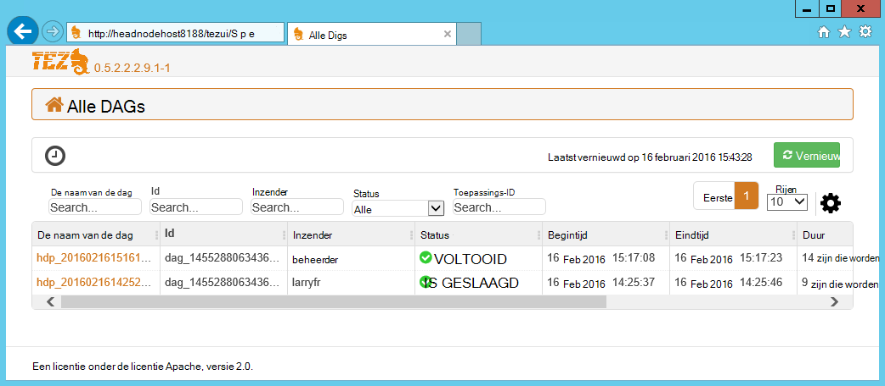
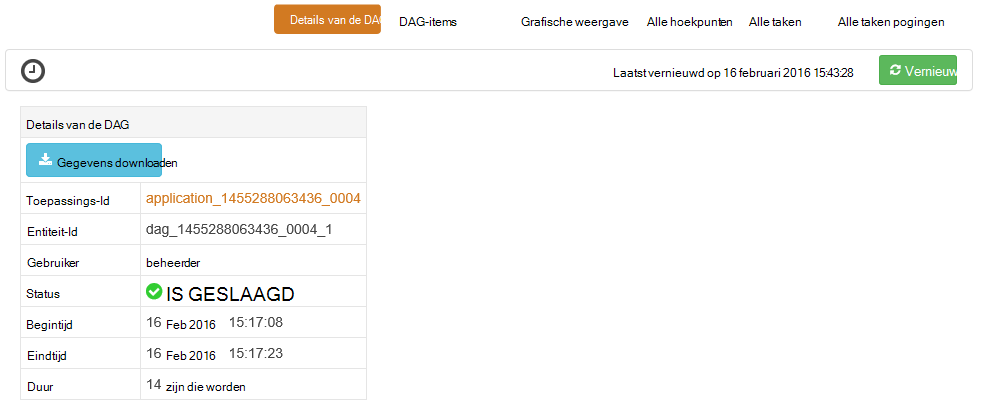
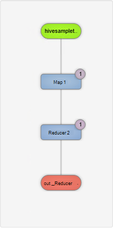
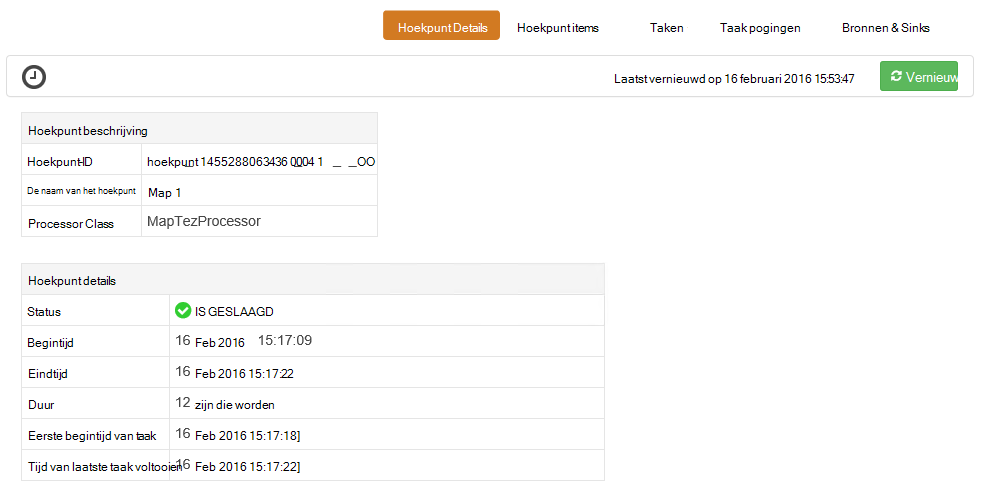
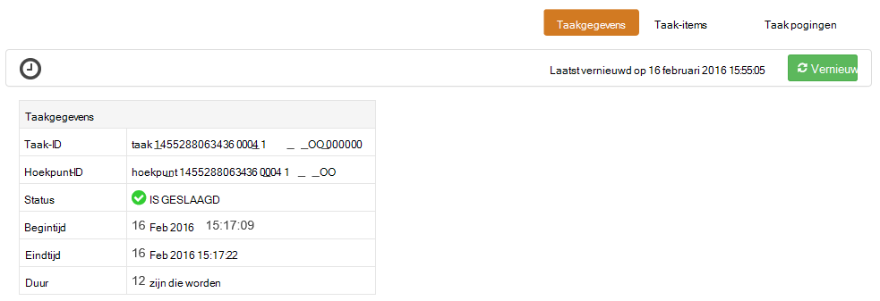

<properties
pageTitle="Tez UI gebruiken met Windows gebaseerde HDInsight | Azure"
description="Informatie over het gebruik van de Tez UI voor foutopsporing Tez taken op Windows gebaseerde HDInsight HDInsight."
services="hdinsight"
documentationCenter=""
authors="Blackmist"
manager="jhubbard"
editor="cgronlun"/>

<tags
ms.service="hdinsight"
ms.devlang="na"
ms.topic="article"
ms.tgt_pltfrm="na"
ms.workload="big-data"
ms.date="10/04/2016"
ms.author="larryfr"/>

# De Tez UI voor foutopsporing Tez taken op HDInsight op basis van Windows gebruiken

De Tez UI is een pagina met webonderdelen die kunnen worden gebruikt om te begrijpen en fouten opsporen in taken die Tez als de engine worden uitgevoerd op Windows gebaseerde HDInsight clusters gebruiken. De UI Tez kunt u de taak als een grafiek van verbonden items visualiseren, zoom in op elk item en statistieken en logboekinformatie ophalen.

> [AZURE.NOTE] De informatie in dit document hoort bij op basis van Windows HDInsight clusters. Zie voor informatie over het weergeven en Tez op Linux gebaseerde HDInsight foutopsporing, [Gebruik Ambari weergaven voor foutopsporing Tez taken op HDInsight](hdinsight-debug-ambari-tez-view.md).

## Vereisten voor

* Een cluster HDInsight op basis van Windows. Zie [aan de slag met Windows gebaseerde HDInsight](hdinsight-hadoop-tutorial-get-started-windows.md)voor informatie over het maken van een nieuw cluster.

    > [AZURE.IMPORTANT] De Tez UI is alleen beschikbaar op Windows gebaseerde HDInsight clusters na 8 februari 2016 hebt gemaakt.

* Een extern bureaublad op basis van een Windows-client.

## Lidmaatschap Tez

Tez is een uitgebreid framework voor gegevensverwerking in Hadoop waarmee groter snelheden dan traditionele MapReduce verwerking. Voor Windows gebaseerde HDInsight kolomgroepen is dit een optioneel engine die u voor component inschakelen kunt met behulp van de volgende opdracht uit als onderdeel van uw query component:

    set hive.execution.engine=tez;

Wanneer het werk is verzonden naar Tez, wordt een doorgestuurd acyclische Graph (DAG) waarmee de volgorde van de uitvoering van de acties die is vereist door de taak wordt beschreven. Afzonderlijke acties hoekpunten worden genoemd, en een deel van de algehele taak uitvoeren. De werkelijke uitvoering van het werk dat wordt beschreven door een hoekpunt een taak wordt genoemd, en mogelijk worden verdeeld over meerdere knooppunten in het cluster.

### Wat is de gebruikersinterface Tez?

De Tez UI is dat een pagina met webonderdelen bevat informatie over processen die worden uitgevoerd, of een ouder Tez gebruiken. U kunt het weergeven van de DAG gegenereerd door Tez, hoe deze wordt verdeeld over de kolomgroepen items zoals geheugen die wordt gebruikt door taken en hoekpunten en foutgegevens. Deze mogelijk nuttige informatie in de volgende scenario's bieden:

* Monitoring langdurige verwerkt, de voortgang van map weergeven en taken te verkleinen.

* Het analyseren van historische gegevens geslaagde of mislukte processen voor meer informatie over hoe verwerking kan worden verbeterd of waarom dit is mislukt.

## Een DAG genereren

De UI Tez bevat alleen de gegevens als een taak die wordt gebruikt de engine Tez al bezig is of is uitgevoerd in het verleden. Eenvoudige component-query's kunnen meestal worden opgelost zonder Tez, echter meer complexe query's die filteren, groeperen, ordening, joins, enzovoort meestal moeten worden Tez uitvoeren.

Gebruik de volgende stappen uit een query component die wordt uitgevoerd met Tez uit te voeren.

1. Ga in een webbrowser naar https://CLUSTERNAME.azurehdinsight.net, waar __CLUSTERNAAM__ de naam van uw cluster HDInsight is.

2. Selecteer de __Component Editor__in het menu boven aan de pagina. Een pagina met het volgende voorbeeldquery wordt weergegeven.

        Select * from hivesampletable

    De voorbeeldquery wissen en vervangen door het volgende.

        set hive.execution.engine=tez;
        select market, state, country from hivesampletable where deviceplatform='Android' group by market, country, state;

3. Selecteer de knop __verzenden__ . De sectie __Taak sessie__ onder aan de pagina wordt de status van de query weergegeven. Zodra het veld status wordt gewijzigd in __voltooid__, selecteert u de __Details weergeven__ -koppeling naar de resultaten bekijken. De __Taak-uitvoer__ moet er ongeveer als volgt te werk:
        
        en-GB   Hessen      Germany
        en-GB   Kingston    Jamaica
        en-GB   Nairobi Area    Kenya

## Gebruik de Tez-gebruikersinterface

> [AZURE.NOTE] De Tez UI is alleen beschikbaar vanaf het bureaublad van de kop knooppunten, dus moet u extern bureaublad verbinding maken met het hoofd knooppunten.

1. Selecteer in de [portal van Azure](https://portal.azure.com)uw cluster HDInsight. Vanaf de bovenkant van het blad HDInsight, selecteert u het pictogram __Extern bureaublad__ . Hiermee wordt het externe bureaublad blad weergeven

    

2. Selecteer in het blad extern bureaublad __verbinding maken__ met de verbinding maken met het hoofd knooppunt. Wanneer u wordt gevraagd, gebruikt u de cluster extern bureaublad-gebruikersnaam en wachtwoord om de verbinding te verifiëren.

    

    > [AZURE.NOTE] Als u extern bureaublad connectivity niet hebt ingeschakeld, Geef een gebruikersnaam, wachtwoord en vervaldatum en selecteer __inschakelen__ om extern bureaublad. Zodra deze is ingeschakeld, moet u de vorige stappen gebruiken om verbinding te.

3. Zodra u verbinding hebt, open Internet Explorer op het externe bureaublad, selecteer het tandwielpictogram in de rechterbovenhoek van de browser en selecteer __Compatibiliteit weergave-instellingen__.

4. Schakel het selectievakje voor de __weergave intranet-sites in de weergave van de compatibiliteit__ en __Gebruik Microsoft compatibiliteit lijsten__vanaf de onderkant van de __Weergave-instellingen voor compatibiliteit__, en selecteer vervolgens __sluiten__.

5. Blader in Internet Explorer naar http://headnodehost:8188/tezui / #/. Hierdoor wordt de UI Tez weergegeven

    

    Als de Tez UI wordt geladen, ziet u een lijst met DAGs die momenteel worden uitgevoerd, of zijn uitgevoerd op het cluster. De standaardweergave bevat de Dag Name, -Id, Inzender, Status, begintijd, eindtijd, duur, toepassings-ID en wachtrij. Meer kolommen kunnen worden toegevoegd met het tandwielpictogram aan de rechterkant van de pagina.

    Als u slechts één item hebt, zijn deze voor de query die u in de vorige sectie hebt uitgevoerd. Als u meerdere items hebt, kunt u zoeken door zoekcriteria in de velden boven de DAGs invoeren en vervolgens druk op __Enter__.

4. Selecteer de __Naam van de Dag__ voor de meest recente DAG-fragment. Hiermee worden gegevens over de DAG, en de optie voor het downloaden van een zip van JSON-bestanden met informatie over de DAG weergegeven.

    

5. Boven de __Details van de DAG__ zijn in verschillende koppelingen die kunnen worden gebruikt om informatie over de DAG weer te geven.

    * __DAG items__ worden items van dit DAG.
    
    * __Grafische weergave__ ziet een grafische weergave van deze DAG.
    
    * __Alle hoekpunten__ bevat een overzicht van de hoekpunten in deze DAG.
    
    * __Alle taken__ bevat een overzicht van de taken die voor alle hoekpunten in deze DAG.
    
    * __Alle TaskAttempts__ wordt informatie over de probeert te taken uitvoeren voor deze DAG.
    
    > [AZURE.NOTE] Als u naar de kolomweergave voor hoekpunten, taken en TaskAttempts schuift, ziet u dat er koppelingen naar __items__ en __bekijken of downloaden van Logboeken__ voor elke rij weergeven.

    Als er een fout aan de taak is, wordt de DAG-Details een status mislukt, samen met koppelingen naar informatie over de mislukte taak weergegeven. Diagnostische informatie wordt weergegeven onder de DAG-details.

7. __Grafische weergave__selecteren. Hiermee worden een grafische weergave van de DAG weergegeven. U kunt de muis plaatsen op elke hoekpunt in de weergave om informatie over deze weer te geven.

    

8. Klikken op een hoekpunt laadt het __Hoekpunt Details__ voor dat item. Klik op het hoekpunt __1 van de kaart__ om details voor dit item weer te geven. Selecteer __bevestigen__ om te bevestigen van de navigatie.

    

9. Houd er rekening mee dat u hebt nu koppelingen boven aan de pagina die betrekking hebben op hoekpunten en taken.

    > [AZURE.NOTE] U kunt ook op deze pagina bereikt door gaat u terug naar __De Details van de DAG__, __Hoekpunt Details__selecteren en vervolgens te klikken op het hoekpunt __kaart 1__ .

    * __Hoekpunt items__ weergegeven item informatie voor deze hoekpunt.
    
    * __Taken__ weergegeven taken voor deze hoekpunt.
    
    * __Taak probeert__ wordt informatie over pogingen om uit te voeren taken voor deze hoekpunt.
    
    * __Bronnen & Sinks__ gegevensbronnen weergeeft en sinks voor deze hoekpunt.

    > [AZURE.NOTE] Als met het vorige menu, kunt u de kolomweergave voor taken, taak pogingen, en bronnen & Sinks__ weer te geven van koppelingen voor meer informatie voor elk item schuiven.

10. Selecteer __taken__en selecteer vervolgens het item met de naam __00_000000__. __Taakgegevens__ wordt voor deze taak weergegeven. In dit scherm kunt u __Items van de taak__ en __Taak pogingen__weergeven.

    

## Volgende stappen

U hebt geleerd hoe u de weergave Tez gebruiken, meer u informatie over het [Gebruik van component op HDInsight](hdinsight-use-hive.md).

Zie voor meer gedetailleerde technische informatie over Tez, de [Tez pagina aan Hortonworks](http://hortonworks.com/hadoop/tez/).
