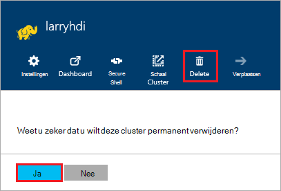

<properties
pageTitle="Het verwijderen van een cluster HDInsight | Azure"
description="Informatie over de verschillende manieren dat u een cluster HDInsight kunt verwijderen."
services="hdinsight"
documentationCenter=""
authors="Blackmist"
manager="jhubbard"
editor="cgronlun"/>

<tags
ms.service="hdinsight"
ms.devlang="na"
ms.topic="article"
ms.tgt_pltfrm="na"
ms.workload="big-data"
ms.date="10/28/2016"
ms.author="larryfr"/>

#Het verwijderen van een cluster HDInsight

HDInsight cluster facturering wordt gestart zodra er een cluster is nu gemaakt en wordt niet meer als het cluster wordt verwijderd en rato per minuut, is dus u altijd uw cluster verwijderen moet wanneer deze niet meer gebruikt wordt. In dit document leert u hoe u een cluster met de Portal Azure, Azure PowerShell en de CLI Azure verwijdert.

> [AZURE.IMPORTANT] Verwijderen van een cluster HDInsight, wordt de opslag van Azure (s) die zijn gekoppeld aan het cluster niet verwijderd. Hiermee kunt u voor het behouden en hergebruiken van gegevens die zijn opgeslagen door het cluster.

##Azure-Portal

1. Meld u aan bij de [portal van Azure](https://portal.azure.com) en selecteert u uw cluster HDInsight. Als uw cluster HDInsight niet aan het dashboard vastgemaakt is, kunt u zoeken voor deze op naam met het zoekveld (Vergrootglas), aan de rechterkant van de navigatiebalk.

    

2. Zodra het blad voor de cluster wordt geopend, selecteert u het pictogram __verwijderen__ . Wanneer u wordt gevraagd, selecteert u __Ja__ het cluster verwijderen.

    

##Azure PowerShell

Gebruik de volgende opdracht uit het cluster verwijderen uit een PowerShell-prompt:

    Remove-AzureRmHDInsightCluster -ClusterName CLUSTERNAME

__CLUSTERNAAM__ vervangen door de naam van uw cluster HDInsight.

##Azure CLI

Gebruik de volgende handelingen uit het cluster verwijderen uit de opdrachtprompt:

    azure hdinsight cluster delete CLUSTERNAME
    
__CLUSTERNAAM__ vervangen door de naam van uw cluster HDInsight.
