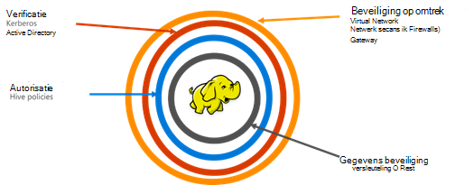

<properties
    pageTitle="Secure HDInsight overzicht | Microsoft Azure"
    description="Meer informatie..."
    services="hdinsight"
    documentationCenter=""
    authors="saurinsh"
    manager="jhubbard"
    editor="cgronlun"
    tags="azure-portal"/>

<tags
    ms.service="hdinsight"
    ms.devlang="na"
    ms.topic="hero-article"
    ms.tgt_pltfrm="na"
    ms.workload="big-data"
    ms.date="10/24/2016"
    ms.author="saurinsh"/>

# Introduceren domein behoren HDInsight clusters (Preview)

Azure HDInsight tot vandaag ondersteund alleen een enkele gebruiker lokale beheerder. Dit gewerkt geweldig voor kleinere toepassing teams of afdelingen. Hadoop op basis van werkbelasting ervaring meer populariteit in de enterprise-sector, is dat u een enterprise grade mogelijkheden zoals active directory gebaseerd verificatie en ondersteuning voor meerdere gebruikers Rolgebaseerd toegangsbeheer kwam belangrijker. Domein behoren HDInsight clusters gebruikt, kunt u maken van een HDInsight cluster dat is gekoppeld aan een Active Directory-domein, een lijst met werknemers van de onderneming via Azure Active Directory verifiëren kan aanmelden bij HDInsight cluster configureren. Iedereen buiten de onderneming niet kunt aanmelden of toegang tot het cluster HDInsight. De enterprise-beheerder kunt Rolgebaseerd toegangsbeheer voor component beveiliging [Apache Zwerver](http://hortonworks.com/apache/ranger/)gebruiken, dus het beperken van toegang tot gegevens alleen zoveel nodig configureren. De beheerder kunt ten slotte de toegang tot de gegevens door andere werknemers en de wijzigingen die zijn gedaan-besturingselement beleid, dus dat nodig is om een hoge mate van beheermodel van hun bedrijfsresources controleren.

[AZURE.NOTE]> De nieuwe functies die worden beschreven in dit voorbeeld zijn alleen beschikbaar op HDInsight Linux gebaseerde clusters voor component werkbelasting. De andere werkbelastingen, zoals HBase, een, Storm en Kafka, worden ingeschakeld in toekomstige versies. 

## Voordelen

Enterprise-beveiliging bevat vier groot pijlers – omtrek beveiliging, verificatie, autorisatie en versleuteling.

.

### Beveiliging

Beveiliging in HDInsight wordt bereikt met virtuele netwerken en Gateway-service. Een enterprise-beheerder kan tegenwoordig kunnen maken van een cluster HDInsight binnen een virtueel netwerk en netwerk beveiligingsgroepen (binnenkomende of uitgaande firewallregels) gebruikt om het beperken van toegang tot het virtuele netwerk. Alleen de IP-adressen die zijn gedefinieerd in de binnenkomende firewallregels kunnen communiceren met het cluster HDInsight, dus omtrek en beveiliging. Een andere laag van beveiliging wordt bereikt met Gateway-service. De Gateway is de service die als eerste regel van de bescherming van alle inkomende verzoeken aan het cluster HDInsight fungeert. Deze de aanvraag accepteert, deze is gevalideerd en kunt alleen vervolgens het verzoek om aan de andere knooppunten in cluster, omtrek en kan dus beveiliging van andere naam en het gegevenstype knooppunten in het cluster te geven.

### Verificatie

Met deze openbare preview, kunt een enterprise-beheerder inrichten van een domein behoren HDInsight cluster in een [virtueel netwerk](https://azure.microsoft.com/services/virtual-network/). De knooppunten van de cluster HDInsight koppelt aan het domein beheerd door de onderneming. Dit is bereikt met behulp van [Azure Active Directory Domain Services](https://technet.microsoft.com/library/cc770946.aspx). Alle knooppunten in het cluster zijn gekoppeld aan een domein dat de onderneming worden beheerd. Met deze instelling kunnen de enterprise-werknemers aanmelden bij knooppunten met hun domeinreferenties van het. Ze kunnen hun domeinreferenties ook gebruiken om te verifiëren met andere goedgekeurde eindpunten zoals tint, Ambari weergaven, ODBC, JDBC, PowerShell en REST API's om te communiceren met het cluster. De beheerder heeft volledige controle over het beperken van het aantal gebruikers interactief werken met het cluster via deze eindpunten.

### Autorisatie

Een goede gewoonte gevolgd door de meeste ondernemingen is dat niet elke werknemer toegang tot alle ondernemingsresources heeft. De beheerder kunt op dezelfde manier in deze release definiëren op basis van de rol-besturingselement beleid voor de resources cluster. De beheerder kan bijvoorbeeld [Apache Zwerver](http://hortonworks.com/apache/ranger/) access besturingselement als beleidsregels wilt instellen voor component configureren. Deze functionaliteit zorgt ervoor dat werknemers zal alleen toegang tot zoveel gegevens als ze moeten zijn voltooid in hun taken. SSH toegang tot het cluster is ook beperkt tot de beheerder.

### Controle

Samen met de HDInsight clusterbronnen beveiligen tegen onbevoegde gebruikers en de beveiliging van de gegevens, is het nodig zijn voor het bijhouden van onbevoegde of onbedoeld toegang van de bronnen voor controle van alle toegang tot de cluster resources en de gegevens. Met dit voorbeeld, kan de beheerder weergeven en alle access rapport aan de HDInsight cluster resources en de gegevens. De beheerder kan ook bekijken en rapport van alle wijzigingen aan het besturingselement clienttoegangsbeleid in Apache Zwerver ondersteund eindpunten gedaan. Een domein behoren HDInsight cluster wordt de vertrouwde Apache Zwerver UI controlelogboeken gezocht. Klik op de backend, wordt Zwerver [Apache Solr]( http://hortonworks.com/apache/solr/) gebruikt voor het opslaan en zoeken de logboeken.

### Versleuteling

Gegevens beveiligen belangrijk is voor beveiliging van de vergadering-organisatie en nalevingsvereisten en samen met het beperken van toegang tot gegevens vanaf onbevoegde werknemers, deze moet ook worden beveiligd door deze te coderen. Beide opgeslagen gegevens voor clusters, Azure opslag Blob en de gegevensopslag Lake Azure HDInsight ondersteunen transparante serverzijde [codering van gegevens](../storage/storage-service-encryption.md) in rust. Secure HDInsight clusters naadloos zijn voor deze server kant-codering van gegevens op de mogelijkheid van de rest geschikt.

## Volgende stappen

- Zie [een domein configureren behoren HDInsight clusters](hdinsight-domain-joined-configure.md)voor het configureren van een domein behoren HDInsight cluster.
- Voor het beheer van Zie een kolomgroepen domein behoren HDInsight [HDInsight beheren domein behoren clusters](hdinsight-domain-joined-manage.md).
- Voor het configureren van beleidsregels voor component en uitvoeren component-query's, Zie [configureren component beleidsregels voor een domein behoren HDInsight clusters](hdinsight-domain-joined-run-hive.md).
- Voor het uitvoeren van component query's met SSH op domein behoren HDInsight clusters, Zie [Gebruik SSH met Linux gebaseerde Hadoop op HDInsight uit Linux, Unix, of OS X](hdinsight-hadoop-linux-use-ssh-unix.md#connect-to-a-domain-joined-hdinsight-cluster).