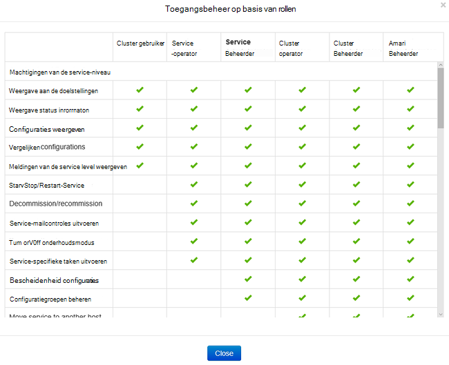
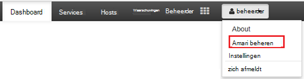
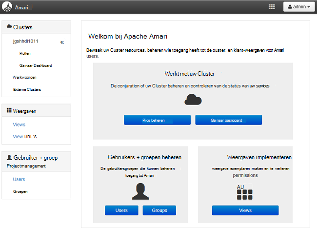
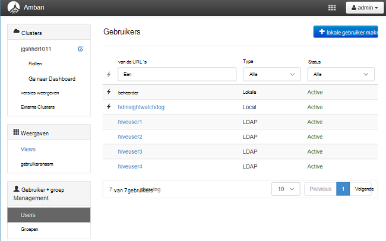
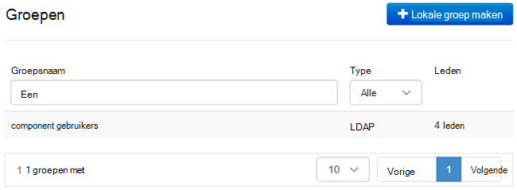
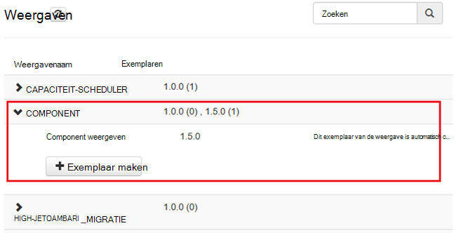
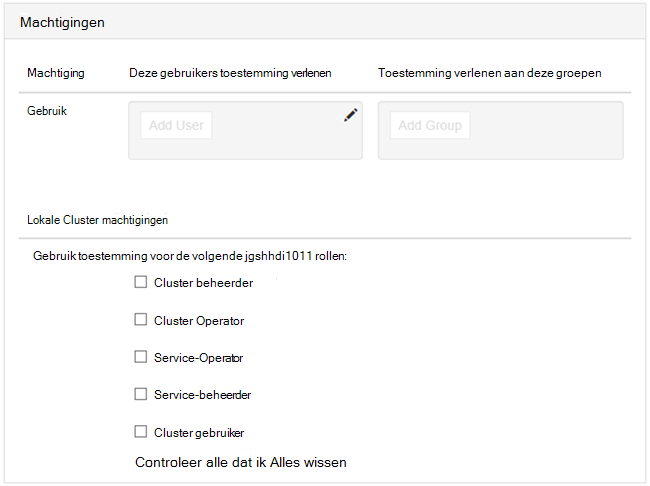

<properties
    pageTitle="Een domein behoren HDInsight clusters beheren | Microsoft Azure"
    description="Informatie over het beheren van een domein behoren HDInsight clusters"
    services="hdinsight"
    documentationCenter=""
    authors="saurinsh"
    manager="jhubbard"
    editor="cgronlun"
    tags=""/>

<tags
    ms.service="hdinsight"
    ms.devlang="na"
    ms.topic="article"
    ms.tgt_pltfrm="na"
    ms.workload="big-data"
    ms.date="10/25/2016"
    ms.author="saurinsh"/>

# Een domein behoren HDInsight clusters (Preview) beheren

Leer de gebruikers en de rollen in een domein behoren HDInsight en hoe u een domein behoren HDInsight clusters beheren.

## Gebruikers van een domein behoren HDInsight clusters

Een HDInsight cluster die geen domein-lid heeft twee gebruikersaccounts die zijn gemaakt tijdens het cluster maken:

- **Ambari beheerder**: dit account wordt ook wel *Hadoop-gebruiker* of *HTTP-gebruiker*. Dit account kan worden gebruikt voor aanmelding bij Ambari op https://&lt;Clusternaam >. azurehdinsight.net. Dit kan ook worden gebruikt query's uitvoeren op Ambari weergaven, taken via externe hulpprogramma's (dat wil zeggen PowerShell, Templeton, Visual Studio) uitvoert en verifiëren met de component ODBC-stuurprogramma en hulpmiddelen voor BI (dat wil zeggen Excel, PowerBI of Tableau).

- **SSH gebruiker**: dit account kan worden gebruikt met SSH en sudo opdrachten uitvoeren. Deze heeft hoofdsite toegangsrechten voor de VMs Linux.

Een HDInsight domein behoren cluster heeft drie nieuwe gebruikers naast Ambari Admin en SSH gebruikersnaam.

- **Zwerver beheerder**: dit account is de lokale Apache Zwerver-beheerdersaccount. Het is niet active directory domain-gebruiker. Dit account kan worden gebruikt voor het beleid instellen en andere beheerders van de gebruikers of gedelegeerde beheerders (zodat die gebruikers beleidsregels beheren kunnen). Standaard de gebruikersnaam is *beheerder* en het wachtwoord is hetzelfde als de beheerderswachtwoord Ambari. Het wachtwoord kan worden bijgewerkt vanaf de pagina instellingen in Zwerver.

- **Cluster beheerder domeingebruiker**: dit account is een active directory-domeingebruiker aangewezen als de beheerder van het Hadoop cluster inclusief Ambari en Zwerver. Tijdens het maken van cluster, moet u de referenties van deze gebruiker opgeven. Deze gebruiker heeft de volgende bevoegdheden:

    - Machines toevoegen aan het domein en plaats deze binnen de organisatie-eenheid die u tijdens het maken van het cluster opgeeft.
    - Maak service principes binnen de organisatie-eenheid die u tijdens het maken van het cluster opgeeft. 
    - Maak omgekeerde DNS entries.

    Houd rekening met dat de andere AD-gebruikers is ook gemachtigd. 

    Er zijn enkele eindpunten binnen het cluster (bijvoorbeeld Templeton) die niet worden beheerd met Zwerver en daarom zijn niet veilig. Deze eindpunten worden vergrendeld voor alle gebruikers behalve het hulpprogramma voor het domein van de cluster-beheerder. 

- **Normale**: gemaakt, kunt u meerdere active directory-groepen bieden. Gebruikers in deze groepen wordt gesynchroniseerd met Zwerver en Ambari. Deze gebruikers zijn gebruikers van een domein en toegang heeft tot alleen Zwerver beheerde eindpunten (bijvoorbeeld Hiveserver2). Alle RBAC beleidsregels en controle is van toepassing op deze gebruikers.

## Rollen van een domein behoren HDInsight clusters

Een domein behoren HDInsight de volgende functies hebben:

- Cluster beheerder
- Cluster Operator
- Service-beheerder
- Service-Operator
- Cluster gebruiker

**Om de machtigingen van deze rollen weer te geven**

1. Ambari Management UI te openen.  Zie [Ambari Management UI te openen](#open-the-ambari-management-ui).
2. Klik in het linkermenu op **rollen**.
3. Klik op het blauwe vraagteken om te zien welke machtigingen:

    

## Ambari Management UI te openen

1. Aanmelden bij de [portal van Azure](https://portal.azure.com).
2. Open uw cluster HDInsight in een blade. Zie [clusters lijst en weergeven](hdinsight-administer-use-management-portal.md#list-and-show-clusters).
3. Klik op **Dashboard** in het bovenste menu Ambari openen.
4. Meld u aan bij Ambari met cluster beheerder domein-gebruikersnaam en hetzelfde wachtwoord.
5. Klik op het vervolgkeuzemenu **beheerder** in de rechterbovenhoek en klik vervolgens op **Ambari beheren**.

    

    De gebruikersinterface ziet er zo:

    

## De domein-gebruikers gesynchroniseerd vanuit uw Active Directory

1. Ambari Management UI te openen.  Zie [Ambari Management UI te openen](#open-the-ambari-management-ui).
2. Klik op **gebruikers**in het linkermenu. Er wordt de gebruikers die zijn gesynchroniseerd vanuit uw Active Directory aan het cluster HDInsight.

    

## De groepen van het domein gesynchroniseerd vanuit uw Active Directory

1. Ambari Management UI te openen.  Zie [Ambari Management UI te openen](#open-the-ambari-management-ui).
2. Klik in het linkermenu op **groepen**. U kunt alle groepen gesynchroniseerd vanuit uw Active Directory aan het cluster HDInsight moet zien.

    

## Weergaven component machtigingen configureren

1. Ambari Management UI te openen.  Zie [Ambari Management UI te openen](#open-the-ambari-management-ui).
2. Klik in het linkermenu op **weergaven**.
3. Klik op de **component** om de details weergeven.

    

4. Klik op de koppeling voor de **Weergave component** om te configureren component weergaven.
5. Schuif omlaag naar de sectie **machtigingen** .

    

6. Klik op **Gebruiker toevoegen** of **Groep toevoegen**en geef vervolgens de gebruikers of groepen die component weergaven kunnen gebruiken. 

## Voor de rollen gebruikers configureren

 Een lijst met functies en hun machtigingen, raadpleegt u [rollen van domein behoren HDInsight clusters](#roles-of-domain---joined-hdinsight-clusters).

1. Ambari Management UI te openen.  Zie [Ambari Management UI te openen](#open-the-ambari-management-ui).
2. Klik in het linkermenu op **rollen**.
3. Klik op **Gebruiker toevoegen** of **Groep toevoegen** als u wilt gebruikers en groepen toewijzen aan verschillende rollen.
 
## Volgende stappen

- Zie [een domein configureren behoren HDInsight clusters](hdinsight-domain-joined-configure.md)voor het configureren van een domein behoren HDInsight cluster.
- Voor het configureren van beleidsregels voor component en uitvoeren component-query's, Zie [configureren component beleidsregels voor een domein behoren HDInsight clusters](hdinsight-domain-joined-run-hive.md).
- Voor het uitvoeren van component query's met SSH op domein behoren HDInsight clusters, Zie [Gebruik SSH met Linux gebaseerde Hadoop op HDInsight uit Linux, Unix, of OS X](hdinsight-hadoop-linux-use-ssh-unix.md#connect-to-a-domain-joined-hdinsight-cluster).
