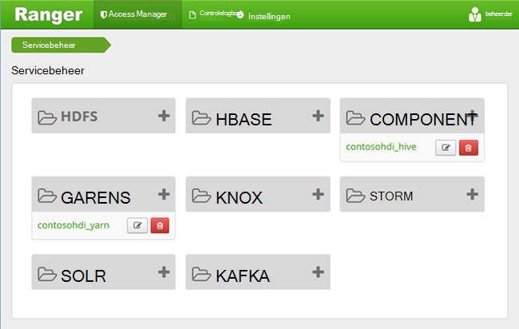
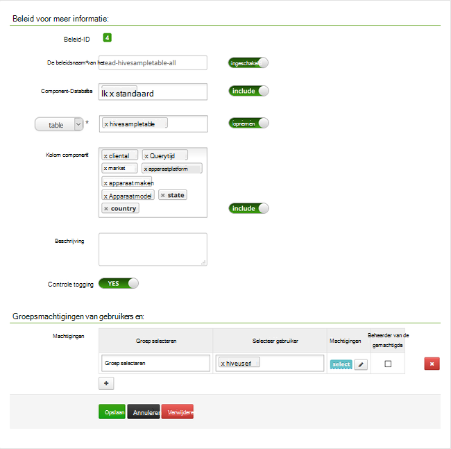

<properties
    pageTitle="Beleidsregels voor component configureren in een domein behoren HDInsight | Microsoft Azure"
    description="Meer informatie..."
    services="hdinsight"
    documentationCenter=""
    authors="saurinsh"
    manager="jhubbard"
    editor="cgronlun"
    tags="azure-portal"/>

<tags
    ms.service="hdinsight"
    ms.devlang="na"
    ms.topic="hero-article"
    ms.tgt_pltfrm="na"
    ms.workload="big-data"
    ms.date="10/25/2016"
    ms.author="saurinsh"/>

# Beleidsregels voor component configureren in een domein behoren HDInsight (Preview)

Informatie over het configureren van Apache Zwerver beleidsregels voor component. In dit artikel u twee Zwerver beleid maken om toegang tot de hivesampletable beperken. De hivesampletable wordt geleverd met HDInsight clusters. Nadat u het beleid hebt geconfigureerd, kunt u Excel en ODBC-stuurprogramma verbinding maken met de component tabellen in HDInsight.

## Vereisten voor

- Een domein behoren HDInsight cluster. Zie [een domein configureren behoren HDInsight clusters](hdinsight-domain-joined-configure.md).
- Een workstation met Office 2016, Office 2013 Professional Plus, Office 365 Pro Plus, zelfstandige versie van Excel 2013 of Office 2010 Professional Plus.

## Verbinding maken met Apache Zwerver beheerder UI

**Verbinding maken met Zwerver beheerder UI**

1. Via een browser verbinding maken met Zwerver beheerder UI. De URL is https://&lt;Clusternaam >.azurehdinsight.net/Ranger/. 

    >[AZURE.NOTE] Zwerver gebruikt andere referenties dan Hadoop cluster. Met nieuwe InPrivate-browservenster om te voorkomen dat browsers met in de cache opgeslagen Hadoop-referenties, verbinding maken met de gebruikersinterface van de beheerder Zwerver.
4. Meld u aan met het cluster beheerder domein-gebruikersnaam en wachtwoord:

    

    Zwerver werkt op dit moment alleen met garens en component.

## Domeingebruikers maken

In [een domein configureren behoren HDInsight clusters](hdinsight-domain-joined-configure.md#create-and-configure-azure-ad-ds-for-your-azure-ad), kunt u hiveruser1 en hiveuser2 hebt gemaakt. In deze zelfstudie gebruikt u het gebruikersaccount van de twee.

## Zwerver-beleid maken

In dit gedeelte maakt u twee Zwerver beleidsregels voor toegang tot hivesampletable. U geven selecteert toestemming op andere reeks kolommen. Beide gebruikers zijn in [een domein configureren behoren HDInsight clusters](hdinsight-domain-joined-configure.md#create-and-configure-azure-ad-ds-for-your-azure-ad)gemaakt.  In de volgende sectie, kunt u de twee beleidsregels in Excel kunt proberen.

**Zwerver-beleid maken**

1. Open Zwerver beheerder UI. Zie [verbinding maken met Apache Zwerver beheerder UI](#connect-to-apache-ranager-admin-ui).
2. Klik op ** &lt;Clusternaam > _hive**, onder **component**. Er zijn twee beleidsregels voor vooraf configureren.
3. Klik op **Nieuw beleid toevoegen**en voer de volgende waarden:

    - Beleidsnaam: alleen-hivesampletable-alles
    - Database component: standaard
    - tabel: hivesampletable
    - Kolom component: *
    - Selecteer gebruiker: hiveuser1
    - Machtigingen: Selecteer

    .

    >[AZURE.NOTE] Als een gebruiker wordt niet gevuld met gebruiker selecteren, wacht dan even duren voordat Zwerver om te synchroniseren met AAD.

4. Klik op **toevoegen** om op te slaan van het beleid.
5. De laatste twee stappen voor het maken van een ander beleid met de volgende eigenschappen:

    - Beleidsnaam: alleen-hivesampletable-devicemake
    - Database component: standaard
    - tabel: hivesampletable
    - Kolom component: clientid, devicemake
    - Selecteer gebruiker: hiveuser2
    - Machtigingen: Selecteer

## Component ODBC-gegevensbron maken

De instructies kunt u vinden in [maken component ODBC-gegevensbron](hdinsight-connect-excel-hive-odbc-driver.md).  

    Eigenschap|Beschrijving
    ---|---
    Naam van de gegevensbron|Geef een naam naar uw gegevensbron
    Host|Voer &lt;HDInsightClusterName >. azurehdinsight.net. Bijvoorbeeld myHDICluster.azurehdinsight.net
    Poort|Gebruik <strong>443</strong>. (Deze poort is gewijzigd van 563 in 443.)
    Database|Gebruik <strong>standaard</strong>.
    Het servertype component|Selecteer <strong>Component Server 2</strong>
    Om|Selecteer <strong>Azure HDInsight-Service</strong>
    HTTP-pad|Laat deze leeg.
    Gebruikersnaam in te voeren|Voer hiveuser1@contoso158.onmicrosoft.com. Werk de domeinnaam als deze.
    Wachtwoord|Voer het wachtwoord voor hiveuser1.
    </table>

Zorg ervoor dat Klik op **testen** voordat u de gegevensbron op te slaan.

##Gegevens importeren in Excel uit HDInsight

U kunt twee beleidsregels hebt geconfigureerd in de laatste sectie.  hiveuser1 heeft de machtiging select op alle kolommen en hiveuser2 heeft de machtiging select op twee kolommen. In dit gedeelte nabootsen u de twee gebruikers om gegevens te importeren in Excel.

1. Een nieuwe of bestaande werkmap openen in Excel.
2. Vanaf het tabblad **gegevens** op **Uit andere gegevensbronnen**en klik vervolgens op **Van Wizard Gegevensverbinding** om de **Wizard Gegevensverbinding**te starten.

    ! [Openen wizard Gegevensverbinding] [img-hdi-simbahiveodbc.excel.dataconnection]

3. **ODBC-DSN** selecteert als de gegevensbron en klik vervolgens op **volgende**.
4. Selecteer de naam van de gegevensbron die u hebt gemaakt in de vorige stap uit ODBC-gegevensbronnen, en klik vervolgens op **volgende**.
5. Voer het wachtwoord voor het cluster in de wizard en klik vervolgens op **OK**. Wacht totdat het dialoogvenster **Database en tabel selecteren** om te openen. Dit kan een paar seconden duren.
8. Selecteer **hivesampletable**en klik vervolgens op **volgende**. 
8. Klik op **Voltooien**.
9. U kunt wijzigen of de query opgeven in het dialoogvenster **Gegevens importeren** . Als u wilt doen, klikt u op **Eigenschappen**. Dit kan een paar seconden duren. 
10. Klik op het tabblad **definitie** . De opdrachttekst is:

        SELECT * FROM "HIVE"."default"."hivesampletable"

    Door het beleid voor Zwerver die u gedefinieerd, heeft hiveuser1 machtiging select op alle kolommen.  Zodat deze query werkt met de referenties van hiveuser1, maar deze query niet niet werkt met hiveuser2 van referenties.

    ! [Verbindingseigenschappen] [img-hdi-simbahiveodbc-excel-connectionproperties]

11. Klik op **OK** om te sluiten van het dialoogvenster Eigenschappen van verbinding.
12. Klik op **OK** om het dialoogvenster **Gegevens importeren** te sluiten.  
13. Het wachtwoord voor hiveuser1 opnieuw invoert en klik vervolgens op **OK**. Het duurt een paar seconden voordat u gegevens naar Excel wordt geïmporteerd. Wanneer deze klaar is, wordt er 11 kolommen met gegevens.

Als u wilt testen van de tweede beleid (alleen-hivesampletable-devicemake) u hebt gemaakt in de laatste sectie

1. Een nieuw blad toevoegen in Excel.
2. Volg de laatste procedure om de gegevens te importeren.  De enige wijziging die u maakt, is van hiveuser2 referenties gebruiken in plaats van de hiveuser1. Dit mislukt omdat hiveuser2 alleen daartoe is gemachtigd om twee kolommen weer te geven. U moet het volgende foutbericht weergegeven:

        [Microsoft][HiveODBC] (35) Error from Hive: error code: '40000' error message: 'Error while compiling statement: FAILED: HiveAccessControlException Permission denied: user [hiveuser2] does not have [SELECT] privilege on [default/hivesampletable/clientid,country ...]'.

3. Voer dezelfde procedure om gegevens te importeren. Schakel ditmaal hiveuser2 van referenties gebruikt, en ook wijzigen de select-instructie uit:

        SELECT * FROM "HIVE"."default"."hivesampletable"

    Aan:

        SELECT clientid, devicemake FROM "HIVE"."default"."hivesampletable"

    Wanneer deze klaar is, wordt er twee kolommen met gegevens die zijn geïmporteerd.

## Volgende stappen

- Zie [een domein configureren behoren HDInsight clusters](hdinsight-domain-joined-configure.md)voor het configureren van een domein behoren HDInsight cluster.
- Voor het beheer van Zie een kolomgroepen domein behoren HDInsight [HDInsight beheren domein behoren clusters](hdinsight-domain-joined-manage.md).
- Voor het uitvoeren van component query's met SSH op domein behoren HDInsight clusters, Zie [Gebruik SSH met Linux gebaseerde Hadoop op HDInsight uit Linux, Unix, of OS X](hdinsight-hadoop-linux-use-ssh-unix.md#connect-to-a-domain-joined-hdinsight-cluster).
- Voor verbinding component JDBC component gebruiken, raadpleegt u [verbinding maken met de component op Azure HDInsight met het stuurprogramma JDBC component](hdinsight-connect-hive-jdbc-driver.md)
- Zie [Excel verbinden met een Hadoop met het Microsoft Component ODBC-station](hdinsight-connect-excel-hive-odbc-driver.md) voor het Excel verbinden met Hadoop component ODBC gebruiken,
- Zie [Excel verbinden met een Hadoop met behulp van Power Query](hdinsight-connect-excel-power-query.md) voor Excel verbinden met Hadoop met Power Query,