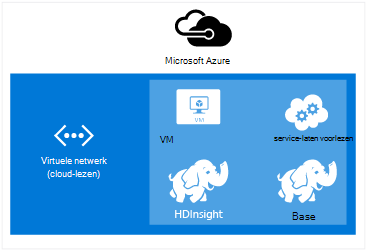
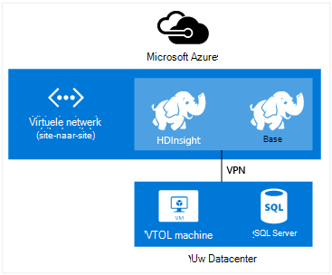
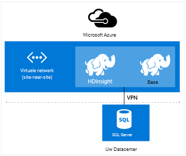

<properties
    pageTitle="HDInsight via virtuele netwerk uitbreiden | Microsoft Azure"  
    description="Informatie over het gebruik van Azure Virtual Network HDInsight verbinden met andere cloud resources of resources in uw datacenter"
    services="hdinsight"
    documentationCenter=""
    authors="Blackmist"
    manager="jhubbard"
    editor="cgronlun"/>

<tags
   ms.service="hdinsight"
   ms.devlang="na"
   ms.topic="article"
   ms.tgt_pltfrm="na"
   ms.workload="big-data"
   ms.date="10/21/2016"
   ms.author="larryfr"/>


#<a name="extend-hdinsight-capabilities-by-using-azure-virtual-network"></a>Mogelijkheden voor HDInsight uitbreiden met behulp van Azure Virtual Network

Azure Virtual Network kunt u uw Hadoop-oplossingen naar on-premises implementatie van resources zoals SQL Server nemen, meerdere HDInsight clustertypen combineren, of maak beveiligde particuliere netwerken tussen bronnen in de cloud uit te breiden.

[AZURE.INCLUDE [upgrade-powershell](../../includes/hdinsight-use-latest-powershell-and-cli.md)]


##<a id="whatis"></a>Wat is Virtual Azure-netwerk?

[Azure Virtual Network](https://azure.microsoft.com/documentation/services/virtual-network/) kunt u een beveiligde, permanente netwerk met de bronnen die u nodig voor uw oplossing hebt maken. Een virtueel netwerk kunt u:

* Verbinding maken met cloud resources samen op een privé-netwerk (cloud-lezen).

    

    Virtual Network gebruiken om te koppelen van Azure services met Azure HDInsight, kunt de volgende scenario's:

    * **Aanroepen van HDInsight services of taken** van Azure websites of services worden uitgevoerd in Azure virtuele machines.

    * De **gegevens rechtstreeks overbrengen** tussen HDInsight en Azure SQL-Database, SQL Server of een andere oplossing voor gegevensopslag uitgevoerd op een virtuele machine.

    * **Meerdere HDInsight-servers combineren** in één oplossing. HDInsight clusters vele verschillende met typen, die met de werklast technologie die het cluster is afgestemd corresponderen op. Er is geen ondersteunde methode een cluster waarin meerdere typen, zoals Storm en HBase op één cluster zijn gecombineerd maken. Gebruikt een virtueel netwerk, kunt meerdere clusters rechtstreeks met elkaar communiceren.

* Verbinding maken met uw resources cloud bij het netwerk van uw lokale datacenter (site-naar-site of punt-naar-site) met behulp van een VPN (VPN).

    Configuratie van de site-naar-site kunt u verbinding maakt van meerdere resources uit uw datacenter met het Azure virtuele netwerk met behulp van een hardware VPN of de Routering en RAS-service.

    

    Configuratie van het punt-naar-site kunt u een specifieke bron verbinding met het Azure virtuele netwerk met behulp van software VPN.

    

    Virtual Network gebruiken om te koppelen van de cloud en uw datacenter, kunt vergelijkbare scenario's in de configuratie alleen de cloud. Maar in plaats van dat wordt beperkt tot het werken met resources in de cloud, kunt u ook werken met resources in uw datacenter.

    * **Gegevens rechtstreeks overbrengen** tussen HDInsight en uw datacenter. Een voorbeeld is Sqoop gebruiken om gegevens aan of van SQL Server of lezen van gegevens die zijn gegenereerd door een lijn-of-business (LOB)-toepassing te brengen.

    * **Aanroepen van HDInsight services of taken** van een LOB-toepassing. Een voorbeeld is HBase Java-API's gebruiken om te slaan en gegevens ophalen uit een cluster HDInsight HBase.

Zie voor meer informatie over de functies, voordelen en mogelijkheden Virtual Network [Azure Virtual Network overzicht](../virtual-network/virtual-networks-overview.md).

> [AZURE.NOTE] Voordat u gaat inrichten van een cluster HDInsight, moet u het Azure virtuele netwerk maken. Zie voor meer informatie [Virtual Network configuratietaken uit te voeren](https://azure.microsoft.com/documentation/services/virtual-network/).

## <a name="virtual-network-requirements"></a>Virtuele netwerkvereisten

> [AZURE.IMPORTANT] Een cluster HDInsight maken op een virtueel netwerk, moet u specifieke Virtual Network configuraties, die in deze sectie worden beschreven.

###<a name="location-based-virtual-networks"></a>Locatie gebaseerde virtuele netwerken

Azure HDInsight ondersteunt alleen locatie gebaseerde virtuele netwerken en werkt niet momenteel met virtuele netwerken op basis van affiniteit groep.

###<a name="classic-or-v2-virtual-network"></a>Klassieke of v2 Virtual Network

Windows gebaseerde clusters vereist een klassieke virtueel netwerk, terwijl Linux gebaseerde clusters een Azure resourcemanager virtueel netwerk vereisen. Als u het juiste type netwerk niet hebt, deze, niet worden gebruikt wanneer u het cluster maakt.

Als u resources in een netwerk met een virtuele die niet kan worden gebruikt door het cluster die u van plan bent over het maken van hebt, kunt u een nieuwe Virtual Network die kan worden gebruikt door het cluster maken en verbindt u deze naar de niet-compatibele Virtual Network. Vervolgens kunt u het cluster in de netwerkversie die er moeten maken en deze kunnen voor toegang tot bronnen in het andere netwerk sinds de twee zijn gekoppeld. Zie voor meer informatie over het verbinden van klassieke en nieuwe virtuele netwerken, [verbinding maken klassieke VNets naar nieuwe VNets](../vpn-gateway/vpn-gateway-connect-different-deployment-models-portal.md).

###<a name="custom-dns"></a>Aangepaste DNS

Wanneer u een virtueel netwerk maakt, biedt Azure naamresolutie standaard voor Azure services zoals HDInsight die in het netwerk zijn geïnstalleerd. Mogelijk moet u echter uw eigen Domain Name System (DNS) gebruiken voor situaties zoals cross netwerk domeinnamen omzetten. Bijvoorbeeld wanneer communicatie tussen services zich bevindt in twee deelnemen aan virtuele netwerken. HDInsight ondersteunt zowel de standaard Azure-naamresolutie als aangepaste DNS-gebruikt in combinatie met Azure Virtual Network.

Zie de sectie __naamresolutie met uw eigen DNS-server__ van het document [Naamresolutie voor VMs en exemplaren van de functie](../virtual-network/virtual-networks-name-resolution-for-vms-and-role-instances.md#name-resolution-using-your-own-dns-server) voor meer informatie over het gebruik van uw eigen DNS-server met Azure Virtual Network.

###<a name="secured-virtual-networks"></a>Beveiligde virtuele netwerken

De HDInsight-service is een beheerde service en is internettoegang vereist tijdens het inrichten en bij het uitvoeren. Dit is dus die Azure kan de status van het cluster, controleren initiëren overname van cluster resources, wijzigt u het aantal knooppunten in het cluster via schaal bewerkingen en andere beheertaken.

Als u HDInsight in een netwerk met een beveiligde virtuele installeren moet, moet u binnenkomende toegang toestaan via poort 443 voor de volgende IP-adressen, waardoor Azure voor het beheren van het cluster HDInsight.

* 168.61.49.99
* 23.99.5.239
* 168.61.48.131
* 138.91.141.162

Binnenkomende toegang van poort 443 voor deze adressen kunt u installeren in een netwerk met een beveiligde virtuele HDInsight.

> [AZURE.IMPORTANT] HDInsight biedt geen ondersteuning uitgaand verkeer, alleen binnenkomend verkeer beperken. Bij het definiëren van de beveiligingsgroep netwerk regels voor het subnet HDInsight met alleen regels voor binnenkomende verbindingen te gebruiken.

De volgende voorbeelden wordt getoond hoe een nieuw netwerk-beveiligingsgroep die kunt de vereiste adressen en van de beveiligingsgroep van toepassing op een subnet binnen het netwerk van uw virtuele maken. Deze stappen wordt ervan uitgegaan dat u al hebt gemaakt een virtueel netwerk en subnetten die u wilt installeren HDInsight in.

__Via Azure PowerShell__

    $vnetName = "Replace with your virtual network name"
    $resourceGroupName = "Replace with the resource group the virtual network is in"
    $subnetName = "Replace with the name of the subnet that HDInsight will be installed into"
    # Get the Virtual Network object
    $vnet = Get-AzureRmVirtualNetwork `
        -Name $vnetName `
        -ResourceGroupName $resourceGroupName
    # Get the region the Virtual network is in.
    $location = $vnet.Location
    # Get the subnet object
    $subnet = $vnet.Subnets | Where-Object Name -eq $subnetName
    # Create a new Network Security Group.
    # And add exemptions for the HDInsight health and management services.
    $nsg = New-AzureRmNetworkSecurityGroup `
        -Name "hdisecure" `
        -ResourceGroupName $resourceGroupName `
        -Location $location `
        | Add-AzureRmNetworkSecurityRuleConfig `
            -name "hdirule1" `
            -Description "HDI health and management address 168.61.49.99" `
            -Protocol "*" `
            -SourcePortRange "*" `
            -DestinationPortRange "443" `
            -SourceAddressPrefix "168.61.49.99" `
            -DestinationAddressPrefix "VirtualNetwork" `
            -Access Allow `
            -Priority 300 `
            -Direction Inbound `
        | Add-AzureRmNetworkSecurityRuleConfig `
            -Name "hdirule2" `
            -Description "HDI health and management 23.99.5.239" `
            -Protocol "*" `
            -SourcePortRange "*" `
            -DestinationPortRange "443" `
            -SourceAddressPrefix "23.99.5.239" `
            -DestinationAddressPrefix "VirtualNetwork" `
            -Access Allow `
            -Priority 301 `
            -Direction Inbound `
        | Add-AzureRmNetworkSecurityRuleConfig `
            -Name "hdirule3" `
            -Description "HDI health and management 168.61.48.131" `
            -Protocol "*" `
            -SourcePortRange "*" `
            -DestinationPortRange "443" `
            -SourceAddressPrefix "168.61.48.131" `
            -DestinationAddressPrefix "VirtualNetwork" `
            -Access Allow `
            -Priority 302 `
            -Direction Inbound `
        | Add-AzureRmNetworkSecurityRuleConfig `
            -Name "hdirule4" `
            -Description "HDI health and management 138.91.141.162" `
            -Protocol "*" `
            -SourcePortRange "*" `
            -DestinationPortRange "443" `
            -SourceAddressPrefix "138.91.141.162" `
            -DestinationAddressPrefix "VirtualNetwork" `
            -Access Allow `
            -Priority 303 `
            -Direction Inbound
    # Set the changes to the security group
    Set-AzureRmNetworkSecurityGroup -NetworkSecurityGroup $nsg
    # Apply the NSG to the subnet
    Set-AzureRmVirtualNetworkSubnetConfig `
        -VirtualNetwork $vnet `
        -Name $subnetName `
        -AddressPrefix $subnet.AddressPrefix `
        -NetworkSecurityGroupId $nsg

__Gebruik van de Azure CLI__

1. Gebruik van de volgende opdracht uit om te maken van een nieuw netwerk beveiligingsgroep met de naam `hdisecure`. __RESOURCEGROUPNAME__ en __locatie__ vervangen door de resourcegroep met het Azure virtuele netwerk en de locatie (regio), die in de groep is gemaakt.

        azure network nsg create RESOURCEGROUPNAME hdisecure LOCATION
    
    Wanneer u de groep hebt gemaakt, ontvangt u informatie over de nieuwe groep. Zoekt u een regel die er ongeveer als volgt uit en sla de `/subscriptions/GUID/resourceGroups/RESOURCEGROUPNAME/providers/Microsoft.Network/networkSecurityGroups/hdisecure` informatie. Deze wordt gebruikt in een volgende stap.
    
        data:    Id                              : /subscriptions/GUID/resourceGroups/RESOURCEGROUPNAME/providers/Microsoft.Network/networkSecurityGroups/hdisecure

2. Gebruik de volgende regels toevoegen aan de nieuwe beveiligingsgroep voor netwerk waarmee u inkomende communicatie op poort 443 van de Azure HDInsight gezondheid en management-service. __RESOURCEGROUPNAME__ vervangen door de naam van de resourcegroep met het Azure virtuele netwerk.

        azure network nsg rule create RESOURCEGROUPNAME hdisecure hdirule1 -p "*" -o "*" -u "443" -f "168.61.49.99" -e "VirtualNetwork" -c "Allow" -y 300 -r "Inbound"
        azure network nsg rule create RESOURCEGROUPNAME hdisecure hdirule2 -p "*" -o "*" -u "443" -f "23.99.5.239" -e "VirtualNetwork" -c "Allow" -y 301 -r "Inbound"
        azure network nsg rule create RESOURCEGROUPNAME hdisecure hdirule3 -p "*" -o "*" -u "443" -f "168.61.48.131" -e "VirtualNetwork" -c "Allow" -y 302 -r "Inbound"
        azure network nsg rule create RESOURCEGROUPNAME hdisecure hdirule4 -p "*" -o "*" -u "443" -f "138.91.141.162" -e "VirtualNetwork" -c "Allow" -y 303 -r "Inbound"

3. Zodra de regels zijn gemaakt, gebruikt u de volgende in het nieuwe netwerk-beveiligingsgroep toepassen op een subnet. __RESOURCEGROUPNAME__ vervangen door de naam van de resourcegroep met het Azure virtuele netwerk. __VNETNAME__ en __SUBNETNAME__ vervangen door de naam van het Azure virtuele netwerk en het subnet dat u gebruiken wilt tijdens de installatie van HDInsight.

        azure network vnet subnet set RESOURCEGROUPNAME VNETNAME SUBNETNAME -w "/subscriptions/GUID/resourceGroups/RESOURCEGROUPNAME/providers/Microsoft.Network/networkSecurityGroups/hdisecure"
    
    Zodra deze opdracht is voltooid, kunt u in de beveiligde virtuele netwerk op het subnet gebruikt in de volgende stappen uit HDInsight installeren.

> [AZURE.IMPORTANT] Via de bovenstaande stappen alleen toegang tot de HDInsight gezondheid en management-service in de cloud Azure. Hiermee kunt u een cluster HDInsight installeren in het subnet, maar toegang tot het cluster HDInsight van buiten het virtuele netwerk al dan niet standaard is geblokkeerd. U moet extra netwerk beveiligingsgroep regels toevoegen als u wilt toegang van buiten het virtuele netwerk inschakelen.
>
> Als u wilt SSH toegang van internet, moet u wordt bijvoorbeeld een regel voor de volgende strekking toevoegen: 
>
> * Azure PowerShell-```Add-AzureRmNetworkSecurityRuleConfig -Name "SSSH" -Description "SSH" -Protocol "*" -SourcePortRange "*" -DestinationPortRange "22" -SourceAddressPrefix "*" -DestinationAddressPrefix "VirtualNetwork" -Access Allow -Priority 304 -Direction Inbound```
> * Azure CLI-```azure network nsg rule create RESOURCEGROUPNAME hdisecure hdirule4 -p "*" -o "*" -u "22" -f "*" -e "VirtualNetwork" -c "Allow" -y 304 -r "Inbound"```

Zie voor meer informatie over beveiligingsgroepen netwerk, [netwerk-beveiligingsgroepen overzicht](../virtual-network/virtual-networks-nsg.md). Zie de [gebruiker gedefinieerde Routes en IP-doorsturen](../virtual-network/virtual-networks-udr-overview.md)voor informatie over het beheren van mailroutering in een Azure Virtual Network.

##<a id="tasks"></a>Taken en informatie

Deze sectie bevat informatie over algemene taken en informatie die u moet u mogelijk wanneer u HDInsight met een virtueel netwerk.

###<a name="determine-the-fqdn"></a>De FQDN-naam bepalen

Het cluster HDInsight worden een specifieke FQDN-naam (Fully Qualified Domain Name) voor de interface Virtual Network toegewezen. Dit is het adres die u gebruiken moet wanneer u verbinding maakt met het cluster van andere bronnen op het virtuele netwerk. Met de volgende URL om te bepalen de FQDN-naam, de Ambari management-service query:

    https://<clustername>.azurehdinsight.net/ambari/api/v1/clusters/<clustername>.azurehdinsight.net/services/<servicename>/components/<componentname>

> [AZURE.NOTE] Zie voor meer informatie over het gebruik van Ambari met HDInsight [Monitor Hadoop clusters in HDInsight de Ambari-API gebruiken](hdinsight-monitor-use-ambari-api.md).

U moet de clusternaam van de en een service en de component wordt uitgevoerd op het cluster, zoals de manager van de resource garens opgeven.

> [AZURE.NOTE] De geretourneerde gegevens is een notatie voor JavaScript-Object (JSON)-document met een groot aantal informatie over het onderdeel. Als u wilt extraheren alleen de FQDN-naam, moet u een JSON-parser gebruiken om op te halen de `host_components[0].HostRoles.host_name` waarde.

Bijvoorbeeld als u wilt teruggaan naar de FQDN-naam van een cluster HDInsight Hadoop, kunt u een van de volgende methoden om op te halen van de gegevens voor de resourcemanager garens:

* [Azure PowerShell](../powershell-install-configure.md)

        $ClusterDnsName = <clustername>
        $Username = <cluster admin username>
        $Password = <cluster admin password>
        $DnsSuffix = ".azurehdinsight.net"
        $ClusterFQDN = $ClusterDnsName + $DnsSuffix

        $webclient = new-object System.Net.WebClient
        $webclient.Credentials = new-object System.Net.NetworkCredential($Username, $Password)

        $Url = "https://" + $ClusterFQDN + "/ambari/api/v1/clusters/" + $ClusterFQDN + "/services/yarn/     components/resourcemanager"
        $Response = $webclient.DownloadString($Url)
        $JsonObject = $Response | ConvertFrom-Json
        $FQDN = $JsonObject.host_components[0].HostRoles.host_name
        Write-host $FQDN

* [omslaan](http://curl.haxx.se/) en [jq](http://stedolan.github.io/jq/)

        curl -G -u <username>:<password> https://<clustername>.azurehdinsight.net/ambari/api/v1/clusters/<clustername>.azurehdinsight.net/services/yarn/components/resourcemanager | jq .host_components[0].HostRoles.host_name

###<a name="connecting-to-hbase"></a>Verbinding maken met HBase

Verbinding HBase op afstand door de Java-API gebruiken, moet u de adressen van de quorum ZooKeeper voor het cluster HBase bepalen en geeft u dit in uw toepassing.

Als u de ZooKeeper quorum adres, gebruikt u een van de volgende methoden om query's in de Ambari management-service:

* [Azure PowerShell](../powershell-install-configure.md)

        $ClusterDnsName = <clustername>
        $Username = <cluster admin username>
        $Password = <cluster admin password>
        $DnsSuffix = ".azurehdinsight.net"
        $ClusterFQDN = $ClusterDnsName + $DnsSuffix

        $webclient = new-object System.Net.WebClient
        $webclient.Credentials = new-object System.Net.NetworkCredential($Username, $Password)

        $Url = "https://" + $ClusterFQDN + "/ambari/api/v1/clusters/" + $ClusterFQDN + "/configurations?type=hbase-site&tag=default&fields=items/properties/hbase.zookeeper.quorum"
        $Response = $webclient.DownloadString($Url)
        $JsonObject = $Response | ConvertFrom-Json
        Write-host $JsonObject.items[0].properties.'hbase.zookeeper.quorum'

* [omslaan](http://curl.haxx.se/) en [jq](http://stedolan.github.io/jq/)

        curl -G -u <username>:<password> "https://<clustername>.azurehdinsight.net/ambari/api/v1/clusters/<clustername>.azurehdinsight.net/configurations?type=hbase-site&tag=default&fields=items/properties/hbase.zookeeper.quorum" | jq .items[0].properties[]

> [AZURE.NOTE] Zie voor meer informatie over het gebruik van Ambari met HDInsight [Monitor Hadoop clusters in HDInsight de Ambari-API gebruiken](hdinsight-monitor-use-ambari-api.md).

Zodra u de gegevens quorum hebt, kunt u deze in de clienttoepassing gebruiken.

U zou doen voor een Java-toepassing waarin de API HBase, bijvoorbeeld een **hbase-site.xml** -bestand toevoegen aan het project en de quorum-gegevens als volgt opgeven in het bestand:

```
<configuration>
  <property>
    <name>hbase.cluster.distributed</name>
    <value>true</value>
  </property>
  <property>
    <name>hbase.zookeeper.quorum</name>
    <value>zookeeper0.address,zookeeper1.address,zookeeper2.address</value>
  </property>
  <property>
    <name>hbase.zookeeper.property.clientPort</name>
    <value>2181</value>
  </property>
</configuration>
```

###<a name="verify-network-connectivity"></a>Netwerkconnectiviteit controleren

Sommige services, zoals SQL Server, kunnen binnenkomende netwerkverbindingen beperken. Hiermee wordt voorkomen dat HDInsight goed werken met deze services.

Als u problemen hebt met het openen van een service uit HDInsight, raadpleegt u de documentatie voor de service om ervoor te zorgen dat u netwerktoegang hebt ingeschakeld. U kunt ook netwerktoegang controleren door te maken van een Azure virtuele machines in hetzelfde virtuele netwerk, en client hulpprogramma's gebruiken om te bevestigen dat de virtuele machine verbinding met de service via het virtuele netwerk maken kunt.

##<a id="nextsteps"></a>Volgende stappen

De volgende voorbeelden laten zien hoe u HDInsight met Azure Virtual Network:

* [Sensorgegevens analyseren met Storm en HBase in HDInsight](hdinsight-storm-sensor-data-analysis.md) - ziet u een cluster Storm en HBase configureren in een virtueel netwerk, evenals de gegevens op afstand schrijven naar HBase van Storm.

* [Inrichten Hadoop clusters in HDInsight](hdinsight-hadoop-provision-linux-clusters.md) - wordt aandacht besteed aan inrichting Hadoop kolomgroepen met inbegrip van informatie over het gebruik van Azure Virtual Network.

* [Gebruik Sqoop met Hadoop in HDInsight](hdinsight-use-sqoop-mac-linux.md) - vindt u informatie over het gebruik van Sqoop gegevens met SQL Server via een virtueel netwerk over te zetten.

Zie voor meer informatie over Azure virtuele netwerken, [Azure Virtual Network overzicht](../virtual-network/virtual-networks-overview.md).
