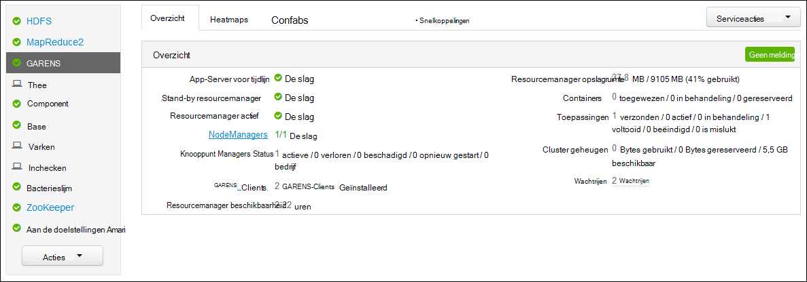
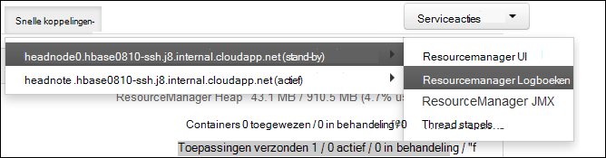

<properties
    pageTitle="Access-toepassing voor Hadoop garens aanmeldt Linux gebaseerde HDInsight | Microsoft Azure"
    description="Leer hoe u toegang tot garens toepassingslogboeken op een Linux gebaseerde HDInsight (Hadoop) cluster met zowel de opdrachtregel en een webbrowser."
    services="hdinsight"
    documentationCenter=""
    tags="azure-portal"
    authors="Blackmist" 
    manager="jhubbard"
    editor="cgronlun"/>

<tags
    ms.service="hdinsight"
    ms.workload="big-data"
    ms.tgt_pltfrm="na"
    ms.devlang="na"
    ms.topic="article"
    ms.date="10/21/2016"
    ms.author="larryfr"/>

# Access-toepassing voor garens aanmeldt Linux gebaseerde HDInsight 

Dit document wordt uitgelegd hoe u toegang tot de logboeken voor garens (nog een andere Resource onderhandelaar)-toepassingen die u op een Hadoop-cluster in Azure HDInsight hebt.

> [AZURE.NOTE] De informatie in dit document is specifiek voor HDInsight Linux gebaseerde clusters. Zie voor informatie over Windows gebaseerde clusters, [garens van Access-toepassing Logboeken op Windows gebaseerde HDInsight](hdinsight-hadoop-access-yarn-app-logs.md)

## Vereisten voor

* Een cluster Linux gebaseerde HDInsight.

* U moet [een tunnel SSH maken](hdinsight-linux-ambari-ssh-tunnel.md) voordat u toegang hebt tot de ResourceManager logboeken web UI.

## GARENS tijdlijn Server

De [Garens tijdlijn Server](http://hadoop.apache.org/docs/r2.4.0/hadoop-yarn/hadoop-yarn-site/TimelineServer.html) bevat algemene informatie over voltooide toepassingen, evenals framework / regiospecifieke toepassingsinformatie tot en met twee verschillende interfaces. Name:

* Opslag en voor het ophalen van algemene toepassingsinformatie op HDInsight clusters is ingeschakeld met versie 3.1.1.374 of hoger.
* Onderdeel van de toepassing framework / regiospecifieke gegevens van de tijdlijn-Server is momenteel niet beschikbaar op HDInsight clusters.

Algemene informatie over toepassingen bevat de volgende soorten gegevens:

* De toepassings-ID, een unieke id van een toepassing
* De gebruiker van wie de toepassing gestart
* Informatie over pogingen om te voltooien van de toepassing
* De containers die worden gebruikt door een bepaalde toepassing poging

## Logboeken garens toepassingen en

GARENS ondersteunt meerdere programming modellen (MapReduce wordt een van deze) door het resourcebeheer van de van toepassing plannen/monitoring ontkoppeling. Dit gebeurt via een globale *ResourceManager* (RM), per werknemer-knooppunten *NodeManagers* (NMs) en per toepassing *ApplicationMasters* (AMs). De AM per toepassing onderhandelingen informatiebronnen (CPU, geheugen, schijf, netwerk) voor het uitvoeren van uw toepassing met de RM. De RM werkt met NMs om te verlenen deze resources, die als *containers*zijn verleend. De AM is verantwoordelijk voor het volgen van de voortgang van de containers toe door de RM. toegewezen Een toepassing kan veel containers afhankelijk van de aard van de toepassing vragen.

Bovendien elke toepassing kan bestaan uit meerdere *toepassing probeert* om te voltooien in de aanwezigheid van loopt of vanwege de verlies van de communicatie tussen een AM en een RM. Daarom containers toegekend aan een specifieke poging van een toepassing. Een container biedt de context voor de basiseenheid voor werk dat door een toepassing garens uitgevoerd in een zin, en alle werk dat is uitgevoerd binnen de context van een container wordt uitgevoerd op het één werknemer knooppunt waarop de container is toegewezen. Zie [Garens begrippen] [ YARN-concepts] voor verdere verwijzing.

Toepassingslogboeken aan de (en de bijbehorende container Logboeken) hebben ernstige foutopsporing problematisch Hadoop-toepassingen. GARENS biedt een nette kader voor het verzamelen en opslaan van de toepassingslogboeken met de [Log aggregatie] aggregeren[ log-aggregation] functie. De functie Log aggregatie kunt toepassingslogboeken aan de toegang tot meer deterministisch, omdat deze logboeken over alle containers op een knooppunt werknemer is samengevoegd en worden opgeslagen als één geaggregeerde logboekbestand per medewerker knooppunt in het standaardbestandssysteem nadat een toepassing is voltooid. Uw toepassing honderden of duizenden containers mogelijk gebruikt, maar logboeken voor alle containers uitgevoerd op een knooppunt één werknemer altijd worden samengevoegd in één bestand, resulteert in één logboekbestand per medewerker knooppunt gebruikt door de toepassing. Log aggregatie is standaard ingeschakeld op HDInsight clusters (versie 3.0 en hoger), en geaggregeerde logboeken kunnen worden gevonden in de standaardcontainer van uw cluster op de volgende locatie:

    wasbs:///app-logs/<user>/logs/<applicationId>

In dat locatie, de *gebruiker* is de naam van de gebruiker van wie de toepassing gestart en *applicationId* de unieke id van een toepassing is zoals die door de RM. garens toegewezen

De samengevoegde logboeken kunnen worden niet rechtstreeks gelezen, zoals ze zijn geschreven in een [TFile][T-file], [binaire indeling] [ binary-format] geïndexeerd door de container. Hebt u de logboeken aan de garens ResourceManager of CLI hulpmiddelen voor deze logboeken weergeven als tekst zonder opmaak voor toepassingen of containers belangrijke. 

##Hulpmiddelen voor garens CLI

Pas de garens CLI hulpmiddelen gebruiken, moet u eerst verbinding maken met het HDInsight cluster via SSH. Gebruik een van de volgende documenten voor meer informatie over het gebruik van SSH met HDInsight:

- [SSH gebruiken met Linux gebaseerde Hadoop op HDInsight uit Linux, Unix of OS X](hdinsight-hadoop-linux-use-ssh-unix.md)

- [SSH gebruiken met Linux gebaseerde Hadoop op HDInsight vanuit Windows](hdinsight-hadoop-linux-use-ssh-windows.md)
    
U kunt deze logboeken als tekst zonder opmaak weergeven door een van de volgende opdrachten uit te voeren:

    yarn logs -applicationId <applicationId> -appOwner <user-who-started-the-application>
    yarn logs -applicationId <applicationId> -appOwner <user-who-started-the-application> -containerId <containerId> -nodeAddress <worker-node-address>
    
Moet u de &lt;applicationId >, &lt;gebruiker-wie-gestart-de-toepassing >, &lt;IdContainer >, en & ltworker-knooppunt-adres > informatie bij het uitvoeren van deze opdrachten.

##GARENS ResourceManager UI

De gebruikersinterface van de ResourceManager garens wordt uitgevoerd op de headnode cluster en zijn toegankelijk via het web Ambari UI; echter, moet u eerst [een tunnel SSH maken](hdinsight-linux-ambari-ssh-tunnel.md) voordat u de UI ResourceManager kunt openen.

Als u een tunnel SSH hebt gemaakt, gebruikt u de volgende stappen uit om weer te geven van de logboeken garens:

1. Ga in uw webbrowser naar https://CLUSTERNAME.azurehdinsight.net. CLUSTERNAAM vervangen door de naam van uw cluster HDInsight.

2. Selecteer in de lijst met services aan de linkerkant, __garens__.

    

3. Selecteer een van de knooppunten hoofd en selecteer __ResourceManager Log__in de vervolgkeuzelijst __Snelkoppelingen__ .

    
    
    U krijgt een lijst met koppelingen naar garens Logboeken.

[YARN-timeline-server]:http://hadoop.apache.org/docs/r2.4.0/hadoop-yarn/hadoop-yarn-site/TimelineServer.html
[log-aggregation]:http://hortonworks.com/blog/simplifying-user-logs-management-and-access-in-yarn/
[T-file]:https://issues.apache.org/jira/secure/attachment/12396286/TFile%20Specification%2020081217.pdf
[binary-format]:https://issues.apache.org/jira/browse/HADOOP-3315
[YARN-concepts]:http://hortonworks.com/blog/apache-hadoop-yarn-concepts-and-applications/
