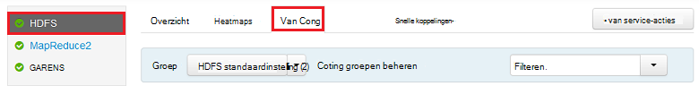
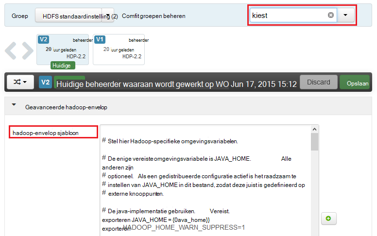
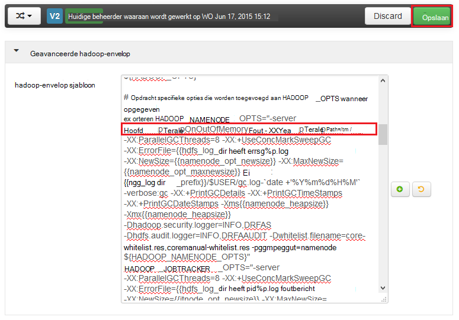
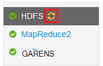
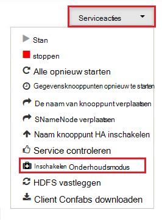

<properties
    pageTitle="Inschakelen van opslagruimte dumps voor Hadoop-services op HDInsight | Microsoft Azure"
    description="Opslagruimte dumps voor Hadoop-services van HDInsight Linux gebaseerde clusters voor foutopsporing en analyse inschakelen."
    services="hdinsight"
    documentationCenter=""
    authors="Blackmist"
    manager="jhubbard"
    editor="cgronlun"
    tags="azure-portal"/>

<tags
    ms.service="hdinsight"
    ms.workload="big-data"
    ms.tgt_pltfrm="na"
    ms.devlang="na"
    ms.topic="article"
    ms.date="09/27/2016"
    ms.author="larryfr"/>

#Opslagruimte dumps voor Hadoop-services op Linux gebaseerde HDInsight (Preview) inschakelen

[AZURE.INCLUDE [heapdump-selector](../../includes/hdinsight-selector-heap-dump.md)]

Opslagruimte dumps bevatten een momentopname van de toepassing geheugen, met inbegrip van de waarden van variabelen op het moment dat de dump is gemaakt. Zodat ze bijzonder nuttig zijn zijn voor het oplossen van problemen die tijdens de uitvoering optreden.

> [AZURE.NOTE] De informatie in dit artikel is alleen van toepassing op Linux gebaseerde HDInsight. Zie [opslagruimte dumps voor Hadoop-services op Windows gebaseerde HDInsight inschakelen](hdinsight-hadoop-collect-debug-heap-dumps.md) voor informatie over Windows gebaseerde HDInsight,

## Services

U kunt opslagruimte dumps voor de volgende services inschakelen:

*  **hcatalog** - tempelton
*  **component** - hiveserver2, metastore, derbyserver
*  **mapreduce** - jobhistoryserver
*  **garens** - resourcemanager, nodemanager, timelineserver
*  **hdfs** - datanode, secondarynamenode, namenode

U kunt ook opslagruimte dumps voor de kaart en verkleinen processen worden uitgevoerd door HDInsight.

## Lidmaatschap opslagruimte dump configuratie

Opslagruimte dumps zijn ingeschakeld door de opties (soms genoemd op kiest, of parameters) naar de JVM wanneer een service wordt gestart. Voor de meeste Hadoop-services, dit kunt u doen doordat de shellscript gebruikt voor het starten van de service.

In elke script is een exporteren voor ** \* \_OPTS**, die de opties doorgegeven aan de JVM bevat. Bijvoorbeeld in het script **hadoop-env.sh** de regel die begint met `export HADOOP_NAMENODE_OPTS=` bevat de opties voor de service NameNode.

Toewijzen en verkleinen processen zijn enigszins afwijkend, zoals hierna ziet u een onderliggend proces van de service MapReduce. Elk toewijzen of beperken proces wordt uitgevoerd in een container onderliggende en er zijn twee posten met de opties JVM voor deze. Beide bevat **mapred-site.xml**:

* **mapreduce.Admin.map.child.Java.opts**
* **mapreduce.Admin.reduce.child.Java.opts**

> [AZURE.NOTE] Het is raadzaam met Ambari wijzigt de scripts en de mapred-site.xml instellingen, zoals Ambari verwerkt door de wijzigingen op knooppunten in het cluster repliceren. Zie het gedeelte [Ambari gebruiken](#using-ambari) voor gedetailleerde stappen.

###Opslagruimte dumps inschakelen

De volgende optie schakelt opslagruimte dumps in geval van een OutOfMemoryError:

    -XX:+HeapDumpOnOutOfMemoryError

De **+** geeft aan dat deze optie is ingeschakeld. De standaardinstelling is uitgeschakeld.

> [AZURE.WARNING] Opslagruimte dumps zijn niet ingeschakeld voor Hadoop-services op HDInsight al dan niet standaard, zoals de bestanden grote worden kunnen. Als u ze voor probleemoplossing inschakelt, moet u ze uitschakelen nadat u het probleem gereproduceerd en die worden verzameld door de bestanden.

###Dump locatie

De standaardlocatie voor het bestand is de huidige werkmap. U kunt bepalen waar het bestand is opgeslagen met de volgende optie:

    -XX:HeapDumpPath=/path

Bijvoorbeeld, met behulp van `-XX:HeapDumpPath=/tmp` de dumpbestanden moeten worden opgeslagen in de adreslijst /tmp veroorzaakt.

###Scripts

U kunt ook een script activeren wanneer een **OutOfMemoryError** plaatsvindt. Een melding bijvoorbeeld activeert zodat u weet dat de fout is opgetreden. Hiermee wordt gecontroleerd met de volgende optie:

    -XX:OnOutOfMemoryError=/path/to/script

> [AZURE.NOTE] Aangezien Hadoop een gedistribueerd systeem is, moet een script gebruikt op alle knooppunten in het cluster die de service wordt uitgevoerd op worden geplaatst.
>
> Het script moet ook worden op een locatie die toegankelijk is voor het account de service wordt uitgevoerd als en moet ondersteuning bieden voor machtigingen voor uitvoeren. U wilt bijvoorbeeld opslaan van scripts in `/usr/local/bin` en gebruikt u `chmod go+rx /usr/local/bin/filename.sh` toestaan lezen en machtigingen voor uitvoeren.

##Ambari gebruiken

Als u wilt wijzigen van de configuratie van een service, gebruikt u de volgende stappen uit:

1. Open het web Ambari UI voor uw cluster. De URL is https://YOURCLUSTERNAME.azurehdinsight.net.

    Wanneer u wordt gevraagd, worden geverifieerd naar de site met de naam van het HTTP-account (standaard:-beheerder) en wachtwoord voor uw cluster.

    > [AZURE.NOTE] U mogelijk gevraagd een tweede maal door Ambari voor de gebruikersnaam en wachtwoord. Zo ja, alleen opnieuw in te voeren de dezelfde naam en het wachtwoord

2. Gebruik de lijst met aan de linkerkant, selecteer het servicegebied die u wilt wijzigen. Bijvoorbeeld: **HDFS**. Selecteer in het gebied in het beheercentrum, het tabblad **configuraties** .

    

3. Met het fragment **... filteren** , voert u **kiest**. Hiermee wordt de lijst met configuratie-items met alleen die met deze tekst gefilterd, en is een snelle manier om te zoeken het shellscript, of de **sjabloon** die kunnen worden gebruikt voor het instellen van deze opties.

    

4. Zoek de ** \* \_OPTS** -vermelding voor de service die u wilt inschakelen opslagruimte dumps voor en toevoegen van de opties die u wilt inschakelen. In de volgende afbeelding, ik heb toegevoegd `-XX:+HeapDumpOnOutOfMemoryError -XX:HeapDumpPath=/tmp/` naar de **HADOOP\_NAMENODE\_OPTS** invoer:

    

    > [AZURE.NOTE] Wanneer inschakelen opslagruimte wordt voor de kaart of onderliggend proces verkleinen, zoekt u in plaats daarvan naar de velden gelabelde **mapreduce.admin.map.child.java.opts** en **mapreduce.admin.reduce.child.java.opts**.

    Gebruik de knop **Opslaan** als u de wijzigingen wilt opslaan. U krijgt een korte notitie met een beschrijving van de wijzigingen invoeren.

5. Nadat de wijzigingen zijn toegepast, wordt het pictogram **opnieuw opstarten vereist** verschijnt naast een of meer services.

    

6. Selecteer elke service die nog moet worden opnieuw en gebruik de knop **Acties van de Service** te **Schakelen op onderhoudsmodus**. Hiermee voorkomt u dat waarschuwingen van deze service wordt gegenereerd wanneer u het programma opnieuw.

    

7. Nadat u onderhoudsmodus hebt ingeschakeld, voert u de knop **Start opnieuw** voor de service **alle** plaatsvinden opnieuw starten

    

    > [AZURE.NOTE] de items voor de knop **Start opnieuw** afwijken voor andere services.

8. Zodra de services opnieuw zijn gestart, gebruikt u de knop **Acties van de Service** te **Schakelen uit onderhoudsmodus**. Deze Ambari hervatten monitoring voor waarschuwingen voor de service.
