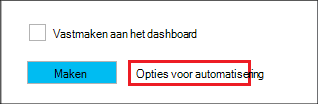

<properties
   pageTitle="Hadoop Linux gebaseerde clusters maken in met sjablonen resourcemanager Azure HDInsight | Microsoft Azure"
    description="Informatie over het maken van clusters voor Azure HDInsight Azure Azure resourcemanager sjablonen gebruiken."
   services="hdinsight"
   documentationCenter=""
   tags="azure-portal"
   authors="mumian"
   manager="jhubbard"
   editor="cgronlun"/>

<tags
   ms.service="hdinsight"
   ms.devlang="na"
   ms.topic="article"
   ms.tgt_pltfrm="na"
   ms.workload="big-data"
   ms.date="09/02/2016"
   ms.author="jgao"/>

# Hadoop Linux gebaseerde clusters in HDInsight met Azure resourcemanager sjablonen maken

[AZURE.INCLUDE [selector](../../includes/hdinsight-selector-create-clusters.md)]

Leer hoe u HDInsight clusters met Azure Resource Manager(ARM) sjablonen maken. Zie [Deploy een toepassing met Azure resourcemanager sjabloon](../resource-group-template-deploy.md)voor meer informatie. Voor het maken van andere cluster hulpprogramma's en functies klikt u op het tabblad Selecteer boven aan deze pagina of Zie [methoden voor het maken van Cluster](hdinsight-provision-clusters.md#cluster-creation-methods).

##Vereisten:

[AZURE.INCLUDE [delete-cluster-warning](../../includes/hdinsight-delete-cluster-warning.md)]

Voordat u de instructies in dit artikel, hebt u het volgende:

- [Azure-abonnement](https://azure.microsoft.com/documentation/videos/get-azure-free-trial-for-testing-hadoop-in-hdinsight/).
- Azure PowerShell en/of Azure CLI

    [AZURE.INCLUDE [use-latest-version](../../includes/hdinsight-use-latest-powershell-and-cli.md)]

### Vereisten voor het beheer van Access

[AZURE.INCLUDE [access-control](../../includes/hdinsight-access-control-requirements.md)]

## Resourcemanager sjablonen

Resourcemanager sjabloon kunt u gemakkelijk HDInsight clusters, hun afhankelijke bronnen (zoals het standaardaccount opslag) en andere resources (zoals Azure SQL-Database voor het gebruik van Apache Sqoop) maken voor uw toepassing een eenmalige, gecoördineerde betrekking heeft. In de sjabloon die u kunt de resources die nodig zijn voor de toepassing definiëren en implementatie parameters voor het invoeren van waarden voor verschillende omgevingen opgeeft. De sjabloon bestaat uit JSON en expressies die u gebruiken kunt om samen te stellen van de waarden voor de implementatie.

Een sjabloon resourcemanager voor het maken van een cluster HDInsight en de afhankelijke opslag van Azure-account kunt u vinden in [Bijlage-A](#appx-a-arm-template). Meerdere platforms [VSCode](https://code.visualstudio.com/#alt-downloads) gebruiken met de [extensie resourcemanager](https://marketplace.visualstudio.com/items?itemName=msazurermtools.azurerm-vscode-tools) of een teksteditor aan de sjabloon opslaan in een bestand op uw werkstation. Hier leert u hoe u de sjabloon met behulp van verschillende methoden bellen.

Zie voor meer informatie over resourcemanager-sjabloon

- [Auteur Azure resourcemanager sjablonen](../resource-group-authoring-templates.md)
- [Een toepassing met Azure resourcemanager sjabloon implementeren](../resource-group-template-deploy.md)

Als u het schema JSON voor bepaalde elementen wilt, kunt u de volgende procedure te volgen:

1. Open [Azure-portal](https://porta.azure.com) maken van een cluster HDInsight.  Zie [maken Linux gebaseerde clusters in met behulp van de portal Azure HDInsight](hdinsight-hadoop-create-linux-clusters-portal.md).
2. De vereiste elementen en de elementen die u nodig hebt met het schema JSON configureren.
3. Voordat u op **maken**, klikt u op **Opties voor automatisering** zoals wordt weergegeven in de volgende schermafbeelding:

    

    De portal Hiermee maakt u een Resource Manager sjabloon op basis van uw configuraties.
## Met PowerShell implementeren

De volgende procedure wordt gemaakt op basis van Linux HDInsight cluster.

**Een cluster met resourcemanager sjabloon implementeren**

1. Sla het bestand json in [bijlage A](#appx-a-arm-template) bij uw werkstation. In de PowerShell-script is de bestandsnaam *C:\HDITutorials-ARM\hdinsight-arm-template.json*.
2. Stel de parameters en variabelen indien nodig.
3. De sjabloon met het volgende PowerShell-script uitvoeren:

        ####################################
        # Set these variables
        ####################################
        #region - used for creating Azure service names
        $nameToken = "<Enter an Alias>" 
        $templateFile = "C:\HDITutorials-ARM\hdinsight-arm-template.json"
        #endregion

        ####################################
        # Service names and varialbes
        ####################################
        #region - service names
        $namePrefix = $nameToken.ToLower() + (Get-Date -Format "MMdd")

        $resourceGroupName = $namePrefix + "rg"
        $hdinsightClusterName = $namePrefix + "hdi"
        $defaultStorageAccountName = $namePrefix + "store"
        $defaultBlobContainerName = $hdinsightClusterName

        $location = "East US 2"

        $armDeploymentName = $namePrefix
        #endregion

        ####################################
        # Connect to Azure
        ####################################
        #region - Connect to Azure subscription
        Write-Host "`nConnecting to your Azure subscription ..." -ForegroundColor Green
        try{Get-AzureRmContext}
        catch{Login-AzureRmAccount}
        #endregion

        # Create a resource group
        New-AzureRmResourceGroup -Name $resourceGroupName -Location $Location

        # Create cluster and the dependent storage accounge
        $parameters = @{clusterName="$hdinsightClusterName"}

        New-AzureRmResourceGroupDeployment `
            -Name $armDeploymentName `
            -ResourceGroupName $resourceGroupName `
            -TemplateFile $templateFile `
            -TemplateParameterObject $parameters

        # List cluster
        Get-AzureRmHDInsightCluster -ResourceGroupName $resourceGroupName -ClusterName $hdinsightClusterName 

    De PowerShell-script configureert alleen de naam van het cluster. De naam van het opslag-account is vastgelegde in de sjabloon. U wordt gevraagd het wachtwoord voor de cluster gebruiker (de standaard-gebruikersnaam is *admin*); in te voeren en het wachtwoord van de SSH-gebruiker (de standaardinstelling SSH gebruikersnaam is *sshuser*).  
    
Zie voor meer informatie [met PowerShell distribueren](../resource-group-template-deploy.md#deploy-with-powershell).

## Met Azure CLI implementeren

In het onderstaande voorbeeld wordt een cluster en de afhankelijke opslag-account en de container door te bellen van een sjabloon resourcemanager gemaakt:

    azure login
    azure config mode arm
    azure group create -n hdi1229rg -l "East US"
    azure group deployment create --resource-group "hdi1229rg" --name "hdi1229" --template-file "C:\HDITutorials-ARM\hdinsight-arm-template.json"
    
U wordt gevraagd om in te voeren naam van het cluster, cluster gebruikerswachtwoord (de standaard-gebruikersnaam is *admin*) en het wachtwoord van de SSH-gebruiker (de standaardinstelling SSH gebruikersnaam is *sshuser*). In line parameters opgeven:

    azure group deployment create --resource-group "hdi1229rg" --name "hdi1229" --template-file "c:\Tutorials\HDInsightARM\create-linux-based-hadoop-cluster-in-hdinsight.json" --parameters '{\"clusterName\":{\"value\":\"hdi1229\"},\"clusterLoginPassword\":{\"value\":\"Pass@word1\"},\"sshPassword\":{\"value\":\"Pass@word1\"}}'

## Implementeren met REST API

Zie [implementeren met de REST API](../resource-group-template-deploy.md#deploy-with-the-rest-api).

## Met Visual Studio implementeren

U kunt met Visual Studio, een resource groepsproject maken en het dashboard implementeren naar Azure via de gebruikersinterface. Selecteert u het type bronnen die u wilt opnemen in uw project en deze resources worden automatisch toegevoegd aan resourcemanager sjabloon. Het project bevat ook een PowerShell-script als u wilt implementeren van de sjabloon.

Zie voor een introductie over het gebruik van Visual Studio met resourcegroepen, [maken en implementeren van Azure resourcegroepen tot en met Visual Studio](../vs-azure-tools-resource-groups-deployment-projects-create-deploy.md).

##Volgende stappen
U kunt op verschillende manieren om te maken van een cluster HDInsight hebt geleerd in dit artikel. Meer informatie raadpleegt u de volgende artikelen:

- Zie [Deploy resources gebruik .NET-bibliotheken en een sjabloon](../virtual-machines/virtual-machines-windows-csharp-template.md)voor een voorbeeld van de implementatie van bronnen via de bibliotheek .NET-client.
- Zie voor een uitgebreide voorbeeld van een toepassing implementeren, [inrichten en implementeren van microservices volgens plan in Azure wordt aangegeven](../app-service-web/app-service-deploy-complex-application-predictably.md).
- Zie voor hulp bij uw-oplossing implementeert in verschillende omgevingen, [ontwikkeling en testomgevingen in Microsoft Azure wordt aangegeven](../solution-dev-test-environments.md).
- Zie voor meer informatie over de secties van de sjabloon Azure resourcemanager, [ontwerpfuncties sjablonen](../resource-group-authoring-templates.md).
- Zie [functies van de sjabloon](../resource-group-template-functions.md)voor een lijst met de functies die u in een sjabloon Azure resourcemanager gebruiken kunt.

##Resourcemanager toepassingX A: sjabloon

De volgende Azure Resource Manager-sjabloon maakt een Linux gebaseerde Hadoop-cluster met het account afhankelijke Azure opslag. 

> [AZURE.NOTE] Het voorbeeld bevat configuratiegegevens voor component metastore en Oozie metastore.  De sectie verwijderen of configureren van de sectie vóór het gebruik van de sjabloon.

    {
    "$schema": "https://schema.management.azure.com/schemas/2015-01-01/deploymentTemplate.json#",
    "contentVersion": "1.0.0.0",
    "parameters": {
        "clusterName": {
        "type": "string",
        "metadata": {
            "description": "The name of the HDInsight cluster to create."
        }
        },
        "clusterLoginUserName": {
        "type": "string",
        "defaultValue": "admin",
        "metadata": {
            "description": "These credentials can be used to submit jobs to the cluster and to log into cluster dashboards."
        }
        },
        "clusterLoginPassword": {
        "type": "securestring",
        "metadata": {
            "description": "The password must be at least 10 characters in length and must contain at least one digit, one non-alphanumeric character, and one upper or lower case letter."
        }
        },
        "sshUserName": {
        "type": "string",
        "defaultValue": "sshuser",
        "metadata": {
            "description": "These credentials can be used to remotely access the cluster."
        }
        },
        "sshPassword": {
        "type": "securestring",
        "metadata": {
            "description": "The password must be at least 10 characters in length and must contain at least one digit, one non-alphanumeric character, and one upper or lower case letter."
        }
        },
        "location": {
        "type": "string",
        "defaultValue": "East US",
        "allowedValues": [
            "East US",
            "East US 2",
            "North Central US",
            "South Central US",
            "West US",
            "North Europe",
            "West Europe",
            "East Asia",
            "Southeast Asia",
            "Japan East",
            "Japan West",
            "Australia East",
            "Australia Southeast"
        ],
        "metadata": {
            "description": "The location where all azure resources will be deployed."
        }
        },
        "clusterType": {
        "type": "string",
        "defaultValue": "hadoop",
        "allowedValues": [
            "hadoop",
            "hbase",
            "storm",
            "spark"
        ],
        "metadata": {
            "description": "The type of the HDInsight cluster to create."
        }
        },
        "clusterWorkerNodeCount": {
        "type": "int",
        "defaultValue": 2,
        "metadata": {
            "description": "The number of nodes in the HDInsight cluster."
        }
        }
    },
    "variables": {
        "defaultApiVersion": "2015-05-01-preview",
        "clusterApiVersion": "2015-03-01-preview",
        "clusterStorageAccountName": "[concat(parameters('clusterName'),'store')]"
    },
    "resources": [
        {
        "name": "[variables('clusterStorageAccountName')]",
        "type": "Microsoft.Storage/storageAccounts",
        "location": "[parameters('location')]",
        "apiVersion": "[variables('defaultApiVersion')]",
        "dependsOn": [ ],
        "tags": { },
        "properties": {
            "accountType": "Standard_LRS"
        }
        },
        {
        "name": "[parameters('clusterName')]",
        "type": "Microsoft.HDInsight/clusters",
        "location": "[parameters('location')]",
        "apiVersion": "[variables('clusterApiVersion')]",
        "dependsOn": [ "[concat('Microsoft.Storage/storageAccounts/',variables('clusterStorageAccountName'))]" ],
        "tags": {

        },
        "properties": {
            "clusterVersion": "3.4",
            "osType": "Linux",
            "tier": "standard",
            "clusterDefinition": {
            "kind": "[parameters('clusterType')]",
            "configurations": {
                "gateway": {
                "restAuthCredential.isEnabled": true,
                "restAuthCredential.username": "[parameters('clusterLoginUserName')]",
                "restAuthCredential.password": "[parameters('clusterLoginPassword')]"
                },
                "hive-site": {
                    "javax.jdo.option.ConnectionDriverName": "com.microsoft.sqlserver.jdbc.SQLServerDriver",
                    "javax.jdo.option.ConnectionURL": "jdbc:sqlserver://myadla0901dbserver.database.windows.net;database=myhive20160901;encrypt=true;trustServerCertificate=true;create=false;loginTimeout=300",
                    "javax.jdo.option.ConnectionUserName": "johndole",
                    "javax.jdo.option.ConnectionPassword": "myPassword$"
                },
                "hive-env": {
                    "hive_database": "Existing MSSQL Server database with SQL authentication",
                    "hive_database_name": "myhive20160901",
                    "hive_database_type": "mssql",
                    "hive_existing_mssql_server_database": "myhive20160901",
                    "hive_existing_mssql_server_host": "myadla0901dbserver.database.windows.net",
                    "hive_hostname": "myadla0901dbserver.database.windows.net"
                },
                "oozie-site": {
                    "oozie.service.JPAService.jdbc.driver": "com.microsoft.sqlserver.jdbc.SQLServerDriver",
                    "oozie.service.JPAService.jdbc.url": "jdbc:sqlserver://myadla0901dbserver.database.windows.net;database=myhive20160901;encrypt=true;trustServerCertificate=true;create=false;loginTimeout=300",
                    "oozie.service.JPAService.jdbc.username": "johndole",
                    "oozie.service.JPAService.jdbc.password": "myPassword$",
                    "oozie.db.schema.name": "oozie"
                },
                "oozie-env": {
                    "oozie_database": "Existing MSSQL Server database with SQL authentication",
                    "oozie_database_name": "myhive20160901",
                    "oozie_database_type": "mssql",
                    "oozie_existing_mssql_server_database": "myhive20160901",
                    "oozie_existing_mssql_server_host": "myadla0901dbserver.database.windows.net",
                    "oozie_hostname": "myadla0901dbserver.database.windows.net"
                }            
            }
            },
            "storageProfile": {
            "storageaccounts": [
                {
                "name": "[concat(variables('clusterStorageAccountName'),'.blob.core.windows.net')]",
                "isDefault": true,
                "container": "[parameters('clusterName')]",
                "key": "[listKeys(resourceId('Microsoft.Storage/storageAccounts', variables('clusterStorageAccountName')), variables('defaultApiVersion')).key1]"
                }
            ]
            },
            "computeProfile": {
            "roles": [
                {
                "name": "headnode",
                "targetInstanceCount": "2",
                "hardwareProfile": {
                    "vmSize": "Standard_D3"
                },
                "osProfile": {
                    "linuxOperatingSystemProfile": {
                    "username": "[parameters('sshUserName')]",
                    "password": "[parameters('sshPassword')]"
                    }
                }
                },
                {
                "name": "workernode",
                "targetInstanceCount": "[parameters('clusterWorkerNodeCount')]",
                "hardwareProfile": {
                    "vmSize": "Standard_D3"
                },
                "osProfile": {
                    "linuxOperatingSystemProfile": {
                    "username": "[parameters('sshUserName')]",
                    "password": "[parameters('sshPassword')]"
                    }
                }
                }
            ]
            }
        }
        }
    ],
    "outputs": {
        "cluster": {
        "type": "object",
        "value": "[reference(resourceId('Microsoft.HDInsight/clusters',parameters('clusterName')))]"
        }
    }
    }
