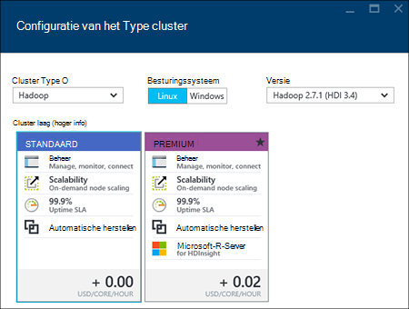
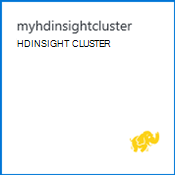

<properties
    pageTitle="Hadoop, HBase, Storm of een clusters maken op Linux in HDInsight met behulp van de portal | Microsoft Azure"
    description="Informatie over het maken van Hadoop, HBase, Storm of een clusters op Linux voor HDInsight met een webbrowser en de portal Azure preview."
    services="hdinsight"
    documentationCenter=""
    authors="nitinme"
    manager="jhubbard"
    editor="cgronlun"
    tags="azure-portal"/>

<tags
    ms.service="hdinsight"
    ms.devlang="na"
    ms.topic="article"
    ms.tgt_pltfrm="na"
    ms.workload="big-data"
    ms.date="10/05/2016"
    ms.author="nitinme"/>

#Linux gebaseerde clusters maken in met behulp van de portal Azure HDInsight

[AZURE.INCLUDE [selector](../../includes/hdinsight-selector-create-clusters.md)]

De Azure-portal is een hulpmiddel voor het web gebaseerde beheer voor services en resources die in de cloud Microsoft Azure worden gehost. In dit artikel leert u hoe u HDInsight Linux gebaseerde clusters met behulp van de portal maken.

## Vereisten voor

[AZURE.INCLUDE [delete-cluster-warning](../../includes/hdinsight-delete-cluster-warning.md)]

- **Een Azure-abonnement**. Zie [Azure krijgen gratis proefversie](https://azure.microsoft.com/documentation/videos/get-azure-free-trial-for-testing-hadoop-in-hdinsight/).
- __Een modern webbrowser__. De portal van Azure gebruikt HTML5 en Javascript en mogelijk niet goed werkt in oudere webbrowsers.

### Vereisten voor het beheer van Access

[AZURE.INCLUDE [access-control](../../includes/hdinsight-access-control-requirements.md)]

##Clusters maken

De portal van Azure beschrijft de meeste clustereigenschappen. Azure resourcemanager sjabloon gebruikt, kunt u een groot aantal details verbergen. Zie voor meer informatie [in HDInsight met Azure resourcemanager sjablonen maken Linux gebaseerde Hadoop](hdinsight-hadoop-create-linux-clusters-arm-templates.md).

1. Meld u aan bij de [portal van Azure](https://portal.azure.com).

2. Klik op **Nieuw**, klik op **Gegevens analyse**en klik vervolgens op **HDInsight**.

    ![Een nieuw cluster in de portal van Azure maken] (./media/hdinsight-hadoop-create-linux-cluster-portal/HDI.CreateCluster.1.png "Een nieuw cluster in de portal van Azure maken")
3. Voer **De naam van Cluster**: deze naam moet uniek zijn.
4. Klik op **Selecteer cluster Type**en selecteer vervolgens:

    - **Cluster Type**: als u niet weet wat u moet kiezen, selecteert u **Hadoop**. Dit is het meest populaire clustertype.

        > [AZURE.IMPORTANT] HDInsight clusters vele verschillende met typen, die met de werklast technologie die het cluster is afgestemd corresponderen op. Er is geen ondersteunde methode een cluster waarin meerdere typen, zoals Storm en HBase op één cluster zijn gecombineerd maken. 

    - **Besturingssysteem**: Selecteer **Linux**.
    - **Versie**: de standaardversie gebruiken als u niet weet wat u moet kiezen. Zie voor meer informatie [HDInsight cluster versies](hdinsight-component-versioning.md).
    - **Cluster laag**: Azure HDInsight biedt de grote gegevens cloud aanbiedingen in twee categorieën: standaard laag en Premium laag. Zie [Cluster lagen](hdinsight-hadoop-provision-linux-clusters.md#cluster-tiers)voor meer informatie.
    
    

4. Klik op **abonnement** om te selecteren van de Azure-abonnement dat wordt gebruikt voor het cluster.

5. Klik op **Resourcegroep** om een bestaande resourcegroep te selecteren of klik op **Nieuw** om te maken van een nieuwe resourcegroep

    > [AZURE.NOTE] Dit item standaard ingesteld op een van uw bestaande resourcegroepen, indien beschikbaar.

6. Klik op **referenties** en voer vervolgens een wachtwoord voor de beheerder. U moet ook een **SSH gebruikersnaam** en een **wachtwoord** of **Openbare sleutel**, die wordt gebruikt om te verifiëren van de gebruiker SSH invoeren. Een openbare sleutel gebruikt, is de aanbevolen wijze. Klik op **selecteren** onder de configuratie referenties opslaan.

    ![Cluster referenties] (./media/hdinsight-hadoop-create-linux-cluster-portal/HDI.CreateCluster.3.png "Cluster referenties")

    Zie een van de volgende artikelen voor meer informatie over het gebruik van SSH met HDInsight:

    * [SSH gebruiken met Linux gebaseerde Hadoop op HDInsight uit Linux, Unix of OS X](hdinsight-hadoop-linux-use-ssh-unix.md)
    * [SSH gebruiken met Linux gebaseerde Hadoop op HDInsight vanuit Windows](hdinsight-hadoop-linux-use-ssh-windows.md)

7. Klik op **Gegevensbron** om een bestaande gegevensbron voor het cluster te selecteren of een nieuw account te maken.

    ![Blade voor gegevensbronnen] (./media/hdinsight-hadoop-create-linux-cluster-portal/HDI.CreateCluster.4.png "Configuratie opgeven voor gegevensbronnen")

    Momenteel kunt u een Account van Azure opslag als de gegevensbron voor een cluster HDInsight. Gebruik de volgende manieren te werk voor meer informatie over de items in het blad **Gegevensbron** .

    - **Selectiemethode**: deze worden ingesteld **van alle abonnementen** om te bladeren opslag-accounts van alle abonnementen inschakelen. Als u wilt de **Naam van de opslag** en **Toegangstoets** van een bestaand opslag-account, moet u dit ingesteld op **Toegangstoets** .

    - **Selecteer opslag account / nieuwe**: klik op **Selecteer opslag-account** om te bladeren en selecteer een bestaande opslag-account dat u wilt koppelen aan het cluster. Of klik op **Nieuw** om een nieuwe opslag-account maken. Het veld dat wordt weergegeven om Voer de naam van het account opslag gebruiken. Een groen vinkje wordt weergegeven als de naam beschikbaar is.

    - **Kies standaardcontainer**: Hiermee voert u de naam van de standaardcontainer wilt gebruiken voor het cluster. Terwijl u hier een naam invoert kunt, wordt u aangeraden dezelfde naam als het cluster gebruiken, zodat u gemakkelijk herkennen kunt dat de container wordt gebruikt voor deze specifieke cluster.

    - **Locatie**: het geografische gebied dat de opslag-account in is of wordt gemaakt in.

        > [AZURE.IMPORTANT] De locatie voor de standaard-gegevensbron selecteren, wordt de locatie van het cluster HDInsight ook instellen. De gegevensbron cluster en standaard moet zich bevinden in dezelfde regio.
        
    - **Cluster AAD identiteit**: door te configureren, maakt u het cluster toegankelijk zijn voor de Azure gegevens Lake winkels op basis van de configuratie AAD.

    Klik op **selecteren** om op te slaan configuratie van de gegevensbron.

8. Klik op **Knooppunt prijzen lagen** informatie over de knooppunten die worden gemaakt voor deze cluster wilt weergeven. Stel het aantal knooppunten van werknemer die u nodig voor het cluster hebt. De geschatte kosten van het cluster worden weergegeven in het blad.

    ![Knooppunt prijzen lagen blade] (./media/hdinsight-hadoop-create-linux-cluster-portal/HDI.CreateCluster.5.png "Geef het aantal knooppunten")
    
    > [AZURE.IMPORTANT] Als u van plan bent om meer dan 32 werknemer knooppunten, bij het maken van het cluster of door het cluster schaalbaarheid na het maken, selecteert u de grootte van een hoofd knooppunt met ten minste 8 cores en 14GB ram.
    >
    > Zie [HDInsight prijzen](https://azure.microsoft.com/pricing/details/hdinsight/)voor meer informatie over het knooppunt grootte en de bijbehorende kosten.

    Klik op **selecteren** om op te slaan het knooppunt prijzen configuratie.

9. Klik op **Optionele configuratie** als u wilt selecteren de cluster-versie, evenals andere optionele instellingen configureren zoals deelnemen aan een **Virtueel netwerk**, een **Externe Metastore** instellen voor het opslaan van gegevens voor component en Oozie, scriptacties gebruiken voor het aanpassen van een cluster om aangepaste onderdelen installeren of extra opslagruimte accounts gebruiken met het cluster.

    * **Virtual Network**: Selecteer een Azure virtuele netwerk en het subnet als u wilt het cluster in een virtueel netwerk plaatsen.  

        ![Virtuele netwerk blade] (./media/hdinsight-hadoop-create-linux-cluster-portal/HDI.CreateCluster.6.png "Geef virtueel netwerkdetails")

        Zie voor informatie over het gebruik van HDInsight met een virtueel netwerk, inclusief de van de specifieke configuratievereisten voor het virtuele netwerk, [mogelijkheden voor HDInsight uitbreiden met behulp van een Azure Virtual Network](hdinsight-extend-hadoop-virtual-network.md).

    * Klik op **Externe Metastores** als SQL-database die u wilt gebruiken om op te slaan component en Oozie metagegevens die is gekoppeld aan het cluster wilt opgeven.
    
        > [AZURE.NOTE] Metastore configuratie is niet beschikbaar voor HBase clustertypen.

        ![Aangepaste metastores blade] (./media/hdinsight-hadoop-create-linux-cluster-portal/HDI.CreateCluster.7.png "Externe metastores opgeven")

        Voor **gebruik van een bestaande SQL-DB voor component** metagegevens, klikt u op **Ja**, selecteert u een SQL-database en geef de gebruikersnaam en wachtwoord voor de database. Herhaal deze stappen als u **gebruiken, een bestaande SQL-DB voor Oozie metagegevens wilt**. Klik op **selecteren** zodat u weer op het blad **Optionele configuratie** bent.

        >[AZURE.NOTE] De SQL Azure-database die wordt gebruikt voor het metastore moet connectiviteit met andere Azure services, met inbegrip van Azure HDInsight toestaan. Klik op het dashboard Azure SQL-database aan de rechterkant op de naam van de server. Dit is de server waarop het exemplaar van de SQL-database wordt uitgevoerd. Wanneer u zijn in de serverweergave, klikt u op **configureren**en klik vervolgens op **Ja**voor **Azure Services**, en klik vervolgens op **Opslaan**.

        &nbsp;

        > [AZURE.IMPORTANT] Wanneer u een metastore maakt, gebruik niet de naam van een database met streepjes of afbreekstreepjes, zoals dit leiden het maakproces cluster tot kan mislukt.

    * **Scriptacties** als u wilt een aangepast script gebruiken om aan te passen een cluster, als het cluster wordt gemaakt. Zie voor meer informatie over het scriptacties [aanpassen HDInsight clusters met de Script-actie](hdinsight-hadoop-customize-cluster-linux.md). Geef op het blad scriptacties de details zoals wordt weergegeven in de schermopname.

        ![Script actie blade] (./media/hdinsight-hadoop-create-linux-cluster-portal/HDI.CreateCluster.8.png "Geef scriptactie")

    * Klik op **Gekoppelde opslag Accounts** om op te geven van extra opslagruimte accounts koppelen aan het cluster. Klik op **een toets opslag toevoegen**, in het blad **Azure opslag toetsen** en selecteert u een bestaand opslag-account of een nieuw account maken.

        ![Extra opslagruimte blade] (./media/hdinsight-hadoop-create-linux-cluster-portal/HDI.CreateCluster.9.png "Geef extra opslagruimte accounts")

        U kunt ook extra opslagruimte accounts toevoegen nadat een cluster is gemaakt.  Zie [HDInsight aanpassen Linux gebaseerde clusters met de Script-actie](hdinsight-hadoop-customize-cluster-linux.md).

        Klik op **selecteren** zodat u weer op het blad **nieuwe HDInsight cluster** bent.
        
        Naast het Blob storage-account, kunt u ook Azure gegevens Lake winkels koppelen. De configuratie kan worden door te configureren AAD uit gegevensbron waar u het standaardaccount voor opslagruimte en standaardcontainer hebt geconfigureerd.

10. Zorg ervoor dat **vastmaken aan Startboard** is geselecteerd en klik vervolgens op **maken**op het blad **Nieuwe HDInsight Cluster** . Hiermee maakt u het cluster en een tegel voor deze toevoegen aan de Startboard van uw Azure-portal. Het pictogram wordt aangegeven dat het cluster is ingericht en verandert de HDInsight als pictogram wilt weergeven wanneer inrichting is voltooid.

  	| Tijdens het inrichten | Inrichten is voltooid |
  	| ------------------ | --------------------- |
  	|  |  |

    > [AZURE.NOTE] Het duurt enige tijd voor het cluster moet worden gemaakt, meestal ongeveer 15 minuten. De tegel op het Startboard of het fragment **meldingen** aan de linkerkant van de pagina gebruiken om te controleren of het inrichten.

11. Zodra het maakproces is voltooid, klikt u op de tegel voor het cluster uit de Startboard aan het blad cluster starten. Het blad cluster bevat alle noodzakelijke informatie over het cluster zoals de naam, de resourcegroep waarbij deze hoort, de locatie, het besturingssysteem, de URL voor de cluster dashboard, enzovoort.

    ![Cluster blade] (./media/hdinsight-hadoop-create-linux-cluster-portal/HDI.Cluster.Blade.png "Eigenschappen van cluster")

    Gebruik de volgende manieren te werk voor meer informatie over de pictogrammen aan het begin van deze blade en klik in de sectie **Essentials** :

    * **Instellingen** en **Alle instellingen**: Hiermee wordt het blad **Instellingen** voor het cluster, zodat u toegang tot de configuratie van de gedetailleerde informatie voor het cluster weergegeven.

    * **Dashboard**, **Cluster Dashboard**en **URL**: dit zijn alle manieren voor toegang tot het dashboard cluster, dat wil een webportal zeggen uitvoeren van taken op het cluster.

    * **Secure Shell**: informatie die nodig zijn voor toegang tot de cluster SSH.

    * **Verwijderen**: Hiermee verwijdert u het cluster HDInsight.

    * **Snelstartgids** (): hiermee informatie waarmee u kunt aan de slag met HDInsight.

    * **Gebruikers** (): Hiermee kunt u machtigingen voor _beheer van de portal_ van deze cluster voor andere gebruikers instellen voor uw abonnement op Azure.

        > [AZURE.IMPORTANT] In dit _alleen_ toegang en machtigingen voor dit cluster in de portal van Azure van invloed is op en heeft geen invloed op wie dit kan verbinding maken met of taken aan het cluster HDInsight.

    * **Labels** (): Tags kunt u instellen sleutel/waardeparen definiëren van een aangepaste taxonomie van uw cloudservices. U mogelijk bijvoorbeeld een __project__met de naam sleutel maakt en gebruikt u een gemeenschappelijke waarde voor alle services dat is gekoppeld aan een specifieke project.

##Clusters aanpassen

- Zie [HDInsight aanpassen clusters Bootstrap gebruiken](hdinsight-hadoop-customize-cluster-bootstrap.md).
- Zie [HDInsight aanpassen Linux gebaseerde clusters met de Script-actie](hdinsight-hadoop-customize-cluster-linux.md).

##Het cluster verwijderen

[AZURE.INCLUDE [delete-cluster-warning](../../includes/hdinsight-delete-cluster-warning.md)]

##Volgende stappen

Nu die u hebt gemaakt met een cluster HDInsight, gebruikt u de volgende manieren te werk voor meer informatie over het werken met uw cluster:

###Hadoop clusters

* [Component gebruiken met HDInsight](hdinsight-use-hive.md)
* [Varken met HDInsight gebruiken](hdinsight-use-pig.md)
* [MapReduce gebruiken met HDInsight](hdinsight-use-mapreduce.md)

###HBase clusters

* [Aan de slag met HBase op HDInsight](hdinsight-hbase-tutorial-get-started-linux.md)
* [Java-toepassingen voor HBase op HDInsight ontwikkelen](hdinsight-hbase-build-java-maven-linux.md)

###Storm clusters

* [Ontwikkel Java topologieën voor Storm op HDInsight](hdinsight-storm-develop-java-topology.md)
* [Gebruik Python onderdelen in Storm op HDInsight](hdinsight-storm-develop-python-topology.md)
* [Implementeren en topologieën met Storm op HDInsight controleren](hdinsight-storm-deploy-monitor-topology-linux.md)

###Elektrische clusters

* [Een zelfstandige toepassing maken met Scala](hdinsight-apache-spark-create-standalone-application.md)
* [Taken op afstand uitvoeren op een elektrische cluster met hier](hdinsight-apache-spark-livy-rest-interface.md)
* [Elektrische met BI: interactieve gegevensanalyses elektrische in HDInsight met hulpmiddelen voor BI uitvoeren](hdinsight-apache-spark-use-bi-tools.md)
* [Elektrische met Machine Learning: gebruik een in HDInsight eten controleresultaten voorspellen](hdinsight-apache-spark-machine-learning-mllib-ipython.md)
* [Een Streaming: Gebruik een in HDInsight voor het samenstellen van realtime streaming-toepassingen](hdinsight-apache-spark-eventhub-streaming.md)
