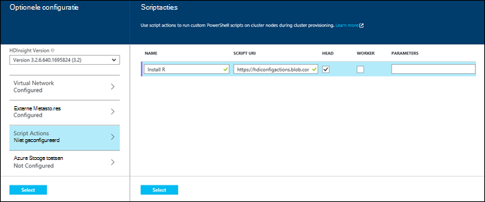
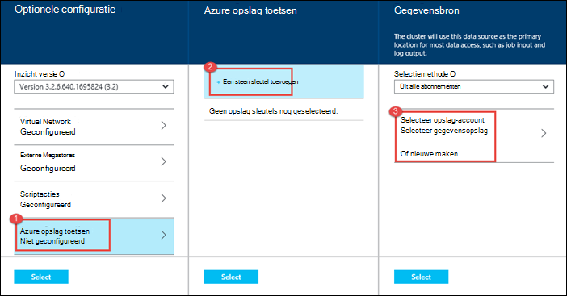

<properties
   pageTitle="Hadoop clusters maken in HDInsight | Microsoft Azure"
    description="Informatie over het maken van clusters voor Azure HDInsight via de Portal Azure."
   services="hdinsight"
   documentationCenter=""
   tags="azure-portal"
   authors="mumian"
   manager="jhubbard"
   editor="cgronlun"/>

<tags
   ms.service="hdinsight"
   ms.devlang="na"
   ms.topic="article"
   ms.tgt_pltfrm="na"
   ms.workload="big-data"
   ms.date="09/02/2016"
   ms.author="jgao"/>

# Maken op basis van Windows Hadoop clusters in met behulp van de Portal Azure HDInsight

[AZURE.INCLUDE [selector](../../includes/hdinsight-selector-create-clusters.md)]

Informatie over het maken van een Hadoop-cluster in met behulp van de Portal Azure HDInsight. De Microsoft [Azure-portal](../azure-portal-overview.md) is een centrale plaats waar u kunt inrichten en uw Azure bronnen beheren. Azure-Portal is een van de hulpmiddelen die u gebruiken kunt voor het maken van Linux- of Windows Hadoop-cluster in HDInsight. Voor het maken van andere cluster hulpprogramma's en functies klikt u op het tabblad Selecteer boven aan deze pagina of Zie [methoden voor het maken van Cluster](hdinsight-provision-clusters.md#cluster-creation-methods).

##Vereisten:

[AZURE.INCLUDE [delete-cluster-warning](../../includes/hdinsight-delete-cluster-warning.md)]

Voordat u de instructies in dit artikel, hebt u het volgende:

- Een Azure-abonnement. Zie [Azure krijgen gratis proefversie](https://azure.microsoft.com/documentation/videos/get-azure-free-trial-for-testing-hadoop-in-hdinsight/).

### Vereisten voor het beheer van Access

[AZURE.INCLUDE [access-control](../../includes/hdinsight-access-control-requirements.md)]

## Clusters maken

**Een cluster HDInsight maken**

1. Meld u aan bij de [Portal van Azure](https://portal.azure.com).
2. Klik op **Nieuw**, klik op **Gegevens analyse**en klik vervolgens op **HDInsight**.

    ![Een nieuw cluster in de Portal Azure maken] (./media/hdinsight-provision-clusters/HDI.CreateCluster.1.png "Een nieuw cluster in de Portal Azure maken")

3. Typ of Selecteer de volgende waarden:

    * **De naam van cluster**: Voer een naam voor het cluster. Een groen vinkje wordt weergegeven naast de naam van het cluster als de naam beschikbaar is.

    * **Clustertype**: Selecteer **Hadoop**. Andere opties inclue **HBase**, **Storm**en **een**.

        > [AZURE.IMPORTANT] HDInsight clusters vele verschillende met typen, die met de werklast technologie die het cluster is afgestemd corresponderen op. Er is geen ondersteunde methode een cluster waarin meerdere typen, zoals Storm en HBase op één cluster zijn gecombineerd maken.

    * **Cluster-besturingssysteem**: Selecteer van **Windows**. Als u wilt een cluster Linux-base maakt, selecteert u **Linux**.
    * **Versie**: Zie [HDInsight versies](hdinsight-component-versioning.md).
    * **Abonnement**: Selecteer het Azure abonnement dat wordt gebruikt voor het maken van dit cluster.
    * **Resourcegroep**: Selecteer een bestaande of maak een nieuwe resourcegroep. Dit item standaard ingesteld op een van uw bestaande resourcegroepen, indien beschikbaar.
    * **Referenties**: de gebruikersnaam en het wachtwoord voor de gebruiker Hadoop (HTTP-gebruiker) configureren. Als u extern bureaublad voor het cluster inschakelt, moet u voor het configureren van het externe bureaublad-gebruikersnaam en wachtwoord en een verloopdatum. Klik op **selecteren** aan het scherm om de wijzigingen op te slaan.

        ![Cluster referenties] (./media/hdinsight-provision-clusters/HDI.CreateCluster.3.png "Cluster referenties")

    * **Gegevensbron**: Maak een nieuwe of Selecteer een bestaande opslag van Azure-account moet worden gebruikt als het standaardbestandssysteem voor het cluster.

        ![Blade voor gegevensbronnen] (./media/hdinsight-provision-clusters/HDI.CreateCluster.4.png "Configuratie opgeven voor gegevensbronnen")

        * **Selectiemethode**: deze worden ingesteld **van alle abonnementen** om te bladeren opslag-accounts van alle abonnementen inschakelen. Als u wilt de **Naam van de opslag** en **Toegangstoets** van een bestaand opslag-account, moet u dit ingesteld op **Toegangstoets** .
        * **Selecteer opslag account / nieuwe maken**: klik op **Selecteer opslag-account** om te bladeren en selecteer een bestaande opslag-account dat u wilt koppelen aan het cluster. Of klik op **Nieuw** om een nieuwe opslag-account maken. Het veld dat wordt weergegeven om Voer de naam van het account opslag gebruiken. Een groen vinkje wordt weergegeven als de naam beschikbaar is.
        * **Kies standaardcontainer**: Hiermee voert u de naam van de standaardcontainer wilt gebruiken voor het cluster. Terwijl u hier een naam invoert kunt, wordt u aangeraden dezelfde naam als het cluster gebruiken, zodat u gemakkelijk herkennen kunt dat de container wordt gebruikt voor deze specifieke cluster.
        * **Locatie**: het geografische gebied dat de opslag-account in is of wordt gemaakt in. Deze locatie bepaalt de cluster-locatie.  Het cluster en het standaardaccount voor de opslag moeten samen Zoek in het dezelfde Azure Datacenter.
    
    * **Knooppunt prijzen lagen**: Stel het aantal knooppunten van werknemer die u nodig voor het cluster hebt. De geschatte kosten van het cluster worden weergegeven in het blad.
  

        ![Knooppunt prijzen lagen blade] (./media/hdinsight-provision-clusters/HDI.CreateCluster.5.png "Geef het aantal knooppunten")

    * **Optionele configuratie** , selecteert u de cluster-versie, evenals andere optionele instellingen configureren zoals deelnemen aan een **Virtueel netwerk**, een **Externe Metastore** instellen voor het opslaan van gegevens voor de component en Oozie, scriptacties gebruiken voor het aanpassen van een cluster om aangepaste onderdelen installeren of extra opslagruimte accounts gebruiken met het cluster.

    * **HDInsight-versie**: Selecteer de versie die u wilt gebruiken voor het cluster. Zie voor meer informatie [HDInsight cluster versies](hdinsight-component-versioning.md).
    * **Virtual Network**: Selecteer een Azure virtuele netwerk en het subnet als u wilt het cluster in een virtueel netwerk plaatsen.  

        ![Virtuele netwerk blade] (./media/hdinsight-provision-clusters/HDI.CreateCluster.6.png "Geef virtueel netwerkdetails")

        Zie voor informatie over het gebruik van HDInsight met een virtueel netwerk, inclusief de van de specifieke configuratievereisten voor het virtuele netwerk, [capbilities HDInsight uitbreiden met behulp van een Azure Virtual Network](hdinsight-extend-hadoop-virtual-network.md).
  

        
    * **Externe Metastores**: Geef een Azure SQL-database voor het opslaan van component en Oozie metagegevens die is gekoppeld aan het cluster.
 
        > [AZURE.NOTE] Metastore configuratie is niet beschikbaar voor HBase clustertypen.

    ![Aangepaste metastores blade] (./media/hdinsight-provision-clusters/HDI.CreateCluster.7.png "Externe metastores opgeven")

    Voor **gebruik van een bestaande SQL-DB voor component** metagegevens, klikt u op **Ja**, selecteert u een SQL-database en geef de gebruikersnaam en wachtwoord voor de database. Herhaal deze stappen als u **gebruiken, een bestaande SQL-DB voor Oozie metagegevens wilt**. Klik op **selecteren** zodat u weer op het blad **Optionele configuratie** bent.

    >[AZURE.NOTE] De SQL Azure-database die wordt gebruikt voor het metastore moet connectiviteit met andere Azure services, met inbegrip van Azure HDInsight toestaan. Klik op het dashboard Azure SQL-database aan de rechterkant op de naam van de server. Dit is de server waarop het exemplaar van de SQL-database wordt uitgevoerd. Wanneer u zijn in de serverweergave, klikt u op **configureren**en klik vervolgens op **Ja**voor **Azure Services**, en klik vervolgens op **Opslaan**.

            &nbsp;

            > [AZURE.IMPORTANT] Wanneer u een metastore maakt, gebruik niet de naam van een database met streepjes of afbreekstreepjes, zoals dit leiden het maakproces cluster tot kan mislukt.
        
        * **Script Actions** if you want to use a custom script to customize a cluster, as the cluster is being created. For more information about script actions, see [Customize HDInsight clusters using Script Action](hdinsight-hadoop-customize-cluster.md). On the Script Actions blade provide the details as shown in the screen capture.
    

            

        * **Azure Storage Keys**: Specify additional storage accounts to associate with the cluster. In the **Azure Storage Keys** blade, click **Add a storage key**, and then select an existing storage account or create a new account.
    

            

4. Klik op **maken**. **Vastmaken aan Startboard** selecteren, wordt een tegel voor cluster toevoegen aan de Startboard van de Portal. Het pictogram wordt aangegeven dat het cluster wordt gemaakt, en de HDInsight als pictogram wilt weergeven wanneer maken is voltooid wordt gewijzigd.
    
    Het duurt enige tijd voor het cluster moet worden gemaakt, meestal ongeveer 15 minuten. De tegel op het Startboard of het fragment **meldingen** aan de linkerkant van de pagina gebruiken om te controleren of het inrichten.
    

5. Zodra de aanmaakdatum is voltooid, klikt u op de tegel voor het cluster uit de Startboard aan het blad cluster starten. Het blad cluster bevat alle noodzakelijke informatie over het cluster zoals de naam, de resourcegroep waarbij deze hoort, de locatie, het besturingssysteem, de URL voor de cluster dashboard, enzovoort.

    ![Cluster blade] (./media/hdinsight-provision-clusters/HDI.Cluster.Blade.png "Eigenschappen van cluster")

    Gebruik de volgende manieren te werk voor meer informatie over de pictogrammen aan het begin van deze blade en klik in de sectie **Essentials** :

    * **Instellingen** en **Alle instellingen**: Hiermee wordt het blad **Instellingen** voor het cluster, zodat u toegang tot de configuratie van de gedetailleerde informatie voor het cluster weergegeven.
    * **Dashboard**, **Cluster Dashboard**en **URL**: dit zijn alle manieren voor toegang tot het dashboard cluster, dat wil een webportal zeggen uitvoeren van taken op het cluster.
    * **Extern bureaublad**: Hiermee kunt u met extern bureaublad-/ uitschakelen knooppunten.
    * **Schaal Cluster**: Hiermee kunt u het aantal knooppunten werknemer voor dit cluster wijzigen.
    * **Verwijderen**: Hiermee verwijdert u het cluster HDInsight.
    * **Snelstartgids** (): hiermee informatie waarmee u kunt aan de slag met HDInsight.
    * **Gebruikers** (): Hiermee kunt u machtigingen voor _beheer van de portal_ van deze cluster voor andere gebruikers instellen voor uw abonnement op Azure.
    

        > [AZURE.IMPORTANT] In dit _alleen_ toegang en machtigingen voor dit cluster in de Portal van invloed is op en heeft geen invloed op wie dit kan verbinding maken met of taken aan het cluster HDInsight.
        
    * **Labels** (): Tags kunt u instellen sleutel/waardeparen definiëren van een aangepaste taxonomie van uw cloudservices. U mogelijk bijvoorbeeld een __project__met de naam sleutel maakt en gebruikt u een gemeenschappelijke waarde voor alle services dat is gekoppeld aan een specifieke project.

##Clusters aanpassen

- Zie [HDInsight aanpassen clusters Bootstrap gebruiken](hdinsight-hadoop-customize-cluster-bootstrap.md).
- Zie [Windows aanpassen gebaseerde HDInsight clusters met de Script-actie](hdinsight-hadoop-customize-cluster.md).

##Volgende stappen
U kunt op verschillende manieren om te maken van een cluster HDInsight hebt geleerd in dit artikel. Meer informatie raadpleegt u de volgende artikelen:

* [Aan de slag met Azure HDInsight](hdinsight-hadoop-linux-tutorial-get-started.md) - informatie over het werken met uw cluster HDInsight starten
* [Hadoop verzenden via programmacode taken](hdinsight-submit-hadoop-jobs-programmatically.md) - leren via programmacode taken kunnen verzenden naar HDInsight
* [Hadoop clusters in HDInsight beheren met behulp van de Azure-Portal](hdinsight-administer-use-management-portal.md)

