<properties
    pageTitle="HDInsight clusters scriptacties gebruiken aanpassen | Microsoft Azure"
    description="Leer hoe u aangepaste onderdelen toevoegen aan HDInsight Linux gebaseerde clusters scriptacties gebruiken. Scriptacties zijn we vaker doen op scripts die knooppunten en kan worden gebruikt om de configuratie van het cluster aanpassen of Voeg aanvullende services en hulpprogramma's zoals tint, Solr of R."
    services="hdinsight"
    documentationCenter=""
    authors="Blackmist"
    manager="jhubbard"
    editor="cgronlun"
    tags="azure-portal"/>

<tags
    ms.service="hdinsight"
    ms.workload="big-data"
    ms.tgt_pltfrm="na"
    ms.devlang="na"
    ms.topic="article"
    ms.date="09/06/2016"
    ms.author="larryfr"/>

# HDInsight Linux gebaseerde clusters met de actie Script aanpassen

HDInsight biedt een optie genaamd **Scriptactie** die activeert aangepaste scripts die het cluster aanpassen. Deze scripts kunnen worden gebruikt tijdens het maken van cluster, en evenmin op een al actief cluster en worden gebruikt voor het installeren van extra onderdelen of configuratie-instellingen wijzigen.

> [AZURE.NOTE] De mogelijkheid om te scriptacties gebruiken op een al actief cluster is alleen beschikbaar voor HDInsight Linux gebaseerde clusters. Zie voor informatie over het gebruik van scriptacties met clusters op basis van Windows [aanpassen HDInsight clusters met de actie Script (Windows)](hdinsight-hadoop-customize-cluster.md).

Scriptacties kunnen ook worden gepubliceerd naar de Azure Marketplace als een toepassing HDInsight. Enkele voorbeelden in dit document weergeven hoe u een HDInsight-toepassing script actie opdrachten uit PowerShell en .NET SDK met kunt installeren. Zie voor meer informatie over HDInsight-toepassingen, [HDInsight publiceren toepassingen in de Azure Marketplace](hdinsight-apps-publish-applications.md). 

## Lidmaatschap scriptacties

Een actie Script is gewoon een we vaker doen script dat u een URL naar en parameters voor het aanbieden en deze vervolgens is uitgevoerd knooppunten HDInsight. Hier volgen kenmerken en functies van scriptacties.

* Moeten worden opgeslagen op een URI die toegankelijk is vanuit het cluster HDInsight. Hier volgen mogelijke opslaglocaties:

    * Een blob storage-account dat is de primaire of extra opslag-account voor het cluster HDInsight. Aangezien HDInsight toegang tot beide van de volgende typen opslag accounts gemaakt krijgt, is deze zelf een formule een niet-openbare scriptactie te gebruiken.
    
    * Een openbaar leesbare URI zoals een Azure Blob, GitHub, OneDrive, Dropbox, enzovoort.
    
    Zie de sectie [voorbeeld script actie scripts](#example-script-action-scripts) voor voorbeelden van de URI voor scripts die zijn opgeslagen in blob container (openbaar leesbaar).

* Kan worden beperkt om te __worden uitgevoerd op alleen bepaalde knooppunttypen__, bijvoorbeeld hoofd knooppunten of werknemer knooppunten.

    > [AZURE.NOTE] Wanneer u met HDInsight Premium gebruikt, kunt u opgeven dat het script op het randknooppunt moet worden gebruikt.

* __Vastgelegde__ of __ad-hoc__kan zijn.

    __Persisted__ scripts zijn scripts die zijn toegepast op werknemer knooppunten en wordt automatisch op nieuwe knooppunten gemaakt wanneer u een cluster schaalbaarheid hebt uitgevoerd.

    Een permanente script mogelijk ook wijzigingen toepassen op een ander knooppunttype, zoals een hoofd knooppunt, maar functionaliteit vanuit het perspectief van de enige reden dan ook een script persistent is dus is geschikt voor nieuwe werknemer knooppunten gemaakt wanneer een cluster heeft schaal af.

    > [AZURE.IMPORTANT] Permanente scriptacties moeten een unieke naam hebben.

    __Ad hoc__ scripts zijn niet behouden; echter kunt u vervolgens een ad-hoc script om een permanente script verhogen of verlagen een permanente script om een ad-hoc-script.

    > [AZURE.IMPORTANT] Scriptacties tijdens het maken van het cluster gebruikt, worden automatisch doorgevoerd.
    >
    > Scripts fail worden niet bewaard, zelfs als u specifiek aangeeft dat deze moeten worden.

* __Parameters__ die worden gebruikt door het script tijdens het uitvoeren van geaccepteerd.

* Worden uitgevoerd met __bevoegdheden root__ knooppunten.

* Via de __portal van Azure__, __Azure PowerShell__, __Azure CLI__of __HDInsight.NET SDK__ kan worden gebruikt

    [AZURE.INCLUDE [upgrade-powershell](../../includes/hdinsight-use-latest-powershell-cli-and-dotnet-sdk.md)]

Om u te helpen begrijpen welke scripts zijn toegepast op een cluster en bij het bepalen van dat de ID van scripts voor kolomrand of degraderen, het cluster blijft een geschiedenis van alle scripts die zijn uitgevoerd.

> [AZURE.IMPORTANT] Er is geen automatische manier om de wijzigingen die zijn aangebracht door een scriptactie ongedaan te maken. Als u de effecten van een script moet, moet u begrijpen welke wijzigingen zijn aangebracht en handmatig omkeren ze (of een scriptactie die ze keert bieden).

### De scriptactie in het proces voor het maken van cluster

Scriptacties die worden gebruikt tijdens het maken van cluster zijn iets anders dan script acties op een bestaand cluster uitgevoerd:

* Het script is __automatisch behouden is gebleven__.

* Een __fout__ in het script kan leiden tot het maakproces cluster mislukt.

In het volgende diagram ziet u als scriptactie wordt uitgevoerd tijdens het maken:

![HDInsight cluster aanpassing en fasen tijdens het maken van cluster][img-hdi-cluster-states]

Het script is uitgevoerd terwijl HDInsight wordt geconfigureerd. In dit stadium het script parallel wordt uitgevoerd op de opgegeven knooppunten in het cluster en op de knooppunten met bevoegdheden voor de hoofdmap is uitgevoerd.

> [AZURE.NOTE] Omdat het script is uitgevoerd met de hoofdmap niveau bevoegdheidsniveau knooppunten, kunt u bewerkingen, zoals services, met inbegrip van Hadoop-gerelateerde services starten en stoppen kunt uitvoeren. Als u stopt met services, moet u ervoor zorgen dat de service Ambari en andere services Hadoop-gerelateerde goed werken voordat het script is voltooid. Deze services zijn vereist om te bepalen met succes de gezondheid en de status van het cluster terwijl deze wordt gemaakt.

Gemaakt, kunt u meerdere scriptacties die worden aangeroepen in de volgorde waarin ze zijn opgegeven.

> [AZURE.IMPORTANT] Scriptacties moeten worden voltooid binnen 60 minuten, of ze time-out wordt. Tijdens het cluster is geïnstalleerd, wordt het script uitgevoerd als andere processen installatie en configuratie. Concurrenten voor resources zoals CPU-tijd of netwerk bandbreedte mogelijk het script duurt langer dan in uw ontwikkelomgeving voltooien.
>
> Als u wilt beperken hoe lang die het duurt het script wilt uitvoeren, geen taken zoals downloaden en toepassingen uit de bron compileren. In plaats daarvan de toepassing vooraf compileren en bewaren van de binaire in Azure-blobopslag, zodat deze snel aan de cluster kan worden gedownload.

###De scriptactie op een actieve cluster

In tegenstelling tot script acties tijdens het maken van het cluster een fout in een script gebruikt op een al actief cluster uitgevoerd wordt niet automatisch ertoe leiden dat het cluster om te wijzigen in een mislukte staat. Wanneer een script is voltooid, weer het cluster naar een status 'uitgevoerd'.

> [AZURE.IMPORTANT] Dit betekent niet dat uw actieve cluster is gebaseerd op scripts die ongeldige dingen doen. Een script kan bijvoorbeeld verwijderen die nodig zijn voor het cluster, configuratie wijzigen zodat de services mislukt, enzovoort.
>
> Scripts acties uitvoeren met bevoegdheden voor hoofdmap, dus moet u ervoor zorgen dat u wat een script weet voordat u deze toepast op uw cluster doet.

Wanneer een script toepassen op een cluster, wordt de stand cluster wijzigen in __actief__ in __geaccepteerde__, klikt u vervolgens __HDInsight configuratie__, en ten slotte terug naar het __uitgevoerd__ voor succesvolle scripts. De scriptstatus is vastgelegd in de geschiedenis van de actie script en u kunt dit gebruiken om te bepalen als het script is geslaagd of mislukt. Bijvoorbeeld de `Get-AzureRmHDInsightScriptActionHistory` PowerShell-cmdlet kan worden gebruikt om de status van een script bekijken. Retourneert informatie ongeveer als volgt uit:

    ScriptExecutionId : 635918532516474303
    StartTime         : 2/23/2016 7:40:55 PM
    EndTime           : 2/23/2016 7:41:05 PM
    Status            : Succeeded

> [AZURE.NOTE] Als u kunt het wachtwoord van de gebruiker (admin) cluster hebt gewijzigd, nadat het cluster is gemaakt, kan dit script acties uitgevoerd ten opzichte van dit cluster mislukt veroorzaken. Als u permanente script bewerkingen die target werknemer knooppunten, mislukken volgende wanneer u toevoegt knooppunten aan het cluster via formaat bewerkingen.

## Voorbeeldscripts scriptactie

Script actie scripts kunnen worden gebruikt in de Azure portal Azure PowerShell, Azure CLI of de HDInsight .NET SDK. HDInsight biedt scripts voor het installeren van de volgende onderdelen op HDInsight clusters:

Naam | Script
----- | -----
**Een opslag van Azure-account toevoegen** | https://hdiconfigactions.BLOB.Core.Windows.NET/linuxaddstorageaccountv01/Add-Storage-account-v01.sh. Zie [een actie Script aan een actieve cluster toepassen](#apply-a-script-action-to-a-running-cluster).
**Kleurtoon installeren** | https://hdiconfigactions.BLOB.Core.Windows.NET/linuxhueconfigactionv02/Install-HUE-uber-v02.sh. Zie [installeren en gebruiken kleurtoon op HDInsight](hdinsight-hadoop-hue-linux.md).
**R installeren** | https://hdiconfigactions.BLOB.Core.Windows.NET/linuxrconfigactionv01/r-Installer-v01.sh. Zie [installeren en gebruiken R op HDInsight clusters](hdinsight-hadoop-r-scripts-linux.md).
**Solr installeren** | https://hdiconfigactions.BLOB.Core.Windows.NET/linuxsolrconfigactionv01/solr-Installer-v01.sh. Zie [installeren en gebruiken Solr op HDInsight](hdinsight-hadoop-solr-install-linux.md).
**Giraph installeren** | https://hdiconfigactions.BLOB.Core.Windows.NET/linuxgiraphconfigactionv01/giraph-Installer-v01.sh. Zie [installeren en gebruiken Giraph op HDInsight](hdinsight-hadoop-giraph-install-linux.md).
| **Vooraf geladen component bibliotheken** | https://hdiconfigactions.BLOB.Core.Windows.NET/linuxsetupcustomhivelibsv01/Setup-customhivelibs-v01.sh. Zie [bibliotheken op HDInsight clusters component toevoegen](hdinsight-hadoop-add-hive-libraries.md) |

## De actie voor een Script gebruiken tijdens het maken van cluster

In dit gedeelte worden voorbeelden gegeven over de verschillende manieren waarop die u scriptacties gebruiken kunt bij het maken van een cluster HDInsight - in de portal Azure met behulp van een sjabloon Azure resourcemanager, PowerShell-CMDlets gebruiken en het gebruik van de .NET SDK.

### De actie voor een Script gebruiken tijdens het maken van cluster van de Azure-portal

1. Beginnen met het maken van een cluster, zoals beschreven op [Hadoop maken clusters in HDInsight](hdinsight-provision-clusters.md#portal).

2. Klik onder __Optionele configuratie__, voor het blad **Scriptacties** op **scriptactie toevoegen** voor meer informatie over de scriptactie, zoals hieronder wordt weergegeven:

    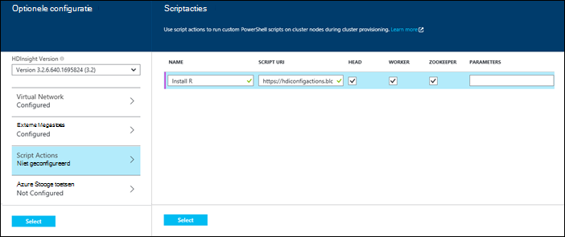

  	| Eigenschap | Waarde |
  	| -------- | ----- |
  	| Naam | Geef een naam voor de scriptactie. |
  	| Script URI | Geef de URI aan het script die als u wilt aanpassen van het cluster wordt geactiveerd. |
  	| Hoofd/werknemer | Geef de knooppunten (**kop**, **werknemer**of **ZooKeeper**) op waarin het script aanpassing wordt uitgevoerd. |
  	| Parameters | Geef de parameters, indien nodig door het script. |

    Druk op ENTER om toe te voegen van meer dan één scriptactie om meerdere onderdelen op het cluster.

3. Klik op **selecteren** om de configuratie opslaan en doorgaan met cluster maken.

### Een actie Script van Azure resourcemanager sjablonen gebruiken

In deze sectie gebruiken we Azure resourcemanager sjablonen maken van een cluster HDInsight en een scriptactie ook gebruiken voor het installeren van aangepaste onderdelen (R, in dit voorbeeld) op het cluster. Deze sectie bevat een voorbeeldsjabloon om een cluster met scriptactie te maken.

> [AZURE.NOTE] De stappen in dit gedeelte geven aan een cluster met een scriptactie voor een maken. Zie voor een voorbeeld van het maken van een cluster van een sjabloon met een HDInsight-toepassing, [aangepaste HDInsight-toepassingen installeren](hdinsight-apps-install-custom-applications.md).

#### Voordat u begint

* Zie voor informatie over het configureren van een werkstation om uit te voeren HDInsight Powershell-cmdlets [installeren en configureren van Azure PowerShell](../powershell-install-configure.md).
* Zie voor instructies over het maken van sjablonen, [Azure resourcemanager Authoring sjablonen](../resource-group-authoring-templates.md).
* Als u niet eerder hebt gebruikt Azure PowerShell met resourcemanager, raadpleegt u [Azure PowerShell gebruiken met Azure Resource Manager](../powershell-azure-resource-manager.md).

#### Clusters met de actie Script maken

1. De volgende sjabloon kopiëren naar een locatie op uw computer. Deze sjabloon Giraph installeert op de headnodes evenals werknemer knooppunten in het cluster. U kunt ook controleren of de sjabloon JSON geldig is. Plak de inhoud van uw sjabloon in [JSONLint](http://jsonlint.com/), een functie online JSON gegevensvalidatie.

            {
            "$schema": "http://schema.management.azure.com/schemas/2015-01-01/deploymentTemplate.json#",
            "contentVersion": "1.0.0.0",
            "parameters": {
                "clusterLocation": {
                    "type": "string",
                    "defaultValue": "West US",
                    "allowedValues": [ "West US" ]
                },
                "clusterName": {
                    "type": "string"
                },
                "clusterUserName": {
                    "type": "string",
                    "defaultValue": "admin"
                },
                "clusterUserPassword": {
                    "type": "securestring"
                },
                "sshUserName": {
                    "type": "string",
                    "defaultValue": "username"
                },
                "sshPassword": {
                    "type": "securestring"
                },
                "clusterStorageAccountName": {
                    "type": "string"
                },
                "clusterStorageAccountResourceGroup": {
                    "type": "string"
                },
                "clusterStorageType": {
                    "type": "string",
                    "defaultValue": "Standard_LRS",
                    "allowedValues": [
                        "Standard_LRS",
                        "Standard_GRS",
                        "Standard_ZRS"
                    ]
                },
                "clusterStorageAccountContainer": {
                    "type": "string"
                },
                "clusterHeadNodeCount": {
                    "type": "int",
                    "defaultValue": 1
                },
                "clusterWorkerNodeCount": {
                    "type": "int",
                    "defaultValue": 2
                }
            },
            "variables": {
            },
            "resources": [
                {
                    "name": "[parameters('clusterStorageAccountName')]",
                    "type": "Microsoft.Storage/storageAccounts",
                    "location": "[parameters('clusterLocation')]",
                    "apiVersion": "2015-05-01-preview",
                    "dependsOn": [ ],
                    "tags": { },
                    "properties": {
                        "accountType": "[parameters('clusterStorageType')]"
                    }
                },
                {
                    "name": "[parameters('clusterName')]",
                    "type": "Microsoft.HDInsight/clusters",
                    "location": "[parameters('clusterLocation')]",
                    "apiVersion": "2015-03-01-preview",
                    "dependsOn": [
                        "[concat('Microsoft.Storage/storageAccounts/', parameters('clusterStorageAccountName'))]"
                    ],
                    "tags": { },
                    "properties": {
                        "clusterVersion": "3.2",
                        "osType": "Linux",
                        "clusterDefinition": {
                            "kind": "hadoop",
                            "configurations": {
                                "gateway": {
                                    "restAuthCredential.isEnabled": true,
                                    "restAuthCredential.username": "[parameters('clusterUserName')]",
                                    "restAuthCredential.password": "[parameters('clusterUserPassword')]"
                                }
                            }
                        },
                        "storageProfile": {
                            "storageaccounts": [
                                {
                                    "name": "[concat(parameters('clusterStorageAccountName'),'.blob.core.windows.net')]",
                                    "isDefault": true,
                                    "container": "[parameters('clusterStorageAccountContainer')]",
                                    "key": "[listKeys(resourceId('Microsoft.Storage/storageAccounts', parameters('clusterStorageAccountName')), '2015-05-01-preview').key1]"
                                }
                            ]
                        },
                        "computeProfile": {
                            "roles": [
                                {
                                    "name": "headnode",
                                    "targetInstanceCount": "[parameters('clusterHeadNodeCount')]",
                                    "hardwareProfile": {
                                        "vmSize": "Large"
                                    },
                                    "osProfile": {
                                        "linuxOperatingSystemProfile": {
                                            "username": "[parameters('sshUserName')]",
                                            "password": "[parameters('sshPassword')]"
                                        }
                                    },
                                    "scriptActions": [
                                        {
                                            "name": "installGiraph",
                                            "uri": "https://hdiconfigactions.blob.core.windows.net/linuxgiraphconfigactionv01/giraph-installer-v01.sh",
                                            "parameters": ""
                                        }
                                    ]
                                },
                                {
                                    "name": "workernode",
                                    "targetInstanceCount": "[parameters('clusterWorkerNodeCount')]",
                                    "hardwareProfile": {
                                        "vmSize": "Large"
                                    },
                                    "osProfile": {
                                        "linuxOperatingSystemProfile": {
                                            "username": "[parameters('sshUserName')]",
                                            "password": "[parameters('sshPassword')]"
                                        }
                                    },
                                    "scriptActions": [
                                        {
                                            "name": "installR",
                                            "uri": "https://hdiconfigactions.blob.core.windows.net/linuxrconfigactionv01/r-installer-v01.sh",
                                            "parameters": ""
                                        }
                                    ]
                                }
                            ]
                        }
                    }
                }
            ],
            "outputs": {
                "cluster":{
                    "type" : "object",
                    "value" : "[reference(resourceId('Microsoft.HDInsight/clusters',parameters('clusterName')))]"
                }
            }
        }

2. Start Azure PowerShell en aanmelden bij uw Azure-account. De opdracht na het opgeven van uw referenties, geeft als resultaat informatie over uw account.

        Add-AzureRmAccount

        Id                             Type       ...
        --                             ----
        someone@example.com            User       ...

3. Als u meerdere abonnementen hebt, vindt u de abonnements-id die u wilt gebruiken voor implementatie.

        Select-AzureRmSubscription -SubscriptionID <YourSubscriptionId>

    > [AZURE.NOTE] U kunt `Get-AzureRmSubscription` om te zien van alle abonnementen die is gekoppeld aan uw account, waaronder de abonnements-Id voor elke batch.

5. Als u een bestaande resourcegroep niet hebt, maakt u een nieuwe resourcegroep. Geef de naam van de resourcegroep en de locatie die u nodig voor uw oplossing hebt. Een overzicht van de nieuwe resourcegroep wordt geretourneerd.

        New-AzureRmResourceGroup -Name myresourcegroup -Location "West US"

        ResourceGroupName : myresourcegroup
        Location          : westus
        ProvisioningState : Succeeded
        Tags              :
        Permissions       :
                            Actions  NotActions
                            =======  ==========
                            *
        ResourceId        : /subscriptions/######/resourceGroups/ExampleResourceGroup

6. Als u wilt een nieuwe installatie voor uw resourcegroep maakt, voert u de opdracht **Nieuw AzureRmResourceGroupDeployment** en geef de benodigde parameters. De parameters bevat een naam voor de implementatie, de naam van uw resourcegroep en het pad of de URL naar de sjabloon die u hebt gemaakt. Als uw sjabloon alle parameters vereist, moet u ook deze parameters doorgeven. In dit geval hoeft de scriptactie R installeren op het cluster niet alle parameters.

        New-AzureRmResourceGroupDeployment -Name mydeployment -ResourceGroupName myresourcegroup -TemplateFile <PathOrLinkToTemplate>

    U wordt gevraagd om waarden te geven voor de parameters die zijn gedefinieerd in de sjabloon.

7. Wanneer de resourcegroep is geïmplementeerd, ziet u een overzicht van de implementatie.

          DeploymentName    : mydeployment
          ResourceGroupName : myresourcegroup
          ProvisioningState : Succeeded
          Timestamp         : 8/17/2015 7:00:27 PM
          Mode              : Incremental
          ...

8. Als uw implementatie is mislukt, kunt u de volgende cmdlets gebruiken om informatie over de fouten te verkrijgen.

        Get-AzureRmResourceGroupDeployment -ResourceGroupName myresourcegroup -ProvisioningState Failed

### De actie voor een Script gebruiken tijdens het maken van cluster van Azure PowerShell

In deze sectie gebruiken we de cmdlet [Toevoegen-AzureRmHDInsightScriptAction](https://msdn.microsoft.com/library/mt603527.aspx) aan te roepen van scripts met behulp van scriptactie om aan te passen een cluster. Zorg ervoor dat u hebt geïnstalleerd en geconfigureerd Azure PowerShell voordat u verdergaat. Zie voor informatie over het configureren van een werkstation om uit te voeren HDInsight PowerShell-cmdlets [installeren en configureren van Azure PowerShell](../powershell-install-configure.md).

De volgende stappen uitvoeren:

1. Open de Azure PowerShell-console en gebruiken van de volgende handelingen uit om aan te melden bij uw Azure-abonnement en sommige PowerShell-variabelen declareren:

        # LOGIN TO ZURE
        Login-AzureRmAccount

        # PROVIDE VALUES FOR THESE VARIABLES
        $subscriptionId = "<SubscriptionId>"        # ID of the Azure subscription
        $clusterName = "<HDInsightClusterName>"         # HDInsight cluster name
        $storageAccountName = "<StorageAccountName>"    # Azure storage account that hosts the default container
        $storageAccountKey = "<StorageAccountKey>"      # Key for the storage account
        $containerName = $clusterName
        $location = "<MicrosoftDataCenter>"             # Location of the HDInsight cluster. It must be in the same data center as the storage account.
        $clusterNodes = <ClusterSizeInNumbers>          # The number of nodes in the HDInsight cluster.
        $resourceGroupName = "<ResourceGroupName>"      # The resource group that the HDInsight cluster will be created in

2. Geef de waarden van de systeemconfiguratie (zoals knooppunten in het cluster) en de standaard-opslag moet worden gebruikt.

        # SPECIFY THE CONFIGURATION OPTIONS
        Select-AzureRmSubscription -SubscriptionId $subscriptionId
        $config = New-AzureRmHDInsightClusterConfig
        $config.DefaultStorageAccountName="$storageAccountName.blob.core.windows.net"
        $config.DefaultStorageAccountKey=$storageAccountKey

3. Gebruik **Toevoegen-AzureRmHDInsightScriptAction** -cmdlet om het script starten. Het volgende voorbeeld wordt een script die wordt geïnstalleerd Giraph op het cluster:

        # INVOKE THE SCRIPT USING THE SCRIPT ACTION FOR HEADNODE AND WORKERNODE
        $config = Add-AzureRmHDInsightScriptAction -Config $config -Name "Install Giraph"  -NodeType HeadNode -Uri https://hdiconfigactions.blob.core.windows.net/linuxgiraphconfigactionv01/giraph-installer-v01.sh
        $config = Add-AzureRmHDInsightScriptAction -Config $config -Name "Install Giraph"  -NodeType WorkerNode -Uri https://hdiconfigactions.blob.core.windows.net/linuxgiraphconfigactionv01/giraph-installer-v01.sh

    De cmdlet **Toevoegen-AzureRmHDInsightScriptAction** heeft de volgende parameters:

  	| Parameter | Definitie |
  	| --------- | ---------- |
  	| Zoekconfiguratie | Configuratieobject aan welke script actie informatie wordt toegevoegd. |
  	| Naam | Naam van de scriptactie. |
  	| NodeType | Geeft het knooppunt waarop het script aanpassing wordt uitgevoerd. Geldige waarden zijn **HeadNode** (om te installeren op het hoofd knooppunt), **WorkerNode** (om te installeren op alle gegevensknooppunten), of **ZookeeperNode** (om te installeren op het knooppunt zookeeper). |
  	| Parameters | Parameters door het script is vereist. |
  	| URI | Hiermee geeft u de URI aan het script die wordt uitgevoerd. |

4. De beheerder-/ HTTPS-gebruiker voor het cluster instellen:

        $httpCreds = get-credential

    Wanneer u wordt gevraagd, voert u 'beheerder' als de naam en een wachtwoord opgeven.

5. SSH referenties instellen:

        $sshCreds = get-credential

    Voer de SSH-gebruikersnaam en wachtwoord in wanneer hierom wordt gevraagd. Als u het SSH-account met een certificaat in plaats van een wachtwoord beveiligen wilt, gebruikt u een lege wachtwoord en instellen `$sshPublicKey` aan de inhoud van het certificaat openbare sleutel die u wilt gebruiken. Bijvoorbeeld:

        $sshPublicKey = Get-Content .\path\to\public.key -Raw

4. Ten slotte het cluster maken:

        New-AzureRmHDInsightCluster -config $config -clustername $clusterName -DefaultStorageContainer $containerName -Location $location -ResourceGroupName $resourceGroupName -ClusterSizeInNodes $clusterNodes -HttpCredential $httpCreds -SshCredential $sshCreds -OSType Linux

    Als u een openbare sleutel gebruikt om uw account SSH te beveiligen, moet u ook opgeven `-SshPublicKey $sshPublicKey` als een parameter.

Het kan enkele minuten duren voordat het cluster is gemaakt.

### De actie voor een Script gebruiken tijdens het maken van cluster uit de HDInsight .NET SDK

De HDInsight .NET SDK biedt clientbibliotheken die gemakkelijker kunt werken met HDInsight vanuit een .NET-toepassing. Zie voor een voorbeeld [maken Linux gebaseerde clusters in met de SDK .NET HDInsight](hdinsight-hadoop-create-linux-clusters-dotnet-sdk.md#use-script-action).

## Een actie Script toepassen op een actieve cluster

In dit gedeelte worden voorbeelden gegeven over de verschillende manieren waarop die u scriptacties op een actieve HDInsight cluster toepassen kunt. in de Azure portal PowerShell-CMDlets gebruiken, gebruikt de platforms Azure CLI en het gebruik van de .NET SDK. De permanente scriptactie die wordt gebruikt in deze sectie wordt een bestaand Azure opslag-account aan een actieve cluster toegevoegd. U kunt ook andere scriptacties, Zie [voorbeeld scriptactie scripts](#example-script-action-scripts)gebruiken.

### De actie voor een Script toepassen op een actieve cluster vanaf de portal van Azure

1. Selecteer in de [portal van Azure](https://portal.azure.com)uw cluster HDInsight.

2. Selecteer de tegel __Scriptacties__ van het blad van de cluster HDInsight.

    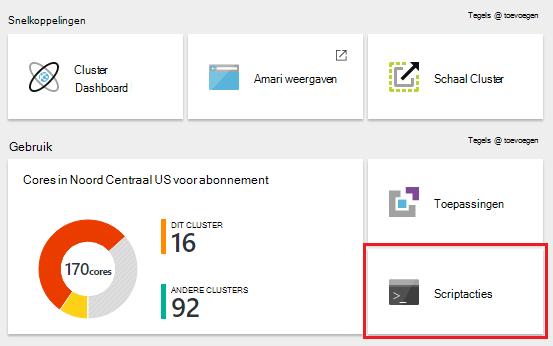

    > [AZURE.NOTE] U kunt ook selecteren om __alle instellingen__ en selecteer vervolgens __Scriptacties__ van het blad instellingen.

4. Selecteer vanaf de bovenkant van het blad scriptacties, de optie __nieuwe verzenden__.

    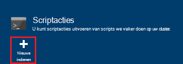

5. Voer de volgende gegevens van het blad scriptactie toevoegen.

    * __Naam__: de beschrijvende naam voor deze actie in Script wilt gebruiken. In dit voorbeeld `Add Storage account`.
    * __SCRIPT URI__: de URI aan het script. In dit voorbeeld`https://hdiconfigactions.blob.core.windows.net/linuxaddstorageaccountv01/add-storage-account-v01.sh`
    * __Hoofd__, __werknemer__en __Zookeeper__: de knooppunten die dit script moet worden toegepast om te controleren. In dit voorbeeld worden hoofd, werknemer en Zookeeper gecontroleerd.
    * __PARAMETERS__: als het script parameters accepteert, geeft u deze hier. Voer de naam van het opslag-account en de accountsleutel opslag in dit voorbeeld:

        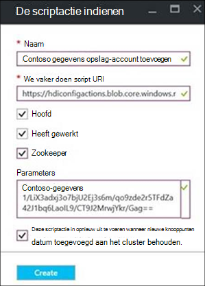

        Klik op de schermafbeelding, `contosodata` is van een bestaand opslag van Azure-account, de tweede regel is de accountsleutel opslag.
    * __PERSISTED__: dit item controleren als u een persistent het script zodat deze worden toegepast op nieuwe werknemer knooppunten wanneer u de schaal van het cluster wilt maken.

6. Gebruik de knop __maken__ ten slotte het script toepassen op het cluster.

### De actie voor een Script toepassen op een actieve cluster van Azure PowerShell

Zorg ervoor dat u hebt geïnstalleerd en geconfigureerd Azure PowerShell voordat u verdergaat. Zie voor informatie over het configureren van een werkstation om uit te voeren HDInsight PowerShell-cmdlets [installeren en configureren van Azure PowerShell](../powershell-install-configure.md).

1. Open de Azure PowerShell-console en gebruiken van de volgende handelingen uit om aan te melden bij uw Azure-abonnement en sommige PowerShell-variabelen declareren:

        # LOGIN TO ZURE
        Login-AzureRmAccount

        # PROVIDE VALUES FOR THESE VARIABLES
        $clusterName = "<HDInsightClusterName>"         # HDInsight cluster name
        $saName = "<ScriptActionName>"                  # Name of the script action
        $saURI = "<URI to the script>"                  # The URI where the script is located
        $nodeTypes = "headnode", "workernode"
        
    > [AZURE.NOTE] Als een cluster HDInsight Premium gebruikt, kunt u een nodetype van `"edgenode"` het script uitvoeren op het randknooppunt.

2. Gebruik de volgende opdracht uit het script toepassen op het cluster:

        Submit-AzureRmHDInsightScriptAction -ClusterName $clusterName -Name $saName -Uri $saURI -NodeTypes $nodeTypes -PersistOnSuccess

    Zodra de taak is voltooid, wordt informatie van de volgende strekking weergegeven:

        OperationState  : Succeeded
        ErrorMessage    :
        Name            : Giraph
        Uri             : https://hdiconfigactions.blob.core.windows.net/linuxgiraphconfigactionv01/giraph-installer-v01.sh
        Parameters      :
        NodeTypes       : {HeadNode, WorkerNode}

### De actie voor een Script toepassen op een actieve cluster vanaf de CLI Azure

Zorg ervoor dat u hebt geïnstalleerd en geconfigureerd de CLI Azure voordat u verdergaat. Zie [de CLI Azure installeren](../xplat-cli-install.md)voor meer informatie.

    [AZURE.INCLUDE [use-latest-version](../../includes/hdinsight-use-latest-cli.md)] 

1. Open een shell-sessie, terminal, opdrachtprompt of andere opdrachtregel voor uw systeem en het gebruik van de volgende opdracht uit om te schakelen naar resourcemanager Azure-modus.

        azure config mode arm

2. Gebruik de volgende handelingen uit om te verifiëren bij uw Azure-abonnement.

        azure login

3. Gebruik van de volgende opdracht uit een scriptactie toepassen op een actieve cluster

        azure hdinsight script-action create <clustername> -g <resourcegroupname> -n <scriptname> -u <scriptURI> -t <nodetypes>

    Als u parameters voor deze opdracht weglaat, wordt u gevraagd deze. Als het script die u hebt opgegeven met `-u` accepteert parameters, kunt u opgeven met de `-p` parameter.

    Geldige __nodetypes__ zijn __headnode__, __workernode__en __zookeeper__. Als het script moet worden toegepast op meerdere typen van knooppunten, geeft u de typen gescheiden door een ';'. Bijvoorbeeld `-n headnode;workernode`.

    Als u wilt het script persistent, toevoegen de `--persistOnSuccess`. U kunt ook met behulp van het script op een later tijdstip persistent `azure hdinsight script-action persisted set`.
    
    Zodra de taak is voltooid, ontvangt u de volgende strekking uitvoer.
    
        info:    Executing command hdinsight script-action create
        + Executing Script Action on HDInsight cluster
        data:    Operation Info
        data:    ---------------
        data:    Operation status:
        data:    Operation ID:  b707b10e-e633-45c0-baa9-8aed3d348c13
        info:    hdinsight script-action create command OK

### Een actie Script toepassen op een actieve cluster met REST API

Zie [Scriptacties uitvoeren op een actieve cluster](https://msdn.microsoft.com/library/azure/mt668441.aspx).
### De actie voor een Script toepassen op een actieve cluster vanaf de HDInsight .NET SDK

Zie voor een voorbeeld van het gebruik van de .NET SDK scripts toepassen op een cluster, [https://github.com/Azure-Samples/hdinsight-dotnet-script-action](https://github.com/Azure-Samples/hdinsight-dotnet-script-action).

## Geschiedenis weergeven, promoten en scriptacties verlagen

### Met behulp van de Azure portal

1. Selecteer in de [portal van Azure](https://portal.azure.com)uw cluster HDInsight.

2. Selecteer in het blad van de cluster HDInsight __-Instellingen__.

    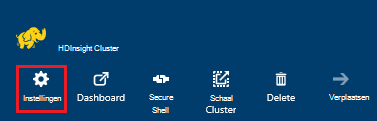

3. Selecteer in het blad instellingen __Scriptacties__.

    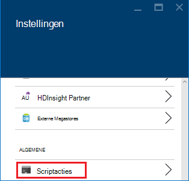

4. Een lijst met de permanente scripts, evenals een geschiedenis van scripts die zijn toegepast op het cluster, wordt weergegeven op het blad scriptacties. In de onderstaande schermafbeelding ziet u dat de Solr script is op dit cluster hebt uitgevoerd, maar dat geen scriptacties hebt behouden is gebleven.

    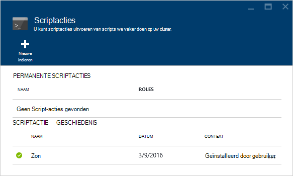

5. Een script selecteren in de geschiedenis, wordt het blad Eigenschappen voor dit script weergegeven. U kunt vanaf de bovenkant van het blad, het script opnieuw uitvoeren of het niveau verhogen.

    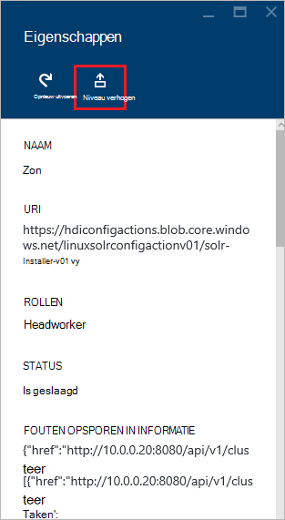

6. U kunt ook de __...__ rechts van items in het blad scriptacties acties wilt uitvoeren, zoals opnieuw uit te voeren, blijven behouden of verwijderen (voor permanente acties,).

    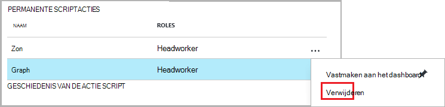

### Via Azure PowerShell

| Gebruik het volgende... | Aan... |
| ----- | ----- |
| Get-AzureRmHDInsightPersistedScriptAction | Informatie over permanente scriptacties ophalen |
| Get-AzureRmHDInsightScriptActionHistory | Een geschiedenis van scriptacties die zijn toegepast op de cluster of details voor een specifieke script ophalen |
| Set-AzureRmHDInsightPersistedScriptAction | Verhoogt het niveau van een ad-hoc scriptactie naar een scriptactie permanente |
| Verwijderen AzureRmHDInsightPersistedScriptAction | Verlaagt het niveau van een scriptactie permanente naar een ad-hoc actie |

> [AZURE.IMPORTANT] Met `Remove-AzureRmHDInsightPersistedScriptAction` wordt niet ongedaan maken de acties worden uitgevoerd door een script, alleen wordt verwijderd de permanente vlag zodat het script wordt niet op nieuwe werknemer knooppunten toegevoegd aan het cluster worden uitgevoerd.

Het volgende voorbeeldscript ziet de cmdlets gebruiken om te verhogen en vervolgens een script verlagen.

    # Get a history of scripts
    Get-AzureRmHDInsightScriptActionHistory -ClusterName mycluster

    # From the list, we want to get information on a specific script
    Get-AzureRmHDInsightScriptActionHistory -ClusterName mycluster -ScriptExecutionId 635920937765978529

    # Promote this to a persisted script
    # Note: the script must have a unique name to be promoted
    # if the name is not unique, you will receive an error
    Set-AzureRmHDInsightPersistedScriptAction -ClusterName mycluster -ScriptExecutionId 635920937765978529

    # Demote the script back to ad hoc
    # Note that demotion uses the unique script name instead of
    # execution ID.
    Remove-AzureRmHDInsightPersistedScriptAction -ClusterName mycluster -Name "Install Giraph"

### Gebruik van de Azure CLI

| Gebruik het volgende... | Aan... |
| ----- | ----- |
| `azure hdinsight script-action persisted list <clustername>` | Een lijst met scriptacties permanente ophalen |
| `azure hdinsight script-action persisted show <clustername> <scriptname>` | Informatie over de scriptactie van een specifieke permanente ophalen |
| `azure hdinsight script-action history list <clustername>` | Een geschiedenis van scriptacties die zijn toegepast op het cluster ophalen |
| `azure hdinsight script-action history show <clustername> <scriptname>` | Informatie over de actie van een specifiek script ophalen |
| `azure hdinsight script action persisted set <clustername> <scriptexecutionid>` | Verhoogt het niveau van een ad-hoc scriptactie naar een scriptactie permanente |
| `azure hdinsight script-action persisted delete <clustername> <scriptname>` | Verlaagt het niveau van een scriptactie permanente naar een ad-hoc actie |

> [AZURE.IMPORTANT] Met `azure hdinsight script-action persisted delete` wordt niet ongedaan maken de acties worden uitgevoerd door een script, alleen wordt verwijderd de permanente vlag zodat het script wordt niet op nieuwe werknemer knooppunten toegevoegd aan het cluster worden uitgevoerd.

### Gebruik van de HDInsight .NET SDK

Voor een voorbeeld van het gebruik van de .NET SDK script geschiedenis ophalen uit een cluster niveau verhogen of verlagen scripts, raadpleegt u [https://github.com/Azure-Samples/hdinsight-dotnet-script-action](https://github.com/Azure-Samples/hdinsight-dotnet-script-action).

> [AZURE.NOTE] Dit voorbeeld wordt ook het installeren van een toepassing HDInsight op basis van de .NET SDK.

## Problemen oplossen

U kunt Ambari web UI gebruiken om informatie door de scriptacties vastgelegd te bekijken. Als het script is gebruikt tijdens cluster maken en maken van het cluster is mislukt vanwege een fout in het script de logboekbestanden zijn ook beschikbaar in de standaard-opslag-account dat is gekoppeld aan het cluster. In deze sectie bevat informatie over het ophalen van de logboeken aan beide deze opties.

### Via het Web Ambari UI

1. Ga in uw browser naar https://CLUSTERNAME.azurehdinsight.net. CLUSTERNAAM vervangen door de naam van uw cluster HDInsight.

    Wanneer u wordt gevraagd, voert u de naam van de account beheerder (admin) en het wachtwoord voor het cluster. Mogelijk moet u de beheerdersreferenties in een webformulier opnieuw in te voeren.

2. Selecteer de post __ops__ in de balk boven aan de pagina. Hier ziet een lijst met de huidige en vorige bewerkingen uitgevoerd op het cluster via Ambari.

    

3. Zoek de gegevens die u hebt __uitvoeren\_customscriptaction__ in de kolom __Operations__ . Deze worden gemaakt wanneer de Script-acties worden uitgevoerd.

    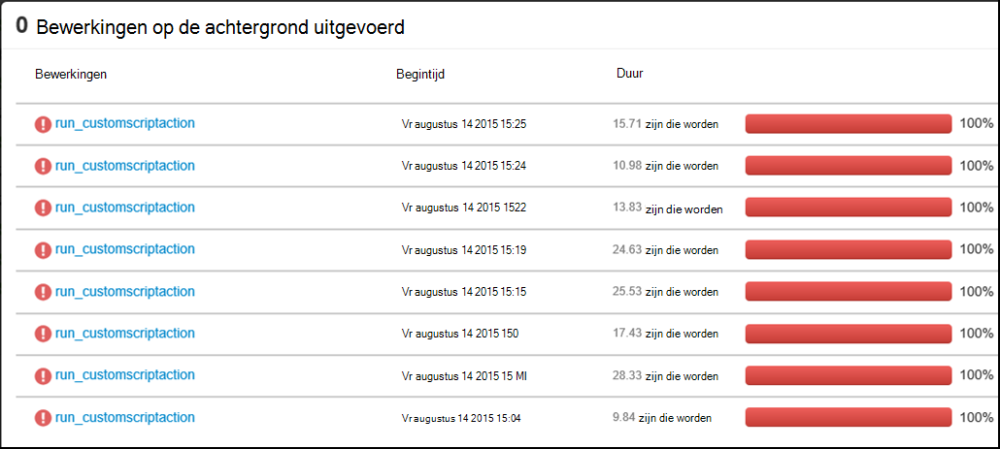

    Selecteer dit item en minder details via de koppelingen naar de weergave van de STDOUT en STDERR uitvoer gegenereerd wanneer het script is uitgevoerd op het cluster.

### Aanmeldingslogboeken uit het standaardaccount voor de opslag

Als het maken van het cluster is mislukt vanwege een fout in scriptactie, de logboeken aan de actie script nog steeds toegankelijk rechtstreeks vanuit het standaardaccount opslag die is gekoppeld aan het cluster.

* De logboeken opslag zijn beschikbaar op `\STORAGE_ACOCUNT_NAME\DEFAULT_CONTAINER_NAME\custom-scriptaction-logs\CLUSTER_NAME\DATE`.

    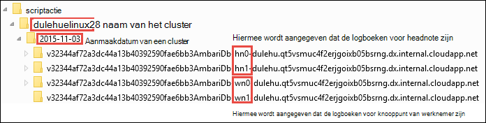

    De logboeken worden onder deze afzonderlijk ingedeeld voor headnode, workernode en zookeeper knooppunten. Er zijn enkele voorbeelden:
    * **Headnode** - `<uniqueidentifier>AmbariDb-hn0-<generated_value>.cloudapp.net`
    * **Werknemer knooppunt** - `<uniqueidentifier>AmbariDb-wn0-<generated_value>.cloudapp.net`
    * **Zookeeper knooppunt** - `<uniqueidentifier>AmbariDb-zk0-<generated_value>.cloudapp.net`

* Alle stdout en stderr van de corresponderende host wordt geüpload naar de opslag-account. Er is een **uitvoer -\*.txt** en **fouten -\*.txt** voor elke scriptactie. De uitvoer-txt-bestand bevat informatie over de URI van het script dat op de host hebt uitgevoerd. Bijvoorbeeld

        'Start downloading script locally: ', u'https://hdiconfigactions.blob.core.windows.net/linuxrconfigactionv01/r-installer-v01.sh'

* Het is mogelijk dat u net zo vaak een script actie cluster met dezelfde naam maken. In dit geval is, kunt u de relevante logboeken op basis van de mapnaam datum onderscheiden. Bijvoorbeeld, worden de mapstructuur voor een cluster (mijncluster) op verschillende datums gemaakt:
    * `\STORAGE_ACOCUNT_NAME\DEFAULT_CONTAINER_NAME\custom-scriptaction-logs\mycluster\2015-10-04`
    * `\STORAGE_ACOCUNT_NAME\DEFAULT_CONTAINER_NAME\custom-scriptaction-logs\mycluster\2015-10-05`

* Als u een script actie cluster met dezelfde naam op dezelfde dag maakt, kunt u de unieke voorvoegsel om aan te geven van de relevante logboekbestanden.

* Als u een cluster aan het einde van de dag maakt, is het mogelijk dat de logboekbestanden over twee dagen beslaan. In dat geval ziet u twee verschillende datum mappen voor hetzelfde cluster.

* Maximaal 5 minuten, met name voor grote clusters kan logboekbestanden uploaden naar de standaardcontainer duren. Zo is, als u toegang wilt tot de logboeken, moet u niet direct verwijderen het cluster als de scriptactie voor een mislukt.

## Ondersteuning voor open source software die worden gebruikt op HDInsight clusters

De Microsoft Azure HDInsight-service is een flexibel platform waarmee u kunt grote gegevens toepassingen maken in de cloud met behulp van een selectie aan open source technologieën gevormd rond Hadoop. Microsoft Azure biedt een algemene niveau van ondersteuning voor open source technologieën, zoals is beschreven in de sectie **Bereik ondersteuning** van de [website van Azure ondersteunen Veelgestelde vragen](https://azure.microsoft.com/support/faq/). De HDInsight-service biedt een extra niveau van ondersteuning voor een deel van de onderdelen, zoals hieronder beschreven.

Er zijn twee soorten open source-onderdelen die beschikbaar in de service HDInsight zijn:

- **Ingebouwde onderdelen** - deze onderdelen zijn vooraf geïnstalleerd op HDInsight clusters en geef de belangrijkste functies van het cluster. Bijvoorbeeld garens ResourceManager, de querytaal component (HiveQL) en de bibliotheek Mahout deel uitmaakt van deze categorie. Een volledige lijst met clusteronderdelen is beschikbaar in [Wat is er nieuw in de Hadoop cluster versies geleverd door HDInsight?](hdinsight-component-versioning.md).

- **Aangepaste onderdelen** - u, als een gebruiker van het cluster, kunt installeren of gebruiken in uw werkzaamheden elk onderdeel beschikbaar in de community of door u gemaakte.

> [AZURE.WARNING] Onderdelen van het cluster HDInsight volledig worden ondersteund en Microsoft Support helpt isoleren en oplossen van problemen met deze onderdelen.
>
> Aangepaste onderdelen ontvangen commercieel redelijk ondersteuning waarmee u kunt het probleem verder kunt oplossen. Dit kan leiden tot het probleem oplossen of vraag of u kunt voeren beschikbare kanalen voor de bron openen technologieën waar uitgebreide expertise voor deze technologie is gevonden. Bijvoorbeeld, zijn er veel communitysites die kunnen worden gebruikt, zoals: [MSDN-forum voor HDInsight](https://social.msdn.microsoft.com/Forums/azure/en-US/home?forum=hdinsight), [http://stackoverflow.com](http://stackoverflow.com). Apache projecten tevens projectsites op [http://apache.org](http://apache.org), bijvoorbeeld: [Hadoop](http://hadoop.apache.org/).

De HDInsight-service biedt diverse manieren om te gebruiken van aangepaste onderdelen. Ongeacht hoe een onderdeel gebruikt of is geïnstalleerd op het cluster, hetzelfde niveau van ondersteuning is van toepassing. Hierna volgt een lijst van de meest voorkomende manieren dat aangepaste onderdelen op HDInsight clusters kunnen worden gebruikt:

1. Taak indiening - Hadoop of andere soorten taken die uitvoeren of aangepaste onderdelen gebruiken kan bij het cluster worden ingediend.

2. Cluster aanpassing - gemaakt, kunt u aanvullende instellingen en aangepaste onderdelen die wordt geïnstalleerd knooppunten opgeven.

3. Voorbeelden - voor populaire aangepaste onderdelen, Microsoft en anderen kunnen voorbeelden van hoe deze onderdelen kunnen worden gebruikt op HDInsight clusters bepalen. Deze voorbeelden worden gegeven zonder ondersteuning.

##Problemen oplossen

###Geschiedenis van niet wordt scripts die worden gebruikt tijdens het maken van cluster weergegeven

Als uw cluster is gemaakt voordat het 15e maart 2016, ziet u mogelijk niet bewerkt een vermelding in de geschiedenis scriptactie voor alle scripts tijdens het maken van het cluster gebruikt. Echter als u het formaat van het cluster na het 15e maart 2016, worden de scripts gebruiken tijdens het maken van cluster weergegeven in geschiedenis als ze zijn toegepast op nieuwe knooppunten in het cluster als onderdeel van de bewerking tabelgrootte wijzigen.

Er zijn twee uitzonderingen:

* Als uw cluster vóór 1e September 2015 is gemaakt. Dit is wanneer u scriptacties zijn geïntroduceerd, zodat een cluster gemaakt voor deze datum kan niet hebt gebruikt scriptacties om cluster te maken.

* Als u meerdere scriptacties tijdens het maken van het cluster gebruikt en die wordt gebruikt voor meerdere scripts, dezelfde naam of het dezelfde naam, dezelfde URI, maar andere parameters voor meerdere scripts. In deze gevallen ontvangt u het volgende foutbericht weergegeven.

    Op dit cluster vanwege conflicterende scriptnamen in bestaande scripts kunnen geen nieuwe scriptacties worden uitgevoerd. Scriptnamen gegeven aan cluster maken verplichte alle uniek zijn. Klik op tabelgrootte wijzigen worden nog steeds bestaande scripts uitgevoerd.

## Volgende stappen

Zie de volgende onderwerpen voor informatie en voorbeelden over het maken en aanpassen van een cluster met behulp van scripts:

- [Ontwikkel scriptactie scripts voor HDInsight](hdinsight-hadoop-script-actions-linux.md)
- [Installeren en gebruiken van Solr op HDInsight clusters](hdinsight-hadoop-solr-install-linux.md)
- [Installeren en gebruiken van Giraph op HDInsight clusters](hdinsight-hadoop-giraph-install-linux.md)

[img-hdi-cluster-states]: ./media/hdinsight-hadoop-customize-cluster-linux/HDI-Cluster-state.png "Fasen tijdens het maken van cluster"
