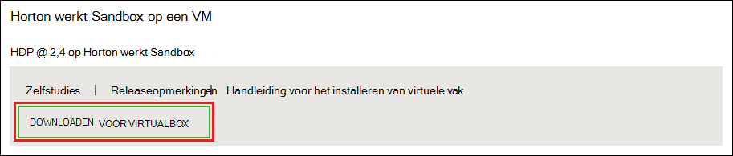
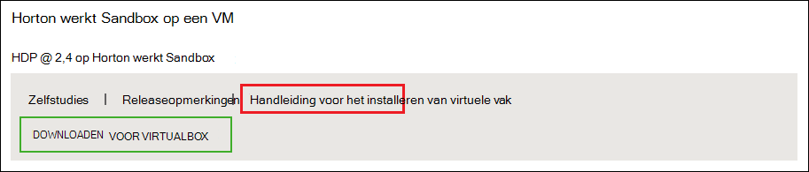
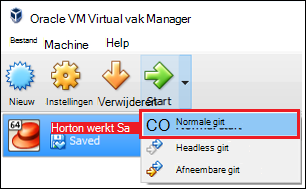

<properties
    pageTitle="Een sandbox Hadoop gebruiken voor meer informatie over Hadoop | Microsoft Azure"
    description="Als u wilt weten over het gebruik van het Hadoop-systeem, kunt u instellen een sandbox Hadoop uit Hortonworks op een Azure virtuele machine. "
    keywords="hadoop emulator, hadoop sandbox"
    editor="cgronlun"
    manager="jhubbard"
    services="hdinsight"
    authors="nitinme"
    documentationCenter=""
    tags="azure-portal"/>

<tags
    ms.service="hdinsight"
    ms.workload="big-data"
    ms.tgt_pltfrm="na"
    ms.devlang="na"
    ms.topic="article"
    ms.date="08/24/2016"
    ms.author="nitinme"/>

# Aan de slag in het Hadoop-systeem met een Hadoop-sandbox op een virtuele machine

Leer hoe u de sandbox Hadoop uit Hortonworks installeren op een virtuele machine voor meer informatie over het Hadoop-systeem. De sandbox biedt een lokale ontwikkelomgeving voor meer informatie over Hadoop, Hadoop Distributed bestand System (HDFS) en indiening van de taak.

## Vereisten voor

* [Oracle VirtualBox](https://www.virtualbox.org/)

Als u bekend met Hadoop bent, kunt u het gebruik van Hadoop op Azure doordat een cluster HDInsight starten. Zie [aan de slag met Hadoop op HDInsight](hdinsight-hadoop-linux-tutorial-get-started.md)voor meer informatie over het aan de slag.

## Download en installeer de virtuele machine

1. Selecteer het item __Downloaden voor VIRTUALBOX__ voor HDP 2,4 op Hortonworks Sandbox in [http://hortonworks.com/downloads/#sandbox](http://hortonworks.com/downloads/#sandbox). U wordt gevraagd om te registreren met Hortonworks voordat het downloaden begint.

    

2. Selecteer in dezelfde webpagina, de __VirtualBox installeren handleiding__ voor HDP 2,4 op Hortonworks Sandbox. Hiermee wordt een PDF-bestand met de installatie-instructies voor de virtuele machine gedownload.

    

## De virtuele machine start

1. VirtualBox starten, selecteert u de Hortonworks Sandbox, selecteer __starten__en selecteer __Normaal starten__.

    

2. Zodra het opstarten van de virtuele machine is voltooid, wordt deze aanmeldingsinstructies weergegeven. Open een webbrowser en navigeer naar de URL wordt weergegeven (meestal http://127.0.0.1:8888).

## Wachtwoorden instellen

1. Selecteer in de stap __aan de slag__ van de pagina Hortonworks Sandbox __Weergave geavanceerde opties__. Gebruik de informatie op deze pagina om Meld u aan bij de sandbox via SSH. Gebruik de naam en het wachtwoord die zijn opgegeven.

    > [AZURE.NOTE] Als u nog geen een SSH-client is geïnstalleerd, kunt u het web gebaseerde SSH gegeven aan door de virtuele machine op __http://localhost:4200 /__.

    De eerste keer dat u verbinding maken met SSH, wordt u gevraagd het wachtwoord voor het account hoofdmap wijzigen. Voer een nieuw wachtwoord, die worden gebruikt wanneer u zich aanmeldt via SSH in de toekomst.

2. Nadat u bent aangemeld, voert u de volgende opdracht uit:

        ambari-admin-password-reset
    
    Wanneer u wordt gevraagd, kunt u een wachtwoord opgeven voor het account van Ambari. Hiermee wordt gebruikt wanneer u toegang hebt tot de gebruikersinterface van de Web Ambari.

## Gebruik de opdracht component

1. Gebruik de volgende opdracht de component shell starten vanuit een SSH-verbinding met de sandbox:

        hive

2. Zodra de shell is gestart, gebruikt u de volgende handelingen uit de tabellen die worden geleverd met de sandbox weergeven:

        show tables;

3. Gebruik van de volgende manieren te werk om op te halen 10 rijen uit de `sample_07` tabel:

        select * from sample_07 limit 10;

## Volgende stappen

* [Informatie over het gebruik van Visual Studio met de Hortonworks Sandbox](hdinsight-hadoop-emulator-visual-studio.md)
* [Zal het leren van de lijnen van de Hortonworks Sandbox](http://hortonworks.com/hadoop-tutorial/learning-the-ropes-of-the-hortonworks-sandbox/)
* [Hadoop zelfstudie: aan de slag met HDP](http://hortonworks.com/hadoop-tutorial/hello-world-an-introduction-to-hadoop-hcatalog-hive-and-pig/)