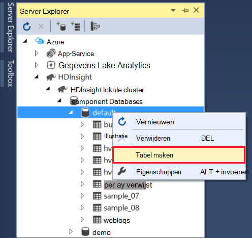

<properties
pageTitle="Gebruik van de Microsoft Azure-gegevens Lake hulpmiddelen voor Visual Studio met de Sandbox Hortonworks | Microsoft Azure"
description="Informatie over het gebruik van de Azure Data Lake Tools voor VIsual Studio met de Hortonworks sandbox (uitgevoerd in een lokale VM). U kunt met deze tools maken en uitvoeren van component en varken taken op de taak-uitvoer sandbox en de weergave en geschiedenis."
services="hdinsight"
documentationCenter=""
authors="Blackmist"
manager="paulettm"
editor="cgronlun"/>

<tags
ms.service="hdinsight"
ms.devlang="na"
ms.topic="article"
ms.tgt_pltfrm="na"
ms.workload="big-data"
ms.date="08/26/2016"
ms.author="larryfr"/>

# Gebruik de Lake Azure Data Tools voor Visual Studio met de Sandbox Hortonworks

De hulpmiddelen Azure gegevens Lake voor Visual Studio bevatten hulpmiddelen voor het werken met algemene Hadoop kolomgroepen naast hulpprogramma's voor het werken met Azure gegevens Lake en HDInsight. Dit document bevat de vereiste stappen voor het gebruik van de hulpmiddelen Lake van Azure-gegevens met de Hortonworks Sandbox uitgevoerd op een lokale virtuele machine.

De Hortonworks Sandbox gebruikt, kunt u werken met Hadoop lokaal op uw ontwikkelomgeving. Nadat u een oplossing hebt ontwikkeld en wilt u deze implementeert bij het op schaal, kunt u vervolgens verplaatsen naar een cluster HDInsight.

## Vereisten voor

* De Hortonworks Sandbox wordt uitgevoerd in een virtuele machine op uw ontwikkelomgeving. In dit document is geschreven en getest met de sandbox die wordt uitgevoerd in Oracle VirtualBox, die is geconfigureerd met behulp van de informatie in het document [aan de slag in het Hadoop-systeem](hdinsight-hadoop-emulator-get-started.md) .

* Visual Studio 2013 of 2015 verlengt, een versie.

* De [Azure SDK voor .NET](https://azure.microsoft.com/downloads/) 2.7.1 of hoger

* [Azure Data Lake Tools voor Visual Studio](https://www.microsoft.com/download/details.aspx?id=49504)

## Wachtwoorden opnieuw instellen voor de sandbox configureren

Zorg ervoor dat de Hortonworks Sandbox wordt uitgevoerd en voert u de stappen in [aan de slag in het Hadoop-systeem](hdinsight-hadoop-emulator-get-started.md#set-passwords) voor het configureren van het wachtwoord voor de SSH `root` account en de Ambari `admin` account. Deze wachtwoorden wordt gebruikt wanneer u verbinding maakt met de sandbox in Visual Studio.

## De hulpmiddelen voor verbinden met de sandbox

1. Open Visual Studio en kies __weergave__ __Server Explorer__.

2. Klik met de rechtermuisknop op het fragment __HDInsight__ vanuit __Server Explorer__, en selecteer vervolgens __verbinding maken met HDInsight Emulator__.

    

3. Voer het wachtwoord dat u hebt geconfigureerd voor Ambari in het dialoogvenster __verbinding maken met HDInsight Emulator__ .

    

    Selecteer __volgende__ om door te gaan.

4. Het veld __wachtwoord__ gebruiken om in te voeren van het wachtwoord die u hebt geconfigureerd voor het `root` account. Laat de andere velden bij de standaardwaarde.

    

    Selecteer __volgende__ om door te gaan.

5. Wacht voor validatie van de services om te voltooien. In sommige gevallen validatie mogelijk mislukt en u de configuratie bij te werken. Als dit gebeurt, selecteer de knop __bijwerken__ en wacht totdat de configuratie en de verificatie voor de service om te voltooien.

    

    > [AZURE.NOTE] Het updateproces wordt Ambari gebruikt voor het wijzigen van de configuratie Hortonworks Sandbox aan wat er wordt verwacht door de Azure gegevens Lake tools voor Visual Studio.

    Wanneer validatie is voltooid, selecteert u __Voltooien__ tot en met volledige configuratie.

    

    > [AZURE.NOTE] Afhankelijk van de snelheid van uw ontwikkelomgeving en de hoeveelheid geheugen toegewezen aan de virtuele machine, kan het enkele minuten duren om te configureren en valideren van de services.

Nadat u deze stappen uitvoert, hebt hebt u nu een vermelding 'HDInsight lokale cluster' in Server Explorer onder de sectie HDInsight.

## Een query component schrijven

Een SQL-achtige querytaal (HiveQL), bevat component voor het werken met gestructureerde gegevens. Gebruik de volgende stappen als u wilt weten hoe u een ad-hoc-query's uitvoeren op het lokale cluster.

1. In __Server Explorer__met de rechtermuisknop op de vermelding voor het lokale cluster die u eerder hebt toegevoegd en selecteer vervolgens __een query component schrijven__.

    

    Hiermee wordt een nieuwe queryvenster waarmee u snel kunt maken en verzenden van een query naar de lokale cluster geopend.

2. Typ het volgende in het queryvenster nieuwe:

        select count(*) from sample_08;
    
    Vanaf de bovenkant van het queryvenster, zorg dat de configuratie voor het lokale cluster is geselecteerd en selecteer vervolgens __verzenden__. Laat de andere waarden (door de__Batch__ en server naam), op de standaardwaarden.

    

    Opmerking u kunt ook de vervolgkeuzelijst naast __verzenden__ gebruiken om te selecteren op __Geavanceerd__. Hiermee wordt een dialoogvenster waarmee u bieden extra opties bij het verzenden van de taak geopend.

    

3. Zodra u de query verzendt, wordt de taakstatus wordt weergegeven. Hiermee wordt aandacht besteed aan de taak terwijl deze wordt verwerkt door Hadoop. De invoer __Taakstatus__ bevat de huidige status van de taak. De staat regelmatig wordt bijgewerkt, of kunt u het pictogram Vernieuwen handmatig vernieuwen van de staat.

    

    Zodra de __Taakstatus__ veranderd in __voltooid__, wordt een doorgestuurd acyclische Graph (DAG) wordt weergegeven. Hierin de uitvoeringspad dat is bepaald door Tez (standaard execution engine voor component op het lokale cluster.) 
    
    > [AZURE.NOTE] Tez is ook de standaardwaarde wanneer u een HDInsight Linux gebaseerde clusters gebruikt. Het is niet de standaard op Windows gebaseerde HDInsight; Gebruik deze er, u moet de regel toevoegen `set hive.execution.engine = tez;` naar het begin van uw query component. 

    Gebruik de __Uitvoer van de taak__ -koppeling naar de weergave van de uitvoer. In dit geval is __823__; het aantal rijen in de tabel sample_08. U kunt diagnostische informatie over de taak weergeven met behulp van de __Taak-logboeken__ en __Download garens Log__ koppelingen.

4. U kunt ook component taken interactief worden uitgevoerd door het veld __Batch__ te __interactief__wijzigen en selecteer vervolgens __uitvoeren__. 

    

    Dit streamt het uitvoerlogboek gegenereerd tijdens het verwerken van het __HiveServer2__ uitvoervenster.
    
    > [AZURE.NOTE] Dit is dezelfde gegevens die beschikbaar is in de koppeling van de __Functie Log__ nadat een taak is voltooid.

    

## Een project component maken

U kunt ook een project met meerdere component scripts maken. Dit is handig wanneer u betrekking hebben scripts die u moet bijeenhouden of onderhouden met een controlesystemen versie.

1. Selecteer in Visual Studio, __bestand__, __Nieuw__en then__Project__.

2. In de lijst met projecten, __sjablonen__, __Azure gegevens Lake__ uitvouwen en selecteer vervolgens __component (HDInsight)__. Selecteer in de lijst met sjablonen, __Component steekproef__. Typ een naam en locatie, klik op __OK__.

    

Het project __Component voorbeeld__ bevat twee scripts, __WebLogAnalysis.hql__ en __SensorDataAnalysis.hql__. U kunt deze met de knop met dezelfde __verzenden__ boven aan het venster verzenden.

## Een project varken maken

Hoewel component een SQL-achtige taal biedt voor het werken met gestructureerde gegevens, vindt u varken een taal (varken Latijns), waarmee u kunt het ontwikkelen van een pijplijn met transformaties die zijn toegepast op uw gegevens. Gebruik de volgende stappen voor het gebruik van varken met de lokale cluster.

1. Open Visual Studio en selecteert u __bestand__, klik op __Nieuw__en klik vervolgens op __Project__. In de lijst met projecten, __sjablonen__, __Azure gegevens Lake__uitvouwen en selecteer __varken (HDInsight)__. Selecteer in de lijst met sjablonen, __Varken toepassing__. Voer een naam en locatie, en selecteer vervolgens __OK__.

    

2. Voer de volgende handelingen uit als de inhoud van het __script.pig__ -bestand dat is gemaakt met dit project.

        a = LOAD '/demo/data/Website/Website-Logs' AS (
            log_id:int, 
            ip_address:chararray, 
            date:chararray, 
            time:chararray, 
            landing_page:chararray, 
            source:chararray);
        b = FILTER a BY (log_id > 100);
        c = GROUP b BY ip_address;
        DUMP c;

    Terwijl de varken met een andere taal dan component, is hoe u de taken uitvoeren consistente tussen beide talen via de knop __verzenden__ . De vervolgkeuzelijst selecteren omlaag naast __verzenden__ , wordt een dialoogvenster Geavanceerde verzenden weergegeven voor varken.

    
    
3. De taakstatus en de uitvoer is ook hetzelfde als een query component weergegeven.

    

## Taken weergeven

Azure hulpmiddelen voor gegevens Lake kunt u eenvoudig informatie weergeven over taken die zijn uitgevoerd op Hadoop. Gebruik de volgende stappen uit om de taken die zijn uitgevoerd op het lokale cluster weer te geven.

1. Met de rechtermuisknop op het lokale cluster van __Server Explorer__, en selecteer vervolgens __Taken weergeven__. Hierdoor wordt een lijst met taken die zijn ingediend aan het cluster weergegeven.

    

2. Selecteer in de lijst met taken, een om de taakdetails te bekijken.

    

    De gegevens worden weergegeven is vergelijkbaar met wat u na het uitvoeren van een component of varken query, inclusief koppelingen naar weergave van de uitvoer en meld u informatie te zien.

3. U kunt ook wijzigen en de taak van hieruit opnieuw indienen.

## Component databases bekijken

1. Vouw het fragment __HDInsight lokale cluster__ in __Server Explorer__en vouwt u __Component Databases__. Hiermee wordt de __standaard__ - en __xademo__ database op het lokale cluster op te geven. Gegevensniveaus uitvouwen van een database klikt, worden de tabellen in de database.

    

2. Een tabel uitvouwen, wordt de kolommen voor die tabel weergegeven. U kunt met de rechtermuisknop op een tabel en selecteert u __Weergave bovenste 100 rijen__ u de gegevens snel kunt bekijken.

    

### Eigenschappen van het scherm database en tabel

U misschien opgevallen dat u __Eigenschappen__ weergeven op een database of een tabel kunt selecteren. Hier ziet details van het geselecteerde item in het eigenschappenvenster.

### Een tabel maken

Als u wilt een nieuwe tabel maakt, met de rechtermuisknop op een database en selecteer vervolgens __Tabel maken__.

Vervolgens kunt u de tabel met een formulier maken. Hier ziet u de onbewerkte HiveQL die wordt gebruikt voor het maken van de tabel onder aan deze pagina.

## Volgende stappen

* [Zal het leren van de lijnen van de Hortonworks Sandbox](http://hortonworks.com/hadoop-tutorial/learning-the-ropes-of-the-hortonworks-sandbox/)
* [Hadoop zelfstudie: aan de slag met HDP](http://hortonworks.com/hadoop-tutorial/hello-world-an-introduction-to-hadoop-hcatalog-hive-and-pig/)