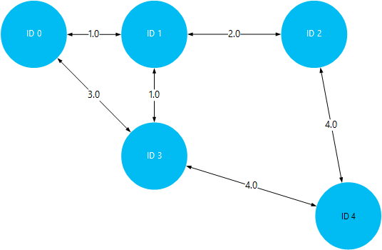

<properties
    pageTitle="Installeren en gebruiken van Giraph op Linux gebaseerde HDInsight (Hadoop) | Microsoft Azure"
    description="Informatie over het installeren van Giraph op HDInsight Linux gebaseerde clusters scriptacties gebruiken. Scriptacties kunnen u het cluster tijdens het maken, aanpassen door te wijzigen van de configuratie van het cluster of installatie van services en hulpprogramma's."
    services="hdinsight"
    documentationCenter=""
    authors="Blackmist"
    manager="jhubbard"
    editor="cgronlun"
    tags="azure-portal"/>

<tags
    ms.service="hdinsight"
    ms.workload="big-data"
    ms.tgt_pltfrm="na"
    ms.devlang="na"
    ms.topic="article"
    ms.date="10/17/2016"
    ms.author="larryfr"/>

# Installeer Giraph op HDInsight Hadoop clusters en Giraph gebruiken voor het verwerken van grote grafieken

Met behulp van **Scriptactie** om aan te passen een cluster, kunt u Giraph installeren op een willekeurig type cluster in Hadoop op Azure HDInsight.

In dit onderwerp leert u hoe u Giraph installeren met behulp van scriptactie. Zodra u Giraph hebt geïnstalleerd, leert u ook het gebruik van Giraph voor de meest voorkomende toepassingen, namelijk grootschalige grafieken verwerken.

> [AZURE.NOTE] De informatie in dit artikel is specifiek voor HDInsight Linux gebaseerde clusters. Zie voor informatie over het werken met Windows gebaseerde clusters [Giraph installeren op HDInsight Hadoop clusters (Windows)](hdinsight-hadoop-giraph-install.md)

## Wat is Giraph?

[Apache Giraph](http://giraph.apache.org/) kunt u graph verwerken met behulp van Hadoop uitvoeren en kan worden gebruikt met Azure HDInsight. Grafieken modelleren van relaties tussen objecten, zoals de verbindingen tussen routers in een grote netwerk zoals Internet, of de relaties tussen personen aan de sociale netwerken (ook wel een sociale grafiek genoemd). Verwerking van de grafiek kunt u reden dan ook over de relaties tussen objecten in een grafiek, zoals:

- Identificerende mogelijke vrienden op basis van uw huidige relaties.
- Identificerende de kortste route tussen twee computers in een netwerk.
- Berekening van de pagina rang van webpagina's.

> [AZURE.WARNING] Onderdelen van het cluster HDInsight volledig worden ondersteund en Microsoft Support helpt isoleren en oplossen van problemen met deze onderdelen.
>
> Aangepaste onderdelen, zoals Giraph, ontvangen commercieel redelijk ondersteuning waarmee u kunt het probleem verder kunt oplossen. Dit kan leiden tot het probleem oplossen of vraag of u kunt voeren beschikbare kanalen voor de bron openen technologieën waar uitgebreide expertise voor deze technologie is gevonden. Bijvoorbeeld, zijn er veel communitysites die kunnen worden gebruikt, zoals: [MSDN-forum voor HDInsight](https://social.msdn.microsoft.com/Forums/azure/en-US/home?forum=hdinsight), [http://stackoverflow.com](http://stackoverflow.com). Apache projecten tevens projectsites op [http://apache.org](http://apache.org), bijvoorbeeld: [Hadoop](http://hadoop.apache.org/).

##Werking van het script

Dit script kunt u de volgende acties uitvoeren:

* Installaties Giraph naar`/usr/hdp/current/giraph`
* Exemplaren het `giraph-examples.jar` bestand naar de standaard-opslag (WASB) voor uw cluster:`/example/jars/giraph-examples.jar`

## Installeer Giraph scriptacties gebruiken

Een voorbeeldscript Giraph installeren op een cluster HDInsight is beschikbaar op de volgende locatie.

    https://hdiconfigactions.blob.core.windows.net/linuxgiraphconfigactionv01/giraph-installer-v01.sh

In deze sectie bevat instructies over het gebruik van het voorbeeldscript tijdens het maken van het cluster met behulp van de Azure-Portal. 

> [AZURE.NOTE] Azure PowerShell, de CLI Azure, de HDInsight .NET SDK of Azure resourcemanager sjablonen kunnen ook worden gebruikt om toe te passen scriptacties. U kunt ook scriptacties toepassen op clusters is gebeurd. Zie [aanpassen HDInsight clusters met scriptacties](hdinsight-hadoop-customize-cluster-linux.md)voor meer informatie.

1. Beginnen met het maken van een cluster met behulp van de stappen in [HDInsight maken Linux gebaseerde clusters](hdinsight-hadoop-create-linux-clusters-portal.md), maar niet maken uitvoert.

2. Selecteer **Scriptacties**op het blad **Optionele configuratie** en de onderstaande informatie opgeven:

    * __Naam__: Voer een beschrijvende naam voor de scriptactie.
    * __SCRIPT URI__: https://hdiconfigactions.blob.core.windows.net/linuxgiraphconfigactionv01/giraph-installer-v01.sh
    * __Hoofd__: Schakel deze optie
    * __Werknemer__: laat dit uitgeschakeld
    * __ZOOKEEPER__: laat dit uitgeschakeld
    * __PARAMETERS__: laat dit veld leeg

3. Gebruik de knop **selecteren** de configuratie opslaan onderaan in de **Script-acties**. Gebruik ten slotte de knop **selecteren** onderaan in het blad **Optionele configuratie** optionele configuratie informatie wilt opslaan.

4. Doorgaan met het maken van het cluster, zoals wordt beschreven in [HDInsight maken Linux gebaseerde clusters](hdinsight-hadoop-create-linux-clusters-portal.md).

## Hoe gebruik ik Giraph in HDInsight?

Zodra het cluster is voltooid maken, gebruikt u de volgende stappen de SimpleShortestPathsComputation voorbeeld wordt geleverd bij Giraph wilt uitvoeren. Dit implementeert de eenvoudige <a href = "http://people.apache.org/~edwardyoon/documents/pregel.pdf">Pregel</a> uitvoering voor het zoeken van de kortste route tussen objecten in een grafiek.

1. Verbinding maken met het HDInsight cluster SSH gebruiken:

        ssh USERNAME@CLUSTERNAME-ssh.azurehdinsight.net

    Zie de volgende onderwerpen voor meer informatie over het gebruik van SSH met HDInsight:

    * [SSH gebruiken met Linux gebaseerde Hadoop op HDInsight uit Linux, Unix of OS X](hdinsight-hadoop-linux-use-ssh-unix.md)

    * [SSH gebruiken met Linux gebaseerde Hadoop op HDInsight vanuit Windows](hdinsight-hadoop-linux-use-ssh-windows.md)

1. Gebruik de volgende handelingen uit om te maken van een nieuw bestand met de naam __tiny_graph.txt__:

        nano tiny_graph.txt

    Gebruik de volgende handelingen uit als de inhoud van dit bestand:

        [0,0,[[1,1],[3,3]]]
        [1,0,[[0,1],[2,2],[3,1]]]
        [2,0,[[1,2],[4,4]]]
        [3,0,[[0,3],[1,1],[4,4]]]
        [4,0,[[3,4],[2,4]]]

    Deze gegevens worden van een relatie tussen objecten in een Services graph, met behulp van de indeling [bron\_-id, bron\_waarde, [[dest\_id], [rand\_waarde],...]]. Elke regel staat een relatie tussen een **bron\_id** object en een of meer **dest\_id** objecten. De **rand\_waarde** (of gewicht) kunnen worden beschouwd als de sterkte of afstand van de verbinding tussen **source_id** en **dest\_id**.

    Getekend, en met de waarde (of gewicht) als de afstand tussen objecten, de bovenstaande gegevens als volgt uitzien:

    

2. Als u wilt het bestand opslaat, gebruikt u __Ctrl + X__, en vervolgens __Y__en ten slotte __Enter__ om de bestandsnaam te accepteren.

3. Gebruik de volgende handelingen uit voor de opslag van de gegevens in primaire opslagruimte voor uw cluster HDInsight:

        hdfs dfs -put tiny_graph.txt /example/data/tiny_graph.txt

4. De SimpleShortestPathsComputation voorbeeld met de volgende opdracht uitvoeren.

         yarn jar /usr/hdp/current/giraph/giraph-examples.jar org.apache.giraph.GiraphRunner org.apache.giraph.examples.SimpleShortestPathsComputation -ca mapred.job.tracker=headnodehost:9010 -vif org.apache.giraph.io.formats.JsonLongDoubleFloatDoubleVertexInputFormat -vip /example/data/tiny_graph.txt -vof org.apache.giraph.io.formats.IdWithValueTextOutputFormat -op /example/output/shortestpaths -w 2

    De parameters voor deze opdracht worden beschreven in de volgende tabel.

  	| Parameter | Beschrijving |
  	| --------- | ------------ |
  	| `jar /usr/hdp/current/giraph/giraph-examples.jar` | Het oppervlak-bestand met de voorbeelden. |
  	| `org.apache.giraph.GiraphRunner` | De klasse die wordt gebruikt voor het starten van de voorbeelden. |
  	| `org.apache.giraph.examples.SimpleShortestPathsCoputation` | Het voorbeeld die worden uitgevoerd. In dit geval wordt deze de kortste route tussen 1-ID en alle andere id's in de grafiek berekenen. |
  	| `-ca mapred.job.tracker=headnodehost:9010` | De headnode voor het cluster. |
  	| `-vif org.apache.giraph.io.formats.JsonLongDoubleFloatDoubleVertexInputFromat` | De invoer notatie wilt gebruiken voor de invoergegevens. |
  	| `-vip /example/data/tiny_graph.txt` | Het bestand invoergegevens. |
  	| `-vof org.apache.giraph.io.formats.IdWithValueTextOutputFormat` | De indeling van de uitvoer. In dit geval ID en waarde als tekst zonder opmaak. |
  	| `-op /example/output/shortestpaths` | De uitvoerlocatie. |
  	| `-w 2` | Het aantal werknemers kunnen gebruiken. In dit geval 2. |

    Zie de [Giraph quickstart](http://giraph.apache.org/quick_start.html)voor meer informatie over deze en andere parameters voor Giraph voorbeelden.

5. Zodra de taak is voltooid, de resultaten worden opgeslagen in de __wasbs: / / / voorbeeld/out/shotestpaths__ directory. De bestanden die zijn gemaakt begint met __deel-m -__ en eindigen met een getal dat de eerste, tweede, enzovoort bestand aangeeft. Gebruik de volgende handelingen uit om weer te geven van de uitvoer:

        hdfs dfs -text /example/output/shortestpaths/*

    De uitvoer moet worden de volgende strekking weergegeven:

        0   1.0
        4   5.0
        2   2.0
        1   0.0
        3   1.0

    Het voorbeeld is hard gecodeerde beginnen SimpleShortestPathComputation object-ID 1 en de kortste route op andere objecten. Zodat de uitvoer moet worden gelezen als `destination_id distance`, waarbij afstand de waarde (of het gewicht) van de randen afgelegde tussen object-ID 1 en de doel-ID.

    Zomersportevenementen volgt, kunt u de resultaten controleren door de kortste paden reizen tussen 1-ID en alle andere objecten. Houd er rekening mee dat het kortste pad tussen 1-ID en -ID 4 5 is. Dit is de totale afstand tussen ID 1 en 3, en klik vervolgens ID 3 en 4.

    

## Volgende stappen

- [Installeren en gebruiken kleurtoon op HDInsight clusters](hdinsight-hadoop-hue-linux.md). Kleurtoon is web UI waarmee u gemakkelijk maken, uitvoeren en opslaan varken en component taken, evenals bladeren de standaard-opslag voor uw HDInsight cluster.

- [R installeren op HDInsight clusters](hdinsight-hadoop-r-scripts-linux.md): instructies voor het gebruik van cluster aanpassen als u wilt installeren en gebruiken van R op HDInsight Hadoop clusters. R is een open source taal- en -omgeving voor statistische computing. Deze bevat honderden ingebouwde statistische functies en een eigen programmeertaal die worden gecombineerd aspecten van het functionele en object-georiënteerd programmeren. Ook vindt u hier de uitgebreide mogelijkheden voor grafische.

- [Solr op HDInsight clusters installeren](hdinsight-hadoop-solr-install-linux.md). Gebruik cluster aanpassing Solr installeren op HDInsight Hadoop clusters. Solr kunt u krachtige zoekbewerkingen uitvoeren op gegevens die zijn opgeslagen.
