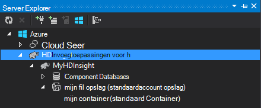

<properties
    pageTitle="Gebruik C# met component en varken op Hadoop in HDInsight | Microsoft Azure"
    description="Informatie over het gebruik van C# de gebruiker gedefinieerde functies (UDF) met component en varken streaming in Azure HDInsight."
    services="hdinsight"
    documentationCenter=""
    authors="Blackmist"
    manager="jhubbard"
    editor="cgronlun"
    tags="azure-portal"/>

<tags
    ms.service="hdinsight"
    ms.workload="big-data"
    ms.tgt_pltfrm="na"
    ms.devlang="dotnet"
    ms.topic="article"
    ms.date="10/28/2016"
    ms.author="larryfr"/>

#C# gebruiker gedefinieerde functies gebruiken met component en varken streaming op Hadoop in HDInsight

Component en varken zijn zeer geschikt voor het werken met gegevens in Azure HDInsight, maar soms moet u een meer algemene taal. Zowel component en varken kunt u externe code door gebruiker gedefinieerde functies (UDF) of streaming bellen.

In dit document, leert u hoe u C# met component en varken.

##Vereisten voor

* Windows 7 of hoger.

* Visual Studio met de volgende versies:

    * Visual Studio 2012 Professional/Premium/Ultimate met [4 bijwerken](http://www.microsoft.com/download/details.aspx?id=39305)

    * Visual Studio 2013 Community/Professional/Premium/Ultimate met [4 bijwerken](https://www.microsoft.com/download/details.aspx?id=44921)

    * Visual Studio-2015

* Hadoop op HDInsight cluster - Zie [inrichten een cluster HDInsight](hdinsight-provision-clusters.md) voor stappen een cluster maken

* Hadoop hulpprogramma's voor Visual Studio. Zie [aan de slag met HDInsight Hadoop Tools for Visual Studio](hdinsight-hadoop-visual-studio-tools-get-started.md) voor stapsgewijze instructies voor het installeren en configureren van de hulpmiddelen.

##.NET op HDInsight

De .NET CLR (CLR) en kaders worden standaard geïnstalleerd op Windows gebaseerde HDInsight clusters. Hiermee kunt u C#-toepassingen gebruiken met component en varken streaming (gegevens worden doorgegeven tussen component/varken en de C#-toepassing via stdout/stdin).

> [AZURE.NOTE] Er is momenteel geen ondersteuning voor het uitvoeren van .NET Framework UDF's op HDInsight Linux gebaseerde clusters. 

##.NET en streaming

Streaming heeft betrekking op component en varken gegevens aan een externe toepassing worden doorgegeven via stdout en de resultaten ontvangen via stdin. Voor C#-toepassingen, u kunt dit snel doen `Console.ReadLine()` en `Console.WriteLine()`.

Aangezien component en varken moet de toepassing tijdens runtime niet starten, moet de sjabloon **Console-toepassing** worden gebruikt voor uw projecten C#.

##Component en C & #35;

###De C#-project maken

1. Open Visual Studio en maak een nieuwe oplossing. Voor het projecttype, selecteer **Console-toepassing**en de naam van het nieuwe project **HiveCSharp**.

2. De inhoud van **Program.cs** vervangen door het volgende:

        using System;
        using System.Security.Cryptography;
        using System.Text;
        using System.Threading.Tasks;

        namespace HiveCSharp
        {
            class Program
            {
                static void Main(string[] args)
                {
                    string line;
                    // Read stdin in a loop
                    while ((line = Console.ReadLine()) != null)
                    {
                        // Parse the string, trimming line feeds
                        // and splitting fields at tabs
                        line = line.TrimEnd('\n');
                        string[] field = line.Split('\t');
                        string phoneLabel = field[1] + ' ' + field[2];
                        // Emit new data to stdout, delimited by tabs
                        Console.WriteLine("{0}\t{1}\t{2}", field[0], phoneLabel, GetMD5Hash(phoneLabel));
                    }
                }
                /// 

                /// Returns an MD5 hash for the given string
                /// 

                /// <param name="input">string value</param>
                /// <returns>an MD5 hash</returns>
                static string GetMD5Hash(string input)
                {
                    // Step 1, calculate MD5 hash from input
                    MD5 md5 = System.Security.Cryptography.MD5.Create();
                    byte[] inputBytes = System.Text.Encoding.ASCII.GetBytes(input);
                    byte[] hash = md5.ComputeHash(inputBytes);

                    // Step 2, convert byte array to hex string
                    StringBuilder sb = new StringBuilder();
                    for (int i = 0; i < hash.Length; i++)
                    {
                        sb.Append(hash[i].ToString("x2"));
                    }
                    return sb.ToString();
                }
            }
        }

3. Het project maakt.

###Uploaden naar opslag

1. Open in Visual Studio **Server Explorer**.

3. Vouw **Azure**en vouw vervolgens uit **HDInsight**.

4. Als u wordt gevraagd, voert u uw referenties Azure-abonnement en klik vervolgens op **Aanmelden**.

5. Vouw het HDInsight cluster die u wilt implementeren van deze toepassing en vouwt u **Standaardaccount voor opslag**.

    

6. Dubbelklik op **Container standaard** voor het cluster. Hiermee wordt een nieuw venster waarin u kunt de inhoud van de standaardcontainer geopend.

7. Klik op het pictogram upload en bladert u naar de map **bin\debug** voor het project **HiveCSharp** . Ten slotte het **HiveCSharp.exe** -bestand en klik op **Ok**.

    

8. Zodra de upload is voltooid, wordt u gebruikmaken van de toepassing uit een query component zijn.

###Component query

1. Open in Visual Studio **Server Explorer**.

2. Vouw **Azure**en vouw vervolgens uit **HDInsight**.

5. Met de rechtermuisknop op het cluster dat u de toepassing **HiveCSharp** geïmplementeerd en selecteer vervolgens **een Query component schrijven**.

6. Gebruik de volgende handelingen uit voor de component query:

        add file wasbs:///HiveCSharp.exe;

        SELECT TRANSFORM (clientid, devicemake, devicemodel)
        USING 'HiveCSharp.exe' AS
        (clientid string, phoneLabel string, phoneHash string)
        FROM hivesampletable
        ORDER BY clientid LIMIT 50;

    Hiermee wordt het `clientid`, `devicemake`, en `devicemodel` velden uit `hivesampletable`, en de velden worden doorgegeven aan de toepassing HiveCSharp.exe. De query de toepassing om terug te keren drie velden, die zijn opgeslagen als verwacht `clientid`, `phoneLabel`, en `phoneHash`. De query verwacht HiveCSharp.exe vinden in de hoofdmap van de standaard-opslag container (`add file wasbs:///HiveCSharp.exe`).

5. Klik op **verzenden** om de taak verstuurt naar het cluster HDInsight. Het venster **Taakoverzicht component** wordt geopend.

6. Klik op **vernieuwen** als u wilt het overzicht vernieuwen totdat **Taakstatus** moet **voltooid verandert**. Weergave van de uitvoer van de taak, klikt u op **Taak uitvoer**.

##Varken en C & #35;

###De C#-project maken

1. Open Visual Studio en maak een nieuwe oplossing. Voor het projecttype, selecteer **Console-toepassing**en de naam van het nieuwe project **PigUDF**.

2. De inhoud van het bestand **Program.cs** vervangen door het volgende:

        using System;

        namespace PigUDF
        {
            class Program
            {
                static void Main(string[] args)
                {
                    string line;
                    // Read stdin in a loop
                    while ((line = Console.ReadLine()) != null)
                    {
                        // Fix formatting on lines that begin with an exception
                        if(line.StartsWith("java.lang.Exception"))
                        {
                            // Trim the error info off the beginning and add a note to the end of the line
                            line = line.Remove(0, 21) + " - java.lang.Exception";
                        }
                        // Split the fields apart at tab characters
                        string[] field = line.Split('\t');
                        // Put fields back together for writing
                        Console.WriteLine(String.Join("\t",field));
                    }
                }
            }
        }

    Deze toepassing zal de regels die zijn verzonden vanuit varken en herformatteren lijnen die beginnen met parseren `java.lang.Exception`.

3. **Program.cs**opslaan en vervolgens het project te maken.

###De toepassing uploaden

1. Varken streaming verwacht de toepassing op de lokale in het bestandssysteem cluster. Extern bureaublad inschakelen voor het cluster HDInsight en maak verbinding met deze volgens de instructies in [verbinding maken met HDInsight clusters RDP gebruiken](hdinsight-administer-use-management-portal.md#rdp).

2. Zodra u verbinding hebt, Kopieer **PigUDF.exe** vanuit de **Prullenbak/foutopsporing** voor het project PigUDF op uw lokale computer, en plak deze in de map **% PIG_HOME %** in het cluster.

###Gebruikt u de toepassing van varken Latijns

1. Start de opdrachtregel Hadoop met behulp van het pictogram **Hadoop-opdrachtregel** op het bureaublad op de sessie van extern bureaublad.

2. Gebruik de volgende handelingen uit om de regel van de opdracht varken te beginnen:

        cd %PIG_HOME%
        bin\pig

    U krijgt een `grunt>` prompt.

3. Voer de volgende handelingen uit als u wilt een eenvoudige varken taak uitvoeren met de .NET Framework-toepassing:

        DEFINE streamer `pigudf.exe` SHIP('pigudf.exe');
        LOGS = LOAD 'wasbs:///example/data/sample.log' as (LINE:chararray);
        LOG = FILTER LOGS by LINE is not null;
        DETAILS = STREAM LOG through streamer as (col1, col2, col3, col4, col5);
        DUMP DETAILS;

    De `DEFINE` instructie maakt u een alias van `streamer` voor de pigudf.exe-toepassingen, en `SHIP` verdeelt deze over de knooppunten in het cluster. Later, `streamer` wordt gebruikt met de `STREAM` operator één regels de waarde in het logboek van proces en de gegevens als een reeks kolommen.

> [AZURE.NOTE] De naam van de toepassing die wordt gebruikt voor streaming moet tussen de \` (backtick) karakter wanneer alias, en ' (enkel aanhalingsteken) in combinatie met `SHIP`.

3. Na het invoeren van de laatste regel, moet de taak beginnen. Uiteindelijk wordt geretourneerd uitvoer ongeveer als volgt uit:

        (2012-02-03 20:11:56 SampleClass5 [WARN] problem finding id 1358451042 - java.lang.Exception)
        (2012-02-03 20:11:56 SampleClass5 [DEBUG] detail for id 1976092771)
        (2012-02-03 20:11:56 SampleClass5 [TRACE] verbose detail for id 1317358561)
        (2012-02-03 20:11:56 SampleClass5 [TRACE] verbose detail for id 1737534798)
        (2012-02-03 20:11:56 SampleClass7 [DEBUG] detail for id 1475865947)

##Overzicht

In dit document, hebt u weet hoe u het gebruik van een .NET Framework-toepassing via component en varken op HDInsight. Als u leren werken met Python met component en varken wilt, raadpleegt u [Python gebruiken met de component en varken in HDInsight](hdinsight-python.md).

Zie de volgende onderwerpen voor andere manieren varken en component gebruiken en voor meer informatie over het gebruik van MapReduce:

* [Component gebruiken met HDInsight](hdinsight-use-hive.md)

* [Varken met HDInsight gebruiken](hdinsight-use-pig.md)

* [MapReduce gebruiken met HDInsight](hdinsight-use-mapreduce.md)
