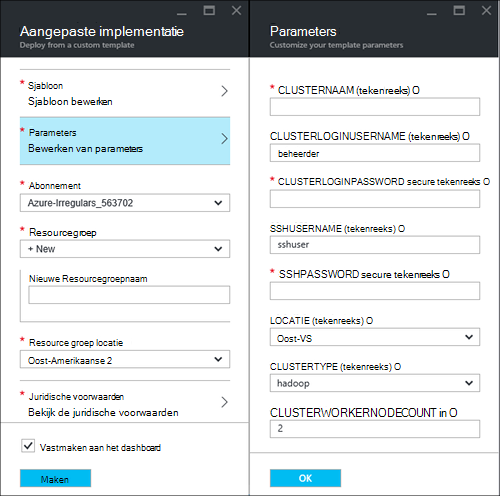
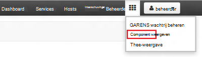

<properties
    pageTitle="Linux zelfstudie: aan de slag met Hadoop en component | Microsoft Azure"
    description="Volg deze zelfstudie Linux aan de slag met Hadoop in HDInsight. Informatie over het inrichten van Linux clusters en gegevens met component query."
    services="hdinsight"
    documentationCenter=""
    authors="mumian"
    manager="jhubbard"
    editor="cgronlun"
    tags="azure-portal"/>

<tags
    ms.service="hdinsight"
    ms.devlang="na"
    ms.topic="hero-article"
    ms.tgt_pltfrm="na"
    ms.workload="big-data"
    ms.date="09/14/2016"
    ms.author="jgao"/>

# Hadoop zelfstudie: aan de slag met Linux gebaseerde Hadoop in HDInsight

> [AZURE.SELECTOR]
- [Linux gebaseerde](hdinsight-hadoop-linux-tutorial-get-started.md)
- [Op basis van Windows](hdinsight-hadoop-tutorial-get-started-windows.md)

Leer hoe u maakt op basis van Linux [Hadoop](http://hadoop.apache.org/) clusters in HDInsight en het component taken uitvoeren in HDInsight. [Apache component](https://hive.apache.org/) is de populairste onderdeel in het Hadoop-systeem. Momenteel HDInsight wordt geleverd met 4 ander clustertypen: [Hadoop](hdinsight-hadoop-introduction.md), [een](hdinsight-apache-spark-overview.md), [HBase](hdinsight-hbase-overview.md) en [Storm](hdinsight-storm-overview.md).  Elk clustertype ondersteunt een andere set onderdelen. Alle ondersteund 4 cluster component. Zie voor een lijst met ondersteunde onderdelen in HDInsight, [Wat is er nieuw in de Hadoop cluster versies geleverd door HDInsight?](hdinsight-component-versioning.md)  

[AZURE.INCLUDE [delete-cluster-warning](../../includes/hdinsight-delete-cluster-warning.md)]

## Vereisten voor

Voordat u deze zelfstudie begint, moet u hebben:

- **Azure-abonnement**: als u wilt een gratis proefabonnement één maand-account hebt gemaakt, bladert u naar [azure.microsoft.com/free](https://azure.microsoft.com/free).

### Vereisten voor het beheer van Access

[AZURE.INCLUDE [access-control](../../includes/hdinsight-access-control-requirements.md)]

## Cluster maken

De meeste Hadoop taken zijn batchtaken. U een cluster maken, uitvoeren van bepaalde taken en verwijder vervolgens het cluster. In dit gedeelte maakt u een Hadoop Linux gebaseerde cluster in met behulp van [de sjabloon resourcemanager Azure](../resource-group-template-deploy.md)HDInsight. Resourcemanager sjabloon is volledig aanpasbaar; deze u gemakkelijk kunt maken van Azure resources zoals HDInsight. Resourcemanager sjabloon-ervaring is niet vereist voor deze zelfstudie te volgen. Zie [clusters HDInsight maken](hdinsight-hadoop-provision-linux-clusters.md)voor andere methoden voor het maken van cluster en informatie over de eigenschappen die in deze zelfstudie wordt gebruikt. De resourcemanager sjabloon gebruikt in deze zelfstudie bevindt zich in een openbare blob container, [https://hditutorialdata.blob.core.windows.net/armtemplates/create-linux-based-hadoop-cluster-in-hdinsight.json](https://hditutorialdata.blob.core.windows.net/armtemplates/create-linux-based-hadoop-cluster-in-hdinsight.json). 

1. Klik op de volgende afbeelding om te melden bij Azure en open de sjabloon resourcemanager in de Portal Azure. 

    

2. Voer de volgende gegevens van het blad **Parameters** :

    .

    - **Clusternaam**: Voer een naam voor het Hadoop-cluster dat u wilt maken.
    - **Cluster aanmeldingsnaam en wachtwoord**: de standaard-aanmeldingsnaam is **beheerder**.
    - **SSH gebruikersnaam en wachtwoord**: de standaard-gebruikersnaam is **sshuser**.  U kunt dit wijzigen. 
    
    Andere parameters zijn optioneel voor deze zelfstudie te volgen. U kunt ze laten terwijl ze zijn. 
    
    Elk cluster heeft een afhankelijkheid Azure Blob storage-account. Dit is meestal het standaardaccount voor de opslag genoemd. HDInsight cluster en het standaardaccount voor de opslag moeten worden kan zich bevinden in dezelfde Azure regio. Clusters worden niet verwijdert, de opslag-account. De standaardnaam voor de opslag-account wordt in de sjabloon gedefinieerd als de naam van het cluster met "store" toegevoegd. 
    
3. Klik op **OK** als u wilt opslaan van de parameters.
4. Voer de **nieuwe resource groepsnaam** als u wilt een nieuwe resourcegroep maken van het blad **aangepaste implementatie** .  De resourcegroep is een container waarin het cluster, het afhankelijke opslag-account en andere s worden gegroepeerd. De locatie van de groep resource kan afwijken van de cluster-locatie.
5. Klik op de **juridische voorwaarden**en klik vervolgens op **maken**.
6. Controleer of het selectievakje **vastmaken aan het dashboard** is geselecteerd en klik vervolgens op **maken**. Hier ziet u een nieuwe tegel getiteld **implementeert sjabloon-implementatie**. Het duurt over ongeveer 20 minuten een cluster maken. 
7.  Nadat het cluster is gemaakt, wordt het bijschrift van de tegel wordt gewijzigd in de naam van de resource-groep die u hebt opgegeven. En de portal twee bladen wordt automatisch wordt geopend met het cluster en de clusterinstellingen. 

    .

    Er zijn twee bronnen die worden vermeld, het cluster en het standaardaccount voor de opslag.

##Component query's uitvoeren

[Apache component](hdinsight-use-hive.md) is de populairste component gebruikt in HDInsight. Er zijn tal van manieren component taken uitvoeren in HDInsight. In deze zelfstudie kunt u de weergave Ambari component vanaf de portal wilt gebruiken voor het uitvoeren van bepaalde taken component. Voor andere methoden voor het indienen van component taken, raadpleegt u [Gebruik component in HDInsight](hdinsight-use-hive.md).

1. Blader naar **https://&lt;Clusternaam >. azurehdinsight.net**, waarbij &lt;Clusternaam > is het cluster u hebt gemaakt in de vorige sectie om te Ambari openen.
2. Voer het Hadoop-gebruikersnaam en wachtwoord die u hebt opgegeven in de vorige sectie. De standaard-gebruikersnaam is **admin**.
3. Open **Component weergave** , zoals wordt weergegeven in de volgende schermafbeelding:

    .
4. Plak de volgende HiveQL-instructies in het werkblad in de sectie __Query-Editor__ van de pagina:

        SHOW TABLES;

    >[AZURE.NOTE] Puntkomma is vereist voor component.       
        
5. Klik op __uitvoeren__. Een sectie __Queryresultaten proces__ moet worden weergegeven onder de Query-Editor en informatie over de taak weergeven. 

    Zodra de query is voltooid, worden de resultaten van de bewerking weergegeven in de sectie __Queryresultaten proces__ . Er wordt een tabel met de naam van **hivesampletable**. Deze component voorbeeldtabel wordt geleverd met alle HDInsight clusters.

    .

6. Herhaal stap 4 en 5 tot en met de volgende query:

        SELECT * FROM hivesampletable;

    > [AZURE.TIP] Houd rekening met de vervolgkeuzelijst __resultaten opslaan__ in de linkerbovenhoek van de sectie __Queryresultaten proces__ . u kunt dit gebruiken de resultaten downloaden of ze opslaan in HDInsight opslag als een CSV-bestand.

7. Klik op **Geschiedenis** voor een overzicht van de taken.

Nadat u een taak component hebt voltooid, kunt u [de resultaten Azure SQL-database of SQL Server-database exporteren](hdinsight-use-sqoop-mac-linux.md), kunt u ook het [visualiseren van de resultaten in Excel](hdinsight-connect-excel-power-query.md). Zie voor meer informatie over het gebruik van de component in HDInsight [Gebruik component en HiveQL met Hadoop in HDInsight zodat u kunt een voorbeeldbestand van Apache log4j analyseren](hdinsight-use-hive.md).

##De zelfstudie opschonen

Nadat u de zelfstudie hebt voltooid, wilt u mogelijk het cluster verwijderen. Uw gegevens worden opgeslagen in Azure-opslag, met HDInsight, zodat u een cluster veilig verwijderen kunt wanneer deze niet gebruikt wordt. U wordt ook geheven voor een cluster HDInsight, zelfs wanneer deze niet gebruikt wordt. Aangezien de kosten voor het cluster vaak meer dan de kosten voor opslag zijn, relevant dat is economic clusters verwijderen wanneer ze niet gebruikt worden. 

>[AZURE.NOTE] [Azure gegevens Factory](hdinsight-hadoop-create-linux-clusters-adf.md)gebruikt, kunt u HDInsight clusters op aanvraag maken en configureren van een instelling TimeToLive clusters om automatisch te verwijderen. 

**Het cluster en/of het standaardaccount voor opslagruimte verwijderen**

1. Meld u aan bij de [portal van Azure](https://portal.azure.com).
2. Klik op de tegel met de naam van de resource-groep die u gebruikt wanneer u het cluster gemaakt vanuit de portal dashboard.
3. Klik op **verwijderen** in het blad resource verwijderen van de resourcegroep waarin het cluster en het standaardaccount opslag; of klik op de naam van het cluster op de tegel van **Resources** en klik vervolgens op **verwijderen** in het blad cluster. Opmerking, als u de resourcegroep wordt Verwijder het opslag-account. Als u behouden de opslag-account wilt, kiest u alleen het cluster verwijderen.

## Volgende stappen

In deze zelfstudie hebt u geleerd hoe een HDInsight Linux gebaseerde cluster met een resourcemanager-sjabloon maken en hoe u eenvoudige component-query's uitvoeren.

Zie de volgende onderwerpen voor meer informatie over het analyseren van gegevens met HDInsight:

- Meer informatie over het gebruik van de component met HDInsight, inclusief hoe component query's uitvoeren vanuit een Visual Studio, leest u [Gebruik component met HDInsight][hdinsight-use-hive].

- Meer informatie over varken, raadpleegt u een taal die wordt gebruikt om gegevens, te transformeren [Gebruik varken met HDInsight][hdinsight-use-pig].

- Meer informatie over MapReduce, een manier om te schrijven van programma's die gegevens betreffende Hadoop, raadpleegt u [Gebruik MapReduce met HDInsight][hdinsight-use-mapreduce].

- Voor meer informatie over het gebruik van de hulpmiddelen HDInsight voor Visual Studio om gegevens op HDInsight te analyseren, Zie [aan de slag met Hadoop voor Visual Studio tools for HDInsight](hdinsight-hadoop-visual-studio-tools-get-started.md).

Als u klaar bent om te gaan werken met uw eigen gegevens gebruikt en voor meer informatie over hoe gegevens worden opgeslagen in HDInsight of hoe u gegevens in HDInsight, Zie de volgende onderwerpen:

- Zie voor informatie over het gebruik van Azure-blobopslag in HDInsight, [Gebruik Azure-blobopslag met HDInsight](hdinsight-hadoop-use-blob-storage.md).

- Zie voor informatie over het uploaden van gegevens naar HDInsight [uploaden van gegevens met HDInsight][hdinsight-upload-data].

Als u meer informatie wilt over het maken of een cluster HDInsight beheren, raadpleegt u het volgende:

- Zie voor meer informatie over het beheren van uw cluster Linux gebaseerde HDInsight, [HDInsight beheren clusters Ambari gebruiken](hdinsight-hadoop-manage-ambari.md).

- Meer informatie over de opties die u bij het maken van een cluster HDInsight kunt selecteren, raadpleegt u [HDInsight maken op Linux met aangepaste opties](hdinsight-hadoop-provision-linux-clusters.md).

- Als u bekend met Linux en Hadoop bent, maar wil details over Hadoop op de HDInsight, raadpleegt u [werken met HDInsight op Linux](hdinsight-hadoop-linux-information.md). Dit bevat informatie, zoals:

    * URL's voor de services die worden gehost op het cluster, zoals Ambari en WebHCat
    * De locatie van Hadoop-bestanden en voorbeelden op het lokale bestandssysteem
    * Het gebruik van Azure opslag (WASB) in plaats van HDFS als de standaardgegevens opslaan

[1]: ../HDInsight/hdinsight-hadoop-visual-studio-tools-get-started.md

[hdinsight-provision]: hdinsight-provision-clusters.md
[hdinsight-admin-powershell]: hdinsight-administer-use-powershell.md
[hdinsight-upload-data]: hdinsight-upload-data.md
[hdinsight-use-mapreduce]: hdinsight-use-mapreduce.md
[hdinsight-use-hive]: hdinsight-use-hive.md
[hdinsight-use-pig]: hdinsight-use-pig.md

[powershell-download]: http://go.microsoft.com/fwlink/p/?linkid=320376&clcid=0x409
[powershell-install-configure]: powershell-install-configure.md
[powershell-open]: powershell-install-configure.md#Install

[img-hdi-dashboard]: ./media/hdinsight-hadoop-tutorial-get-started-windows/HDI.dashboard.png
[img-hdi-dashboard-query-select]: ./media/hdinsight-hadoop-tutorial-get-started-windows/HDI.dashboard.query.select.png
[img-hdi-dashboard-query-select-result]: ./media/hdinsight-hadoop-tutorial-get-started-windows/HDI.dashboard.query.select.result.png
[img-hdi-dashboard-query-select-result-output]: ./media/hdinsight-hadoop-tutorial-get-started-windows/HDI.dashboard.query.select.result.output.png
[img-hdi-dashboard-query-browse-output]: ./media/hdinsight-hadoop-tutorial-get-started-windows/HDI.dashboard.query.browse.output.png
[image-hdi-clusterstatus]: ./media/hdinsight-hadoop-tutorial-get-started-windows/HDI.ClusterStatus.png
[image-hdi-gettingstarted-powerquery-importdata]: ./media/hdinsight-hadoop-tutorial-get-started-windows/HDI.GettingStarted.PowerQuery.ImportData.png
[image-hdi-gettingstarted-powerquery-importdata2]: ./media/hdinsight-hadoop-tutorial-get-started-windows/HDI.GettingStarted.PowerQuery.ImportData2.png
