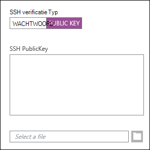
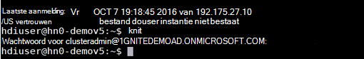
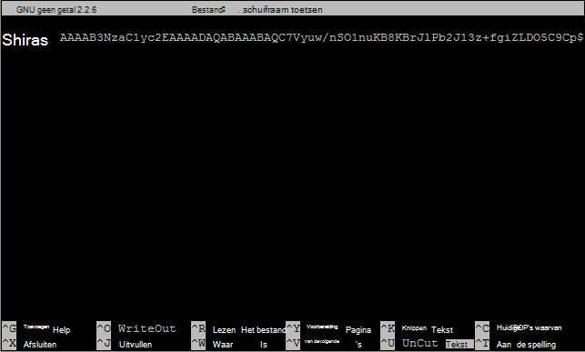

<properties
   pageTitle="SSH-sleutels gebruiken met Linux-gebaseerde Hadoop van Linux, Unix of OS X | Microsoft Azure"
   description=" Toegang tot Linux-gebaseerde HDInsight met behulp van Secure Shell (SSH). Dit document bevat informatie over het gebruik van SSH met HDInsight van Linux, Unix of OS X-clients."
   services="hdinsight"
   documentationCenter=""
   authors="Blackmist"
   manager="jhubbard"
   editor="cgronlun"
    tags="azure-portal"/>

<tags
   ms.service="hdinsight"
   ms.devlang="na"
   ms.topic="get-started-article"
   ms.tgt_pltfrm="na"
   ms.workload="big-data"
   ms.date="09/13/2016"
   ms.author="larryfr"/>

#<a name="use-ssh-with-linux-based-hadoop-on-hdinsight-from-linux-unix-or-os-x"></a>SSH gebruiken met Linux-gebaseerde Hadoop op HDInsight van Linux, Unix of OS X

> [AZURE.SELECTOR]
- [Windows](hdinsight-hadoop-linux-use-ssh-windows.md)
- [Linux, Unix, OS X](hdinsight-hadoop-linux-use-ssh-unix.md)

[Secure Shell (SSH)](https://en.wikipedia.org/wiki/Secure_Shell) kunt u op afstand uitvoeren van bewerkingen op HDInsight Linux gebaseerde clusters met een opdrachtregel-interface. Dit document bevat informatie over het gebruik van SSH met HDInsight van Linux, Unix of OS X-clients.

> [AZURE.NOTE] De stappen in dit artikel wordt ervan uitgegaan dat u een client voor Linux, Unix of OS X. Deze stappen kunnen worden uitgevoerd op een Windows-client als u een pakket dat u hier hebt geïnstalleerd `ssh` en `ssh-keygen`, zoals [Bash op Ubuntu op Windows](https://msdn.microsoft.com/commandline/wsl/about).
>
> Als u niet geïnstalleerd op uw Windows-client SSH hebt, gebruik de stappen in [Gebruik SSH met Linux-gebaseerde HDInsight (Hadoop) van Windows](hdinsight-hadoop-linux-use-ssh-windows.md) voor informatie over het installeren en gebruiken van stopverf.

##<a name="prerequisites"></a>Vereisten

* **SSH-keygen** en **ssh** voor Linux, Unix en OS X-clients. Deze hulpprogramma's worden gewoonlijk geleverd met het besturingssysteem of via het pakket management system.

* Een moderne webbrowser die HTML5 ondersteunt.

OR

* [Azure CLI](../xplat-cli-install.md).

    [AZURE.INCLUDE [use-latest-version](../../includes/hdinsight-use-latest-cli.md)] 

##<a name="what-is-ssh"></a>Wat is SSH?

SSH is een hulpprogramma voor het aanmelden bij en op afstand, opdrachten uitvoeren op een externe server. Met de Linux-gebaseerde HDInsight SSH maakt een versleutelde verbinding met het cluster headnode en biedt een opdrachtregel waarmee u opdrachten invoeren. Opdrachten worden vervolgens rechtstreeks op de server uitgevoerd.

###<a name="ssh-user-name"></a>SSH-gebruikersnaam

Een SSH-gebruikersnaam is de naam die u gebruikt voor de verificatie van de cluster HDInsight. Wanneer u een SSH-gebruikersnaam tijdens het maken van het cluster opgeven, wordt deze gebruiker gemaakt op alle knooppunten in het cluster. Als het cluster is gemaakt, kunt u deze gebruikersnaam verbinding maken met het cluster HDInsight headnodes. Van de headnodes, kunt u vervolgens aansluiten op de knooppunten van de individuele werknemer.

###<a name="ssh-password-or-public-key"></a>SSH wachtwoord of openbare sleutel

Een SSH-gebruiker kan een wachtwoord of een openbare sleutel gebruiken voor verificatie. Een wachtwoord is een string van de tekst die u aanbrengt, terwijl een openbare sleutel deel van een cryptografisch sleutelpaar dat wordt gegenereerd uitmaakt om u een unieke identificatie.

Een sleutel is veiliger dan een wachtwoord, maar er moet extra stappen uitvoeren om de sleutel te genereren en u moet de bestanden met de sleutel op een veilige locatie onderhouden. Als iedereen toegang tot de belangrijkste bestanden krijgt, krijgen zij toegang tot uw account. Of als u de belangrijkste bestanden kwijtraakt, wordt u niet aanmelden bij uw account.

Een paar sleutels bestaat uit een openbare sleutel (die wordt verzonden naar de server HDInsight) en een persoonlijke sleutel (die is opgeslagen op uw clientcomputer.) Wanneer u verbinding met de HDInsight-server via SSH maakt, de SSH client gebruikt de persoonlijke sleutel op uw computer om te verifiëren met de server.

##<a name="create-an-ssh-key"></a>Maak een SSH-sleutel

Gebruik de volgende informatie als u van plan bent over het gebruik van SSH-sleutels in het cluster. Als u van plan bent over het gebruik van een wachtwoord, kunt u deze sectie overslaan.

1. Open een terminal sessie en gebruik de volgende opdracht om te zien of er eventuele bestaande SSH-sleutels:

        ls -al ~/.ssh

    Zoek de volgende bestanden in een map weergeeft. Dit zijn de algemene namen voor openbare SSH-sleutels.

    * id\_dsa.pub
    * id\_ecdsa.pub
    * id\_ed25519.pub
    * id\_rsa.pub

2. Als u niet wilt gebruiken van een bestaand bestand, of u geen bestaande SSH-sleutels hebt, gebruikt u de volgende voor het genereren van een nieuw bestand:

        ssh-keygen -t rsa

    U wordt gevraagd de volgende informatie:

    * De locatie van het bestand - standaard de locatie ~/.ssh/id\_rsa.
    * Een wachtwoordzin -, moet u deze opnieuw invoeren.

        > [AZURE.NOTE] Wij raden u ook een wachtwoordzin beveiligen voor de sleutel. Als u de wachtwoordzin vergeet, is er echter geen manier om te herstellen.

    Nadat de opdracht is voltooid, hebt u twee nieuwe bestanden, de persoonlijke sleutel (bijvoorbeeld, **id\_rsa**) en de openbare sleutel (bijvoorbeeld, **id\_rsa.pub**).

##<a name="create-a-linux-based-hdinsight-cluster"></a>Een HDInsight op basis van Linux-cluster maken

Bij het maken van een HDInsight op basis van Linux-cluster, moet u de openbare sleutel die eerder is gemaakt opgeven. Er zijn twee manieren voor het maken van een cluster HDInsight van Linux, Unix of OS X-clients:

* Een portal op het web **Portal Azure** - gebruikt voor het maken van het cluster.

* Opdrachtregelopdrachten **CLI voor Mac, Linux en Windows azure** - gebruikt voor het maken van het cluster.

Elk van deze methoden moet een wachtwoord of een openbare sleutel. Zie voor volledige informatie over het maken van een HDInsight op basis van Linux-cluster [HDInsight bepaling Linux gebaseerde clusters](hdinsight-hadoop-provision-linux-clusters.md).

###<a name="azure-portal"></a>Azure Portal

Wanneer u de [Azure Portal] [ preview-portal] een Linux-gebaseerde HDInsight als cluster wilt maken, moet u een **SSH gebruikersnaam**invoeren en selecteer **Openbare SSH-sleutel**of **wachtwoord** op te geven.

Als u **Openbare SSH-sleutel**selecteert, kunt u de openbare sleutel (opgenomen in het bestand met de extensie **.pub** ) in het veld __SSH PublicKey__ plakken of selecteer __een bestand selecteren__ om te bladeren en selecteer het bestand met openbare sleutel.



> [AZURE.NOTE] Het sleutelbestand is gewoon een tekstbestand. De inhoud moeten worden met de volgende strekking weergegeven:
> ```
ssh-rsa AAAAB3NzaC1yc2EAAAADAQABAAABAQCelfkjrpYHYiks4TM+r1LVsTYQ4jAXXGeOAF9Vv/KGz90pgMk3VRJk4PEUSELfXKxP3NtsVwLVPN1l09utI/tKHQ6WL3qy89WVVVLiwzL7tfJ2B08Gmcw8mC/YoieT/YG+4I4oAgPEmim+6/F9S0lU2I2CuFBX9JzauX8n1Y9kWzTARST+ERx2hysyA5ObLv97Xe4C2CQvGE01LGAXkw2ffP9vI+emUM+VeYrf0q3w/b1o/COKbFVZ2IpEcJ8G2SLlNsHWXofWhOKQRi64TMxT7LLoohD61q2aWNKdaE4oQdiuo8TGnt4zWLEPjzjIYIEIZGk00HiQD+KCB5pxoVtp user@system
> ```

Hiermee maakt u een aanmelding voor de opgegeven gebruiker met behulp van het wachtwoord of de openbare sleutel die u opgeeft.

###<a name="azure-command-line-interface-for-mac-linux-and-windows"></a>Opdrachtregel-Interface voor Mac, Linux en Windows Azure

U kunt de [CLI voor Mac, Linux en Windows Azure](../xplat-cli-install.md) een nieuw cluster maken met behulp van de `azure hdinsight cluster create` opdracht.

Zie voor meer informatie over het gebruik van deze opdracht [bepaling Hadoop Linux-clusters in HDInsight met aangepaste opties](hdinsight-hadoop-provision-linux-clusters.md).

##<a name="connect-to-a-linux-based-hdinsight-cluster"></a>Verbinding maken met een cluster van Linux-gebaseerde HDInsight

U het SSH verbinding maken met de headnode van het cluster door de naam en de gebruikersnaam van een terminal sessie:

* **Adres van de SSH** - er zijn twee adressen die kunnen worden gebruikt om verbinding met een cluster met behulp van SSH:

    * **Verbinding maken met de headnode**: de naam van het cluster, gevolgd door **-ssh.azurehdinsight.net**. Bijvoorbeeld **mijncluster ssh.azurehdinsight.net**.
    
    * **Verbinding maken met het randknooppunt**: als uw cluster Server op HDInsight R, het cluster bevat ook een randknooppunt die toegankelijk zijn met behulp van **RServer.CLUSTERNAME.ssh.azurehdinsight.net**, waarbij de __CLUSTERNAAM__ de naam van het cluster is.

* **Gebruikersnaam** - de SSH gebruikersnaam die u bij het maken van het cluster.

In het volgende voorbeeld wordt een verbinding met de primaire headnode van **mijncluster** als de gebruiker **me**:

    ssh me@mycluster-ssh.azurehdinsight.net

Als u een wachtwoord voor de gebruikersaccount gebruikt, wordt u gevraagd het wachtwoord op te geven.

Als u een SSH-sleutel die is beveiligd met een wachtwoordzin gebruikt, wordt u gevraagd de wachtwoordzin opgeven. SSH zal anders proberen automatisch geverifieerd met behulp van een van de lokale persoonlijke sleutels op de client.

> [AZURE.NOTE] Als SSH wordt niet automatisch geverifieerd met de juiste persoonlijke sleutel, gebruikt u de parameter **-i** en geef het pad op naar de persoonlijke sleutel. In het volgende voorbeeld wordt de persoonlijke sleutel van het geladen `~/.ssh/id_rsa`:
>
> `ssh -i ~/.ssh/id_rsa me@mycluster-ssh.azurehdinsight.net`

Als u verbinding maakt met het adres voor de headnode en er geen poort is opgegeven, standaard SSH poort 22, maakt verbinding met de primaire headnode op de cluster HDInsight. Als u poort 23 gebruikt, maakt u verbinding met de secundaire. Zie voor meer informatie over de headnodes, [beschikbaarheid en betrouwbaarheid van Hadoop clusters in het HDInsight](hdinsight-high-availability-linux.md).

###<a name="connect-to-worker-nodes"></a>Verbinding maken met de knooppunten van de werknemer

De werknemer knooppunten zijn niet rechtstreeks toegankelijk van buiten het datacenter Azure maar toegankelijk zijn vanuit de headnode van het cluster via SSH.

Als u een SSH-sleutel gebruikt voor de verificatie van uw account, moet u de volgende stappen uitvoeren op de client:

1. Open een teksteditor, `~/.ssh/config`. Als dit bestand niet bestaat, kunt u deze maken door te voeren `touch ~/.ssh/config` in de terminal.

2. Voeg het volgende toe aan het bestand. *CLUSTERNAAM* vervangen door de naam van het cluster HDInsight.

        Host CLUSTERNAME-ssh.azurehdinsight.net
          ForwardAgent yes

    Hiermee configureert u de SSH-agent forwarding voor uw cluster HDInsight.

3. SSH-agent doorsturen met behulp van de volgende opdracht bij de terminal van de test:

        echo "$SSH_AUTH_SOCK"

    Dit moet geven als resultaat informatie met de volgende strekking:

        /tmp/ssh-rfSUL1ldCldQ/agent.1792

    Als er wordt niets geretourneerd, betekent dit dat **ssh-agent** wordt niet uitgevoerd. Raadpleeg de documentatie bij uw besturingssysteem voor specifieke stappen voor het installeren en configureren van **ssh-agent**of [met behulp van ssh-agent met ssh](http://mah.everybody.org/docs/ssh)zien.

4. Nadat u hebt gecontroleerd dat **ssh-agent** wordt uitgevoerd, gebruikt u de volgende uw persoonlijke SSH-sleutel toevoegen aan de agent:

        ssh-add ~/.ssh/id_rsa

    Als de persoonlijke sleutel is opgeslagen in een ander bestand, vervangt u `~/.ssh/id_rsa` door het pad naar het bestand.

De volgende stappen uit om verbinding met de werknemer knooppunten van het cluster te gebruiken.

> [AZURE.IMPORTANT] Als u een SSH-sleutel gebruikt voor de verificatie van uw account, moet u de vorige stappen om te controleren of deze agent forwarding werkt voltooien.

1. Verbinding maken met het cluster HDInsight via SSH zoals eerder is beschreven.

2. Zodra u verbinding hebt gemaakt, gebruikt u de volgende voor een lijst van de knooppunten in het cluster. *ADMINPASSWORD* vervangen door het wachtwoord voor de beheerdersaccount van uw cluster. *CLUSTERNAAM* vervangen door de naam van het cluster.

        curl --user admin:ADMINPASSWORD https://CLUSTERNAME.azurehdinsight.net/api/v1/hosts

    Het resultaat is informatie in JSON-indeling voor de knooppunten in het cluster, met inbegrip van `host_name`, waarin de FQDN-naam (Fully Qualified Domain Name) voor elk knooppunt. Het volgende is een voorbeeld van een `host_name` post die wordt geretourneerd door de **curl-** opdracht:

        "host_name" : "workernode0.workernode-0-e2f35e63355b4f15a31c460b6d4e1230.j1.internal.cloudapp.net"

3. Zodra u een lijst van de werknemer-knooppunten dat u verbinding wilt maken hebt, gebruik de volgende opdracht bij de SSH sessie op de server voor het openen van een verbinding met een knooppunt van de werknemer:

        ssh USERNAME@FQDN

    Vervang *gebruikersnaam* met uw gebruikersnaam SSH en *FQDN-naam* met de FQDN-naam voor het knooppunt van de werknemer. Bijvoorbeeld `workernode0.workernode-0-e2f35e63355b4f15a31c460b6d4e1230.j1.internal.cloudapp.net`.

    > [AZURE.NOTE] Als u een wachtwoord voor verificatie met de SSH-sessie, wordt u gevraagd het wachtwoord opnieuw invoeren. Als u een SSH-sleutel gebruikt, moet de verbinding voltooien zonder enige waarschuwing.

4. Zodra de sessie tot stand is gebracht, wordt het terminalvenster verandert van `username@hn#-clustername` op `username@wk#-clustername` om aan te geven dat u met het knooppunt voor de werknemer verbonden bent. Alle opdrachten die u op dit moment uitvoert wordt uitgevoerd op het knooppunt van de werknemer.

4. Zodra u klaar bent met het uitvoeren van acties op het knooppunt van de werknemer, de `exit` opdracht de sessie aan het knooppunt van de werknemer te sluiten. Hiermee herstelt u de `username@hn#-clustername` vragen.

## <a name="connect-to-a-domain-joined-hdinsight-cluster"></a>Verbinding maken met een cluster HDInsight deel uitmaakt van een domein

[HDInsight domein behoren](hdinsight-domain-joined-introduction.md) geïntegreerd Kerberos met Hadoop in HDInsight. Omdat de SSH gebruiker niet een Active Directory-domein is, kan niet deze gebruikersaccount Hadoop opdrachten van SSH shell op een domein behoren cluster direct uitvoeren. U moet eerst *kinit* uitvoeren. 

**Component uitvoeren van query's op een domein behoren HDInsight-cluster met behulp van SSH**

1. Verbinding maken met een domein behoren HDInsight-cluster met behulp van SSH.  Zie voor instrocutions, [verbinding maken met een cluster van Linux-gebaseerde HDInsight](#connect-to-a-linux-based-hdinsight-cluster).
2. Kinit uitvoeren. Er wordt u gevraagd een gebruikersnaam en domein domein gebruikerswachtwoord. Domeingebruikers HDInsight clusters deel uitmaakt van een domein configureren voor meer informatie over, Zie [de clusters deel uitmaakt van een domein configureren HDInisight](hdinsight-domain-joined-configure.md).

    
3. Open het onderdeel console door te voeren:

        hive

    U kunt vervolgens de component opdrachten uitvoeren.

##<a name="add-more-accounts"></a>Meer accounts toevoegen

1. Een nieuwe openbare en persoonlijke sleutel voor de nieuwe gebruikersaccount genereren zoals beschreven in de sectie [een SSH-sleutel maken](#create-an-ssh-key-optional) .

    > [AZURE.NOTE] De persoonlijke sleutel moet worden gegenereerd op een client die de gebruiker verbinding maken met het cluster of veilig worden overgebracht naar een dergelijke client nadat het is gemaakt.

1. Bij een SSH-sessie aan het cluster, de nieuwe gebruiker toevoegen met de volgende opdracht:

        sudo adduser --disabled-password <username>

    Dit zal een nieuwe gebruikersaccount maken, maar wordt wachtwoordverificatie uitgeschakeld.

2. Maak de map en de bestanden voor het opslaan van de sleutel met behulp van de volgende opdrachten:

        sudo mkdir -p /home/<username>/.ssh
        sudo touch /home/<username>/.ssh/authorized_keys
        sudo nano /home/<username>/.ssh/authorized_keys

3. Als de nano editor wordt geopend, kopieer en plak de inhoud van de openbare sleutel voor de nieuwe gebruikersaccount. Gebruik **Ctrl-X** ten slotte, sla het bestand op en sluit de editor af.

    

4. Gebruik de volgende opdracht als u eigenaar van de .ssh map en de inhoud aan de nieuwe gebruikersaccount wijzigen:

        sudo chown -hR <username>:<username> /home/<username>/.ssh

5. Nu moet u toegang hebben tot de server met de nieuwe gebruikersaccount en de persoonlijke sleutel.

##<a id="tunnel"></a>SSH tunneling

SSH kan worden gebruikt voor lokale aanvragen, zoals webverzoeken aan het cluster HDInsight tunnel. De aanvraag wordt daarna aan de aangevraagde resource als deze afkomstig van de cluster HDInsight headnode zijn.

> [AZURE.IMPORTANT] Een SSH-tunnel is vereist voor toegang tot de on line gebruikersinterface voor bepaalde services Hadoop. Bijvoorbeeld, de gebruikersinterface van project geschiedenis of de resourcemanager UI is alleen toegankelijk via een SSH-tunnel.

Zie [Gebruik SSH Tunneling voor toegang tot Ambari web UI, ResourceManager, JobHistory, NameNode, Oozie, en andere web UI van](hdinsight-linux-ambari-ssh-tunnel.md)voor meer informatie over het maken en gebruiken van een SSH-tunnel.

##<a name="next-steps"></a>Volgende stappen

Nu u weet hoe om te verifiëren met behulp van een SSH-sleutel, leren gebruiken MapReduce met Hadoop op HDInsight.

* [Gebruik component met HDInsight](hdinsight-use-hive.md)

* [Varken met HDInsight gebruiken](hdinsight-use-pig.md)

* [MapReduce taken gebruiken met HDInsight](hdinsight-use-mapreduce.md)

[preview-portal]: https://portal.azure.com/
