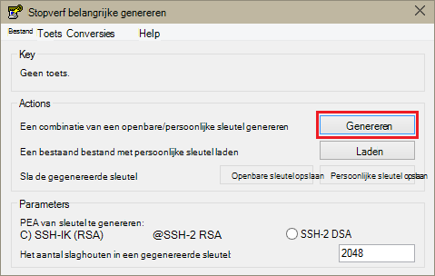
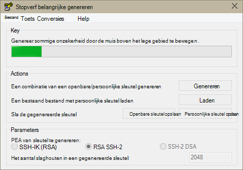
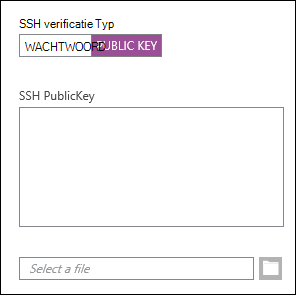
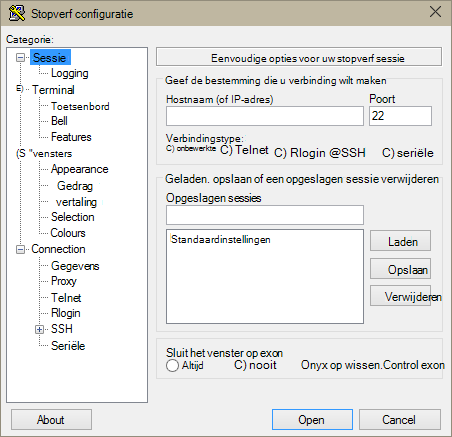
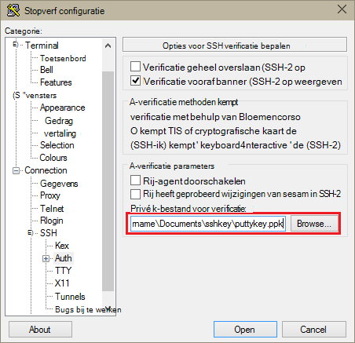
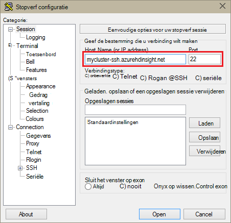
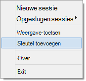
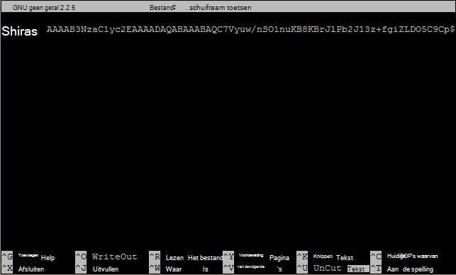

<properties
   pageTitle="SSH toetsen gebruiken met Hadoop op Linux gebaseerde clusters vanuit Windows | Microsoft Azure"
   description="Informatie over het maken en SSH toetsen gebruiken om te verifiëren met HDInsight Linux gebaseerde clusters. Verbinding maken met clusters vanuit Windows-clients met behulp van de stopverf SSH-client."
   services="hdinsight"
   documentationCenter=""
   authors="Blackmist"
   manager="jhubbard"
   editor="cgronlun"
    tags="azure-portal"/>

<tags
   ms.service="hdinsight"
   ms.devlang="na"
   ms.topic="get-started-article"
   ms.tgt_pltfrm="na"
   ms.workload="big-data"
   ms.date="08/30/2016"
   ms.author="larryfr"/>

#SSH gebruiken met Linux gebaseerde Hadoop op HDInsight vanuit Windows

> [AZURE.SELECTOR]
- [Windows](hdinsight-hadoop-linux-use-ssh-windows.md)
- [Linux, Unix OS X](hdinsight-hadoop-linux-use-ssh-unix.md)

[Secure Shell (SSH)](https://en.wikipedia.org/wiki/Secure_Shell) kunt u op afstand bewerkingen uitvoeren op uw HDInsight Linux gebaseerde clusters opdrachtregel. In dit document bevat informatie over het verbinding maken met HDInsight vanuit Windows-clients met de stopverf SSH-client.

> [AZURE.NOTE] De stappen in dit artikel wordt ervan uitgegaan dat u gebruikt een Windows-client. Als u een Linux, Unix of OS X-client gebruikt, raadpleegt u [Gebruik SSH met Linux gebaseerde Hadoop op HDInsight uit Linux, Unix, of OS X](hdinsight-hadoop-linux-use-ssh-unix.md).
>
> Als u Windows 10 en [Bash op Ubuntu op Windows](https://msdn.microsoft.com/commandline/wsl/about)gebruikt, kunt u de stappen in het [Gebruik van SSH met Linux gebaseerde Hadoop op HDInsight uit Linux, Unix, of OS X](hdinsight-hadoop-linux-use-ssh-unix.md) -document gebruiken.

##Vereisten voor

* **Stopverf** en **PuTTYGen** voor Windows-clients. Deze hulpprogramma's zijn [http://www.chiark.greenend.org.uk/~sgtatham/putty/download.html](http://www.chiark.greenend.org.uk/~sgtatham/putty/download.html)beschikbaar.

* Een modern webbrowser die ondersteuning biedt voor HTML5.

OF-BEWERKING

* [Azure CLI](../xplat-cli-install.md).

    [AZURE.INCLUDE [use-latest-version](../../includes/hdinsight-use-latest-cli.md)] 

##Wat is SSH?

SSH is een hulpprogramma voor aanmelden bij en televergaderen, opdrachten uitvoeren op een externe server. Met Linux gebaseerde HDInsight SSH maakt een versleutelde verbinding met het hoofd knooppunt en biedt een opdrachtregel die u typt in opdrachten gebruiken. Opdrachten worden vervolgens rechtstreeks op de server uitgevoerd.

###SSH gebruikersnaam in te voeren

Een gebruikersnaam in te voeren SSH is de naam die u gebruikt om te verifiëren met het cluster HDInsight. Wanneer u een gebruikersnaam in te voeren SSH tijdens het maken van cluster opgeeft, wordt deze gebruiker wordt gemaakt op alle knooppunten in het cluster. Nadat het cluster is gemaakt, kunt u deze gebruikersnaam verbinding maken met het hoofd knooppunten HDInsight. Vanaf het hoofd knooppunten, kunt u vervolgens verbinding met de knooppunten afzonderlijke werknemer.

###SSH wachtwoord of openbare sleutel

Een gebruiker SSH kunt u een wachtwoord of de openbare sleutel gebruiken voor verificatie. Een wachtwoord is alleen een tekenreeks van de tekst die u aanbrengt, terwijl een openbare sleutel deel uit van cryptografische combinatie van een sleutel maakt identificeert u gegenereerd.

Een sleutel is veiliger dan een wachtwoord, maar deze zijn extra stappen voor het genereren van de toets vereist en moet u voor het behoud van de bestanden met de toets op een veilige locatie. Als iemand toegang tot de belangrijkste bestanden krijgt, worden ze toegang tot uw account. Of als u de belangrijkste bestanden kwijtraakt, is niet mogelijk aanmelden bij uw account.

Combinatie van een sleutel bestaat uit een openbare sleutel (dat wordt verzonden naar de server HDInsight) en een persoonlijke sleutel (dat wordt bewaard op de clientcomputer.) Wanneer u verbinding met de HDInsight-server via SSH maakt, wordt de client SSH de persoonlijke sleutel gebruiken op uw computer om te verifiëren met de server.

##Maken van een sleutel SSH

Gebruik de volgende informatie als u van plan bent over het gebruik van SSH toetsen met uw cluster. Als u van plan met een wachtwoord bent, kunt u dit gedeelte overslaan.

1. Open PuTTYGen.

2. Selecteer **SSH-2-RSA**voor **Type sleutel wilt genereren**, en klik op **genereren**.

    

3. Houd de muis rond in het gebied onder de voortgangsbalk, totdat de balk. Als de muisaanwijzer genereert willekeurige gegevens die worden gebruikt om de sleutel te genereren.

    

    Zodra de sleutel is gegenereerd, kan de openbare sleutel, worden weergegeven.

4. U kunt voor extra beveiliging, een wachtwoordzin invoeren in het veld **toets wachtwoordzin** en typt u dezelfde waarde in het veld **bevestigen wachtwoordzin** .

    

    > [AZURE.NOTE] Het is raadzaam dat u een secure wachtwoordzin voor de sleutel gebruiken. Als u de wachtwoordzin vergeet, is er echter geen manier om deze herstellen.

5. Klik op **persoonlijke sleutel opslaan** om op te slaan de sleutel naar een bestand **.ppk** . Deze toets wordt gebruikt om te verifiëren aan uw cluster Linux gebaseerde HDInsight.

    > [AZURE.NOTE] Als deze kan worden gebruikt voor toegang tot uw cluster Linux gebaseerde HDInsight, moet u deze toets opslaan op een veilige locatie.

6. Klik op de **openbare sleutel opslaan** om de sleutel opslaan als een **txt** -bestand. Hiermee kunt u naar de openbare sleutel in de toekomst opnieuw gebruiken wanneer u extra HDInsight Linux gebaseerde clusters maakt.

    > [AZURE.NOTE] De openbare sleutel wordt ook weergegeven aan de bovenkant van PuTTYGen. U kunt met de rechtermuisknop op dit veld de waarde kopiëren en plak deze in een formulier bij het maken van een cluster met behulp van de Azure-Portal.

##Een cluster Linux gebaseerde HDInsight maken

Wanneer u een cluster Linux gebaseerde HDInsight maakt, moet u opgeven dat de openbare sleutel eerder hebt gemaakt. Er zijn twee manieren een cluster HDInsight Linux gebaseerde maken vanuit Windows-clients:

* **Azure-Portal** - maakt gebruik van een portal web gebaseerde de cluster maken.

* **Azure CLI voor Mac, Linux en Windows** - gebruik opdrachtregel opdrachten voor het maken van het cluster.

Elk van de volgende manieren vereist de openbare sleutel. Zie [HDInsight inrichten Linux gebaseerde clusters](hdinsight-hadoop-provision-linux-clusters.md)voor volledige informatie over het maken van een cluster Linux gebaseerde HDInsight.

###Azure-Portal

Bij gebruik van de [Portal van Azure] [ preview-portal] als u wilt een cluster Linux gebaseerde HDInsight maakt, moet u een **SSH gebruikersnaam**Voer en selecteer **wachtwoord** of **Openbare SSH-sleutel**op te geven.

Als u **Openbare SSH-sleutel**selecteert, kunt u op de openbare sleutel plakken (weergegeven in de __openbare sleutel voor deze plakken in OpenSSH geautoriseerd\_toetsen bestand__ veld in PuttyGen,) in het veld __SSH PublicKey__ of selecteer __een bestand hebt geselecteerd__ om te bladeren en selecteer het bestand met de openbare sleutel.

Hiermee wordt gemaakt van een aanmelding voor de opgegeven gebruiker, en kunt u wachtwoordverificatie of SSH belangrijke verificatie.

###Azure opdrachtregel-Interface voor Mac, Linux en Windows

U kunt de [Azure CLI voor Mac, Linux en Windows](../xplat-cli-install.md) maken van een nieuw cluster met behulp van de `azure hdinsight cluster create` opdracht.

Zie voor meer informatie over het gebruik van deze opdracht [inrichten Hadoop Linux clusters in HDInsight met aangepaste opties](hdinsight-hadoop-provision-linux-clusters.md).

##Verbinding maken met een cluster Linux gebaseerde HDInsight

1. Open stopverf.

    

2. Als u een sleutel SSH opgegeven wanneer u uw gebruikersaccount hebt gemaakt, moet u de volgende stap uit om te selecteren van de persoonlijke sleutel wilt gebruiken wanneer u geverifieerd bij het cluster uitvoeren:

    In de **categorie** **verbinding**uitvouwen, **SSH**uitvouwen en selecteer **Auth**. Tot slot op **Bladeren** en selecteer het bestand .ppk met uw persoonlijke sleutel.

    

3. Selecteer bij **categorie** **sessie**. Voer in het scherm **eenvoudige opties voor uw stopverf sessie** het SSH-adres van uw HDInsight-server in het veld **hostnaam (of IP-adres)** . Er zijn twee mogelijke SSH adressen die mag u wanneer u verbinding maakt met een cluster:

    * __Hoofd knooppuntadres__: als u wilt verbinden met het hoofd knooppunt van de cluster, gebruikt u de naam van uw cluster, vervolgens **-ssh.azurehdinsight.net**. Bijvoorbeeld: **mijncluster-ssh.azurehdinsight.net**.
    
    * __Rand knooppuntadres__: als u verbinding met een R-Server op HDInsight cluster maakt, kunt u verbinding maken met het R-Server randknooppunt via het adres __RServer.CLUSTERNAME.ssh.azurehdinsight.net__, waar CLUSTERNAAM de naam van uw cluster is. Bijvoorbeeld: __RServer.mycluster.ssh.azurehdinsight.net__.

    

4. Als u wilt de verbindingsgegevens voor toekomstig gebruik opslaan, typ een naam voor deze verbinding onder **Sessies opgeslagen**en klik vervolgens op **Opslaan**. De verbinding worden, toegevoegd aan de lijst met opgeslagen sessies.

5. Klik op **openen** verbinding maken met de cluster.

    > [AZURE.NOTE] Als dit de eerste keer dat u hebt verbonden met het cluster, ontvangt u een melding voor een waardepapier. Dit is normaal. Selecteer **Ja** cache van de server RSA2-toets om door te gaan.

6. Wanneer u wordt gevraagd, voert u de gebruiker die u hebt ingevoerd wanneer u het cluster hebt gemaakt. Als u een wachtwoord hebt opgegeven voor de gebruiker, wordt u gevraagd deze ook invoeren.

> [AZURE.NOTE] De bovenstaande stappen wordt ervan uitgegaan dat u gebruikt poort 22, die verbinding met de primaire headnode op het cluster HDInsight maken wordt. Als u poort 23 gebruikt, maakt u verbinding met de secundaire. Zie voor meer informatie over het hoofd knooppunten, [beschikbaarheid en betrouwbaarheid van Hadoop clusters in HDInsight](hdinsight-high-availability-linux.md).

###Verbinding maken met werknemer knooppunten

De werknemer knooppunten zijn niet rechtstreeks toegankelijk zijn vanuit buiten het Azure datacenter, maar ze zijn toegankelijk vanaf het hoofd knooppunt via SSH.

Als u een sleutel SSH opgegeven wanneer u uw gebruikersaccount hebt gemaakt, moet u de volgende stappen uit als u wilt de persoonlijke sleutel gebruiken bij het verifiëren met het cluster als u verbinding maakt met de knooppunten werknemer wilt uitvoeren.

1. Installeer Bloemencorso vanaf [http://www.chiark.greenend.org.uk/~sgtatham/putty/download.html](http://www.chiark.greenend.org.uk/~sgtatham/putty/download.html). Dit hulpprogramma wordt gebruikt voor SSH toetsen voor stopverf in cache.

2. Bloemencorso uitvoeren. Dit wordt verkleind tot een pictogram in het systeemvak status. Met de rechtermuisknop op het pictogram en selecteer **Sleutel toevoegen**.

    

3. Wanneer het bladerdialoogvenster wordt weergegeven, selecteert u het .ppk-bestand met de toets en klik vervolgens op **openen**. Hiermee wordt de sleutel toegevoegd aan Bloemencorso, die wordt bieden aan stopverf, wanneer u verbinding maakt met het cluster.

    > [AZURE.IMPORTANT] Als u een sleutel SSH gebruikt om uw account te beveiligen, moet u de vorige stappen uitvoeren voordat u kunt verbinding maken met werknemer knooppunten.

4. Open stopverf.

5. Als u een sleutel SSH gebruikt om te verifiëren, in de sectie **categorie** **verbinding**uitvouwen, **SSH**uitvouwen en selecteer vervolgens **Auth**.

    Klik in de sectie **parameters voor verificatie** inschakelen **toestaan agent doorsturen**. Hierdoor stopverf automatisch de certificaat-authenticatie via de verbinding om aan te geven het hoofd knooppunt wanneer u verbinding maakt met werknemer knooppunten.

    

6. Verbinding maken met het cluster zoals eerder is beschreven. Als u een SSH-sleutel voor verificatie gebruikt, u hoeft niet te Selecteer de sleutel: de SSH-sleutel toegevoegd aan Bloemencorso wordt gebruikt om te verifiëren met het cluster.

7. Nadat de verbinding tot stand is gebracht, gebruikt u de volgende handelingen uit om een lijst van de knooppunten in uw cluster te halen. *BEHEERDERSWACHTWOORD* vervangen door het wachtwoord voor uw cluster-beheerdersaccount. *CLUSTERNAAM* vervangen door de naam van uw cluster.

        curl --user admin:ADMINPASSWORD https://CLUSTERNAME.azurehdinsight.net/api/v1/hosts

    Hiermee herstelt u gegevens in de indeling van JSON voor de knooppunten in het cluster, inclusief `host_name`, die de FQDN-naam (Fully Qualified Domain Name) voor elk knooppunt bevat. De volgende is een voorbeeld van een `host_name` vermelding die het resultaat van de opdracht **omslaan** :

        "host_name" : "workernode0.workernode-0-e2f35e63355b4f15a31c460b6d4e1230.j1.internal.cloudapp.net"

8. Nadat u een lijst van de werknemer knooppunten die u verbinding wilt maken hebt, gebruikt u de volgende opdracht uit de stopverf sessie om te openen van een verbinding met een medewerker knooppunt:

        ssh USERNAME@FQDN

    *Gebruikersnaam* vervangen door uw SSH gebruikersnaam in te voeren en de *FQDN-naam* met de FQDN-naam voor het knooppunt werknemer. Bijvoorbeeld `workernode0.workernode-0-e2f35e63355b4f15a31c460b6d4e1230.j1.internal.cloudapp.net`.

    > [AZURE.NOTE] Als u een wachtwoord verificatie gebruikt uw SSH-sessie, wordt u gevraagd het wachtwoord opnieuw invoeren. Als u een sleutel SSH gebruikt, moet de verbinding zonder eventuele aanwijzingen zijn voltooid.

9. Zodra de sessie is gebracht, de prompt voor uw stopverf sessie wordt gewijzigd van `username@hn#-clustername` naar `username@wn#-clustername` om aan te geven dat u met het knooppunt werknemer verbonden bent. Alle opdrachten die u op dit moment uitvoert kunnen worden uitgevoerd op het knooppunt werknemer.

10. Wanneer u klaar bent met het uitvoeren van acties op het knooppunt werknemer, via de `exit` opdracht de sessie naar het knooppunt werknemer sluiten. Hiermee herstelt u de `username@hn#-clustername` prompt.

##Meer accounts toevoegen

Als u meer accounts toevoegen aan uw cluster wilt, moet u de volgende stappen uitvoeren:

1. Genereer een nieuwe openbare en persoonlijke sleutel voor de nieuwe gebruikersaccount zoals eerder is beschreven.

2. Toevoegen vanuit een SSH-sessie met het cluster, de nieuwe gebruiker met de volgende opdracht uit:

        sudo adduser --disabled-password <username>

    Hiermee wordt een nieuwe gebruikersaccount maken, maar schakelt wachtwoordverificatie.

3. Maak de map en bestanden met ingedrukt met behulp van de volgende opdrachten:

        sudo mkdir -p /home/<username>/.ssh
        sudo touch /home/<username>/.ssh/authorized_keys
        sudo nano /home/<username>/.ssh/authorized_keys

4. Wanneer de nano-editor wordt geopend, kopiëren en plakken in de inhoud van de openbare sleutel voor de nieuwe gebruikersaccount. Gebruik **CTRL + X** ten slotte naar het bestand opslaan en sluit de editor af.

    

5. Gebruik de volgende opdracht eigenaar van het .ssh map en de inhoud naar de nieuwe gebruikersaccount wijzigen:

        sudo chown -hR <username>:<username> /home/<username>/.ssh

6. U moet nu mogelijk om te verifiëren bij de server met de nieuwe gebruikersaccount en persoonlijke sleutel.

##SSH tunneling

SSH kan worden gebruikt voor tunnel lokale aanvragen, zoals webaanvragen, voor het cluster HDInsight. Het verzoek wordt vervolgens naar de gewenste bron worden gerouteerd alsof deze afkomstig op het hoofd knooppunt van HDInsight zijn.

> [AZURE.IMPORTANT] Een tunnel SSH is vereist voor toegang tot de web-gebruikersinterface voor sommige Hadoop-services. Bijvoorbeeld kan zowel de taak geschiedenis UI of resourcemanager UI alleen worden geopend met een tunnel SSH.

Zie [Gebruik SSH tunnel naar Ambari web UI, ResourceManager, JobHistory, NameNode, Oozie, en andere web van UI openen](hdinsight-linux-ambari-ssh-tunnel.md)voor meer informatie over het maken en gebruiken van een tunnel SSH.

##Volgende stappen

Nu u weet hoe om te verifiëren met behulp van een sleutel SSH, leren hoe u MapReduce met Hadoop op HDInsight.

* [Component gebruiken met HDInsight](hdinsight-use-hive.md)

* [Varken met HDInsight gebruiken](hdinsight-use-pig.md)

* [Gebruik MapReduce taken met HDInsight](hdinsight-use-mapreduce.md)

[preview-portal]: https://portal.azure.com/
