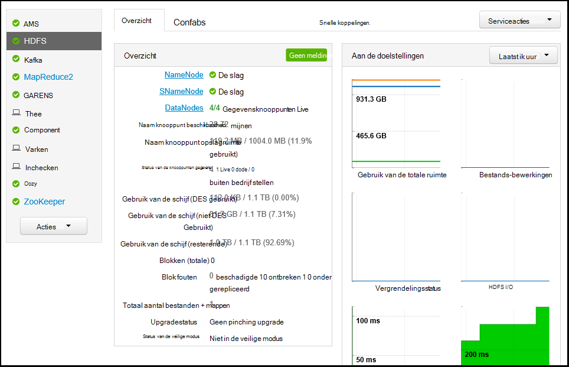

<properties
   pageTitle="Bewaken en beheren van HDInsight clusters met de gebruikersinterface van Apache Ambari Web | Microsoft Azure"
   description="Informatie over het gebruik van Ambari om te controleren en beheren van HDInsight Linux gebaseerde clusters. In dit document leert u hoe u de Ambari Web-gebruikersinterface die wordt geleverd bij HDInsight clusters gebruikt."
   services="hdinsight"
   documentationCenter=""
   authors="Blackmist"
   manager="jhubbard"
   editor="cgronlun"
    tags="azure-portal"/>

<tags
   ms.service="hdinsight"
   ms.devlang="na"
   ms.topic="article"
   ms.tgt_pltfrm="na"
   ms.workload="big-data"
   ms.date="09/27/2016"
   ms.author="larryfr"/>

#HDInsight clusters beheren met behulp van de gebruikersinterface van de Web Ambari

[AZURE.INCLUDE [ambari-selector](../../includes/hdinsight-ambari-selector.md)]

Apache Ambari vergemakkelijkt het beheer en controle van een Hadoop-cluster doordat een eenvoudig te web UI en REST API gebruiken. Ambari op HDInsight Linux gebaseerde clusters is opgenomen, en wordt gebruikt om het cluster bewaken en wijzigingen in de configuratie.

In dit document leert u hoe u de gebruikersinterface van de Web Ambari met een cluster HDInsight.

##Wat is Ambari?

<a href="http://ambari.apache.org" target="_blank">Apache Ambari</a> zorgt ervoor dat Hadoop management eenvoudiger doordat een web eenvoudig te gebruiken gebruikersinterface die kan worden gebruikt om inrichten, beheren en controleren van Hadoop clusters. Ontwikkelaars kunnen deze mogelijkheden in hun toepassingen integreren met behulp van de <a href="https://github.com/apache/ambari/blob/trunk/ambari-server/docs/api/v1/index.md" target="_blank">Ambari REST API's</a>.

De gebruikersinterface van de Web Ambari is al dan niet standaard met HDInsight Linux gebaseerde clusters opgegeven. 

##Connectiviteit

De gebruikersinterface van de Web Ambari is beschikbaar op uw cluster HDInsight bij HTTPS://CLUSTERNAME.azurehdidnsight.net, waar __CLUSTERNAAM__ de naam van uw cluster is. 

> [AZURE.IMPORTANT] Verbinding maken met Ambari op HDInsight vereist HTTPS. U moet ook worden geverifieerd bij Ambari met de beheerder accountnaam (de standaardinstelling is __beheerder__), en het wachtwoord die u hebt opgegeven toen het cluster is gemaakt.

##SSH-proxy

> [AZURE.NOTE] Terwijl Ambari voor uw cluster toegankelijk is rechtstreeks via Internet, sommige koppelingen van de gebruikersinterface voor het Web van Ambari (bijvoorbeeld de JobTracker,) zijn niet zichtbaar op internet. Dus, ontvangt u fouten "server is niet gevonden" wanneer u probeert voor toegang tot deze functies tenzij u een Secure Shell (SSH) tunnel naar proxy webverkeer naar het hoofd clusterknooppunt gebruiken.

Zie [Gebruik SSH tunnel naar Ambari web UI, ResourceManager, JobHistory, NameNode, Oozie, en andere web van UI openen](hdinsight-linux-ambari-ssh-tunnel.md)voor informatie over het maken van een tunnel SSH voor gebruik met Ambari.

##Ambari Web UI

Wanneer u verbinding maakt met de gebruikersinterface van de Web Ambari, wordt u gevraagd om te verifiëren naar de pagina. Gebruik de cluster admin-gebruiker (standaard beheerder) en het wachtwoord dat u tijdens het maken van het cluster gebruikt.

Als de pagina wordt geopend, noteert u de balk bovenaan. Dit bevat de volgende informatie en besturingselementen:

* **Ambari logo** - Hiermee opent u het dashboard, die kan worden gebruikt om de het cluster te houden.

* **Cluster naam # ops** - wordt het aantal doorlopende Ambari bewerkingen. Als u de naam of het **# ops** , wordt een lijst met bewerkingen op de achtergrond weergegeven.

* **# waarschuwingen** - waarschuwingen of kritieke waarschuwingen, indien van toepassing, voor het cluster. Als u deze, wordt een lijst met waarschuwingen weergegeven.

* **Dashboard** - geeft het dashboard.

* **Services** - gegevens en configuratie-instellingen voor de services in het cluster.

* **Hosts** - informatie en configuratie-instellingen voor de knooppunten in het cluster.

* **Waarschuwingen** - een logboek met informatie, waarschuwingen en kritieke waarschuwingen.

* **Beheerder** - Software stapel/services die zijn geïnstalleerd op de cluster, gegevens van de service-account en Kerberos-beveiliging.

* **Knop beheerder** - Ambari management, gebruikersinstellingen en meld u af.

##Cmdlets voor controle

###Waarschuwingen

Ambari biedt veel waarschuwingen, dat een van de volgende handelingen uit als de status:

* **OK**

* **Waarschuwing**

* **KRITIEKE**

* **ONBEKEND**

Waarschuwingen dan **OK** , zal het fragment **# waarschuwingen** boven aan de pagina om het aantal waarschuwingen weer te geven. Dit item te selecteren, wordt de meldingen en hun status weergeven.

Waarschuwingen worden ingedeeld in verschillende standaardgroepen, die kunnen worden weergegeven op de pagina **waarschuwingen** .

U kunt de groepen beheren met behulp van het menu **Acties** en **Waarschuwingen groepen beheren**selecteren. Hiermee kunt u bestaande groepen wijzigen of nieuwe groepen maakt.

U kunt ook waarschuwingen maken vanuit het menu **Acties** . Hiermee kunt u triggers die meldingen per **E-mail** of **SNMP** verzenden wanneer u specifieke waarschuwing/ernst combinaties optreden maken. U kunt bijvoorbeeld verzendt een melding wanneer de waarschuwingen in de groep **Garens standaard** is ingesteld op **kritiek**.

###Cluster

Het tabblad **aan de doelstellingen** van het dashboard bevat een reeks widgets die u eenvoudig kunt u de status van uw cluster in een oogopslag. Meerdere objecten, zoals **CPU-gebruik**, bieden aanvullende informatie aanklikken.

Aan de doelstellingen op het tabblad **Heatmaps** weergegeven als gekleurde heatmaps, gaat u naar rood van groen.

Voor meer gedetailleerde informatie over de knooppunten binnen het cluster, selecteer **Hosts**en selecteer vervolgens het specifieke knooppunt waarin u geïnteresseerd bent.

###Services

De zijbalk **Services** op het dashboard biedt snel inzicht in de status van de services worden uitgevoerd op het cluster. Verschillende pictogrammen worden gebruikt om aan te geven van een nieuwe status of acties die moeten worden ondernomen, zoals een gele Prullenbak-symbool als een service moet worden herhaald.

Als u een service, worden meer gedetailleerde informatie op de service weergegeven.

####Snelkoppelingen

Een **Snelkoppelingen** -koppeling weergeven bepaalde services boven aan de pagina. Dit kan worden gebruikt voor toegang tot van service-specifieke web UI, zoals:

* **Werkervaring** - MapReduce werkervaring.

* **Resourcemanager** - garens ResourceManager UI.

* **NameNode** - Hadoop Distributed bestand System (HDFS) NameNode UI.

* **Oozie Web UI** - Oozie UI.

Selecteren een van de volgende koppelingen, wordt een nieuw tabblad in uw browser, waarin de geselecteerde pagina wordt geopend.

> [AZURE.NOTE] Een koppeling **Snelkoppelingen** voor elke service selecteren resulteert in een fout "server is niet gevonden" tenzij u een Secure Sockets Layer (SSL) tunnel naar proxy webverkeer naar het cluster gebruikt. Dit komt omdat de webtoepassingen die wordt gebruikt voor weergave van deze gegevens zijn niet zichtbaar op internet.
>
> Zie voor informatie over het gebruik van een SSL-tunnel met HDInsight [Gebruik SSH tunnel naar Ambari web UI, ResourceManager, JobHistory, NameNode, Oozie, en andere web van UI openen](hdinsight-linux-ambari-ssh-tunnel.md)

##Projectmanagement

###Ambari gebruikers, groepen en machtigingen

Gebruikers, groepen en machtigingen beheren mag niet worden gebruikt met HDInsight clusters.

###Hosts

De pagina **Hosts** vermeldt alle hosts in het cluster. U kunt hosts beheren door de volgende stappen uit.

> [AZURE.NOTE] Toevoegen, buiten bedrijf stellen of een host recommissioning moet niet worden gebruikt met HDInsight clusters.

1. Selecteer de host (s) die u wilt beheren.

2. Gebruik het menu **Acties** selecteert u de actie die u wilt uitvoeren:

    * **Alle onderdelen starten** - alle onderdelen op de host starten.

    * **Alle onderdelen stoppen** - alle onderdelen op de host stoppen.

    * **Alle onderdelen opnieuw** - stoppen en begint u alle onderdelen op de host.

    * **Onderhoudsmodus inschakelen** - meldingen voor de host onderdrukt. Dit moet worden ingeschakeld als u acties die waarschuwingen, zoals opnieuw starten van een service die met services afhankelijk van zijn genereren uitvoert.

    * **Onderhoudsmodus uitschakelen** - retourneert de host de normale waarschuwingen.

    * **Stoppen** - kleurovergangsbeëindigingen DataNode of NodeManagers op de host.

    * **Start** - DataNode wordt gestart of NodeManagers op de host.

    * **Start opnieuw** - stopt en begint DataNode of NodeManagers op de host.

    * Een host verwijdert **uit bedrijf nemen** - uit het cluster.

        > [AZURE.NOTE] Gebruik deze actie niet op HDInsight clusters.

    * Een eerder bedrijf host aan het cluster toevoegen **recommission** -

        > [AZURE.NOTE] Gebruik deze actie niet op HDInsight clusters.

###Services

Gebruik de knop **Acties** in de pagina **Dashboard** of **Services** onderaan in de lijst met services stoppen en alle services starten.

> [AZURE.WARNING] Terwijl de __Service toevoegen__ wordt weergegeven in het menu deze, moet deze niet worden gebruikt voor services toevoegen aan het cluster HDInsight. Nieuwe services moeten worden toegevoegd met de actie van een Script tijdens het cluster inrichten. Zie voor meer informatie over het gebruik van scriptacties [aanpassen HDInsight clusters scriptacties gebruiken](hdinsight-hadoop-customize-cluster-linux.md).

Terwijl de knop **Acties** alle services opnieuw te starten kunt, wilt vaak u starten, stoppen of opnieuw starten van een specifieke services. Gebruik de volgende stappen uit te voeren acties op een afzonderlijke service:

1. Selecteer een service die op de pagina **Dashboard** of - **Services** .

2. Gebruik van de knop **Acties van de Service** vanaf de bovenkant van het tabblad **Samenvatting** , en selecteert u de actie moet worden uitgevoerd. Hiermee wordt de service op alle knooppunten opnieuw starten.

    

    > [AZURE.NOTE] Opnieuw starten van bepaalde services terwijl het cluster actief is, is het mogelijk genereren waarschuwingen. U kunt dit voorkomen, kunt u de knop **Acties van de Service** **onderhoud-modus** inschakelen voor de service voordat het uitvoeren van de opnieuw starten.

3. Wanneer een actie is geselecteerd, wordt het fragment **# op** boven aan de pagina om weer te geven dat een achtergrondbewerking optreedt verhogen. Indien geconfigureerd als u wilt weergeven, wordt de lijst met bewerkingen op de achtergrond wordt weergegeven.

    > [AZURE.NOTE] Als u **Onderhoudsmodus** ingeschakeld voor de service, moet u deze uitschakelen via de knop **Acties van de Service** zodra de bewerking is voltooid.

Een service configureren, gebruik de volgende stappen uit:

1. Selecteer een service die op de pagina **Dashboard** of - **Services** .

2. Selecteer het tabblad **configuraties** . De huidige configuratie worden, weergegeven. Een lijst met vorige configuraties wordt ook weergegeven.

    

3. De velden weergegeven om te wijzigen van de configuratie gebruiken en selecteer vervolgens **Opslaan**. Of Selecteer een vorige configuratie en selecteer **instellen als huidige** terugkeren naar de vorige instellingen.

##Ambari weergaven

Ambari weergaven kunnen ontwikkelaars gebruikersinterface-elementen aansluiten op de gebruikersinterface van de Web Ambari met het [Ambari weergaven Framework](https://cwiki.apache.org/confluence/display/AMBARI/Views). HDInsight biedt de volgende weergaven met Hadoop clustertypen:

* Garens wachtrij beheren: de wachtrij manager biedt een eenvoudige gebruikersinterface voor weergeven en garens wachtrijen wijzigen.
* Weergave van de component: De weergave component kunt u component query's uitvoeren rechtstreeks vanuit uw webbrowser. U kunt opslaan van query's, resultaten bekijken, resultaten in de clusteropslag opslaan of resultaten downloaden naar uw lokale. Zie voor meer informatie over het gebruik van de weergaven component [Gebruiken component weergaven met HDInsight](hdinsight-hadoop-use-hive-ambari-view.md).
* Tez View: De Tez weergave kunt u beter te begrijpen en taken optimaliseren informatie door op te bekijken hoe ze Tez moeten worden uitgevoerd en welke resources worden gebruikt door de taak.
