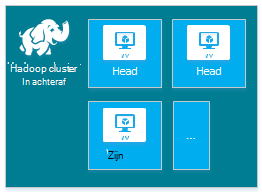

<properties
    pageTitle="Hadoop, HBase, Storm of een clusters maken op Linux in HDInsight | Microsoft Azure"
    description="Informatie over het maken van Hadoop, HBase, Storm of clusters op Linux dus voor HDInsight met behulp van een browser de Azure CLI, Azure PowerShell, REST, of via een SDK."
    services="hdinsight"
    documentationCenter=""
    authors="mumian"
    manager="jhubbard"
    editor="cgronlun"
    tags="azure-portal"/>

<tags
    ms.service="hdinsight"
    ms.devlang="na"
    ms.topic="article"
    ms.tgt_pltfrm="na"
    ms.workload="big-data"
    ms.date="10/18/2016"
    ms.author="jgao"/>

# Hadoop Linux gebaseerde clusters in HDInsight maken

[AZURE.INCLUDE [selector](../../includes/hdinsight-selector-create-clusters.md)]

Een Hadoop-cluster bestaat uit verschillende virtuele machines (knooppunten) die worden gebruikt voor gedistribueerde verwerking van taken op het cluster. Azure abstracts informatie over de implementatie van installatie en configuratie van afzonderlijke knooppunten, zodat u alleen hoeft configuratie van algemene informatie te verstrekken. In dit artikel u meer informatie over deze configuratie-instellingen.

## Vereisten voor het beheer van Access

[AZURE.INCLUDE [access-control](../../includes/hdinsight-access-control-requirements.md)]

## Clustertypen

Azure HDInsight biedt op dit moment vijf verschillende typen kolomgroepen elk voorzien van een reeks onderdelen op te geven van bepaalde functies.

| Clustertype | Functionaliteit |
| ------------ | ----------------------------- |
| Hadoop       | Query en analyse (batchtaken)     |
| HBase        | NoSQL gegevensopslag            |
| Storm        | Realtime gebeurtenis verwerking |
| Elektrische        | In het geheugen verwerking, interactieve query's, micro-batch stream verwerking |
| [Interactieve component (Preview)](hdinsight-hadoop-use-interactive-hive.md) | In het geheugen caching voor interactieve en sneller component-query 's|
| R-Server op een (Preview) | Een groot aantal groot gegevens statistieken, bekijk modellering en machine learning-mogelijkheden |

Elk clustertype heeft een eigen aantal knooppunten binnen het cluster, terminologie voor knooppunten binnen het cluster en VM standaardgrootte voor elk knooppunttype. In de volgende tabel is het aantal knooppunten voor elk knooppunttype tussen haakjes.

| Type| Knooppunten | Diagram|
|-----|------|--------|
|Hadoop| Hoofd knooppunt, (2), gegevensknooppunt (1 +)||
|HBase|Hoofd-server (2), regio-server (1 +), outmodel/Zookeeper knooppunt (3)||
|Storm|Nimbus knooppunt (2), toezichthouder server (1 +), Zookeeper knooppunt (3)||
|Elektrische|Hoofd-knooppunt (2), werknemer knooppunt (1 +), Zookeeper knooppunt (3) (gratis voor A1 zoohouder VM grootte)||

De volgende tabel bevat de standaardgrootte voor VM voor HDInsight:

- Alle ondersteunde regio's behalve Brazilië Zuid en West Japan:

  	|Clustertype                     | Hadoop               | HBase                | Storm                | Elektrische                                                                 | R-Server |
  	|---------------------------------|----------------------|----------------------|----------------------|-----------------------------------------------------------------------|-----------------------------------------------------------------------|
  	|Hoofd-standaard VM grootte           | D3 v2                | D3 v2                | A3                   | D12 v2                                                                | D12 v2                                                                |
  	|Hoofd – aanbevolen VM formaten      | D3 v2, D4 v2, D12 v2 | D3 v2, D4 v2, D12 v2 | A3, A4, A5           | D12 v2, D13 v2, D14 v2                                                | D12 v2, D13 v2, D14 v2                                                |
  	|Werknemer-standaard VM grootte         | D3 v2                | D3 v2                | D3 v2                | Windows: D12 v2; Linux: D4 v2                                         | Windows: D12 v2; Linux: D4 v2                                         |
  	|Werknemer – aanbevolen VM formaten    | D3 v2, D4 v2, D12 v2 | D3 v2, D4 v2, D12 v2 | D3 v2, D4 v2, D12 v2 | Windows: D12 v2, D13 v2, D14 v2; Linux: D4 v2, D12 v2, D13 v2, D14 v2 | Windows: D12 v2, D13 v2, D14 v2; Linux: D4 v2, D12 v2, D13 v2, D14 v2 |
  	|Zookeeper – standaard VM grootte      |                      | A3                   | A2                   |                                                                       |
  	|Zookeeper – aanbevolen VM formaten |                      | A3, A4, A5           | A2, A3 EN A4           |                                                                       |
  	|Rand - standaard VM grootte           |                      |                      |                      |                                                                       | Windows: D12 v2; Linux: D4 v2                                         |
  	|Rand - aanbevolen VM grootte       |                      |                      |                      |                                                                       | Windows: D12 v2, D13 v2, D14 v2; Linux: D4 v2, D12 v2, D13 v2, D14 v2 |

- Brazilië Zuid en Japan West alleen (geen v2 grootten hier):

  	|Clustertype                     | Hadoop      | HBase       | Storm      | Elektrische                                          |R-Server|
  	|---------------------------------|-------------|-------------|------------|------------------------------------------------|--------|
  	|Hoofd-standaard VM grootte           | D3          | D3          | A3         | D12                                            | D12|
  	|Hoofd – aanbevolen VM formaten      | D3, D4, D12 | D3, D4, D12 | A3, A4, A5 | D12, D13 D14                                  | D12, D13 D14|
  	|Werknemer-standaard VM grootte         | D3          | D3          | D3         | Windows: D12; Linux: D4                        | Windows: D12; Linux: D4|
  	|Werknemer – aanbevolen VM formaten    | D3, D4, D12 | D3, D4, D12 | D3, D4, D12| Windows: D12, D13 D14; Linux: D4, D12, D13 D14| Windows: D12, D13 D14; Linux: D4, D12, D13 D14|
  	|Zookeeper – standaard VM grootte      |             | A2          | A2         |                                                | |
  	|Zookeeper – aanbevolen VM formaten |             | A2, A3 EN A4  | A2, A3 EN A4 |                                                | |
  	|Rand-standaard VM grootte          |             |             |            |                                                | Windows: D12; Linux: D4 |
  	|Rand – aanbevolen VM formaten      |             |             |            |                                                | Windows: D12, D13 D14; Linux: D4, D12, D13 D14 |

Houd er rekening mee dat hoofd *Nimbus* wordt genoemd voor het type van de cluster Storm. Werknemer is bekend als *regio* voor het type van de cluster HBase en als *toezichthouder* voor het type van de cluster Storm.

> [AZURE.IMPORTANT] Als u van plan met meer dan 32 werknemer knooppunten bent, bij het maken van het cluster of door het cluster schaalbaarheid na het maken, selecteert u de grootte van een hoofd knooppunt met ten minste 8 cores en 14 GB RAM.

U kunt andere onderdelen zoals kleurtoon of R toevoegen aan deze elementaire typen met behulp van [Scriptacties](#customize-clusters-using-script-action).

> [AZURE.IMPORTANT] HDInsight clusters vele verschillende met typen, die met de werklast technologie die het cluster is afgestemd corresponderen op. Er is geen ondersteunde methode een cluster waarin meerdere typen, zoals Storm en HBase op één cluster zijn gecombineerd maken. 

Als uw oplossing technologieën die zijn verdeeld over meerdere HDInsight clustertypen vereist, moet u een Azure virtuele netwerk maken en de clustertypen vereiste binnen het virtuele netwerk maken. Hiermee kunt de clusters en een code, die u dashboard implementeren naar deze rechtstreeks met elkaar communiceren.

Zie voor meer informatie over het gebruik van een Azure Virtual Network met HDInsight [HDInsight uitbreiden met Azure virtuele netwerken](hdinsight-extend-hadoop-virtual-network.md).

Zie voor een voorbeeld van het gebruik van twee clustertypen binnen een Azure Virtual Network [sensorgegevens analyseren met Storm en HBase](hdinsight-storm-sensor-data-analysis.md).

## Cluster lagen

Azure HDInsight biedt de grote gegevens cloud aanbiedingen in twee categorieën: Standard en [Premium](hdinsight-component-versioning.md#hdinsight-standard-and-hdinsight-premium). HDInsight Premium bevat R en andere extra onderdelen. HDInsight Premium wordt alleen ondersteund op HDInsight versie 3.4.

De volgende tabel bevat de HDInsight clustertype en HDInsight Premium ondersteuningsmatrix.

| Clustertype | Standaard | Premium  |
|--------------|---------------|--------------|
| Hadoop       | Ja           | Ja          |
| Elektrische        | Ja           | Ja          |
| HBase        | Ja           | Nee           |
| Storm        | Ja           | Nee           |
| R-Server op een | Nee | Ja |

In deze tabel wordt bijgewerkt terwijl meer clustertypen zijn opgenomen in HDInsight Premium. De volgende schermafbeelding ziet u de portal Azure-gegevens voor het kiezen van clustertypen.

## Eenvoudige configuratieopties

Hier volgen de eenvoudige configuratieopties gebruikt om te maken van een cluster HDInsight.

### De naam van cluster ###

De naam van cluster verwijst naar een cluster. De naam van cluster moet uniek zijn en deze moet voldoen aan de volgende naming richtlijnen:

- Het veld moet een tekenreeks die tussen 3 en 63 tekens bevat.
- Het veld kan alleen letters, cijfers en afbreekstreepjes bevatten.

### Clustertype###

Zie [clustertypen](#cluster-types) en [Cluster lagen](#cluster-tiers).

### Besturingssysteem ###

U kunt op een van de volgende twee besturingssystemen HDInsight clusters maken:

- HDInsight op Linux.  HDInsight biedt de optie van het configureren van Linux clusters op Azure. Een cluster Linux configureren als u bekend met Linux of Unix bent, migreren van een bestaande Linux gebaseerde Hadoop-oplossing, of wilt u eenvoudige integratie met Hadoop-systeem onderdelen die is ingebouwd voor Linux. Zie [aan de slag met Hadoop op Linux in HDInsight](hdinsight-hadoop-linux-tutorial-get-started.md)voor meer informatie.
- HDInsight op Windows (Windows Server 2012 R2 Datacenter).

### HDInsight-versie###

Hiermee wordt gebruikt om te bepalen welke versie van HDInsight die u nodig hebt voor dit cluster. Zie voor meer informatie [Hadoop cluster versies en onderdelen in HDInsight](https://go.microsoft.com/fwLink/?LinkID=320896&clcid=0x409).

### De naam van abonnement###

Elk cluster HDInsight is gekoppeld aan één Azure-abonnement.

### De naam van de resource-groep ###

[Azure resourcemanager](../azure-resource-manager/resource-group-overview.md) Hiermee kunt u werken met de resources in uw toepassing als een groep genoemd een resourcegroep Azure. U kunt implementeren, bijwerken, controleren of alle bronnen voor uw toepassing gecoördineerde tegelijk verwijderen.

### Referenties###

U kunt twee gebruikersaccounts tijdens het maken van cluster configureren met HDInsight kolomgroepen:

- HTTP-gebruiker. De standaardnaam van de gebruiker is *admin* , met de eenvoudige configuratie op Azure portal. Soms wordt genoemd "Cluster gebruiker."
- SSH gebruiker (Linux clusters). Dit wordt gebruikt om verbinding maken met het cluster via SSH. Nadat het cluster volgens de stappen in [Gebruik SSH met Linux gebaseerde Hadoop op HDInsight uit Linux, Unix, of OS X](hdinsight-hadoop-linux-use-ssh-unix.md) of [Gebruik SSH met Linux gebaseerde Hadoop op HDInsight vanuit Windows](hdinsight-hadoop-linux-use-ssh-unix.md)is gemaakt, kunt u aanvullende SSH-gebruikersaccounts maken.

    >[AZURE.NOTE] U kunt een RDP-gebruiker verbinding maken met de cluster met RDP maken voor kolomgroepen op basis van Windows.

### Gegevensbron###

Het oorspronkelijke Hadoop distributed file system (HDFS) gebruikt veel lokale schijf op het cluster. Azure-blobopslag HDInsight gebruikt voor gegevensopslag. Azure-blobopslag is een krachtige, algemene opslagoplossing dat naadloos met HDInsight. Via een interface HDFS, kan de volledige set van onderdelen in HDInsight rechtstreeks op gestructureerde of ongestructureerde gegevens in blobopslag worden uitgevoerd. Gegevens opslaat in Blob storage, kunt u veilig verwijderen HDInsight clusters die worden gebruikt voor berekening zonder gebruikersgegevens kwijt te raken.

U moet tijdens het configureren van een Azure opslag-account en een Azure Blob storage container opgeven voor de opslag van Azure-account. Sommige processen maken is vereist voor de opslag van Azure-account en de container Blob storage tevoren worden gemaakt. De Blob storage container wordt gebruikt als de standaardopslaglocatie door het cluster. Desgewenst kunt u extra opslagruimte van Azure accounts (gekoppelde opslag) die toegankelijk voor het cluster zijn opgeven. Het cluster kunt ook een Blob storage containers die zijn geconfigureerd met volledige openbare leestoegang of openbare leestoegang voor BLOB's alleen openen.  Zie [Toegang tot Azure opslagbronnen beheren](../storage/storage-manage-access-to-resources.md)voor meer informatie.

>[AZURE.NOTE] Een Blob storage container biedt een groepering van een set BLOB's, zoals weergegeven in de volgende afbeelding.

We raden niet de standaard Blob storage container gebruiken voor het opslaan van zakelijke gegevens. De standaard Blob storage container verwijderen nadat elke gebruiken om shapes te beperken opslag een goede gewoonte is. Opmerking dat de standaardcontainer toepassings- en bevat Logboeken. Zorg ervoor dat de logboeken ophalen voordat u de container verwijdert.

>[AZURE.WARNING] Delen van één Blob storage container voor meerdere clusters wordt niet ondersteund.

Zie voor meer informatie over het gebruik van secundaire blobopslag [Azure-blobopslag gebruiken met HDInsight](hdinsight-hadoop-use-blob-storage.md).

U kunt ook [Azure Lake gegevensopslag](../data-lake-store/data-lake-store-overview.md) gebruiken naast Azure-blobopslag, als een standaardaccount voor de opslag voor HBase cluster in HDInsight en als gekoppelde opslag voor alle vier typen in het cluster HDInsight. Zie [een HDInsight cluster met Lake gegevensopslag maken met behulp van Azure portal](../data-lake-store/data-lake-store-hdinsight-hadoop-use-portal.md)voor meer informatie.

### Locatie (regio) ###

Het cluster HDInsight en het standaardaccount voor de opslag moeten zich op dezelfde locatie Azure.

Voor een lijst met ondersteunde regio's, klikt u op de vervolgkeuzelijst **regio** op [HDInsight prijzen](https://go.microsoft.com/fwLink/?LinkID=282635&clcid=0x409).

### Knooppunt prijzen van lagen###

Klanten worden gefactureerd voor het gebruik van deze knooppunten voor de duur van de levensduur van het cluster. Facturering wordt gestart wanneer een cluster wordt gemaakt en stopt wanneer het cluster wordt verwijderd. Clusters kunnen niet worden opgeheven toegewezen of in de wacht zetten.

Ander clustertypen hebben verschillende knooppunttypen, getallen knooppunten en knooppunt tekengrootten. Een Hadoop clustertype bevat bijvoorbeeld twee _hoofd knooppunten_ en standaard vier _gegevensknooppunten_, terwijl een Storm clustertype heeft twee _nimbus knooppunten_, drie _zookeeper knooppunten_, en een standaardinstelling van vier _toezichthouder knooppunten_. De kosten van HDInsight clusters wordt bepaald door het aantal knooppunten en de grootte van de virtuele machines voor de knooppunten. Als u weet dat u bewerkingen die veel geheugen zult uitvoeren, wilt u mogelijk een berekeningscluster resource met meer geheugen selecteren. Het wordt aanbevolen voor leermateriaal, één gegevensknooppunt gebruiken. Zie [HDInsight prijzen](https://go.microsoft.com/fwLink/?LinkID=282635&clcid=0x409)voor meer informatie over HDInsight prijzen.

>[AZURE.NOTE] De cluster groottelimiet overschrijden varieert per Azure abonnementen. Neem contact op met factureringsondersteuning de limiet te verhogen.

>De knooppunten door uw cluster gebruikt, worden niet als virtuele machines meegerekend omdat de VM afbeeldingen gebruikt voor de knooppunten de details van een implementatie van de service HDInsight zijn. De berekeningscluster cores die worden gebruikt door de knooppunten worden meegerekend bij het totale aantal berekeningscluster cores beschikbaar voor uw abonnement. Hier ziet u het aantal beschikbare cores en de boormonsters die door het cluster in de sectie Samenvatting van het blad knooppunt prijzen lagen wordt gebruikt bij het maken van een cluster HDInsight.

Wanneer u de portal van Azure gebruikt voor het configureren van het cluster, is de grootte van het knooppunt beschikbaar via het __Knooppunt prijzen laag__ blad. U ziet ook de kosten die is gekoppeld aan de grootte van de verschillende knooppunt. De volgende schermafbeelding ziet u de opties voor een Linux-base Hadoop-cluster.

De volgende tabellen bevatten de grootte die wordt ondersteund door HDInsight clusters en de capaciteit die ze bieden.

#### Standaard laag: A-reeks####

In het implementatiemodel klassieke zijn sommige grootten VM iets anders uit in PowerShell en CLI.
* Standard_A3 is groot
* Standard_A4 is ExtraLarge

|Grootte |CPU-kernen|Geheugen|NIC (Max.)|Max. grootte van de schijf|Max. gegevensschijven (1023 GB elke)|Max. IO's / s (500 per schijf)|
|---|---|---|---|---|---|---|
|Standard_A3\Large|4|7 GB|2|Tijdelijke = 285 GB |8|8 x 500|
|Standard_A4\ExtraLarge|8|14 GB|4|Tijdelijke = 605 GB |16|16 x 500|
|Standard_A6|4|28 GB|2|Tijdelijke = 285 GB |8|8 x 500|
|Standard_A7|8|56 GB|4|Tijdelijke = 605 GB |16|16 x 500|

#### Standaard laag: D-reeks####

|Grootte |CPU-kernen|Geheugen|NIC (Max.)|Max. grootte van de schijf|Max. gegevensschijven (1023 GB elke)|Max. IO's / s (500 per schijf)|
|---|---|---|---|---|---|---|
|Standard_D3 |4|14 GB|4|Tijdelijk (SSD) = 200 GB |8|8 x 500|
|Standard_D4 |8|28 GB|8|Tijdelijk (SSD) = 400 GB |16|16 x 500|
|Standard_D12 |4|28 GB|4|Tijdelijk (SSD) = 200 GB |8|8 x 500|
|Standard_D13 |8|56 GB|8|Tijdelijk (SSD) = 400 GB |16|16 x 500|
|Standard_D14 |16|112 GB|8|Tijdelijk (SSD) = 800 GB |32|32 x 500|

#### Standaard laag: Dv2-reeks####

|Grootte |CPU-kernen|Geheugen|NIC (Max.)|Max. grootte van de schijf|Max. gegevensschijven (1023 GB elke)|Max. IO's / s (500 per schijf)|
|---|---|---|---|---|---|---|
|Standard_D3_v2 |4|14 GB|4|Tijdelijk (SSD) = 200 GB |8|8 x 500|
|Standard_D4_v2 |8|28 GB|8|Tijdelijk (SSD) = 400 GB |16|16 x 500|
|Standard_D12_v2 |4|28 GB|4|Tijdelijk (SSD) = 200 GB |8|8 x 500|
|Standard_D13_v2 |8|56 GB|8|Tijdelijk (SSD) = 400 GB |16|16 x 500|
|Standard_D14_v2 |16|112 GB|8|Tijdelijk (SSD) = 800 GB |32|32 x 500|    

Zie voor implementatie overwegingen letten wanneer u van plan bent deze bronnen, [grootte voor virtuele machines](../virtual-machines/virtual-machines-windows-sizes.md). Zie voor informatie over de prijzen van de verschillende groottes [HDInsight prijzen](https://azure.microsoft.com/pricing/details/hdinsight).   

> [AZURE.IMPORTANT] Als u van plan met meer dan 32 werknemer knooppunten bent, bij het maken van het cluster of door het cluster schaalbaarheid na het maken, selecteert u de grootte van een hoofd knooppunt met ten minste 8 cores en 14 GB RAM.

Facturering wordt gestart wanneer een cluster wordt gemaakt en stopt wanneer het cluster wordt verwijderd. Zie voor meer informatie over prijzen, [prijsgegevens HDInsight](https://azure.microsoft.com/pricing/details/hdinsight/).

## Extra opslagruimte gebruiken

In sommige gevallen wilt u mogelijk extra opslagruimte wilt toevoegen aan het cluster. Zoals u mogelijk meerdere Azure opslag-accounts voor verschillende geografische regio's of andere services, maar u wilt analyseren ze allemaal met HDInsight.

Wanneer u een cluster HDInsight maakt of na een cluster is gemaakt, kunt u opslagruimte accounts toevoegen.  Zie [HDInsight aanpassen Linux gebaseerde clusters met de Script-actie](hdinsight-hadoop-customize-cluster-linux.md).

Zie voor meer informatie over secundaire blobopslag [gebruiken Azure-blobopslag met HDInsight](hdinsight-hadoop-use-blob-storage.md). Zie voor meer informatie over secundaire Lake gegevensopslag [maken HDInsight clusters met Lake gegevensopslag met behulp van Azure portal](../data-lake-store/data-lake-store-hdinsight-hadoop-use-portal.md).

## Component/Oozie metastore gebruiken

Het is raadzaam dat u een aangepaste metastore gebruiken als u bewaren van uw tabellen component wilt nadat u uw cluster HDInsight hebt verwijderd. Is mogelijk dat metastore als bijlage aan een ander HDInsight cluster toevoegen.

> [AZURE.IMPORTANT] HDInsight metastore gemaakt voor één HDInsight cluster versie, kunnen niet worden gedeeld met verschillende versies van HDInsight cluster. Zie voor een lijst met HDInsight versies, [ondersteund HDInsight versies](hdinsight-component-versioning.md#supported-hdinsight-versions).

De metastore bevat component en Oozie metagegevens, zoals component tabellen, partities, schema's en kolommen. De metastore helpt u bij het behouden van de metagegevens van uw component en Oozie, zodat u niet hoeft component tabellen of Oozie taken opnieuw maken wanneer u een nieuw cluster maakt. Component wordt standaard een ingesloten Azure SQL-database gebruikt deze gegevens wilt opslaan. De ingesloten database behouden niet de metagegevens wanneer het cluster wordt verwijderd. Wanneer u Component tabel in een HDInsight cluster met een component metastore geconfigureerd maakt, wordt deze tabellen worden behouden wanneer u het gebruik van de dezelfde component metastore cluster opnieuw moet maken.

Metastore configuratie is niet beschikbaar voor HBase clustertypen.

> [AZURE.IMPORTANT] Wanneer u een aangepaste metastore maakt, gebruik de naam van een database die streepjes of afbreekstreepjes bevat niet. Hiermee kan leiden tot het maakproces cluster mislukt.

## Azure virtuele netwerken gebruiken

Met een [Azure virtuele netwerk](https://azure.microsoft.com/documentation/services/virtual-network/), kunt u een beveiligde, permanente netwerk met de bronnen die u nodig voor uw oplossing hebt maken. Met een virtueel netwerk, kunt u het volgende doen:

* Verbinding maken met cloud resources samen op een privé-netwerk (cloud-lezen).

    

* Verbinding maken met uw resources cloud bij het netwerk van uw lokale datacenter (site-naar-site of punt-naar-site) met behulp van een VPN (VPN).

| Configuratie van de site-naar-site | Configuratie van het punt-naar-site |
| -------------------------- | --------------------------- |
| Met de configuratie van de site-naar-site, kunt u meerdere resources in uw datacenter bij het Azure virtuele netwerk met behulp van een hardware VPN of omleiden en Remote Access Service.  | Met de configuratie van de punt-naar-site, kunt u een specifieke bron aan het Azure virtuele netwerk via een VPN-software.  |

Windows gebaseerde clusters vereisen een v1 (Classic) virtueel netwerk, terwijl Linux gebaseerde clusters v2 (Azure resourcemanager) virtuele netwerk nodig. Als u het juiste type netwerk niet hebt, deze, niet worden gebruikt wanneer u de cluster maakt.

Zie voor meer informatie over het gebruik van HDInsight met een virtueel netwerk, inclusief de van de specifieke configuratievereisten voor het virtuele netwerk, [mogelijkheden HDInsight uitbreiden met behulp van een Azure virtuele netwerk](hdinsight-extend-hadoop-virtual-network.md).

## Clusters met HDInsight cluster aanpassing (bootstrap) aanpassen

Soms wilt u voor het configureren van de volgende configuratiebestanden:

- clusterIdentity.xml
- Core-site.xml
- gateway.XML
- hbase-env.xml
- hbase-site.xml
- hdfs-site.xml
- component-env.xml
- component-site.xml
- mapred-site
- oozie-site.xml
- oozie-env.xml
- storm-site.xml
- tez-site.xml
- webhcat-site.xml
- garens-site.xml

Als u wilt de wijzigingen door de levensduur van een cluster houden, kunt u HDInsight cluster aanpassing tijdens het maken of kunt u Ambari in Linux gebaseerde clusters. Zie [HDInsight aanpassen clusters Bootstrap gebruiken](hdinsight-hadoop-customize-cluster-bootstrap.md)voor meer informatie.

>[AZURE.NOTE] De clusters op basis van Windows kunnen niet de wijzigingen vanwege opnieuw afbeelding behouden. Zie [Rol exemplaar opnieuw is opgestart moeten Upgrades voor het besturingssysteem](http://blogs.msdn.com/b/kwill/archive/2012/09/19/role-instance-restarts-due-to-os-upgrades.aspx)voor meer informatie.  Als u wilt de wijzigingen door de clusters levensduur houden, moet u HDInsight cluster aanpassing tijdens het maken.

## Met de actie Script clusters aanpassen

U kunt extra onderdelen installeren of clusterconfiguratie aanpassen met behulp van scripts tijdens het maken van. Dergelijke scripts worden aangeroepen via een **Scriptactie**, dat wil zeggen een configuratieoptie die kan worden gebruikt vanaf de portal van Azure HDInsight Windows PowerShell-cmdlets of de HDInsight .NET SDK. Zie [cluster van HDInsight aanpassen met de actie Script](hdinsight-hadoop-customize-cluster-linux.md)voor meer informatie.

Sommige systeemeigen Java-onderdelen, zoals Mahout en trapsgewijze, kunnen worden uitgevoerd op het cluster als Java archief (oppervlak)-bestanden. Deze bestanden oppervlak kunnen worden verdeeld over Azure-blobopslag en bij HDInsight clusters ingediend met Hadoop taak indiening regelingen. Zie [Hadoop verzenden via programmacode taken](hdinsight-submit-hadoop-jobs-programmatically.md)voor meer informatie.

>[AZURE.NOTE] Als u problemen oppervlak-bestanden met HDInsight clusters implementeert of inbelt oppervlak-bestanden op HDInsight clusters hebt, neemt u contact op met [Microsoft ondersteuning](https://azure.microsoft.com/support/options/).

> Trapsgewijze wordt niet ondersteund door HDInsight en komt niet in aanmerking voor Microsoft Support. Zie voor lijsten met ondersteunde onderdelen, [Wat is er nieuw in de cluster versies geleverd door HDInsight?](hdinsight-component-versioning.md)

## Randknooppunt gebruiken

 Een lege randknooppunt is een Linux virtuele machine met de dezelfde clienthulpprogramma's geïnstalleerd en geconfigureerd zoals in de headnodes. U kunt het randknooppunt gebruiken voor toegang tot het cluster, uw clienttoepassingen testen en uw clienttoepassingen hostingprovider. Zie [Gebruik lege rand knooppunten in HDInsight](hdinsight-apps-use-edge-node.md)voor meer informatie.
 
## Methoden voor het maken van cluster

In dit artikel, hebt u hebt geleerd basisinformatie over het maken van een cluster Linux gebaseerde HDInsight. Gebruik de volgende tabel om specifieke informatie over het maken van een cluster met behulp van een methode die het beste aan uw wensen voldoet te vinden.

| Clusters die zijn gemaakt met | Webbrowser | Opdrachtregel | REST API | SDK | Linux, Mac OS X of Unix | Windows |
| ------------------------------- |:----------------------:|:--------------------:|:------------------:|:------------:|:-----------------------------:|:------------:|
| [De portal van Azure](hdinsight-hadoop-create-linux-clusters-portal.md) | ✔     | &nbsp; | &nbsp; | &nbsp; | ✔      | ✔ |
| [Azure gegevens Factory](hdinsight-hadoop-create-linux-clusters-adf.md) | ✔     | ✔  | ✔  |✔  | ✔      | ✔ |
| [Azure CLI](hdinsight-hadoop-create-linux-clusters-azure-cli.md)         | &nbsp; | ✔     | &nbsp; | &nbsp; | ✔      | ✔ |
| [Azure PowerShell](hdinsight-hadoop-create-linux-clusters-azure-powershell.md) | &nbsp; | ✔     | &nbsp; | &nbsp; | ✔ | ✔ |
| [Omslaan](hdinsight-hadoop-create-linux-clusters-curl-rest.md) | &nbsp; | ✔     | ✔ | &nbsp; | ✔      | ✔ |
| [.NET SDK](hdinsight-hadoop-create-linux-clusters-dotnet-sdk.md) | &nbsp; | &nbsp; | &nbsp; | ✔ | ✔      | ✔ |
| [Azure resourcemanager-sjablonen](hdinsight-hadoop-create-linux-clusters-arm-templates.md) | &nbsp; | ✔     | &nbsp; | &nbsp; | ✔      | ✔ |
