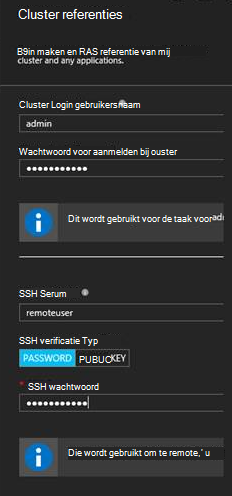

<properties
   pageTitle="Aan de slag met R-Server op HDInsight (preview) | Azure"
   description="Meer informatie over het maken van een elektrische Apache op HDInsight (Hadoop) cluster met R-Server (evaluatieversie) en vervolgens dient een R-script op het cluster."
   services="HDInsight"
   documentationCenter=""
   authors="jeffstokes72"
   manager="jhubbard"
   editor="cgronlun"
/>

<tags
   ms.service="HDInsight"
   ms.devlang="R"
   ms.topic="article"
   ms.tgt_pltfrm="na"
   ms.workload="data-services"
   ms.date="08/19/2016"
   ms.author="jeffstok"
/>

# Aan de slag met R-Server op HDInsight (preview)

De premium-laag aanbod voor HDInsight bevat R-Server als onderdeel van uw cluster HDInsight (preview). Hierdoor R scripts met MapReduce en een verdeelde berekeningen uitvoeren. In dit document leert u hoe u een nieuwe R-Server op HDInsight maken en een R-script die laat zien met behulp van een voor verdeelde R berekeningen uitvoeren.

## Vereisten voor

* __Een Azure-abonnement__: voordat u deze zelfstudie begint, moet u een Azure abonnement hebben. Zie [Azure krijgen gratis proefversie](https://azure.microsoft.com/documentation/videos/get-azure-free-trial-for-testing-hadoop-in-hdinsight/) voor meer informatie.

* __A Secure Shell (SSH)-client__: een SSH client gebruikt voor extern verbinding maken met de cluster HDInsight en opdrachten direct op het cluster uitvoeren. Linux, Unix en OS X-systemen bieden een client SSH via de `ssh` opdracht. Voor Windows-systemen raden [stopverf](http://www.chiark.greenend.org.uk/~sgtatham/putty/download.html).

    * __SSH toetsen (optioneel)__: U kunt het SSH-account gebruikt om verbinding met het cluster met een wachtwoord of een openbare sleutel te beveiligen. Met een wachtwoord is gemakkelijker en kunt u aan de slag gaan zonder te hoeven maken van de combinatie van een openbare/persoonlijke; met behulp van een sleutel is echter beter kunt beveiligen.
    
        De stappen in dit document wordt ervan uitgegaan dat u een wachtwoord gebruikt. Zie de volgende documenten voor informatie over het maken en gebruiken van SSH toetsen met HDInsight:
        
        * [SSH gebruiken met HDInsight vanuit Linux, Unix of OS X-clients](hdinsight-hadoop-linux-use-ssh-unix.md)
        
        * [SSH gebruiken met HDInsight vanuit Windows-clients](hdinsight-hadoop-linux-use-ssh-windows.md)

### Vereisten voor het beheer van Access

[AZURE.INCLUDE [access-control](../../includes/hdinsight-access-control-requirements.md)]

## Het cluster maken

> [AZURE.NOTE] De stappen in dit document Maak een R-Server op HDInsight met eenvoudige configuratiegegevens. Zie voor andere cluster configuratie-instellingen (zoals extra opslagruimte accounts toevoegen, een Azure Virtual Network gebruiken of een metastore maken voor component), [HDInsight maken Linux gebaseerde clusters](hdinsight-hadoop-provision-linux-clusters.md).

1. Meld u aan bij de [portal van Azure](https://portal.azure.com).

2. Selecteer __Nieuw__, __gegevens + analyses__, en selecteer __HDInsight__.

    

3. Voer een naam voor het cluster in het veld __Naam Cluster__ . Als u meerdere Azure abonnementen hebt, gebruikt u het fragment __abonnement__ welke methode die u wilt gebruiken.

    

4. __Selecteer clustertype__selecteren Selecteer op het blad __Cluster Type__ de volgende opties:

    * __Clustertype__: R-Server op een
    
    * __Cluster laag__: Premium

    De overige opties op de standaardwaarden laten staan en het gebruik van de knop __selecteren__ om het opslaan van het clustertype.
    
    
    
    > [AZURE.NOTE] U kunt ook R Server toevoegen aan andere typen HDInsight cluster (zoals Hadoop of HBase,) door het clustertype selecteren, en selecteer __Premium__.

5. Selecteer de **Resourcegroep** moet een overzicht van bestaande resourcegroepen en selecteer vervolgens het account te maken van het cluster in. Of u kunt **Nieuw** te selecteren en voer vervolgens de naam van de nieuwe resourcegroep. Een groen vinkje wordt weergegeven om aan te geven dat de naam van de nieuwe groep beschikbaar is.

    > [AZURE.NOTE] Dit item standaard ingesteld op een van uw bestaande resourcegroepen, indien beschikbaar.
    
    Gebruik de knop __selecteren__ om op te slaan van het resourceveld groep.

6. Selecteer **referenties**, voer vervolgens een **Cluster Login-gebruikersnaam** en **Wachtwoord voor aanmelden bij Cluster**.

    Voer een __SSH gebruikersnaam__.  SSH wordt gebruikt om extern verbinding maken met het cluster met een client __Secure Shell (SSH)__ . U kunt de gebruiker SSH opgeven in dit dialoogvenster of nadat het cluster (tabblad configuratie voor het cluster) is gemaakt. R-Server is geconfigureerd voor een __SSH gebruikersnaam__ van "remoteuser" verwachten.  Als u een andere gebruikersnaam gebruikt, moet u een extra stap uitvoeren nadat het cluster is gemaakt.
    
    

    __SSH verificatietype__: __wachtwoord__ selecteert als het verificatietype, tenzij u liever gebruik van een openbare sleutel.  U moet een combinatie van een openbare/persoonlijke sleutel desgewenst voor toegang tot R-Server op het cluster via een externe client, bijvoorbeeld RTVS, RStudio of een ander bureaublad IDE.   

    Maken en gebruiken van een openbare en persoonlijke sleutel paar 'Openbare sleutel' selecteren en gaat u als volgt.  Deze instructies wordt ervan uitgegaan dat er Cygwin met ssh-keygen of een vergelijkbare is geïnstalleerd.

    -    Een combinatie van een openbare/persoonlijke sleutel genereren van de opdrachtprompt op uw laptop:
      
            SSH-keygen - t rsa -b 2048 – f < privé-sleutel-bestandsnaam >
      
    -    Hiermee maakt u een bestand met persoonlijke sleutel en een openbare sleutel bestand onder de naam < privé-sleutel-bestandsnaam > .pub, bijvoorbeeld  davec en davec.pub.  Geef het bestand met openbare sleutel (* .pub) bij het toewijzen van HDI cluster referenties:
      
          
      
    -    Machtigingen voor het privé sleutelbestand op uw laptop wijzigen
      
            type chmod 600 < privé-sleutel-filename >
      
    -    Gebruik het bestand met persoonlijke sleutel met SSH voor externe aanmelding, bijvoorbeeld
      
            SSH – i < privé-sleutel-filename >remoteuser@<hostname public ip>
      
      of als onderdeel van de definitie van de context van uw Hadoop Spark berekeningscluster voor R-Server op de client (Zie Using Microsoft R Server als een Hadoop-Client in de sectie [voor het maken van een Context berekenen voor een](https://msdn.microsoft.com/microsoft-r/scaler-spark-getting-started#creating-a-compute-context-for-spark) van de online [RevoScaleR Hadoop een handleiding aan de slag](https://msdn.microsoft.com/microsoft-r/scaler-spark-getting-started).)

7. Selecteer **Gegevensbron** selecteren van een gegevensbron voor het cluster. Selecteer een bestaande opslag-account door selecteren __Selecteer opslag-account__ en selecteer het account of een nieuw account op de koppeling __Nieuw__ in de sectie __Selecteer opslag-account__ maken.

    Als u een __Nieuw__selecteert, moet u een naam voor de nieuwe opslag-account. Een groen vinkje wordt weergegeven als de naam wordt geaccepteerd.

    De __Standaardcontainer__ standaard ingesteld op de naam van het cluster. Laat u dit als de waarde.
    
    Selecteer de __locatie__ voor het maken van het account opslag in de regio selecteren.
    
    > [AZURE.IMPORTANT] De locatie voor de standaard-gegevensbron selecteren, wordt de locatie van het cluster HDInsight ook instellen. De gegevensbron cluster en standaard moet zich bevinden in dezelfde regio.

    Gebruik de knop **selecteren** om op te slaan configuratie van de gegevensbron.
    
    

8. Selecteer **Knooppunt prijzen lagen** om informatie over de knooppunten die worden gemaakt voor deze cluster weer te geven. Tenzij u weet dat u een grotere cluster moet, laat u het aantal knooppunten werknemer ingesteld op `4`. De geschatte kosten van het cluster worden weergegeven in het blad.

    > [AZURE.NOTE] Als nodig kunt u opnieuw uw cluster later via de Portal groot (Cluster-instellingen > -> schaal Cluster) te vergroten of verkleinen van het aantal knooppunten werknemer.  Dit is handig voor stationair het cluster wanneer u niet in gebruik af of voor het toevoegen van capaciteit om te voldoen aan de behoeften van grote taken.

    Sommige factoren in gedachten moet houden bij het formaat wijzigen van uw cluster, de gegevensknooppunten en het randknooppunt opnemen:  
   
    - De prestaties van verdeelde R-Server-analyses op elektrische is evenredig aan het aantal knooppunten werknemer wanneer de gegevens groot is.  
    - De prestaties van R Server analyses is lineaire in de grootte van de gegevens die worden geanalyseerd. Bijvoorbeeld:  
        - Voor klein is voor bescheiden gegevens worden aanbevolen wanneer geanalyseerd in een lokale berekeningscluster context op het randknooppunt.  Zie voor meer informatie over de scenario's waarin de lokale versie en een berekeningscluster contexten werken het best berekeningscluster context opties voor R-Server op HDInsight. 
        - Als u Meld u aan bij het randknooppunt en uitvoeren van alle en vervolgens uw R-script er maar de ScaleR rx-functies <strong>lokaal</strong> wordt uitgevoerd op het randknooppunt zodat het geheugen en het aantal kernen van het randknooppunt moeten formaat worden gewijzigd dienovereenkomstig gewijzigd. Hetzelfde is van toepassing als u R-Server op HDI als een externe berekeningscluster context vanaf uw laptop.
    
    

    Gebruik de knop **selecteren** om op te slaan het knooppunt configuratie prijzen.
    
9. Zorg ervoor dat **vastmaken aan Startboard** is geselecteerd op het blad **Nieuwe HDInsight Cluster** en selecteer **maken**. Hiermee maakt u het cluster en een tegel voor deze toevoegen aan de Startboard van uw Azure-Portal. Het pictogram wordt aangegeven dat het cluster maakt en de HDInsight als pictogram wilt weergeven wanneer maken is voltooid wordt gewijzigd.

  	| Tijdens het maken van | Maken is voltooid |
  	| ------------------ | --------------------- |
  	|  |  |

    > [AZURE.NOTE] Het duurt enige tijd voor het cluster moet worden gemaakt, meestal ongeveer 15 minuten. De tegel op het Startboard of het fragment **meldingen** aan de linkerkant van de pagina gebruiken om te controleren of het maakproces.

## Verbinding maken met het knooppunt van de rand R-Server

Verbinding maken met R Server randknooppunt van het HDInsight cluster SSH gebruiken:

    ssh USERNAME@r-server.CLUSTERNAME-ssh.azurehdinsight.net
    
> [AZURE.NOTE] U vindt ook de `R-Server.CLUSTERNAME-ssh.azurehdinsight.net` adres in de portal van Azure door uw cluster, en vervolgens __Alle instellingen__, __Apps__en __RServer__te selecteren. Hiermee wordt de SSH eindpunt-informatie voor het randknooppunt weergeven.
>
> 
    
Als u een wachtwoord beveiligen van uw gebruikersaccount SSH gebruikt, wordt u gevraagd in te voeren. Als u een openbare sleutel gebruikt, moet u mogelijk gebruiken de `-i` -parameter voor de overeenkomende persoonlijke sleutel opgeven. Bijvoorbeeld `ssh -i ~/.ssh/id_rsa USERNAME@R-Server.CLUSTERNAME-ssh.azurehdinsight.net`.
    
Zie de volgende artikelen voor meer informatie over het gebruik van SSH met Linux gebaseerde HDInsight:

* [SSH gebruiken met Linux gebaseerde Hadoop op HDInsight uit Linux, Unix of OS X](hdinsight-hadoop-linux-use-ssh-unix.md)

* [SSH gebruiken met Linux gebaseerde Hadoop op HDInsight vanuit Windows](hdinsight-hadoop-linux-use-ssh-windows.md)

Zodra u verbinding hebt, wordt u bij de opdrachtprompt de volgende strekking binnenkomen.

    username@ed00-myrser:~$

## Gebruik de R-console

1. Gebruik de volgende opdracht uit de R-console starten in de sessie SSH.

        R
    
    Hier ziet u de volgende strekking uitvoer.
    
        R version 3.2.2 (2015-08-14) -- "Fire Safety"
        Copyright (C) 2015 The R Foundation for Statistical Computing
        Platform: x86_64-pc-linux-gnu (64-bit)

        R is free software and comes with ABSOLUTELY NO WARRANTY.
        You are welcome to redistribute it under certain conditions.
        Type 'license()' or 'licence()' for distribution details.

        Natural language support but running in an English locale

        R is a collaborative project with many contributors.
        Type 'contributors()' for more information and
        'citation()' on how to cite R or R packages in publications.

        Type 'demo()' for some demos, 'help()' for on-line help, or
        'help.start()' for an HTML browser interface to help.
        Type 'q()' to quit R.

        Microsoft R Server version 8.0: an enhanced distribution of R
        Microsoft packages Copyright (C) 2016 Microsoft Corporation

        Type 'readme()' for release notes.

        >

2. Vanuit de `>` vragen, kunt u R code invoeren. R-server bevat pakketten waarmee u kunt eenvoudig werken met Hadoop en verdeelde berekeningen uitvoeren. Gebruik bijvoorbeeld de volgende opdracht uit om weer te geven van de hoofdsite van de standaard-bestandssysteem voor het cluster HDInsight.

        rxHadoopListFiles("/")
    
    U kunt ook de adressering van WASB stijl.
    
        rxHadoopListFiles("wasbs:///")

## R-Server op HDI vanuit een extern exemplaar van Microsoft R Server of Microsoft R-Client gebruiken

Per de sectie hierboven met betrekking tot het gebruik van de paren van openbare en persoonlijke sleutels voor toegang tot de cluster, is het mogelijk om setup toegang tot de HDI Hadoop een berekeningscluster context vanuit een extern exemplaar van Microsoft R Server of Microsoft R-Client op een desktop of laptop uitgevoerd (Zie Using Microsoft R Server als een Hadoop-Client in de sectie [voor het maken van een Context berekenen voor een](https://msdn.microsoft.com/microsoft-r/scaler-spark-getting-started#creating-a-compute-context-for-spark) van de online [RevoScaleR Hadoop een handleiding aan de slag](https://msdn.microsoft.com/microsoft-r/scaler-spark-getting-started)).  Om dit te doen moet u de volgende opties bij het definiëren van de RxSpark berekenen context op uw laptop opgeven: hdfsShareDir, shareDir, sshUsername, sshHostname, sshSwitches, en sshProfileScript. Bijvoorbeeld:

    
    myNameNode <- "default"
    myPort <- 0 
 
    mySshHostname  <- 'rkrrehdi1-ssh.azurehdinsight.net'  # HDI secure shell hostname
    mySshUsername  <- 'remoteuser'# HDI SSH username
    mySshSwitches  <- '-i /cygdrive/c/Data/R/davec'   # HDI SSH private key
 
    myhdfsShareDir <- paste("/user/RevoShare", mySshUsername, sep="/")
    myShareDir <- paste("/var/RevoShare" , mySshUsername, sep="/")
 
    mySparkCluster <- RxSpark(
      hdfsShareDir = myhdfsShareDir,
      shareDir     = myShareDir,
      sshUsername  = mySshUsername,
      sshHostname  = mySshHostname,
      sshSwitches  = mySshSwitches,
      sshProfileScript = '/etc/profile',
      nameNode     = myNameNode,
      port         = myPort,
      consoleOutput= TRUE
    )

    
 
## De context van een berekeningscluster gebruiken

De context van een berekeningscluster kunt u aangeven of berekening wordt uitgevoerd lokaal op het randknooppunt of of deze worden verdeeld over de knooppunten in het cluster HDInsight.
        
1. Vanuit de R-console, gebruikt u de volgende voorbeeldgegevens in de standaard-opslag voor HDInsight laden.

        # Set the HDFS (WASB) location of example data
        bigDataDirRoot <- "/example/data"
        # create a local folder for storaging data temporarily
        source <- "/tmp/AirOnTimeCSV2012"
        dir.create(source)
        # Download data to the tmp folder
        remoteDir <- "http://packages.revolutionanalytics.com/datasets/AirOnTimeCSV2012"
        download.file(file.path(remoteDir, "airOT201201.csv"), file.path(source, "airOT201201.csv"))
        download.file(file.path(remoteDir, "airOT201202.csv"), file.path(source, "airOT201202.csv"))
        download.file(file.path(remoteDir, "airOT201203.csv"), file.path(source, "airOT201203.csv"))
        download.file(file.path(remoteDir, "airOT201204.csv"), file.path(source, "airOT201204.csv"))
        download.file(file.path(remoteDir, "airOT201205.csv"), file.path(source, "airOT201205.csv"))
        download.file(file.path(remoteDir, "airOT201206.csv"), file.path(source, "airOT201206.csv"))
        download.file(file.path(remoteDir, "airOT201207.csv"), file.path(source, "airOT201207.csv"))
        download.file(file.path(remoteDir, "airOT201208.csv"), file.path(source, "airOT201208.csv"))
        download.file(file.path(remoteDir, "airOT201209.csv"), file.path(source, "airOT201209.csv"))
        download.file(file.path(remoteDir, "airOT201210.csv"), file.path(source, "airOT201210.csv"))
        download.file(file.path(remoteDir, "airOT201211.csv"), file.path(source, "airOT201211.csv"))
        download.file(file.path(remoteDir, "airOT201212.csv"), file.path(source, "airOT201212.csv"))
        # Set directory in bigDataDirRoot to load the data into
        inputDir <- file.path(bigDataDirRoot,"AirOnTimeCSV2012") 
        # Make the directory
        rxHadoopMakeDir(inputDir)
        # Copy the data from source to input
        rxHadoopCopyFromLocal(source, bigDataDirRoot)

2. Vervolgens we enkele info gegevens maken en twee gegevensbronnen te definiëren, zodat we met de gegevens werken kunt.

        # Define the HDFS (WASB) file system
        hdfsFS <- RxHdfsFileSystem()
        # Create info list for the airline data
        airlineColInfo <- list(
            DAY_OF_WEEK = list(type = "factor"),
            ORIGIN = list(type = "factor"),
            DEST = list(type = "factor"),
            DEP_TIME = list(type = "integer"),
            ARR_DEL15 = list(type = "logical"))

        # get all the column names
        varNames <- names(airlineColInfo)

        # Define the text data source in hdfs
        airOnTimeData <- RxTextData(inputDir, colInfo = airlineColInfo, varsToKeep = varNames, fileSystem = hdfsFS)
        # Define the text data source in local system
        airOnTimeDataLocal <- RxTextData(source, colInfo = airlineColInfo, varsToKeep = varNames)

        # formula to use
        formula = "ARR_DEL15 ~ ORIGIN + DAY_OF_WEEK + DEP_TIME + DEST"

3. Laten we uitvoeren een logistische regressie via de gegevens met de lokale context berekenen.

        # Set a local compute context
        rxSetComputeContext("local")
        # Run a logistic regression
        system.time(
            modelLocal <- rxLogit(formula, data = airOnTimeDataLocal)
        )
        # Display a summary 
        summary(modelLocal)

    Hier ziet u uitvoer die met de volgende strekking lijnen eindigt.

        Data: airOnTimeDataLocal (RxTextData Data Source)
        File name: /tmp/AirOnTimeCSV2012
        Dependent variable(s): ARR_DEL15
        Total independent variables: 634 (Including number dropped: 3)
        Number of valid observations: 6005381
        Number of missing observations: 91381
        -2*LogLikelihood: 5143814.1504 (Residual deviance on 6004750 degrees of freedom)

        Coefficients:
                        Estimate Std. Error z value Pr(>|z|)
        (Intercept)   -3.370e+00  1.051e+00  -3.208  0.00134 **
        ORIGIN=JFK     4.549e-01  7.915e-01   0.575  0.56548
        ORIGIN=LAX     5.265e-01  7.915e-01   0.665  0.50590
        ......
        DEST=SHD       5.975e-01  9.371e-01   0.638  0.52377
        DEST=TTN       4.563e-01  9.520e-01   0.479  0.63172
        DEST=LAR      -1.270e+00  7.575e-01  -1.676  0.09364 .
        DEST=BPT         Dropped    Dropped Dropped  Dropped
        ---
        Signif. codes:  0 ‘***’ 0.001 ‘**’ 0.01 ‘*’ 0.05 ‘.’ 0.1 ‘ ’ 1

        Condition number of final variance-covariance matrix: 11904202
        Number of iterations: 7

4. Volgende, laten we de dezelfde logistische regressie gebruik van de context elektrische worden uitgevoerd. De context elektrische wordt de verwerking distribueren via de werknemer knooppunten in het cluster HDInsight.

        # Define the Spark compute context 
        mySparkCluster <- RxSpark()
        # Set the compute context 
        rxSetComputeContext(mySparkCluster)
        # Run a logistic regression 
        system.time(  
            modelSpark <- rxLogit(formula, data = airOnTimeData)
        )
        # Display a summary
        summary(modelSpark)

    > [AZURE.NOTE] U kunt ook MapReduce gebruiken om te berekenen verdelen over knooppunten. Zie [context opties voor R-Server op HDInsight premium berekenen](hdinsight-hadoop-r-server-compute-contexts.md)voor meer informatie over berekeningscluster context.

## R-code aan meerdere knooppunten distribueren

Met R-Server kunt u eenvoudig bestaande R-code uitvoeren en op verschillende knooppunten in het cluster worden uitgevoerd met behulp van `rxExec`. Dit is handig wanneer u een parameter opschonen of simulaties manieren. De volgende is een voorbeeld van het gebruik van `rxExec`.

    rxExec( function() {Sys.info()["nodename"]}, timesToRun = 4 )
    
Als u nog steeds de context elektrische of MapReduce gebruikt, dit waarde als resultaat de knooppuntnaam voor de werknemer knooppunten die de code (`Sys.info()["nodename"]`) op wordt uitgevoerd. Bijvoorbeeld op een cluster met vier knooppunten wordt de volgende strekking uitvoer.

    $rxElem1
        nodename
    "wn3-myrser"

    $rxElem2
        nodename
    "wn0-myrser"

    $rxElem3
        nodename
    "wn3-myrser"

    $rxElem4
        nodename
    "wn3-myrser"

## R-pakketten installeren

Als u extra R-pakketten installeren op het randknooppunt wilt, kunt u `install.packages()` rechtstreeks vanuit binnen de R console wanneer u verbinding hebt met het randknooppunt tot en met SSH. Als u R-pakketten installeren op de knooppunten werknemer van het cluster moet, moet u echter een actie Script gebruiken.

Scriptacties zijn we vaker doen scripts die worden gebruikt configuratiewijzigingen aanbrengen in het cluster HDInsight of om extra software te installeren. In dit geval voor het installeren van extra R verpakt. Gebruik de volgende stappen uit om te kunnen installeren extra pakketten met de actie voor een Script.

> [AZURE.IMPORTANT] Scriptacties gebruiken voor het installeren van extra R-pakketten kan alleen worden gebruikt nadat het cluster is gemaakt. Deze moet niet worden gebruikt tijdens het maken van het cluster, zoals het script is afhankelijk van het R-Server wordt volledig geïnstalleerd en geconfigureerd.

1. Selecteer uw R-Server op HDInsight cluster in de [portal van Azure](https://portal.azure.com).

2. Selecteer in het blad cluster __Alle instellingen__en klik op __Scriptacties__. Selecteer __Nieuwe verzenden__ om in te dienen van een nieuwe scriptactie uit het blad __Scriptacties__ .

    

3. Van het blad __verzenden scriptactie__ , moet u de onderstaande informatie opgeven.

  - __Naam__: een beschrijvende naam voor dit script
  - __Script URI bash__:`http://mrsactionscripts.blob.core.windows.net/rpackages-v01/InstallRPackages.sh`
  - __Hoofd__: dit moet __uitgeschakeld__
  - __Werknemer__: dit is __ingeschakeld__
  - __Zookeeper__: dit moet __uitgeschakeld__
  - __Parameters__: het R-pakketten zijn geïnstalleerd. Bijvoorbeeld:`bitops stringr arules`
  - __Persist dit script..__: dit moet __ingeschakeld__  

    > [AZURE.NOTE] 1. worden, alle R-pakketten standaard geïnstalleerd vanaf een momentopname van de Microsoft MRAN opslagplaats consistent is met de versie van R-Server die is geïnstalleerd.  Als u nieuwere versies van pakketten installeren en vervolgens er risico's van incompatibiliteit tussen wilt zijn, maar dit is mogelijk door het opgeven van `useCRAN` als het eerste element van het pakket, bijvoorbeeld  `useCRAN bitops, stringr, arules`.  
    > 2. Sommige R-pakketten moeten worden aanvullende Linux systeembibliotheken. Voor het gemak hebben we de afhankelijkheden die nodig zijn voor de bovenste 100 meest populaire R-pakketten vooraf geïnstalleerd. Echter als de R pakket(ten) die u hebt geïnstalleerd bibliotheken voorbij deze vereist, moet klikt u vervolgens u het grondtal script hier gebruikt downloaden en toevoegen stappen voor het installeren van de systeembibliotheken. Vervolgens moet u de gewijzigde script uploaden naar een openbare blob container in Azure opslag en gebruik van het gewijzigde script de pakketten installeren.
    > Zie voor meer informatie over het ontwikkelen van scriptacties [scriptactie ontwikkeling](hdinsight-hadoop-script-actions-linux.md).  

    

4. Selecteer __maken__ het script uitvoeren. Zodra het script is voltooid, wordt de R-pakketten op alle werknemer knooppunten beschikbaar zijn.
    
## Volgende stappen

Nu die u meer informatie over het maken van een nieuwe HDInsight cluster met R-Server en de basisbeginselen van het gebruik van de R-console uit een sessie SSH, gebruikt u de volgende handelingen uit om te ontdekken andere manieren van het werken met R-Server op HDInsight.

- [RStudio Server toevoegen aan HDInsight premium](hdinsight-hadoop-r-server-install-r-studio.md)

- [Context-opties voor R-Server op HDInsight premium berekenen](hdinsight-hadoop-r-server-compute-contexts.md)

- [Azure opslagopties voor R-Server op HDInsight premium](hdinsight-hadoop-r-server-storage.md)

### Azure resourcemanager-sjablonen

Als u geïnteresseerd bent in het maken van R-Server op HDInsight met Azure resourcemanager sjablonen automatiseren, raadpleegt u het volgende voorbeeld-sjablonen.

* [Een R-Server op HDInsight cluster met een openbare sleutel SSH maken](http://go.microsoft.com/fwlink/p/?LinkID=780809)
* [Een R-Server op HDInsight cluster met een wachtwoord SSH maken](http://go.microsoft.com/fwlink/p/?LinkID=780810)

Beide sjablonen maken van een nieuw HDInsight cluster en de bijbehorende opslag-account en kunnen worden gebruikt vanaf de CLI Azure, Azure PowerShell of de Azure-Portal.

Zie voor algemene informatie over het gebruik van Azure resourcemanager sjablonen [in HDInsight met Azure resourcemanager sjablonen maken Linux gebaseerde Hadoop](hdinsight-hadoop-create-linux-clusters-arm-templates.md).
