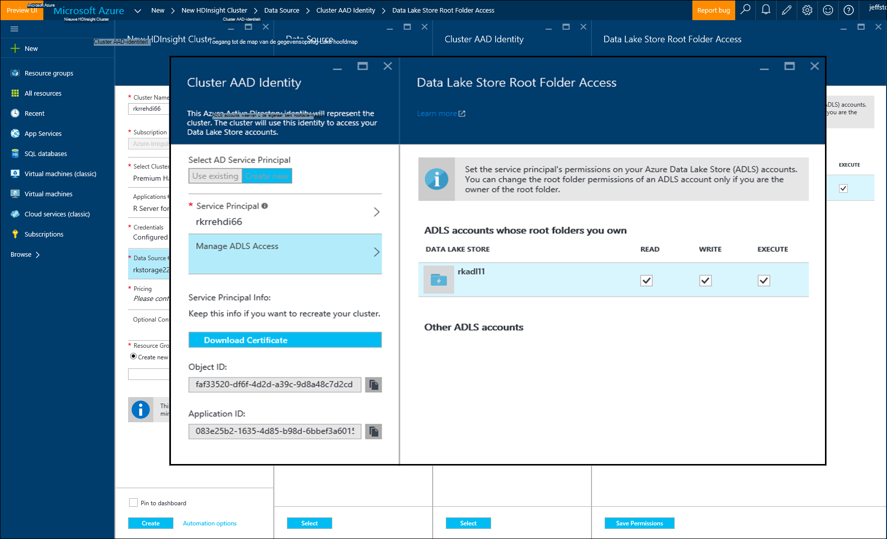

<properties
   pageTitle="Azure opslagopties voor R-Server op HDInsight (preview) | Microsoft Azure"
   description="Meer informatie over de verschillende opslagopties voor het beschikbaar voor gebruikers met R-Server op HDInsight (preview)"
   services="HDInsight"
   documentationCenter=""
   authors="jeffstokes72"
   manager="jhubbard"
   editor="cgronlun"
/>

<tags
   ms.service="HDInsight"
   ms.devlang="R"
   ms.topic="article"
   ms.tgt_pltfrm="na"
   ms.workload="data-services"
   ms.date="09/01/2016"
   ms.author="jeffstok"
/>

# <a name="azure-storage-options-for-r-server-on-hdinsight-preview"></a>Azure opslagopties voor R-Server op HDInsight (preview)

Microsoft R Server op HDInsight (preview) toegang heeft tot beide Azure Blob en [Azure Lake gegevensopslag](https://azure.microsoft.com/services/data-lake-store/), als een vastleggen van gegevens, code, objecten van analysis resultaat, enzovoort.

Wanneer u een Hadoop-cluster in HDInsight maakt, geeft u een Azure opslag-account. Een specifieke Blob storage container uit dat account bevat de-bestandssysteem voor het cluster die u (bijvoorbeeld de Hadoop Distributed File System maakt). Voor prestaties doeleinden, het cluster HDInsight gemaakt in de dezelfde Datacenter als het primaire opslag-account dat u opgeeft. Zie [Azure-blobopslag gebruiken met HDInsight](hdinsight-hadoop-use-blob-storage.md "Gebruik Azure-blobopslag met HDInsight")voor meer informatie.   


## <a name="use-multiple-azure-blob-storage-accounts"></a>Gebruik van meerdere Azure Blob storage-accounts

Zo nodig kunt u meerdere accounts van Azure opslag of containers openen met uw cluster HDI. Hiervoor moet u de extra opslagruimte-accounts in de gebruikersinterface opgeven wanneer u het cluster maken en volg deze stappen om te gebruiken in R.  

1.  Maak een HDInsight cluster met een naam voor het account van opslag van **storage1** en een standaard zogenaamd **container1**.
2. Geef een extra opslagruimte account **storage2**genoemd.  
3. Kopieer het bestand mycsv.csv naar de map/share en analyses uitvoeren op dat bestand.  

    ````
    hadoop fs –mkdir /share
    hadoop fs –copyFromLocal myscsv.scv /share  
    ````

3.  In R-code, het knooppunt van de naam is ingesteld op **standaard** en stel uw mappen en bestanden worden verwerkt.  

    ````
    myNameNode <- "default"
    myPort <- 0
    ````

  Locatie van de gegevens:  

    bigDataDirRoot <-"/ share"  

  Een berekeningscluster context definiëren:

    mySparkCluster <-RxSpark(consoleOutput=TRUE)

  Berekeningscluster context instellen:

    rxSetComputeContext(mySparkCluster)

  Definieer het bestandssysteem Hadoop Distributed bestand System (HDFS):

    hdfsFS <-RxHdfsFileSystem (hostName = myNameNode, poort = myPort)

  Geef het bestand invoer te analyseren in HDFS:

    Invoerbestand <-file.path(bigDataDirRoot,"mycsv.csv")

Alle mappen en bestanden referenties wijst u het account opslag wasbs://container1@storage1.blob.core.windows.net. Dit is het **standaardaccount voor de opslag** dat is gekoppeld aan het cluster HDInsight.

Stel nu dat u wilt een bestand met de naam van mySpecial.csv die in de /private bevindt zich verwerken directory van **container2** in **storage2**.

Wijs de naam knooppunt-verwijzing naar de **storage2** opslag-account in uw code R.

    myNameNode <- "wasbs://container2@storage2.blob.core.windows.net"
    myPort <- 0

  Locatie van de gegevens:

    bigDataDirRoot <- "/private"

  Een berekeningscluster context definiëren:

    mySparkCluster <- RxSpark(consoleOutput=TRUE, nameNode=myNameNode, port=myPort)

  Berekeningscluster context instellen:

    rxSetComputeContext(mySparkCluster)

  HDFS bestandssysteem definiëren:

    hdfsFS <- RxHdfsFileSystem(hostName=myNameNode, port=myPort)

  Geef het bestand invoer te analyseren in HDFS:

    inputFile <-file.path(bigDataDirRoot,"mySpecial.csv")

Alle mappen en bestanden referenties nu wijst u het account opslag wasbs://container2@storage2.blob.core.windows.net. Dit is het **Knooppunt van de naam** die u hebt opgegeven.

Opmerking dat u hebt voor het configureren van de/User/RevoShare/<SSH username> op **storage2** als volgt:

    hadoop fs -mkdir wasbs://container2@storage2.blob.core.windows.net/user
    hadoop fs -mkdir wasbs://container2@storage2.blob.core.windows.net/user/RevoShare
    hadoop fs -mkdir wasbs://container2@storage2.blob.core.windows.net/user/RevoShare/<RDP username>

## <a name="use-an-azure-data-lake-store"></a>Een archief Azure gegevens Lake gebruiken

Als u wilt meer gegevens worden gebruikt met uw HDInsight-account, moet u uw cluster toegang geven tot elke Azure gegevens Lake winkel die u wilt gebruiken. U gebruikt de store in uw script R net zoals u een secundaire opslag-account gebruikt (zoals beschreven in de vorige procedure).

## <a name="add-cluster-access-to-your-azure-data-lake-stores"></a>Toegang tot cluster toevoegen aan uw winkels Lake van Azure-gegevens

Er wordt een winkel gegevens Lake met behulp van een Service-hoofdsom van Azure Active Directory (Azure AD) dat is gekoppeld aan uw cluster HDInsight.

### <a name="to-add-a-service-principal"></a>De hoofdsom van een Service toevoegen
1. Wanneer u uw cluster HDInsight maakt, selecteert u **Cluster AAD identiteit** vanaf het tabblad van de **Gegevensbron** .
2. Selecteer in het dialoogvenster **Cluster AAD identiteit** , klik onder **Selecteer AD Service Principal**, **Nieuw**.

Nadat u de Service-Principal Geef een naam en een wachtwoord voor het maken, wordt een nieuw tabblad geopend waarin u de Service-Principal met uw gegevens Lake winkels kunt koppelen.

Opmerking dat u ook toegang aan een winkel gegevens Lake later toevoegen kunt door de gegevens Lake store openen in de Azure-portal en gaat u naar de **Data Explorer** > **Access**.  Hier volgt een voorbeeld van een dialoogvenster waarin u hoe leert u een Service Principal maken en koppelen aan de 'rkadl11' gegevens Lake store.




## <a name="use-the-data-lake-store-with-r-server"></a>De gegevens Lake store met R-Server gebruiken
Zodra u toegang tot een winkel gegevens Lake gegeven hebt, kunt u de store in R-Server op HDInsight de manier waarop u zou doen met een secundaire Azure opslag-account. Het enige verschil is dat het voorvoegsel **wasb: / /** wordt gewijzigd in **adl: / /** als volgt:

````
# Point to the ADL store (e.g. ADLtest)
myNameNode <- "adl://rkadl1.azuredatalakestore.net"
myPort <- 0

# Location of the data (assumes a /share directory on the ADL account)
bigDataDirRoot <- "/share"  

# Define Spark compute context
mySparkCluster <- RxSpark(consoleOutput=TRUE, nameNode=myNameNode, port=myPort)

# Set compute context
rxSetComputeContext(mySparkCluster)

# Define HDFS file system
hdfsFS <- RxHdfsFileSystem(hostName=myNameNode, port=myPort)

# Specify the input file in HDFS to analyze
inputFile <-file.path(bigDataDirRoot,"AirlineDemoSmall.csv")

# Create factors for days of the week
colInfo <- list(DayOfWeek = list(type = "factor",
               levels = c("Monday", "Tuesday", "Wednesday", "Thursday",
                          "Friday", "Saturday", "Sunday")))

# Define the data source
airDS <- RxTextData(file = inputFile, missingValueString = "M",
                    colInfo  = colInfo, fileSystem = hdfsFS)

# Run a linear regression
model <- rxLinMod(ArrDelay~CRSDepTime+DayOfWeek, data = airDS)
````

Hier volgen de opdrachten die worden gebruikt voor het account van gegevens meer opslagruimte met de adreslijst RevoShare configureren en het CSV-voorbeeldbestand toevoegen vanuit het vorige voorbeeld:

````
hadoop fs -mkdir adl://rkadl1.azuredatalakestore.net/user
hadoop fs -mkdir adl://rkadl1.azuredatalakestore.net/user/RevoShare
hadoop fs -mkdir adl://rkadl1.azuredatalakestore.net/user/RevoShare/<user>

hadoop fs -mkdir adl://rkadl1.azuredatalakestore.net/share

hadoop fs -copyFromLocal /usr/lib64/R Server-7.4.1/library/RevoScaleR/SampleData/AirlineDemoSmall.csv adl://rkadl1.azuredatalakestore.net/share

hadoop fs –ls adl://rkadl1.azuredatalakestore.net/share
````

## <a name="use-azure-files-on-the-edge-node"></a>Azure-bestanden op het randknooppunt gebruiken

Er is ook een gemakkelijke manier gegevens opslag-optie voor gebruik op de randknooppunt [Azure bestanden](../storage/storage-how-to-use-files-linux.md "Azure bestanden")genoemd. U kunt een bestandsshare Azure Storage om het bestandssysteem Linux te koppelen. Dit is handig voor het opslaan van bestanden, R-scripts en resultaatobjecten die mogelijk zijn er nodig later als dat relevant is voor het gebruik van de systeemeigen bestandssysteem op de randknooppunt in plaats van HDFS.

Een belangrijk voordeel van Azure bestanden is dat de bestandsshares kunnen worden gekoppeld en die wordt gebruikt door elk systeem met een ondersteund besturingssysteem zoals Windows of Linux. Dit kan bijvoorbeeld worden gebruikt door een andere HDInsight cluster waarop u of iemand in uw team, door een VM Azure of zelfs door een on-premises-systeem.


## <a name="next-steps"></a>Volgende stappen

Nu dat u de basisbeginselen van het gebruik van de R-console uit een sessie SSH en hoe u een nieuwe HDInsight cluster met R Server maken, gebruikt u de volgende koppelingen naar andere manieren van het werken met R-Server op HDInsight ontdekken.

- [Overzicht van R-Server op HDInsight](hdinsight-hadoop-r-server-overview.md)
- [Aan de slag met R-server op Hadoop](hdinsight-hadoop-r-server-get-started.md)
- [RStudio Server toevoegen aan HDInsight premium](hdinsight-hadoop-r-server-install-r-studio.md)
- [Context-opties voor R-Server op HDInsight berekenen](hdinsight-hadoop-r-server-compute-contexts.md)
