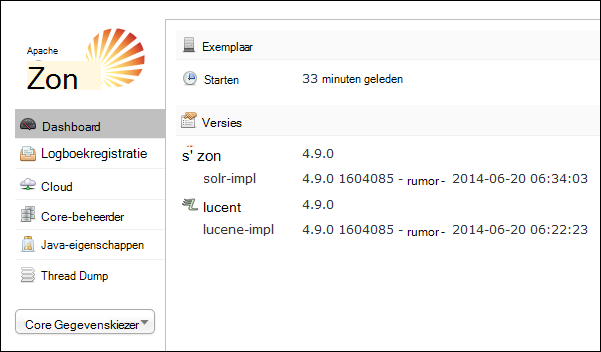
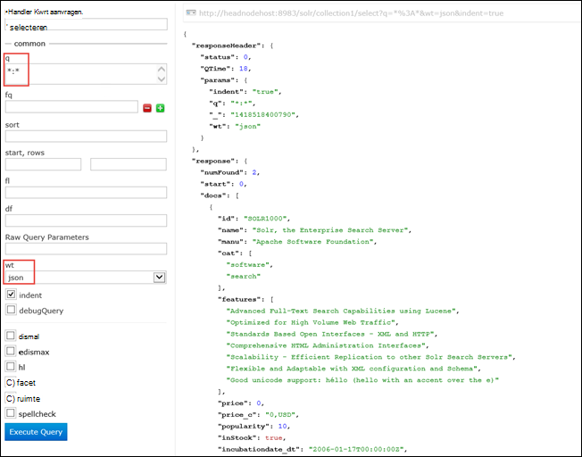

<properties
    pageTitle="Gebruik van scriptactie Solr installeren op Linux gebaseerde HDInsight | Microsoft Azure"
    description="Informatie over het installeren van Solr op HDInsight Hadoop Linux gebaseerde clusters scriptacties gebruiken."
    services="hdinsight"
    documentationCenter=""
    authors="Blackmist"
    manager="jhubbard"
    editor="cgronlun"
    tags="azure-portal"/>

<tags
    ms.service="hdinsight"
    ms.workload="big-data"
    ms.tgt_pltfrm="na"
    ms.devlang="na"
    ms.topic="article"
    ms.date="10/03/2016"
    ms.author="larryfr"/>

# Installeren en gebruiken van Solr op HDInsight Hadoop clusters

In dit onderwerp leert u hoe u Solr installeert op Azure HDInsight met behulp van scriptactie. Solr is een krachtige zoeken-platform en enterprise-niveau zoekmogelijkheden biedt aan gegevens die worden beheerd door Hadoop. Wanneer u Solr op HDInsight cluster hebt geïnstalleerd, leert u ook hoe u gegevens zoeken met behulp van Solr.

> [AZURE.NOTE] De stappen in dit document moet een cluster Linux gebaseerde HDInsight. Zie voor informatie over het gebruik van Solr met een Windows gebaseerde cluster [installeren en gebruiken Solr op HDinsight Hadoop clusters (Windows)](hdinsight-hadoop-solr-install.md)

Het voorbeeldscript gebruikt in dit onderwerp wordt een cluster Solr gemaakt met een specifieke configuratie. Als u het cluster Solr configureren met verschillende siteverzamelingen, shards, schema's, replica's, enzovoort wilt, moet u aanpassen het script en Solr binaire bestanden.

## Wat is Solr?

[Apache Solr](http://lucene.apache.org/solr/features.html) is een enterprise search-platform waarmee u krachtige zoeken in de volledige tekst van gegevens. Terwijl Hadoop kunt opslaan en beheren van grote hoeveelheden gegevens, biedt Apache Solr de zoekmogelijkheden snel de gegevens worden opgehaald. In dit onderwerp bevat instructies voor het aanpassen van een cluster HDInsight om te kunnen installeren Solr.

> [AZURE.WARNING] Onderdelen van het cluster HDInsight volledig worden ondersteund en Microsoft Support helpt isoleren en oplossen van problemen met deze onderdelen.
>
> Aangepaste onderdelen, zoals Solr, ontvangen commercieel redelijk ondersteuning waarmee u kunt het probleem verder kunt oplossen. Dit kan leiden tot het probleem oplossen of vraag of u kunt voeren beschikbare kanalen voor de bron openen technologieën waar uitgebreide expertise voor deze technologie is gevonden. Bijvoorbeeld, zijn er veel communitysites die kunnen worden gebruikt, zoals: [MSDN-forum voor HDInsight](https://social.msdn.microsoft.com/Forums/azure/en-US/home?forum=hdinsight), [http://stackoverflow.com](http://stackoverflow.com). Apache projecten tevens projectsites op [http://apache.org](http://apache.org), bijvoorbeeld: [Hadoop](http://hadoop.apache.org/).

## Werking van het script

Dit script zorgt ervoor dat de volgende wijzigingen aan het cluster HDInsight:

* Installaties Solr in`/usr/hdp/current/solr`
* Hiermee maakt u een nieuwe gebruiker, __solrusr__, die wordt gebruikt voor het uitvoeren van de service Solr
* Hiermee stelt u __solruser__ als de eigenaar van`/usr/hdp/current/solr`
* Een [Upstart](http://upstart.ubuntu.com/) -configuratie die Solr wordt gestart als een clusterknooppunt opnieuw is opgestart toevoegen. Solr wordt ook automatisch knooppunten na de installatie gestart

## Installeer Solr scriptacties gebruiken

Een voorbeeldscript Solr installeren op een cluster HDInsight is beschikbaar op de volgende locatie.

    https://hdiconfigactions.blob.core.windows.net/linuxsolrconfigactionv01/solr-installer-v01.sh

In deze sectie bevat instructies over het gebruik van het voorbeeldscript bij het maken van een nieuw cluster met behulp van de Azure-portal. 

> [AZURE.NOTE] Azure PowerShell, de CLI Azure, de HDInsight .NET SDK of Azure resourcemanager sjablonen kunnen ook worden gebruikt om toe te passen scriptacties. U kunt ook scriptacties toepassen op clusters is gebeurd. Zie [aanpassen HDInsight clusters met scriptacties](hdinsight-hadoop-customize-cluster-linux.md)voor meer informatie.

1. Start de inrichting van een cluster met behulp van de stappen in de [voorziening Linux gebaseerde HDInsight clusters](hdinsight-hadoop-create-linux-clusters-portal.md), maar inrichting niet voltooien.

2. Selecteer **Scriptacties**op het blad **Optionele configuratie** en de onderstaande informatie opgeven:

    * __Naam__: Voer een beschrijvende naam voor de scriptactie.
    * __SCRIPT URI__: https://hdiconfigactions.blob.core.windows.net/linuxsolrconfigactionv01/solr-installer-v01.sh
    * __Hoofd__: Schakel deze optie
    * __Werknemer__: Schakel deze optie
    * __ZOOKEEPER__: Schakel deze optie om te installeren op het knooppunt Zookeeper
    * __PARAMETERS__: laat dit veld leeg

3. Gebruik de knop **selecteren** de configuratie opslaan onderaan in de **Script-acties**. Gebruik ten slotte de knop **selecteren** onderaan in het blad **Optionele configuratie** optionele configuratie informatie wilt opslaan.

4. Ga verder met het cluster inrichting zoals is beschreven in [HDInsight inrichten Linux gebaseerde clusters](hdinsight-hadoop-create-linux-clusters-portal.md).

## Hoe gebruik ik Solr in HDInsight?

### Indexeren van gegevens

U moet beginnen met het indexeren Solr met enkele gegevensbestanden. U kunt vervolgens Solr zoekquery's uitvoeren op de geïndexeerde gegevens. Gebruik van de volgende stappen enkele voorbeeldgegevens toevoegen aan Solr en vervolgens deze query:

1. Verbinding maken met het HDInsight cluster SSH gebruiken:

        ssh USERNAME@CLUSTERNAME-ssh.azurehdinsight.net

    Zie de volgende onderwerpen voor meer informatie over het gebruik van SSH met HDInsight:

    * [SSH gebruiken met Linux gebaseerde Hadoop op HDInsight uit Linux, Unix of OS X](hdinsight-hadoop-linux-use-ssh-unix.md)

    * [SSH gebruiken met Linux gebaseerde Hadoop op HDInsight vanuit Windows](hdinsight-hadoop-linux-use-ssh-windows.md)

    > [AZURE.IMPORTANT] Stappen verderop in dit document plaatsen met van een SSL-tunnel verbinding maken met het web Solr UI. Pas deze stappen gebruiken, moet u geen een SSL-tunnel en configureer uw browser om het te gebruiken.
    >
    > Zie [Gebruik SSH tunnel naar Ambari web UI, ResourceManager, JobHistory, NameNode, Oozie, en andere web van UI openen](hdinsight-linux-ambari-ssh-tunnel.md) voor meer informatie

2. De volgende opdrachten gebruiken om te laten Solr index voorbeeldgegevens:

        cd /usr/hdp/current/solr/example/exampledocs
        java -jar post.jar solr.xml monitor.xml

    Klik op de console ziet u het volgende resultaat:

        POSTing file solr.xml
        POSTing file monitor.xml
        2 files indexed.
        COMMITting Solr index changes to http://localhost:8983/solr/update..
        Time spent: 0:00:01.624

    Het hulpprogramma post.jar indexeert Solr met twee steekproeven documenten, **solr.xml** en **monitor.xml**. Deze worden opgeslagen in __collection1__ binnen Solr.

3. Gebruik de volgende handelingen uit om de REST API die worden aangeboden door Solr query:

        curl "http://localhost:8983/solr/collection1/select?q=*%3A*&wt=json&indent=true"

    Dit een query op __collection1__ voor alle documenten die overeenkomen met problemen __ \*:\* __ (gecodeerd als \*% 3A\* in de queryreeks) en dat het antwoord moet worden geretourneerd als JSON. Het antwoord ziet er ongeveer als volgt uit:

            "response": {
                "numFound": 2,
                "start": 0,
                "maxScore": 1,
                "docs": [
                  {
                    "id": "SOLR1000",
                    "name": "Solr, the Enterprise Search Server",
                    "manu": "Apache Software Foundation",
                    "cat": [
                      "software",
                      "search"
                    ],
                    "features": [
                      "Advanced Full-Text Search Capabilities using Lucene",
                      "Optimized for High Volume Web Traffic",
                      "Standards Based Open Interfaces - XML and HTTP",
                      "Comprehensive HTML Administration Interfaces",
                      "Scalability - Efficient Replication to other Solr Search Servers",
                      "Flexible and Adaptable with XML configuration and Schema",
                      "Good unicode support: héllo (hello with an accent over the e)"
                    ],
                    "price": 0,
                    "price_c": "0,USD",
                    "popularity": 10,
                    "inStock": true,
                    "incubationdate_dt": "2006-01-17T00:00:00Z",
                    "_version_": 1486960636996878300
                  },
                  {
                    "id": "3007WFP",
                    "name": "Dell Widescreen UltraSharp 3007WFP",
                    "manu": "Dell, Inc.",
                    "manu_id_s": "dell",
                    "cat": [
                      "electronics and computer1"
                    ],
                    "features": [
                      "30\" TFT active matrix LCD, 2560 x 1600, .25mm dot pitch, 700:1 contrast"
                    ],
                    "includes": "USB cable",
                    "weight": 401.6,
                    "price": 2199,
                    "price_c": "2199,USD",
                    "popularity": 6,
                    "inStock": true,
                    "store": "43.17614,-90.57341",
                    "_version_": 1486960637584081000
                  }
                ]
              }

### Gebruik van het dashboard Solr

Het dashboard Solr is een web UI waarmee u kunt werken met Solr via uw webbrowser. Het dashboard Solr niet rechtstreeks op Internet uit uw cluster HDInsight worden weergegeven, maar moet worden geopend met een tunnel SSH. Zie voor meer informatie over het gebruik van een tunnel SSH, [Gebruik SSH tunnel naar Ambari web UI, ResourceManager, JobHistory, NameNode, Oozie, en andere web van UI openen](hdinsight-linux-ambari-ssh-tunnel.md)

Zodra u een tunnel SSH hebt vastgesteld, gebruik de volgende stappen uit om het dashboard Solr:

1. De hostnaam van de voor de primaire headnode bepalen:

    1. Met SSH verbinding maken met het cluster op poort 22. Bijvoorbeeld `ssh USERNAME@CLUSTERNAME-ssh.azurehdinsight.net` waarbij __gebruikersnaam__ uw gebruikersnaam SSH is en __CLUSTERNAAM__ is de naam van uw cluster.

        Zie de volgende documenten voor meer informatie over het gebruik van SSH:

        * [SSH gebruiken met Linux gebaseerde HDInsight van een client Linux, Unix of Mac OS X](hdinsight-hadoop-linux-use-ssh-unix.md)

        * [SSH gebruiken met Linux gebaseerde HDInsight vanuit een Windows-client](hdinsight-hadoop-linux-use-ssh-windows.md)
    
    3. Gebruik de volgende opdracht uit om de volledig gekwalificeerde hostnaam:

            hostname -f

        Hiermee herstelt u een naam ongeveer als volgt uit:

            hn0-myhdi-nfebtpfdv1nubcidphpap2eq2b.ex.internal.cloudapp.net
    
        Dit is de hostnaam die moet worden gebruikt in de volgende stappen.
    
1. Klik in de browser verbinding maken met __http://HOSTNAME:8983/solr / #/__, waarbij __HOSTNAME__ de naam die u hebt vastgesteld in de vorige stappen. 

    Het verzoek moet worden gerouteerd via de tunnel SSH naar het hoofd knooppunt voor uw cluster HDInsight. Hier ziet u een pagina ongeveer als volgt uit:

    

2. Gebruik de **Core Gegevenskiezer** vervolgkeuzelijst **collection1**selecteren in het linkerdeelvenster. Meerdere posten moeten ze worden weergegeven onder __collection1__.

3. Selecteer de vermeldingen onder __collection1__ __Query__. Gebruik de volgende waarden om te vullen de zoekpagina:

    * Voer in het tekstvak **q** ** \*:**\*. Hiermee herstelt u alle documenten die zijn geïndexeerd in Solr. Als u zoeken naar een specifieke tekenreeks binnen de documenten wilt, kunt u die tekenreeks hier invoeren.

    * Selecteer in het tekstvak **wt** de uitvoerindeling. Standaard is **json**.

    Ten slotte, selecteer de knop **Zoekopdracht uitvoeren** onder aan de pate zoeken.

    

    De uitvoer geeft als resultaat de twee documenten die wordt gebruikt voor het indexeren Solr. De uitvoer er ongeveer als volgt te werk:

            "response": {
                "numFound": 2,
                "start": 0,
                "maxScore": 1,
                "docs": [
                  {
                    "id": "SOLR1000",
                    "name": "Solr, the Enterprise Search Server",
                    "manu": "Apache Software Foundation",
                    "cat": [
                      "software",
                      "search"
                    ],
                    "features": [
                      "Advanced Full-Text Search Capabilities using Lucene",
                      "Optimized for High Volume Web Traffic",
                      "Standards Based Open Interfaces - XML and HTTP",
                      "Comprehensive HTML Administration Interfaces",
                      "Scalability - Efficient Replication to other Solr Search Servers",
                      "Flexible and Adaptable with XML configuration and Schema",
                      "Good unicode support: héllo (hello with an accent over the e)"
                    ],
                    "price": 0,
                    "price_c": "0,USD",
                    "popularity": 10,
                    "inStock": true,
                    "incubationdate_dt": "2006-01-17T00:00:00Z",
                    "_version_": 1486960636996878300
                  },
                  {
                    "id": "3007WFP",
                    "name": "Dell Widescreen UltraSharp 3007WFP",
                    "manu": "Dell, Inc.",
                    "manu_id_s": "dell",
                    "cat": [
                      "electronics and computer1"
                    ],
                    "features": [
                      "30\" TFT active matrix LCD, 2560 x 1600, .25mm dot pitch, 700:1 contrast"
                    ],
                    "includes": "USB cable",
                    "weight": 401.6,
                    "price": 2199,
                    "price_c": "2199,USD",
                    "popularity": 6,
                    "inStock": true,
                    "store": "43.17614,-90.57341",
                    "_version_": 1486960637584081000
                  }
                ]
              }

### Starten en stoppen Solr

Als u nodig hebt handmatig worden Solar starten of stoppen, gebruikt u de volgende opdrachten:

    sudo stop solr

    sudo start solr

## Geïndexeerde doos

Als een goede gewoonte, moet u back-up van de geïndexeerde gegevens van knooppunten Solr naar Azure-blobopslag. Doe het volgende doen:

1. Verbinding maken met het cluster via SSH en het gebruik van de volgende opdracht uit om de hostnaam voor het hoofd knooppunt verkrijgen:

        hostname -f
        
2. Gebruik de volgende handelingen uit om te maken van een momentopname van de geïndexeerde gegevens. __HOSTNAME__ vervangen door de naam van de vorige opdracht geretourneerd:

        curl http://HOSTNAME:8983/solr/replication?command=backup

    Hier ziet u een antwoord als volgt:

        <?xml version="1.0" encoding="UTF-8"?>
        <response>
          <lst name="responseHeader">
            <int name="status">0</int>
            <int name="QTime">9</int>
          </lst>
          <str name="status">OK</str>
        </response>

2. Wijzig vervolgens mappen in __/usr/hdp/current/solr/example/solr__. Er is een submap voor elke siteverzameling. Elke map van de siteverzameling bevat een map __gegevens__ , dat wil zeggen waar de momentopname voor die siteverzameling bevindt zich bevindt.

    Bijvoorbeeld als u de stappen eerder gebruikt bij het indexeren van de steekproef-documenten, de map __/usr/hdp/current/solr/example/solr/collection1/data__ bevat nu een map met de naam __momentopname. ###__ waar de (#) zijn de datum en tijd van de opname.

3. Maak een gecomprimeerde archief van de map met momentopnamen met een opdracht ongeveer als volgt uit:

        tar -zcf snapshot.20150806185338855.tgz snapshot.20150806185338855

    Hiermee maakt u een nieuwe archiveren met de naam __snapshot.20150806185338855.tgz__, waarin de inhoud van de map __snapshot.20150806185338855__ .

3. U kunt vervolgens het archief met van het cluster primaire storage met de volgende opdracht opslaan:

    hadoop fs - copyFromLocal snapshot.20150806185338855.tgz/voorbeeld/gegevens

    > [AZURE.NOTE] Het is raadzaam een speciale map voor het opslaan van Solr momentopnamen maken. Bijvoorbeeld `hadoop fs -mkdir /solrbackup`.

Zie [maken en terugzetten van back-ups van SolrCores](https://cwiki.apache.org/confluence/display/solr/Making+and+Restoring+Backups+of+SolrCores)voor meer informatie over het werken met Solr back-up en herstellen.

## Zie ook

- [Installeren en gebruiken kleurtoon op HDInsight clusters](hdinsight-hadoop-hue-linux.md). Kleurtoon is web UI waarmee u gemakkelijk maken, uitvoeren en opslaan varken en component taken, evenals bladeren de standaard-opslag voor uw HDInsight cluster.

- [R installeren op HDInsight clusters][hdinsight-install-r]. Gebruik cluster aanpassing R installeren op HDInsight Hadoop clusters. R is een open source taal- en -omgeving voor statistische computing. Deze bevat honderden ingebouwde statistische functies en een eigen programmeertaal die worden gecombineerd aspecten van het functionele en object-georiënteerd programmeren. Ook vindt u hier de uitgebreide mogelijkheden voor grafische.

- [Giraph op HDInsight clusters installeren](hdinsight-hadoop-giraph-install-linux.md). Gebruik cluster aanpassing Giraph installeren op HDInsight Hadoop clusters. Giraph kunt u graph verwerken met behulp van Hadoop uitvoeren en kan worden gebruikt met Azure HDInsight.

- [Kleurtoon op HDInsight clusters installeren](hdinsight-hadoop-hue-linux.md). Gebruik cluster aanpassing Kleurtoon op HDInsight Hadoop clusters installeren. Kleurtoon is een verzameling webtoepassingen gebruikt om te communiceren met een Hadoop-cluster.

[hdinsight-install-r]: hdinsight-hadoop-r-scripts-linux.md
[hdinsight-cluster-customize]: hdinsight-hadoop-customize-cluster-linux.md
