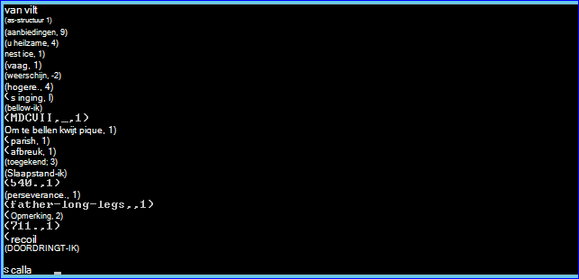
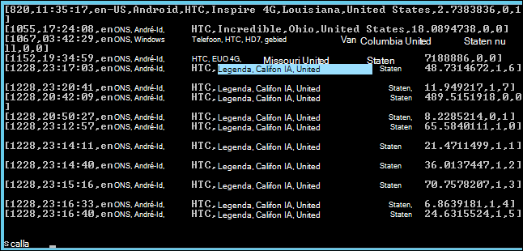

<properties
    pageTitle="Gebruik van scriptactie voor het installeren van een op Hadoop cluster | Microsoft Azure"
    description="Informatie over het aanpassen van een HDInsight cluster met uitgerust met de Script-actie."
    services="hdinsight"
    documentationCenter=""
    authors="nitinme"
    manager="jhubbard"
    editor="cgronlun"/>

<tags
    ms.service="hdinsight"
    ms.workload="big-data"
    ms.tgt_pltfrm="na"
    ms.devlang="na"
    ms.topic="article"
    ms.date="02/05/2016"
    ms.author="nitinme"/>

# Installeren en gebruiken van een op HDInsight Hadoop clusters met de actie Script

> [AZURE.IMPORTANT] In dit artikel is nu afgeschaft. HDInsight biedt nu een als een eersteklas cluster voor Windows gebaseerde kolomgroepen wat inhoudt dat u nu rechtstreeks een cluster elektrische maken kunt zonder een Hadoop-cluster met scriptactie worden gewijzigd. Het type van een cluster krijgt u een HDInsight versie 3,2 cluster met een versie 1.3.1.  Als u wilt verschillende versies van een hebt geïnstalleerd, kunt u scriptactie. HDInsight biedt een scriptactie voorbeeldscript.

Leer hoe u een installeert op Windows op basis van HDInsight met de actie Script en hoe u een query's uitvoeren op HDInsight clusters.

**Verwante artikelen**

- [Hadoop maken clusters in HDInsight](hdinsight-provision-clusters.md): algemene informatie over het maken van HDInsight clusters.

- [Aan de slag met Apache elektrische op HDInsight](hdinsight-apache-spark-jupyter-spark-sql.md): een cluster HDInsight Spark maken.

- [Aanpassen HDInsight cluster met scriptactie][hdinsight-cluster-customize]: algemene informatie over het aanpassen van HDInsight clusters met de Script-actie.

- [Ontwikkel scriptactie-scripts voor HDInsight](hdinsight-hadoop-script-actions.md).

## Wat is een?

<a href="http://spark.apache.org/docs/latest/index.html" target="_blank">Apache elektrische</a> is een open source parallel processing die ondersteuning biedt voor de verwerking in het geheugen om zo de prestaties van groot-gegevens analytische toepassingen. Een van de berekening in het geheugen mogelijkheden kunnen u een goede keuze voor iteratieve algoritmen in machine learning en graph berekeningen.

Elektrische kan ook worden gebruikt om uit te voeren gebruikelijke gegevensverwerking van op de schijf. Elektrische verbetert de traditionele MapReduce framework door te schrijven naar schijf in de tussenliggende fasen vermijden. Ook is een compatibel met de Hadoop Distributed bestand System (HDFS) en Azure Blob storage zodat de bestaande gegevens via een eenvoudig kan worden verwerkt.

In dit onderwerp bevat instructies voor het aanpassen van een cluster HDInsight als u wilt een installeren.

## Installeren met behulp van de Portal Azure elektrische

Een voorbeeldscript elektrische installeren op een cluster HDInsight vindt u in een alleen-lezen opslag van Azure blob bij [https://hdiconfigactions.blob.core.windows.net/sparkconfigactionv03/spark-installer-v03.ps1](https://hdiconfigactions.blob.core.windows.net/sparkconfigactionv03/spark-installer-v03.ps1). Dit script kunt installeren elektrische 1.2.0 of een 1.0.2 afhankelijk van de versie van het HDInsight cluster die u maakt.

- Als u het script tijdens het maken van een cluster **HDInsight 3,2** gebruikt, wordt er **een 1.2.0**.
- Als u het script tijdens het maken van een cluster **HDInsight 3.1** gebruikt, wordt er **een 1.0.2**.

U kunt dit script wijzigen of uw eigen script om te kunnen installeren van andere versies van een maken.

> [AZURE.NOTE] Het voorbeeldscript werkt alleen met HDInsight 3.1 en 3,2 clusters. Zie voor meer informatie over HDInsight cluster versies, [HDInsight cluster versies](hdinsight-component-versioning.md).

1. Beginnen met het maken van een cluster met behulp van de optie **Aangepaste maken** , zoals beschreven op [Hadoop maken clusters in HDInsight](hdinsight-provision-clusters.md#portal). Kies de versie cluster afhankelijk van het volgende:

    - Als u **een 1.2.0**installeren wilt, maakt u een cluster HDInsight 3,2.
    - Als u **een 1.0.2**installeren wilt, maakt u een cluster HDInsight 3.1.

2. Klik op de pagina **Scriptacties** van de wizard op **scriptactie toevoegen** voor meer informatie over de scriptactie, zoals hieronder wordt weergegeven:

    ![Gebruik scriptactie om aan te passen een cluster] (./media/hdinsight-hadoop-spark-install/HDI.CustomProvision.Page6.png "Gebruik scriptactie om aan te passen een cluster")

    <table border='1'>
        <tr><th>Eigenschap</th><th>Waarde</th></tr>
        <tr><td>Naam</td>
            <td>Geef een naam voor de scriptactie. Bijvoorbeeld <b>Een installeren</b>.</td></tr>
        <tr><td>Script URI</td>
            <td>Geef de id URI (Uniform Resource) aan het script die als u wilt aanpassen van het cluster wordt geactiveerd. Bijvoorbeeld: <i>https://hdiconfigactions.blob.core.windows.net/sparkconfigactionv03/spark-installer-v03.ps1</i></td></tr>
        <tr><td>Knooppunttype</td>
            <td>Geef de knooppunten waarop het script aanpassing wordt uitgevoerd. U kunt <b>alle knooppunten</b>, <b>alleen hoofd knooppunten</b>of <b>alleen werknemer knooppunten</b>.
        <tr><td>Parameters</td>
            <td>Geef de parameters, indien nodig door het script. Het script voor het installeren van een hoeft niet alle parameters, zodat u kunt dit leeg laat.</td></tr>
    </table>

    U kunt meer dan één scriptactie om meerdere onderdelen op het cluster toevoegen. Nadat u de scripts hebt toegevoegd, klikt u op het vinkje om te beginnen met het maken van het cluster.

U kunt ook het script gebruiken voor het installeren van een op HDInsight via Azure PowerShell of de HDInsight .NET SDK. Instructies voor deze procedures worden verderop in dit onderwerp gegeven.

## Elektrische in HDInsight gebruiken
Elektrische biedt API's in Scala, Python en Java. U kunt ook de interactieve elektrische shell aan een query's uitvoeren. Deze sectie bevat instructies over het gebruik van de verschillende methoden voor gebruik met een:

- [Gebruik de shell een interactieve query's uitvoeren](#sparkshell)
- [Gebruik de shell elektrische een SQL-query's uitvoeren](#sparksql)
- [Een zelfstandige Scala-programma gebruiken](#standalone)

###Gebruik de shell een interactieve query's uitvoeren
De volgende stappen uitvoeren van een query's uit een interactieve elektrische shell uitvoeren. In dit gedeelte we een query's uitvoeren op een voorbeeld van gegevensbestand (/ example/data/gutenberg/davinci.txt) die beschikbaar is op HDInsight clusters al dan niet standaard.

1. Schakel in de portal Azure extern bureaublad voor het cluster die u hebt gemaakt met een geïnstalleerd en vervolgens remote in het cluster. Zie [verbinding maken met HDInsight clusters met RDP](hdinsight-administer-use-management-portal.md#rdp)voor instructies.

2. Open de opdrachtregel Hadoop (vanuit een snelkoppeling op het bureaublad) in de sessie Remote Desktop Protocol (RDP), vanaf het bureaublad, en navigeer naar de locatie waar een is geïnstalleerd. bijvoorbeeld: **C:\apps\dist\spark-1.2.0**.

3. Voer de volgende opdracht de shell elektrische starten:

         .\bin\spark-shell --master yarn

    Nadat de opdracht is voltooid, krijgt u een Scala vragen in:

         scala>

5. Voer de elektrische query hieronder wordt weergegeven op de prompt Scala. Deze query telt het exemplaar van elk woord in het davinci.txt-bestand dat is beschikbaar op de/voorbeeld/gegevens/gutenberg/locatie op de Azure-blobopslag die is gekoppeld aan het cluster.

        val file = sc.textFile("/example/data/gutenberg/davinci.txt")
        val counts = file.flatMap(line => line.split(" ")).map(word => (word, 1)).reduceByKey(_ + _)
        counts.toArray().foreach(println)

6. De uitvoer moet er dan ongeveer als volgt te werk:

    

7. Voer: q om af te sluiten van de vraag Scala.

        :q

###Gebruik de shell elektrische een SQL-query's uitvoeren

Een SQL kunt u met een relationele query's, uitgedrukt in taal SQL (Structured Query), HiveQL of Scala uitvoeren. In dit gedeelte kijken we naar het gebruik van een een component-query uitvoeren op een component voorbeeldtabel. De component-tabel die wordt gebruikt in deze sectie ( **hivesampletable**genoemd) is standaard beschikbaar wanneer u een cluster maakt.

>[AZURE.NOTE] Het onderstaande voorbeeld is gemaakt tegen **dus 1.2.0**, die wordt geïnstalleerd als u de scriptactie tijdens het maken van HDInsight 3,2 cluster uitvoeren.

1. Schakel in de portal Azure extern bureaublad voor het cluster die u hebt gemaakt met een geïnstalleerd en vervolgens remote in het cluster. Zie [verbinding maken met HDInsight clusters met RDP](hdinsight-administer-use-management-portal.md#rdp)voor instructies.

2. Open de opdrachtregel Hadoop (vanuit een snelkoppeling op het bureaublad) in de RDP-sessie, vanaf het bureaublad, en navigeer naar de locatie waar een is geïnstalleerd. bijvoorbeeld: **C:\apps\dist\spark-1.2.0**.

3. Voer de volgende opdracht de shell elektrische starten:

         .\bin\spark-shell --master yarn

    Nadat de opdracht is voltooid, krijgt u een Scala vragen in:

         scala>

4. Stel de component context op de prompt Scala. Dit is verplicht voor het werken met component query's met behulp van een.

        val hiveContext = new org.apache.spark.sql.hive.HiveContext(sc)

    Houd er rekening mee dat **sc** wordt standaard een context die is ingesteld tijdens het starten van de shell elektrische.

5. Component query's uitvoeren met behulp van de context component en de afdrukopties aan de console. De query haalt gegevens op apparaten met een specifieke tabelmaakquery en het aantal records dat wordt opgehaald tot en met 20 beperkt.

        hiveContext.sql("""SELECT * FROM hivesampletable WHERE devicemake LIKE "HTC%" LIMIT 20""").collect().foreach(println)

6. Hier ziet u een uitvoer als volgt uit:

    

7. Voer: q om af te sluiten van de vraag Scala.

        :q

### Een zelfstandige Scala-programma gebruiken

In dit gedeelte we een Scala toepassing schrijven die telt het aantal regels met de letters "a" en "b" in een voorbeeld van gegevensbestand (/ example/data/gutenberg/davinci.txt) die beschikbaar is op HDInsight clusters al dan niet standaard. Als u wilt schrijven en een zelfstandig Scala programma gebruiken met een aangepast met door de installatie van een cluster, moet u de volgende stappen uitvoeren:

- Schrijf een Scala-programma
- Het programma Scala om het bestand .jar maken
- De taak uitvoeren op het cluster

#### Schrijf een Scala-programma
In deze sectie, schrijft u een Scala-programma dat telt het aantal regels met "a" en "b" in het voorbeeld van gegevensbestand.

1. Open een teksteditor en plak de volgende code:

        /* SimpleApp.scala */
        import org.apache.spark.SparkContext
        import org.apache.spark.SparkContext._
        import org.apache.spark.SparkConf

        object SimpleApp {
          def main(args: Array[String]) {
            val logFile = "/example/data/gutenberg/davinci.txt"         //Location of the sample data file on Azure Blob storage
            val conf = new SparkConf().setAppName("SimpleApplication")
            val sc = new SparkContext(conf)
            val logData = sc.textFile(logFile, 2).cache()
            val numAs = logData.filter(line => line.contains("a")).count()
            val numBs = logData.filter(line => line.contains("b")).count()
            println("Lines with a: %s, Lines with b: %s".format(numAs, numBs))
          }
        }

2. Sla het bestand met de naam **SimpleApp.scala**.

#### Het programma Scala maken
In deze sectie gebruikt u de <a href="http://www.scala-sbt.org/0.13/docs/index.html" target="_blank">Eenvoudige hulpprogramma maken</a> (of sbt) maken van het programma Scala. SBT Java 1,6 of later vereist, dus te controleren of u de juiste versie van Java geïnstalleerd voordat u verdergaat met deze sectie.

1. Installeer sbt vanaf http://www.scala-sbt.org/0.13/tutorial/Installing-sbt-on-Windows.html.
2. Maken van een map genaamd **SimpleScalaApp**en maak een bestand met de naam van **simple.sbt**in deze map. Dit is een configuratiebestand met informatie over de Scala versie, bibliotheek afhankelijkheden, enzovoort. Plak de volgende handelingen uit in het simple.sbt-bestand en sla het:

        name := "SimpleApp"

        version := "1.0"

        scalaVersion := "2.10.4"

        libraryDependencies += "org.apache.spark" %% "spark-core" % "1.2.0"

    >[AZURE.NOTE] Zorg ervoor dat u de lege regels in het bestand bewaren.

3. Klik onder de map **SimpleScalaApp** , een directory structuur **\src\main\scala** maken en plak het Scala programma (**SimpleApp.scala**) die u eerder hebt gemaakt onder de map \src\main\scala.
4. Open een opdrachtprompt, Ga naar de map SimpleScalaApp en voer de volgende opdracht:

        sbt package

    Zodra de toepassing is gecompileerd, ziet u een **simpleapp_2.10-1.0.jar** -bestand dat is gemaakt in de map **\target\scala-2.10** binnen de hoofdmap van de SimpleScalaApp.

#### De taak uitvoeren op het cluster
In deze sectie, moet u in de cluster met een externe geïnstalleerd en kopieer van het project SimpleScalaApp doelmap. U de opdracht **elektrische indienen** gebruiken om in te dienen de taak op het cluster.

1. De afstand in het cluster met een geïnstalleerd. Vanaf de computer waarop u hebt geschreven en het programma SimpleApp.scala ingebouwd, de map **SimpleScalaApp\target** kopieert en plakt u deze naar een locatie op het cluster.
2. In de RDP-sessie, vanaf het bureaublad, opent u de opdrachtregel Hadoop en navigeer naar de locatie waar u **de doelmap** geplakt.
3. Voer de volgende opdracht uit het programma SimpleApp.scala uit te voeren:

        C:\apps\dist\spark-1.2.0\bin\spark-submit --class "SimpleApp" --master local target/scala-2.10/simpleapp_2.10-1.0.jar

4. Wanneer het programma is voltooid, wordt de uitvoer weergegeven op de console.

        Lines with a: 21374, Lines with b: 11430

## Elektrische via Azure PowerShell installeren

In deze sectie gebruiken we de cmdlet **<a href = "http://msdn.microsoft.com/library/dn858088.aspx" target="_blank">Toevoegen-AzureHDInsightScriptAction</a>** aan te roepen van scripts met behulp van scriptactie om aan te passen een cluster. Zorg ervoor dat u hebt geïnstalleerd en geconfigureerd Azure PowerShell voordat u verdergaat. Zie voor informatie over het configureren van een werkstation om uit te voeren Azure PowerShell-cmdlets voor HDInsight [installeren en configureren van Azure PowerShell](../powershell-install-configure.md).

De volgende stappen uitvoeren:

1. Open een Azure PowerShell-venster en de volgende variabelen declareren:

        # Provide values for these variables
        $subscriptionName = "<SubscriptionName>"        # Name of the Azure subscription
        $clusterName = "<HDInsightClusterName>"         # HDInsight cluster name
        $storageAccountName = "<StorageAccountName>"    # Azure Storage account that hosts the default container
        $storageAccountKey = "<StorageAccountKey>"      # Key for the Storage account
        $containerName = $clusterName
        $location = "<MicrosoftDataCenter>"             # Location of the HDInsight cluster. It must be in the same data center as the Storage account.
        $clusterNodes = <ClusterSizeInNumbers>          # Number of nodes in the HDInsight cluster
        $version = "<HDInsightClusterVersion>"          # For example, "3.2"

2. Geef de configuratiewaarden zoals knooppunten in het cluster en de standaard-opslag moet worden gebruikt.

        # Specify the configuration options
        Select-AzureSubscription $subscriptionName
        $config = New-AzureHDInsightClusterConfig -ClusterSizeInNodes $clusterNodes
        $config.DefaultStorageAccount.StorageAccountName="$storageAccountName.blob.core.windows.net"
        $config.DefaultStorageAccount.StorageAccountKey=$storageAccountKey
        $config.DefaultStorageAccount.StorageContainerName=$containerName

3. Gebruik de cmdlet **Toevoegen-AzureHDInsightScriptAction** de scriptactie voor een toevoegen aan clusterconfiguratie. Later, wanneer het cluster wordt gemaakt, wordt de scriptactie uitgevoerd.

        # Add a script action to the cluster configuration
        $config = Add-AzureHDInsightScriptAction -Config $config -Name "Install Spark" -ClusterRoleCollection HeadNode -Uri https://hdiconfigactions.blob.core.windows.net/sparkconfigactionv03/spark-installer-v03.ps1

    **Toevoegen-AzureHDInsightScriptAction** cmdlet heeft de volgende parameters:

    <table style="border-color: #c6c6c6; border-width: 2px; border-style: solid; border-collapse: collapse;">
    <tr>
    <th style="border-color: #c6c6c6; border-width: 2px; border-style: solid; border-collapse: collapse; width:90px; padding-left:5px; padding-right:5px;">Parameter</th>
    <th style="border-color: #c6c6c6; border-width: 2px; border-style: solid; border-collapse: collapse; width:550px; padding-left:5px; padding-right:5px;">Definitie</th></tr>
    <tr>
    <td style="border-color: #c6c6c6; border-width: 2px; border-style: solid; border-collapse: collapse; padding-left:5px;">Zoekconfiguratie</td>
    <td style="border-color: #c6c6c6; border-width: 2px; border-style: solid; border-collapse: collapse; padding-left:5px; padding-right:5px;">De configuratieobject aan welke script actie informatie wordt toegevoegd.</td></tr>
    <tr>
    <td style="border-color: #c6c6c6; border-width: 2px; border-style: solid; border-collapse: collapse; padding-left:5px;">Naam</td>
    <td style="border-color: #c6c6c6; border-width: 2px; border-style: solid; border-collapse: collapse; padding-left:5px;">Naam van de scriptactie.</td></tr>
    <tr>
    <td style="border-color: #c6c6c6; border-width: 2px; border-style: solid; border-collapse: collapse; padding-left:5px;">ClusterRoleCollection</td>
    <td style="border-color: #c6c6c6; border-width: 2px; border-style: solid; border-collapse: collapse; padding-left:5px;">Hiermee geeft u de knooppunten waarop het script aanpassing wordt uitgevoerd. Geldige waarden zijn HeadNode (om te installeren op het hoofd knooppunt) of DataNode (om te installeren op alle gegevensknooppunten). U kunt een of beide waarden.</td></tr>
    <tr>
    <td style="border-color: #c6c6c6; border-width: 2px; border-style: solid; border-collapse: collapse; padding-left:5px;">URI</td>
    <td style="border-color: #c6c6c6; border-width: 2px; border-style: solid; border-collapse: collapse; padding-left:5px;">Hiermee geeft u de URI aan het script die wordt uitgevoerd.</td></tr>
    <tr>
    <td style="border-color: #c6c6c6; border-width: 2px; border-style: solid; border-collapse: collapse; padding-left:5px;">Parameters</td>
    <td style="border-color: #c6c6c6; border-width: 2px; border-style: solid; border-collapse: collapse; padding-left:5px;">Parameters door het script is vereist. Het voorbeeldscript gebruikt in dit onderwerp niet vereist is voor alle parameters en dus u deze parameter in het fragment hierboven niet wordt weergegeven.
    </td></tr>
    </table>

4. Tot slot beginnen met het maken van een aangepaste cluster met een geïnstalleerd.  

        # Start creating a cluster with Spark installed
        New-AzureHDInsightCluster -Config $config -Name $clusterName -Location $location -Version $version

Wanneer u wordt gevraagd, typt u de referenties voor het cluster. Het kan enkele minuten duren voordat het cluster is gemaakt.

## Elektrische via PowerShell installeren

Zie [HDInsight aanpassen clusters met de Script-actie](hdinsight-hadoop-customize-cluster.md#call_scripts_using_powershell).

## Elektrische met .NET SDK installeren

Zie [HDInsight aanpassen clusters met de Script-actie](hdinsight-hadoop-customize-cluster.md#call_scripts_using_azure_powershell).

## Zie ook

- [Hadoop maken clusters in HDInsight](hdinsight-provision-clusters.md): HDInsight clusters maken.
- [Aan de slag met Apache elektrische op HDInsight](hdinsight-apache-spark-jupyter-spark-sql.md): aan de slag met een op HDInsight.
- [Aanpassen HDInsight cluster met scriptactie][hdinsight-cluster-customize]: HDInsight clusters met de actie Script aanpassen.
- [Ontwikkel scriptactie-scripts voor HDInsight](hdinsight-hadoop-script-actions.md): scriptactie scripts ontwikkelen.
- [R installeren op HDInsight clusters] [ hdinsight-install-r] bevat instructies over het gebruik van cluster aanpassing installeren en gebruiken van R op HDInsight Hadoop clusters. R is een open source taal- en -omgeving voor statistische computing. Deze bevat honderden ingebouwde statistische functies en een eigen programmeertaal die worden gecombineerd aspecten van het functionele en object-georiënteerd programmeren. Ook vindt u hier de uitgebreide mogelijkheden voor grafische.
- [Giraph op HDInsight clusters installeren](hdinsight-hadoop-giraph-install.md). Gebruik cluster aanpassing Giraph installeren op HDInsight Hadoop clusters. Giraph kunt u graph verwerken met behulp van Hadoop uitvoeren en kan worden gebruikt met Azure HDInsight.
- [Solr op HDInsight clusters installeren](hdinsight-hadoop-solr-install.md). Gebruik cluster aanpassing Solr installeren op HDInsight Hadoop clusters. Solr kunt u krachtige zoekbewerkingen uitvoeren op gegevens die zijn opgeslagen.

[hdinsight-provision]: hdinsight-provision-clusters.md
[hdinsight-install-r]: hdinsight-hadoop-r-scripts.md
[hdinsight-cluster-customize]: hdinsight-hadoop-customize-cluster.md
[powershell-install-configure]: powershell-install-configure.md
