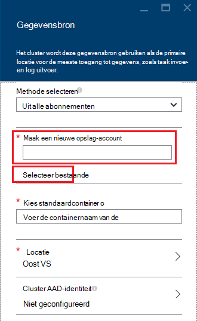

<properties
    pageTitle="Gegevens van HDFS-compatibele-blobopslag opvragen | Microsoft Azure"
    description="HDInsight gebruik Azure-blobopslag als de grote gegevensopslag voor HDFS. Leer hoe u gegevens van Blob storage opvragen en bewaren van de resultaten van uw analyse."
    keywords="BLOB-opslag, hdfs, gestructureerde gegevens, ongestructureerde gegevens"
    services="hdinsight,storage"
    documentationCenter=""
    tags="azure-portal"
    authors="mumian"
    manager="jhubbard"
    editor="cgronlun"/>

<tags
    ms.service="hdinsight"
    ms.workload="big-data"
    ms.tgt_pltfrm="na"
    ms.devlang="na"
    ms.topic="get-started-article"
    ms.date="09/06/2016"
    ms.author="jgao"/>

# HDFS-compatibele Azure-blobopslag gebruiken met Hadoop in HDInsight

Leer hoe u lage kosten Azure-blobopslag gebruiken met HDInsight, Azure opslag-account en Blob storage container maken en vervolgens het adres van de gegevens in.

Azure-blobopslag is een krachtige, algemene opslagoplossing dat naadloos met HDInsight. Tot en met een Hadoop distributed bestand system (HDFS) interface, kan de volledige set van onderdelen in HDInsight rechtstreeks op gestructureerde of ongestructureerde gegevens in blobopslag worden uitgevoerd.

Gegevens in blobopslag opslaat, kunt u veilig verwijderen HDInsight clusters die worden gebruikt voor berekening zonder gebruikersgegevens kwijt te raken.

> [AZURE.IMPORTANT] HDInsight ondersteunt alleen blokkeren BLOB's. Deze niet ondersteuningspagina of BLOB's toevoegen.

Zie voor informatie over het maken van een cluster HDInsight [Aan de slag met HDInsight] [ hdinsight-get-started] of [HDInsight maken clusters][hdinsight-creation].

## HDInsight opslagarchitectuur
In het volgende diagram biedt een abstracte weergave van de architectuur van de opslagruimte HDInsight:

![Hadoop clusters de HDFS-API gebruiken om te openen en gestructureerde en ongestructureerde gegevens opslaan in blobopslag.] (./media/hdinsight-hadoop-use-blob-storage/HDI.WASB.Arch.png "HDInsight opslag architectuur")

HDInsight biedt toegang tot distributed file system die lokaal op de knooppunten berekeningscluster is aangesloten. Dit bestandssysteem kan worden geopend met behulp van de volledig gekwalificeerde URI, bijvoorbeeld:

    hdfs://<namenodehost>/<path>

HDInsight biedt bovendien de mogelijkheid om te access-gegevens die zijn opgeslagen in Azure-blobopslag. De syntaxis van de luidt als volgt:

    wasb[s]://<containername>@<accountname>.blob.core.windows.net/<path>

> [AZURE.NOTE] In eerdere versies van HDInsight dan 3.0, `asv://` is gebruikt in plaats van `wasb://`. `asv://`mag niet worden gebruikt met HDInsight clusters 3.0 of hoger, zoals deze zijn ingevoegd om een fout.

Hadoop ondersteunt een begrip van de standaard-bestandssysteem. De standaard-bestandssysteem houdt een standaard kleurenschema en certificeringsinstantie. Dit kan ook worden gebruikt voor het oplossen van relatieve paden. Tijdens het maakproces HDInsight, een Azure Storage-account en een specifieke Azure-blobopslag container uit dat account ingesteld als het standaard-bestandssysteem.

Naast deze opslag-account, kunt u extra opslagruimte accounts toevoegen vanuit de hetzelfde Azure-abonnement of andere Azure abonnementen tijdens het maken of na een cluster is gemaakt. Zie voor instructies over het toevoegen van extra opslagruimte-accounts [maken HDInsight clusters][hdinsight-creation].

- **Containers in de opslagruimte-accounts die met een cluster verbonden zijn:** Omdat de accountnaam en van toetsen gekoppeld aan het cluster tijdens het maken zijn, hebt u volledige toegang tot de BLOB's in deze containers.

- **Openbare containers of openbare BLOB's in opslag-accounts die niet aan een cluster verbonden zijn:** U hebt alleen-lezen machtigingen voor het BLOB's in de containers.

    > [AZURE.NOTE]
        > Openbare containers kunnen u een lijst met alle BLOB's die beschikbaar zijn in dat onderdeel en bekijk de container metagegevens. Openbare BLOB's kunnen u toegang tot de BLOB's alleen als u weet dat de exacte URL. Zie <a href="http://msdn.microsoft.com/library/windowsazure/dd179354.aspx">beperken toegang tot containers en BLOB's</a>voor meer informatie.

- **Privé containers in opslag-accounts die niet aan een cluster verbonden zijn:** U kunt de BLOB's in de containers geen toegang tot, tenzij u de opslag-account definieert wanneer u de taken WebHCat indienen. Dit wordt uitgelegd verderop in dit artikel.

De opslag-accounts die zijn gedefinieerd in het proces voor het maken en de sleutels zijn opgeslagen in %HADOOP_HOME%/conf/core-site.xml knooppunten. Het standaardgedrag van HDInsight is via de opslag-accounts in het bestand core-site.xml gedefinieerd. Het wordt niet aanbevolen dat u het bestand wilt bewerken core-site.xml omdat het hoofd node(master) cluster kan worden reimaged of gemigreerd op elk gewenst moment en eventuele wijzigingen in deze bestanden niet verloren.

Meerdere WebHCat taken, inclusief component, MapReduce, Hadoop streaming en varken, kan een beschrijving van opslag accounts en metagegevens met hen kunnen uitvoeren. (Dit werkt op dit moment voor varken met opslag accounts, maar niet voor metagegevens.) In de sectie [toegang BLOB's via Azure PowerShell](#powershell) van dit artikel is een voorbeeld van deze functie. Zie [Een HDInsight Cluster met alternatieve opslag-Accounts en Metastores](http://social.technet.microsoft.com/wiki/contents/articles/23256.using-an-hdinsight-cluster-with-alternate-storage-accounts-and-metastores.aspx)voor meer informatie.

Blobopslag kan worden gebruikt voor gestructureerde en ongestructureerde gegevens. Opslag van gegevens als sleutel/waardeparen BLOB storage containers en er is geen directory-hiërarchie. De schuine streep (/) kan echter binnen de naam van de sleutel worden gebruikt, zodat u deze worden weergegeven als wanneer een bestand is opgeslagen in de structuur van een map. Sleutel van een blob mogelijk bijvoorbeeld *input/log1.txt*. Er bestaat geen werkelijke *invoer* map, maar vanwege de aanwezigheid van de schuine streep in naam van de sleutel, heeft het uiterlijk van een bestandspad.

###Voordelen van het Blob storage
De kosten impliciete prestaties van het niet gezamenlijk zoeken berekenen clusters en opslag resources beperkt door de manier waarop de computerclusters dicht bij de opslag account bronnen binnen het gebied van de Azure, waar de snel netwerk kunt u ermee werken voor de knooppunten berekeningscluster voor toegang tot de gegevens in Azure-blobopslag worden gemaakt.

Er zijn verschillende voordelen die is gekoppeld aan gegevens op te slaan in Azure-blobopslag in plaats van HDFS:

* **Gegevens hergebruik en delen:** De gegevens in HDFS bevindt zich in de berekeningscluster. Alleen de toepassingen die toegang tot de berekeningscluster hebben kunnen de gegevens met behulp van HDFS API's gebruiken. De gegevens in Azure-blobopslag kunnen worden geopend via de HDFS-API's of via de [Blob Storage REST API][blob-storage-restAPI]. Een grotere set (met inbegrip van andere clusters HDInsight)-toepassingen en hulpprogramma's voor kan dus worden gebruikt voor het maken en gebruiken van de gegevens.
* **Archiveren van gegevens:** Gegevens opslaat in Azure-blobopslag, kunt de HDInsight clusters gebruikt voor de berekening om te worden verwijderd zonder gebruikersgegevens kwijt te raken.
* **Gegevens opslag kosten:** Gegevens op te slaan in DFS voor de lange termijn is meer goedkoper is dan de gegevens opslaat in Azure-blobopslag omdat de kosten van een berekeningscluster hoger zijn dan de kosten van een Azure Blob storage container is. Bovendien omdat de gegevens niet kan worden geladen voor elke berekeningscluster cluster generatie, zijn ook slaat u het laden van de kosten van gegevens.
* **Elastische schalen:** Hoewel HDFS u met een schaal-out bestandssysteem vindt, wordt de schaal wordt bepaald door het aantal knooppunten die u voor uw cluster maakt. De schaal wijzigen kan worden omgezet in een ingewikkelder proces dan te vertrouwen op de elastische schaalbaarheid van de mogelijkheden die u automatisch in Azure-blobopslag.
* **Geografische herhaling:** Uw Azure Blob storage containers kunnen zijn geografische gerepliceerd. Hoewel dit u geografische herstel en overbodige biedt, een failover naar de locatie geografische gerepliceerd ernstige invloed is op uw prestaties en deze mogelijk extra kosten. Wij raden wordt de geografische-replicatie zorgvuldig kiezen en alleen als de waarde van de gegevens meer zegt dan de extra kosten.

Bepaalde MapReduce taken en -pakketten mogelijk tussenliggende resultaten die u niet zeker wilt opslaan in Azure-blobopslag maken. U kunt in dat geval kiezen voor de opslag van de gegevens in de lokale HDFS. Ja, HDInsight DFS voor verscheidene deze tussenliggende resultaten in component taken en andere processen gebruikt.

> [AZURE.NOTE] De meeste HDFS opdrachten (bijvoorbeeld <b>ls</b>, <b>copyFromLocal</b> en <b>mkdir</b>) nog steeds werkt zoals verwacht. Alleen de opdrachten die specifiek voor de systeemeigen HDFS uitvoering zijn (waarnaar wordt verwezen als DFS), zoals <b>fschk</b> en <b>dfsadmin</b>, worden verschillende gedrag weergegeven in Azure-blobopslag.

## Blob containers maken

Als u wilt gebruiken BLOB's, u eerst een [Azure Storage-account]maken[azure-storage-create]. Als onderdeel van dit, moet u een Azure gebied waarin de objecten die u samenstelt met dit account wordt opgeslagen opgeven. Het cluster en de opslag-account moeten worden gehost in dezelfde regio. De component metastore SQL Server-database en Oozie metastore SQL Server-database moeten ook zich bevinden in dezelfde regio.

Waar deze zich bevindt, wordt elke blob die u maakt hoort bij een container in uw opslagruimte van Azure-account. Deze container mogelijk een bestaande blob die buiten HDInsight is gemaakt of is het mogelijk een container die is gemaakt voor een cluster HDInsight.

De standaard Blob container slaat cluster specifieke informatie zoals werkervaring en Logboeken. Niet een standaard Blob container delen met meerdere HDInsight clusters. Dit werkervaring mogelijk beschadigd en het cluster zijn wordt vastgelopen. Het wordt aanbevolen een andere container voor elk cluster en gedeelde gegevens op een gekoppelde opslag-account dat is opgegeven in de implementatie van alle relevante clusters in plaats van het standaardaccount voor de opslag plaatsen. Zie voor meer informatie over het configureren van gekoppelde opslag-accounts [maken HDInsight clusters][hdinsight-creation]. U kunt echter een standaard-opslag container hergebruiken nadat het oorspronkelijke HDInsight cluster is verwijderd. Voor HBase kolomgroepen kunt u het schema van de tabel HBase daadwerkelijk behouden en gegevens door maken een nieuw HBase cluster met behulp van de standaard blob storage container die wordt gebruikt door een HBase cluster die is verwijderd.

### Met behulp van de Azure Portal

Wanneer u een cluster HDInsight maakt in de Portal, hebt u de opties voor het gebruik van een bestaand opslag-account of maak een nieuw account voor de opslag:

###Azure CLI gebruiken

[AZURE.INCLUDE [use-latest-version](../../includes/hdinsight-use-latest-cli.md)]

Als u [installatie en configuratie van de Azure CLI](../xplat-cli-install.md)hebt, kan de volgende opdracht uit een opslag-account en de container worden gebruikt.

    azure storage account create <storageaccountname> --type LRS

> [AZURE.NOTE] De `--type` parameter geeft aan hoe de opslag-account worden gerepliceerd. Zie [Azure opslag replicatie](../storage/storage-redundancy.md)voor meer informatie. Gebruik geen ZRS zoals ZRS biedt geen ondersteuning voor pagina blob, een bestand, tabel of wachtrij.

U wordt gevraagd om het geografische regio die het opslag-account in worden geplaatst. U moet de opslag-account maken in hetzelfde gebied dat u van plan bent over het maken van uw cluster HDInsight.

Nadat het account opslag is gemaakt, gebruikt u de volgende opdracht uit om op te halen de opslag-account te gebruiken:

    azure storage account keys list <storageaccountname>

Als u wilt een container maken, gebruikt u de volgende opdracht:

    azure storage container create <containername> --account-name <storageaccountname> --account-key <storageaccountkey>

### Via Azure PowerShell

Als u [installatie en configuratie van Azure PowerShell][powershell-install], kunt u de volgende handelingen uit de Azure PowerShell-prompt om een opslag-account en de container te maken:

[AZURE.INCLUDE [upgrade-powershell](../../includes/hdinsight-use-latest-powershell.md)]

    $SubscriptionID = "<Your Azure Subscription ID>"
    $ResourceGroupName = "<New Azure Resource Group Name>"
    $Location = "EAST US 2"
    
    $StorageAccountName = "<New Azure Storage Account Name>"
    $containerName = "<New Azure Blob Container Name>"
    
    Add-AzureRmAccount
    Select-AzureRmSubscription -SubscriptionId $SubscriptionID
    
    # Create resource group
    New-AzureRmResourceGroup -name $ResourceGroupName -Location $Location
    
    # Create default storage account
    New-AzureRmStorageAccount -ResourceGroupName $ResourceGroupName -Name $StorageAccountName -Location $Location -Type Standard_LRS 
    
    # Create default blob containers
    $storageAccountKey = (Get-AzureRmStorageAccountKey -ResourceGroupName $resourceGroupName -StorageAccountName $StorageAccountName)[0].Value
    $destContext = New-AzureStorageContext -StorageAccountName $storageAccountName -StorageAccountKey $storageAccountKey  
    New-AzureStorageContainer -Name $containerName -Context $destContext

## Bestanden in-blobopslag

Het URI-schema voor het openen van bestanden in-blobopslag uit HDInsight luidt als volgt:

    wasb[s]://<BlobStorageContainerName>@<StorageAccountName>.blob.core.windows.net/<path>

Het URI-schema bevat niet-versleutelde access (met de *wasb:* voorvoegsel) en SSL versleutelde access (met *wasbs*). U wordt aangeraden *wasbs* Gebruik zoveel mogelijk, zelfs wanneer toegang tot gegevens die zich in dezelfde regio in Azure wordt aangegeven bevindt.

De &lt;BlobStorageContainerName&gt; geeft de naam van de container in Azure-blobopslag.
De &lt;StorageAccountName&gt; geeft aan wat het Azure-opslagaccountnaam. Een volledig gekwalificeerde domeinnaam (FQDN) is vereist.

Alle andere gevallen &lt;BlobStorageContainerName&gt; noch &lt;StorageAccountName&gt; is opgegeven, het standaardbestandssysteem wordt gebruikt. Voor de bestanden op de standaard-bestandssysteem, kunt u een relatieve of een absolute pad. Bijvoorbeeld kan het *hadoop-mapreduce-examples.jar* -bestand dat wordt geleverd met HDInsight clusters worden verwezen met behulp van een van de volgende opties:

    wasbs://mycontainer@myaccount.blob.core.windows.net/example/jars/hadoop-mapreduce-examples.jar
    wasbs:///example/jars/hadoop-mapreduce-examples.jar
    /example/jars/hadoop-mapreduce-examples.jar

> [AZURE.NOTE] De bestandsnaam is <i>hadoop-examples.jar</i> in HDInsight versie 2.1 en 1,6 clusters.

De &lt;pad&gt; is de naam van bestand of map een HDFS pad. Aangezien containers in Azure-blobopslag gewoon sleutelwaarde winkels, is er geen waar hiërarchische bestandssysteem. Een schuine streep (/) binnen een sleutel blob geïnterpreteerd als een scheidingsteken directory. De naam van de blob voor *hadoop-mapreduce-examples.jar* is bijvoorbeeld:

    example/jars/hadoop-mapreduce-examples.jar

> [AZURE.NOTE] Tijdens het werken met BLOB's buiten HDInsight, de meeste hulpprogramma's niet herkend door de WASB-indeling en in plaats daarvan een padindeling met eenvoudige, zoals verwacht `example/jars/hadoop-mapreduce-examples.jar`.

## Access BLOB's met Azure CLI

Gebruik de volgende opdracht uit voor een overzicht van de blob opdrachten:

    azure storage blob

**Voorbeeld van het gebruik van Azure CLI om een bestand te uploaden**

    azure storage blob upload <sourcefilename> <containername> <blobname> --account-name <storageaccountname> --account-key <storageaccountkey>

**Voorbeeld van het gebruik van Azure CLI om een bestand te downloaden**

    azure storage blob download <containername> <blobname> <destinationfilename> --account-name <storageaccountname> --account-key <storageaccountkey>

**Voorbeeld van het gebruik van Azure CLI voor een bestand verwijderen**

    azure storage blob delete <containername> <blobname> --account-name <storageaccountname> --account-key <storageaccountkey>

**Voorbeeld van het gebruik van Azure CLI voor bestanden weergeven**

    azure storage blob list <containername> <blobname|prefix> --account-name <storageaccountname> --account-key <storageaccountkey>

## Access BLOB's via Azure PowerShell

> [AZURE.NOTE] De opdrachten in deze sectie vindt u een eenvoudig voorbeeld van PowerShell gebruiken voor access-gegevens die zijn opgeslagen in BLOB's. Zie de [HDInsight hulpprogramma's](https://github.com/Blackmist/hdinsight-tools)voor een uitgebreidere voorbeeld dat is aangepast voor het werken met HDInsight.

Gebruik de volgende opdracht uit voor een overzicht van de cmdlets blob-gerelateerde:

    Get-Command *blob*

![Lijst met blob-gerelateerde PowerShell-cmdlets.][img-hdi-powershell-blobcommands]

###Bestanden uploaden

Zie [gegevens met HDInsight uploaden][hdinsight-upload-data].

###Bestanden downloaden

De volgende scriptbestanden downloads een blok blob naar de huidige map. Voordat u het script, wijzig de map naar een map waarin u schrijfmachtigingen hebt.

    $resourceGroupName = "<AzureResourceGroupName>"
    $storageAccountName = "<AzureStorageAccountName>"   # The storage account used for the default file system specified at creation.
    $containerName = "<BlobStorageContainerName>"  # The default file system container has the same name as the cluster.
    $blob = "example/data/sample.log" # The name of the blob to be downloaded.
    
    # Use Add-AzureAccount if you haven't connected to your Azure subscription
    Login-AzureRmAccount 
    Select-AzureRmSubscription -SubscriptionID "<Your Azure Subscription ID>"
    
    Write-Host "Create a context object ... " -ForegroundColor Green
    $storageAccountKey = (Get-AzureRmStorageAccountKey -ResourceGroupName $resourceGroupName -Name $storageAccountName)[0].Value
    $storageContext = New-AzureStorageContext -StorageAccountName $storageAccountName -StorageAccountKey $storageAccountKey  
    
    Write-Host "Download the blob ..." -ForegroundColor Green
    Get-AzureStorageBlobContent -Container $ContainerName -Blob $blob -Context $storageContext -Force
    
    Write-Host "List the downloaded file ..." -ForegroundColor Green
    cat "./$blob"

De naam van de resource-groep en de naam van het cluster leveren, kunt u de volgende code:

    $resourceGroupName = "<AzureResourceGroupName>"
    $clusterName = "<HDInsightClusterName>"
    $blob = "example/data/sample.log" # The name of the blob to be downloaded.
    
    $cluster = Get-AzureRmHDInsightCluster -ResourceGroupName $resourceGroupName -ClusterName $clusterName
    $defaultStorageAccount = $cluster.DefaultStorageAccount -replace '.blob.core.windows.net'
    $defaultStorageAccountKey = (Get-AzureRmStorageAccountKey -ResourceGroupName $resourceGroupName -Name $defaultStorageAccount)[0].Value
    $defaultStorageContainer = $cluster.DefaultStorageContainer
    $storageContext = New-AzureStorageContext -StorageAccountName $defaultStorageAccount -StorageAccountKey $defaultStorageAccountKey 
    
    Write-Host "Download the blob ..." -ForegroundColor Green
    Get-AzureStorageBlobContent -Container $defaultStorageContainer -Blob $blob -Context $storageContext -Force

###Bestanden verwijderen

    Remove-AzureStorageBlob -Container $containerName -Context $storageContext -blob $blob

###Lijst met bestanden

    Get-AzureStorageBlob -Container $containerName -Context $storageContext -prefix "example/data/"

###Component query's met een account ongedefinieerd opslag uitvoeren

In dit voorbeeld ziet u hoe u een map van opslag-account die niet tijdens het proces is gedefinieerd.
$clusterName = "<HDInsightClusterName>"

    $undefinedStorageAccount = "<UnboundedStorageAccountUnderTheSameSubscription>"
    $undefinedContainer = "<UnboundedBlobContainerAssociatedWithTheStorageAccount>"

    $undefinedStorageKey = Get-AzureStorageKey $undefinedStorageAccount | %{ $_.Primary }

    Use-AzureRmHDInsightCluster $clusterName

    $defines = @{}
    $defines.Add("fs.azure.account.key.$undefinedStorageAccount.blob.core.windows.net", $undefinedStorageKey)

    Invoke-AzureRmHDInsightHiveJob -Defines $defines -Query "dfs -ls wasbs://$undefinedContainer@$undefinedStorageAccount.blob.core.windows.net/;"

## Volgende stappen

In dit artikel u hebt geleerd hoe u HDFS-compatibele Azure-blobopslag met HDInsight en u hebt geleerd dat Azure-blobopslag een fundamentele onderdeel van HDInsight is. Hiermee kunt u gegevens scalable, langdurige, archivering acquisition oplossingen bouwen met Azure-blobopslag met behulp van HDInsight en het ontgrendelen van de informatie in de opgeslagen gestructureerde en ongestructureerde gegevens.

Zie voor meer informatie:

* [Aan de slag met Azure HDInsight][hdinsight-get-started]
* [Gegevens uploaden naar HDInsight][hdinsight-upload-data]
* [Component gebruiken met HDInsight][hdinsight-use-hive]
* [Varken met HDInsight gebruiken][hdinsight-use-pig]
* [Azure opslag gedeeld Access handtekeningen gebruiken voor het beperken van toegang tot gegevens met HDInsight][hdinsight-use-sas]

[hdinsight-use-sas]: hdinsight-storage-sharedaccesssignature-permissions.md
[powershell-install]: ../powershell-install-configure.md
[hdinsight-creation]: hdinsight-provision-clusters.md
[hdinsight-get-started]: hdinsight-hadoop-tutorial-get-started-windows.md
[hdinsight-upload-data]: hdinsight-upload-data.md
[hdinsight-use-hive]: hdinsight-use-hive.md
[hdinsight-use-pig]: hdinsight-use-pig.md

[blob-storage-restAPI]: http://msdn.microsoft.com/library/windowsazure/dd135733.aspx
[azure-storage-create]: ../storage/storage-create-storage-account.md

[img-hdi-powershell-blobcommands]: ./media/hdinsight-hadoop-use-blob-storage/HDI.PowerShell.BlobCommands.png
[img-hdi-quick-create]: ./media/hdinsight-hadoop-use-blob-storage/HDI.QuickCreateCluster.png
[img-hdi-custom-create-storage-account]: ./media/hdinsight-hadoop-use-blob-storage/HDI.CustomCreateStorageAccount.png  
