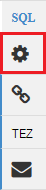

<properties
   pageTitle="Ambari weergaven gebruiken om te werken met onderdeel op HDInsight (Hadoop) | Microsoft Azure"
   description="Leer hoe u de weergave component via uw webbrowser gebruiken om in te dienen component query's. De weergave component maakt deel uit van de Web-gebruikersinterface van het Ambari voorzien van uw cluster Linux gebaseerde HDInsight."
   services="hdinsight"
   documentationCenter=""
   authors="Blackmist"
   manager="jhubbard"
   editor="cgronlun"
    tags="azure-portal"/>

<tags
   ms.service="hdinsight"
   ms.devlang="na"
   ms.topic="article"
   ms.tgt_pltfrm="na"
   ms.workload="big-data"
   ms.date="10/28/2016"
   ms.author="larryfr"/>

#Gebruik de component-weergave met Hadoop in HDInsight

[AZURE.INCLUDE [hive-selector](../../includes/hdinsight-selector-use-hive.md)]

Ambari is een management en controle hulpprogramma HDInsight Linux gebaseerde clusters voorzien. Een van de functies van tot en met Ambari is een Web-gebruikersinterface die kunnen worden gebruikt om de component query's uitvoeren. Dit is de __Weergave component__deel uit van de weergaven Ambari met uw cluster HDInsight.

> [AZURE.NOTE] Ambari heeft een groot aantal mogelijkheden die in dit document won't worden besproken. Zie [clusters HDInsight beheren met behulp van de gebruikersinterface van de Web Ambari](hdinsight-hadoop-manage-ambari.md)voor meer informatie.

##Vereisten voor

- Een cluster Linux gebaseerde HDInsight. Zie voor informatie over het maken van een nieuw cluster [aan de slag met Linux gebaseerde HDInsight](hdinsight-hadoop-linux-tutorial-get-started.md).

##Open de component-weergave

U kunt Ambari weergaven vanaf de Portal Azure; Selecteer uw cluster HDInsight en selecteer vervolgens __Ambari weergaven__ in de sectie __Snelkoppelingen__ .

U kunt ook Ga rechtstreeks naar Ambari door te gaan naar https://CLUSTERNAME.azurehdinsight.net in een webbrowser ( __CLUSTERNAAM__ is waar de naam van uw cluster HDInsight) en selecteer vervolgens het instellen van de kwadraten van het Paginamenu (naast de koppeling van __beheerder__ en de knop aan de linkerkant van de pagina) naar de lijst met beschikbare weergaven. Selecteer de __component weergave__.

.

> [AZURE.NOTE] Bij het openen van Ambari, wordt u gevraagd om te verifiëren naar de site. Voer de beheerder (standaard `admin`,) naam en het wachtwoord die u hebt gebruikt bij het maken van het cluster.

Hier ziet u een pagina ongeveer als volgt uit:

##Tabellen weergeven

Selecteer de __standaard__ -vermelding op het tabblad __Databases__ in de sectie __Database Explorer__ van de pagina. Hiermee wordt een lijst met tabellen weergegeven in de standaard-database. Voor een nieuwe HDInsight cluster, moet er slechts één tabel zijn; __hivesampletable__.

Als nieuwe tabellen wordt toegevoegd via de stappen in dit document, kunt u het pictogram Vernieuwen in de rechterbovenhoek van de Database Explorer vernieuwt u de lijst met beschikbare tabellen.

##Query-editor

Gebruik de volgende stappen uit de weergave component component query uitvoeren op gegevens wordt geleverd bij het cluster.

1. Plak de volgende HiveQL-instructies in het werkblad in de sectie __Query-Editor__ van de pagina:

        DROP TABLE log4jLogs;
        CREATE EXTERNAL TABLE log4jLogs(t1 string, t2 string, t3 string, t4 string, t5 string, t6 string, t7 string)
        ROW FORMAT DELIMITED FIELDS TERMINATED BY ' '
        STORED AS TEXTFILE LOCATION 'wasbs:///example/data/';
        SELECT t4 AS sev, COUNT(*) AS cnt FROM log4jLogs WHERE t4 = '[ERROR]' GROUP BY t4;

    Deze instructies heeft de volgende acties uitvoeren:

    - **DROP TABLE** - verwijdert de tabel en het gegevensbestand geval de tabel al bestaat.
    - **Externe tabel maken** - maakt een nieuwe 'externe' tabel in component. Externe tabellen opslaan alleen de definitie van de tabel in component; de gegevens is links op de oorspronkelijke locatie.
    - **Rij-indeling** : Hiermee wordt aan component hoe de gegevens worden opgemaakt. In dit geval worden de velden in elke log gescheiden door een spatie.
    - **Opgeslagen als TEXTFILE locatie** - Hiermee wordt aan Component waar de gegevens is opgeslagen (de map met de voorbeeldgegevens /), en dat deze wordt opgeslagen als tekst.
    - **Selecteer** - Hiermee selecteert u een telling van alle rijen waarbij kolom t4 de waarde [fout bevat].

    >[AZURE.NOTE] Externe tabellen moeten worden gebruikt wanneer u verwacht dat de onderliggende gegevens worden bijgewerkt door een externe bron, zoals een geautomatiseerde gegevens upload-proces of door een andere MapReduce bewerking, maar u altijd component query's om de meest recente gegevens te gebruiken. Weghalen van een externe tabel bevat *niet* verwijderen de gegevens, alleen de definitie van de tabel.

2. Gebruik de knop __uitvoeren__ onder van de Query-Editor om de query te starten. Deze oranje in te schakelen en de tekst wordt gewijzigd in __uitvoering stoppen__. Een sectie __Queryresultaten proces__ moet worden weergegeven onder de Query-Editor en informatie over de taak weergeven.

    > [AZURE.IMPORTANT] Sommige browsers mogelijk niet correct de gegevens logboek of resultaten vernieuwen. Als u een taak uitvoeren en het lijkt op eeuwen uitgevoerd zonder het logboek bijwerken of resultaten retourneren, probeer dan Mozilla FireFox of Google Chrome in plaats daarvan.

3. Zodra de query is voltooid, worden de resultaten van de bewerking weergegeven in de sectie __Queryresultaten proces__ . De knop __stoppen execution__ verandert ook weer in een groene __Execute__ -knop. Het tabblad __resultaten__ moet de volgende gegevens bevatten:

        sev       cnt
        [ERROR]   3

    Het tabblad __Logboeken__ kan worden gebruikt om weer te geven van de logboekgegevens gemaakt door de taak. U kunt dit gebruiken voor probleemoplossing als er problemen met een query zijn.

    > [AZURE.TIP] Houd rekening met het dialoogvenster vervolgkeuzelijst __resultaten opslaan__ in de linkerbovenhoek van de sectie __Queryresultaten proces__ . u kunt dit gebruiken de resultaten downloaden of ze opslaan in HDInsight opslag als een CSV-bestand.

3. Selecteer de eerste vier regels van deze query en selecteer __uitvoeren__. Zoals u ziet dat er geen resultaten wanneer de taak is voltooid. Dit komt omdat de geselecteerde beweringen wordt alleen uitgevoerd via de knop __uitvoeren__ als onderdeel van de query wordt geselecteerd. De selectie bevatten niet in dit geval de uiteindelijke instructie die rijen opgehaald uit de tabel. Als u alleen die regel selecteren en gebruiken van __uitvoeren__, ziet u de verwachte resultaten.

3. Gebruik de knop __Nieuw werkblad__ onderaan in de __Query-Editor__ maken een nieuw werkblad. Voer de volgende HiveQL-instructies in het nieuwe werkblad:

        CREATE TABLE IF NOT EXISTS errorLogs (t1 string, t2 string, t3 string, t4 string, t5 string, t6 string, t7 string) STORED AS ORC;
        INSERT OVERWRITE TABLE errorLogs SELECT t1, t2, t3, t4, t5, t6, t7 FROM log4jLogs WHERE t4 = '[ERROR]';

    Deze instructies heeft de volgende acties uitvoeren:

    - **Maken van tabel als niet aanwezig** - Hiermee maakt u een tabel, als deze nog niet bestaat. Aangezien het **externe** trefwoord niet wordt gebruikt, is dit is een interne tabel, die is opgeslagen in de component datawarehouse en volledig wordt beheerd door component. In tegenstelling tot de externe tabellen, worden een interne tabel weghalen verwijderd als u ook de onderliggende gegevens.
    - De gegevens **Die zijn opgeslagen als ORC** - opgeslagen in geoptimaliseerd rij kolommen (ORC)-indeling. Dit is een zeer geoptimaliseerde en efficiënt indeling voor het opslaan van de component data.
    - **Invoegen OVERSCHRIJVEN... Selecteer** : Hiermee selecteert u rijen uit de tabel **log4jLogs** die [fout] bevatten en voegt u vervolgens de gegevens in de tabel **errorLogs** .

    Gebruik de knop __uitvoeren__ deze query uit te voeren. Het tabblad __resultaten__ geen gegevens als er geen rijen worden geretourneerd door deze query, maar de status moet worden weergegeven als __geslaagd__.

###Component-instellingen

Selecteer het pictogram __Instellingen__ aan de rechterkant van de editor.

Instellingen kunnen worden gebruikt om verschillende component-instellingen, zoals het wijzigen van de engine worden uitgevoerd voor component uit Tez (de standaardinstelling), te wijzigen naar MapReduce.

###Visual uitleggen

Selecteer het pictogram __Visuele uitleggen__ aan de rechterkant van de editor.

Dit is de weergave __Visuele uitleg__ van de query die handig is in de informatie over de stroom van complexe query's. U kunt een tekstuele equivalent van deze weergave weergeven met behulp van de knop __uitleg__ in Query-Editor.

###Tez

Selecteer het pictogram __Tez__ aan de rechterkant van de editor.

De opdracht krijgt acyclische Graph (DAG) gebruikt in Tez voor deze query wordt weergegeven als deze beschikbaar is. Als u wilt weergeven van de DAG voor query's hebt u uitgevoerd in het verleden of foutopsporing het proces Tez, gebruik de [Tez weergeven](hdinsight-debug-ambari-tez-view.md) in plaats daarvan.

###Meldingen

Selecteer het pictogram __meldingen__ aan de rechterkant van de editor.

Meldingen worden berichten die worden gegenereerd bij het uitvoeren van query's. Bijvoorbeeld, ontvangt u een melding wanneer een query is verzonden, of wanneer u een fout optreedt.

##Opgeslagen query 's

1. Van de Query-Editor, maakt u een nieuw werkblad en voert u de volgende query:

        SELECT * from errorLogs;

    De query om te bevestigen dat deze altijd werkt. De resultaten worden als volgt:

        errorlogs.t1    errorlogs.t2    errorlogs.t3    errorlogs.t4    errorlogs.t5    errorlogs.t6    errorlogs.t7
        2012-02-03  18:35:34    SampleClass0    [ERROR]     incorrect   id  
        2012-02-03  18:55:54    SampleClass1    [ERROR]     incorrect   id  
        2012-02-03  19:25:27    SampleClass4    [ERROR]     incorrect   id

2. Gebruik de knop __Opslaan als__ onderaan in de editor. Deze query __Errorlogs__ een naam en selecteer __OK__. Houd er rekening mee dat de naam van het werkblad gewijzigd in __Errorlogs__.

3. Selecteer het tabblad __Query's opgeslagen__ boven aan de pagina weergave component. Houd er rekening mee dat __Errorlogs__ nu is vermeld als een opgeslagen query. Blijft in deze lijst totdat u deze verwijderen. De naam selecteren wordt geopend de query in de Query-Editor.

##Geschiedenis van de query

De knop __Geschiedenis__ boven aan de weergave component kunt u query's van de weergeven die u eerder hebt uitgevoerd. Gebruik deze nu aan en selecteer enkele van de query's die u eerder hebt uitgevoerd. Wanneer u een query selecteert, wordt geopend in de Query-Editor.

##Door gebruiker gedefinieerde functies (UDF)

Component kan ook worden verlengd door **gebruiker gedefinieerde functies (UDF)**. Een UDF kunt u functionaliteit of -logica die is niet gemakkelijk gebaseerd implementeren in HiveQL.

Terwijl u een UDF als onderdeel van de HiveQL-instructies in uw query toevoegen kunt, wordt het tabblad UDF boven aan de weergave component kunt u declareren en opslaan van een reeks UDF's die kunnen worden gebruikt met de __Query-Editor__.

Wanneer u een UDF aan de weergave component hebt toegevoegd, verschijnt er een knop voor het __invoegen van UDF's__ onderaan in de __Query-Editor__. Als u deze, wordt een vervolgkeuzelijst van de UDF's gedefinieerd in de weergave component weergegeven. Een UDF selecteren, wordt HiveQL-instructies toevoegen aan uw query toevoegen aan de UDF inschakelen.

Bijvoorbeeld als u een UDF met de volgende eigenschappen hebt gedefinieerd:

* Resourcenaam: myudfs
* Resource-pad: wasbs:///myudfs.jar
* De naam van de UDF: myawesomeudf
* UDF klassenaam: com.myudfs.Awesome

Met de knop __UDF's invoegen__ , wordt een fragment __myudfs__, met een andere vervolgkeuzelijst voor elke UDF die is gedefinieerd voor de desbetreffende resource weergegeven. In dit geval __myawesomeudf__. Dit item te selecteren, wordt het volgende toevoegen aan het begin van de query:

    add jar wasbs:///myudfs.jar;

    create temporary function myawesomeudf as 'com.myudfs.Awesome';

U kunt de UDF gebruiken in uw query. Bijvoorbeeld `SELECT myawesomeudf(name) FROM people;`.

Zie de volgende onderwerpen voor meer informatie over het gebruik van UDF's met onderdeel op HDInsight:

* [Gebruik van Python met component en varken in HDInsight](hdinsight-python.md)

* [Het toevoegen van een aangepaste component UDF met HDInsight](http://blogs.msdn.com/b/bigdatasupport/archive/2014/01/14/how-to-add-custom-hive-udfs-to-hdinsight.aspx)

##Volgende stappen

Voor algemene informatie over component in HDInsight:

* [Component gebruiken met Hadoop op HDInsight](hdinsight-use-hive.md)

Voor informatie over andere manieren waarop kunt u werken met Hadoop op HDInsight:

* [Varken met Hadoop op HDInsight gebruiken](hdinsight-use-pig.md)

* [MapReduce gebruiken met Hadoop op HDInsight](hdinsight-use-mapreduce.md)
