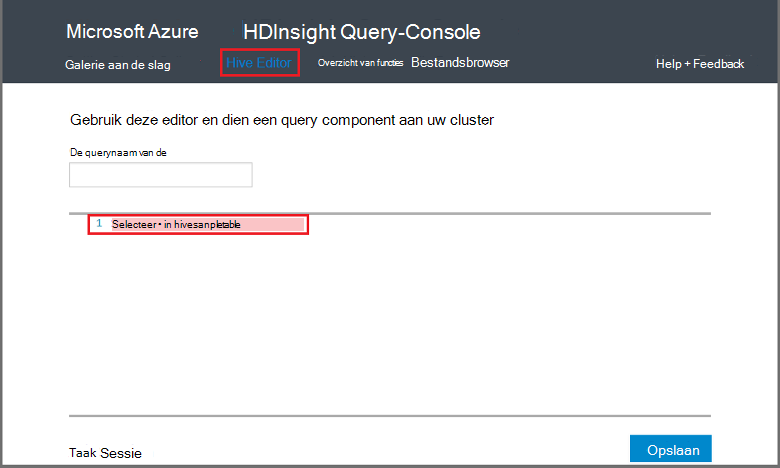

<properties
   pageTitle="Hadoop-component gebruiken op de Query-Console in HDInsight | Microsoft Azure"
   description="Informatie over het gebruik van de Query op het web Console component query's uitvoeren op een cluster HDInsight Hadoop vanuit uw browser."
   services="hdinsight"
   documentationCenter=""
   authors="Blackmist"
   manager="jhubbard"
   editor="cgronlun"
    tags="azure-portal"/>

<tags
   ms.service="hdinsight"
   ms.devlang="na"
   ms.topic="article"
   ms.tgt_pltfrm="na"
   ms.workload="big-data"
   ms.date="09/20/2016"
   ms.author="larryfr"/>

# Component query's met de Query-Console uitvoeren

[AZURE.INCLUDE [hive-selector](../../includes/hdinsight-selector-use-hive.md)]

In dit artikel leert u hoe u met de Query-Console HDInsight component query's uitvoeren op een cluster HDInsight Hadoop vanuit uw browser.

> [AZURE.IMPORTANT] De Query-Console HDInsight is alleen beschikbaar op Windows gebaseerde HDInsight clusters. Als u een cluster Linux gebaseerde HDInsight gebruikt, raadpleegt u [query's met de weergave van component component uitvoeren](hdinsight-hadoop-use-hive-ambari-view.md).

##Vereisten voor

U voltooit de stappen in dit artikel, moet u het volgende.

* Een cluster HDInsight Hadoop op basis van Windows

* Een modern webbrowser

##Component query's met de Query-Console uitvoeren

1. Open een webbrowser en navigeer naar __https://CLUSTERNAME.azurehdinsight.net__, waar __CLUSTERNAAM__ de naam van uw cluster HDInsight is. Als u wordt gevraagd, voert u de gebruikersnaam en wachtwoord dat u gebruikt wanneer u het cluster hebt gemaakt.

2. Selecteer in de koppelingen boven aan de pagina, **Component Editor**. Hiermee worden weergegeven voor een formulier dat kan worden gebruikt voor het invoeren van de HiveQL-instructies die u wilt uitvoeren in het cluster HDInsight.

    

    Vervang de tekst `Select * from hivesampletable` met de volgende HiveQL-instructies:

        set hive.execution.engine=tez;
        DROP TABLE log4jLogs;
        CREATE EXTERNAL TABLE log4jLogs (t1 string, t2 string, t3 string, t4 string, t5 string, t6 string, t7 string)
        ROW FORMAT DELIMITED FIELDS TERMINATED BY ' '
        STORED AS TEXTFILE LOCATION 'wasbs:///example/data/';
        SELECT t4 AS sev, COUNT(*) AS count FROM log4jLogs WHERE t4 = '[ERROR]' AND INPUT__FILE__NAME LIKE '%.log' GROUP BY t4;

    Deze instructies heeft de volgende acties uitvoeren:

    * **DROP TABLE**: Hiermee verwijdert u de tabel en het gegevensbestand als de tabel al bestaat.
    * **Externe tabel maken**: maakt een nieuwe 'externe' tabel in component. Externe tabellen opslaan alleen de definitie van de tabel in component; de gegevens is links op de oorspronkelijke locatie.

    > [AZURE.NOTE] Externe tabellen moeten worden gebruikt wanneer u de onderliggende gegevens moeten worden bijgewerkt door een externe bron (zoals een geautomatiseerde gegevens uploadproces) of door een andere MapReduce bewerking verwacht, maar u wilt dat altijd component query's om de meest recente gegevens te gebruiken.
    >
    > Weghalen van een externe tabel bevat **niet** verwijderen de gegevens, alleen de definitie van de tabel.

    * **Rij-indeling**: Hiermee wordt aan component hoe de gegevens worden opgemaakt. In dit geval worden de velden in elke log gescheiden door een spatie.
    * **Opgeslagen als TEXTFILE locatie**: Hiermee wordt aan Component waar de gegevens is opgeslagen (de map met de voorbeeldgegevens /) en wordt deze opgeslagen als tekst
    * **Selecteer**: Selecteer een telling van alle rijen waar kolom **t4** de waarde **[fout]**bevatten. Dit moet een waarde van **3** retourneren omdat er zijn drie rijen met deze waarde.
    * **INPUT__FILE__NAME zoals '%.log'** - Hiermee wordt aan die we alleen gegevens uit bestanden die eindigen ophalen moet op component. log. Hiermee beperkt u de zoekopdracht naar het bestand sample.log die de gegevens bevat, en behoudt uit retourneren van gegevens uit andere voorbeeld gegevensbestanden die niet overeenkomen met het schema dat zoals gedefinieerd.

2. Klik op **verzenden**. De **Taak sessie** onder aan de pagina details voor de taak moet worden weergegeven.

3. Wanneer het veld **Status** wordt gewijzigd in **afgesloten**, selecteert u **Details weergeven** voor de taak. Klik op de detailpagina van de **Taak uitvoer** bevat `[ERROR]   3`. U kunt de knop **downloaden** onder deze velden gebruiken om een bestand met de uitvoer van de taak te downloaden.

##Overzicht

Zoals u ziet u de Query-Console een eenvoudige manier component query's uitvoeren in een cluster HDInsight, het controleren van de taakstatus en het ophalen van de uitvoer.

Meer informatie over het gebruik van Query-Console component component taken uitvoeren, selecteert u **Aan de slag** boven aan de Query-Console en gebruik de voorbeelden die beschikbaar zijn. Er worden elk voorbeeld doorlopen het proces van het gebruik van de component voor het analyseren van gegevens, inclusief uitleg over de HiveQL beweringen gebruikt in de steekproef.

##Volgende stappen

Voor algemene informatie over component in HDInsight:

* [Component gebruiken met Hadoop op HDInsight](hdinsight-use-hive.md)

Voor informatie over andere manieren waarop kunt u werken met Hadoop op HDInsight:

* [Varken met Hadoop op HDInsight gebruiken](hdinsight-use-pig.md)

* [MapReduce gebruiken met Hadoop op HDInsight](hdinsight-use-mapreduce.md)

Als u Tez met onderdeel gebruikt, raadpleegt u de volgende documenten voor foutopsporing informatie:

* [De gebruikersinterface Tez op HDInsight op basis van Windows gebruiken](hdinsight-debug-tez-ui.md)

* [De weergave Ambari Tez op Linux gebaseerde HDInsight gebruiken](hdinsight-debug-ambari-tez-view.md)

[1]: ../HDInsight/hdinsight-hadoop-visual-studio-tools-get-started.md

[hdinsight-sdk-documentation]: http://msdnstage.redmond.corp.microsoft.com/library/dn479185.aspx

[azure-purchase-options]: http://azure.microsoft.com/pricing/purchase-options/
[azure-member-offers]: http://azure.microsoft.com/pricing/member-offers/
[azure-free-trial]: http://azure.microsoft.com/pricing/free-trial/

[apache-tez]: http://tez.apache.org
[apache-hive]: http://hive.apache.org/
[apache-log4j]: http://en.wikipedia.org/wiki/Log4j
[hive-on-tez-wiki]: https://cwiki.apache.org/confluence/display/Hive/Hive+on+Tez
[import-to-excel]: http://azure.microsoft.com/documentation/articles/hdinsight-connect-excel-power-query/

[hdinsight-use-oozie]: hdinsight-use-oozie.md
[hdinsight-analyze-flight-data]: hdinsight-analyze-flight-delay-data.md

[hdinsight-storage]: hdinsight-hadoop-use-blob-storage.md

[hdinsight-provision]: hdinsight-provision-clusters.md
[hdinsight-submit-jobs]: hdinsight-submit-hadoop-jobs-programmatically.md
[hdinsight-upload-data]: hdinsight-upload-data.md
[hdinsight-get-started]: hdinsight-hadoop-linux-tutorial-get-started.md

[Powershell-install-configure]: powershell-install-configure.md
[powershell-here-strings]: http://technet.microsoft.com/library/ee692792.aspx

[img-hdi-hive-powershell-output]: ./media/hdinsight-use-hive/HDI.Hive.PowerShell.Output.png
