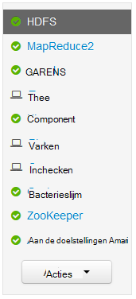
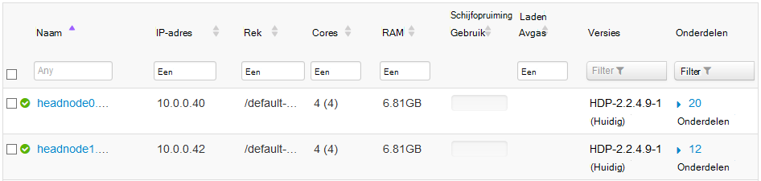
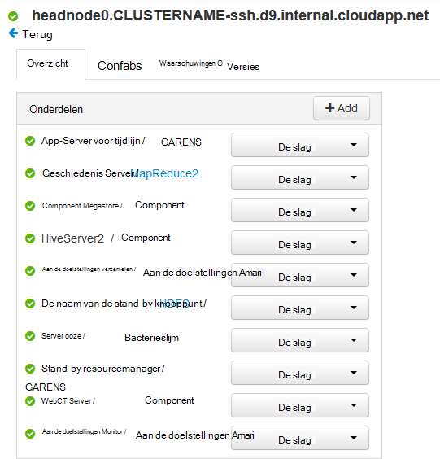
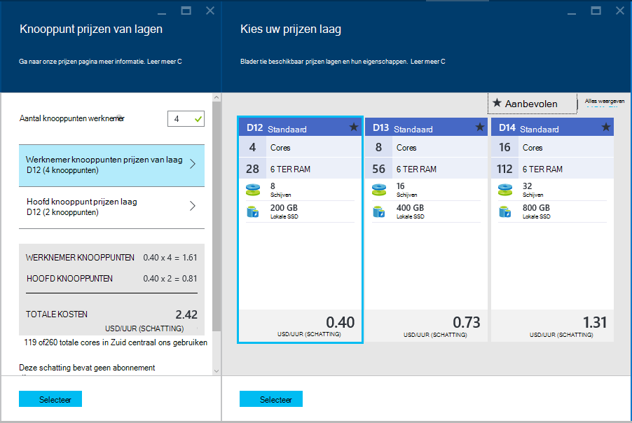

<properties
    pageTitle="Functies van de beschikbaarheid van Linux gebaseerde HDInsight (Hadoop) | Microsoft Azure"
    description="Leer hoe Linux-gebaseerde HDInsight clusters betrouwbaarheid en beschikbaarheid verbeteren met behulp van een extra hoofd knooppunt. U leert hoe dit van invloed is Hadoop-services zoals Ambari en component, en hoe afzonderlijk verbinding maken met elk hoofd knooppunt via SSH."
    services="hdinsight"
    editor="cgronlun"
    manager="jhubbard"
    authors="Blackmist"
    documentationCenter=""
    tags="azure-portal"/>

<tags
    ms.service="hdinsight"
    ms.workload="big-data"
    ms.tgt_pltfrm="na"
    ms.devlang="multiple"
    ms.topic="article"
    ms.date="09/13/2016"
    ms.author="larryfr"/>

#Beschikbaarheid en betrouwbaarheid van Hadoop clusters in HDInsight

Hadoop realiseert beschikbaarheid en betrouwbaarheid door overbodige kopieën van services en gegevens over de knooppunten in een cluster distribueren. Standaard onderzoeken van Hadoop hebben echter meestal slechts één hoofd knooppunt. Een storing van het één hoofd knooppunt kan leiden tot het cluster niet meer werkt.

Om dit probleem op te lossen, bieden HDInsight Linux gebaseerde clusters op Azure twee hoofd knooppunten om te verhogen van de beschikbaarheid en betrouwbaarheid van Hadoop-services en de taken die worden uitgevoerd.

> [AZURE.NOTE] De stappen in dit document zijn specifiek voor HDInsight Linux gebaseerde clusters. Als u een cluster op basis van Windows gebruikt, raadpleegt u [beschikbaarheid en betrouwbaarheid van Windows gebaseerde Hadoop clusters in HDInsight](hdinsight-high-availability.md) voor Windows-specifieke informatie.

##Informatie over de knooppunten

Knooppunten in een cluster HDInsight worden geïmplementeerd met Azure virtuele Machines. In het geval dat een knooppunt mislukt, offline is geplaatst en een nieuw knooppunt als u wilt vervangen het knooppunt wordt gemaakt. Terwijl het knooppunt offline is, wordt er een ander knooppunt van hetzelfde type worden gebruikt totdat het nieuwe knooppunt online is opgenomen.

> [AZURE.NOTE] Als het knooppunt is analyseren van gegevens mislukt, wordt de voortgang voor de taak gaat verloren. De taak die het knooppunt mislukte bezig was wordt opnieuw naar een ander knooppunt worden ingediend.

De volgende secties worden de typen afzonderlijke knooppunten gebruikt met HDInsight. Niet alle typen van knooppunten worden gebruikt voor een clustertype. Een Hadoop clustertype hebben bijvoorbeeld geen Nimbus knooppunten. Zie voor meer informatie over knooppunten die door HDInsight clustertypen, de sectie voor het typen van Cluster van [Hadoop maken Linux gebaseerde clusters in HDInsight](hdinsight-hadoop-provision-linux-clusters.md#cluster-types).

###Hoofd knooppunten

Sommige implementaties van Hadoop hebben één hoofd knooppunt die als host fungeert services en de onderdelen die de fout van werknemer knooppunten soepel beheren. Maar een bijvoorbeeld van basispagina services worden uitgevoerd op het hoofd knooppunt zou ertoe leiden dat het cluster te beëindigen om te werken.

HDInsight clusters bieden een secundaire hoofd knooppunt, waarmee basispagina services en de onderdelen te voeren op op de secundaire knooppunt in het geval van een fout in de primaire.

> [AZURE.IMPORTANT] Beide hoofd knooppunten zijn actieve en wordt uitgevoerd binnen het cluster tegelijk. Sommige services, zoals HDFS of garens, zijn alleen 'active' op één hoofd knooppunt bij een bepaalde tijd (en 'stand-by' op het andere hoofd knooppunt). Andere services zoals HiveServer2 of component MetaStore zijn op hetzelfde moment actief zijn op beide hoofd knooppunten.

Hebben een numerieke waarde als onderdeel van de hostnaam van het knooppunt hoofd knooppunten (en andere knooppunten in HDInsight,). Bijvoorbeeld `hn0-CLUSTERNAME` of `hn4-CLUSTERNAME`. 

> [AZURE.IMPORTANT] Koppelt de numerieke waarde niet aan of een knooppunt primaire of secundaire is; de numerieke waarde is alleen presenteren op te geven van een unieke naam voor elk knooppunt.

###Nimbus knooppunten

Voor Storm kolomgroepen wordt met de knooppunten Nimbus vergelijkbare functionaliteit biedt aan de Hadoop JobTracker verstrekt door distribueren en het verwerking controleren op werknemer knooppunten. HDInsight biedt 2 Nimbus knooppunten voor het type van de cluster Storm.

###Zookeeper knooppunten

[ZooKeeper](http://zookeeper.apache.org/ ) knooppunten (ZKs) worden gebruikt voor de leider van de verkiezingsuitslagen van basispagina services op hoofd knooppunten en om te zorgen dat services, (werknemer) gegevensknooppunten en gateways welk hoofd knooppunt weet een basispagina service actief is. Standaard bevat HDInsight 3 ZooKeeper knooppunten.

###Werknemer knooppunten

Werknemer knooppunten gegevensanalyses de werkelijke wanneer een taak is verzonden naar het cluster. Als een werknemer knooppunt mislukt, wordt de taak waarvan deze is uitvoering onderworpen aan een andere werknemer knooppunt. Standaard maakt HDInsight 4 werknemer knooppunten; u kunt echter dit nummer aan uw behoeften zowel tijdens het maken van cluster en na het maken van het cluster wijzigen.

###Randknooppunt

Een randknooppunt niet actief deelneemt gegevensanalyse binnen het cluster, maar in plaats daarvan wordt gebruikt door ontwikkelaars of gegevens wetenschappers tijdens het werken met Hadoop. Het randknooppunt zich bevindt in hetzelfde Azure virtuele netwerk als de andere knooppunten in het cluster en rechtstreeks toegang tot alle andere knooppunten. Aangezien het niet betrokken is bij het analyseren van gegevens voor het cluster, kan deze worden gebruikt zonder vragen waarbij bronnen van kritieke Hadoop-services of analyse taken.

R-Server op HDInsight is momenteel het enige clustertype waarmee een randknooppunt al dan niet standaard. Voor R-Server op HDInsight, het randknooppunt wordt gebruikt test R code lokaal op het knooppunt voordat u deze aan het cluster voor gedistribueerde verwerking verzendt.

[Een HDInsight Linux gebaseerde cluster met kleurtoon op een knooppunt rand maken](https://azure.microsoft.com/documentation/templates/hdinsight-linux-with-hue-on-edge-node/) is een voorbeeldsjabloon die kan worden gebruikt om een Hadoop clustertype maken met een randknooppunt.

## Toegang krijgen tot de knooppunten

Toegang tot het cluster via internet via een openbare gateway wordt geleverd, en is beperkt tot het verbinding maken met het hoofd knooppunten en (indien een R-Server op HDInsight cluster) het randknooppunt. Toegang tot services worden uitgevoerd op de kop knooppunten niet plaatsvindt doordat meerdere hoofd knooppunten, zoals de openbare gateway stuurt aanvragen naar het hoofd knooppunt waarop de gevraagde service. Bijvoorbeeld als Ambari momenteel wordt gehost op het secundaire kop, wordt de gateway gerouteerd verzoeken voor oproepen voor Ambari naar dat knooppunt.

Bij het openen van het cluster via SSH maakt verbinding via poort 22 (de standaardinstelling voor SSH) verbinding met het primaire hoofd knooppunt. een verbinding via poort 23 maakt verbinding met het secundaire hoofd knooppunt. Bijvoorbeeld `ssh username@mycluster-ssh.azurehdinsight.net` maakt verbinding met het primaire hoofd knooppunt van het cluster __mijncluster__met de naam.

> [AZURE.NOTE] Dit geldt ook voor protocollen die op basis van SSH, zoals de SSH bestand Transfer Protocol (SFTP).

Het knooppunt van de rand is opgegeven met R-Server op HDInsight clusters ook rechtstreeks toegankelijk met SSH via poort 22. Bijvoorbeeld `ssh username@RServer.mycluster.ssh.azurehdinsight.net` maakt verbinding met het randknooppunt voor een R-Server op HDInsight cluster __mijncluster__met de naam. 

### Interne volledig gekwalificeerde domeinnamen (FQDN)

Knooppunten in een cluster HDInsight hebben een interne IP-adres en FQDN-naam die alleen zijn toegankelijk vanaf het cluster (zoals een sessie SSH aan het hoofd knooppunt of een taak op het cluster.) Bij het openen van services op het cluster via het interne FQDN of IP-adres, moet u Ambari gebruiken om te controleren of de IP- of FQDN gebruiken bij het openen van de service.

Bijvoorbeeld de Oozie-service kan alleen worden uitgevoerd op één hoofd knooppunt en het gebruik van de `oozie` opdracht uit een SSH-sessie is de URL voor de service vereist. Deze kan worden opgehaald uit Ambari met behulp van de volgende opdracht uit:

    curl -u admin:PASSWORD "https://CLUSTERNAME.azurehdinsight.net/api/v1/clusters/CLUSTERNAME/configurations?type=oozie-site&tag=TOPOLOGY_RESOLVED" | grep oozie.base.url

Hiermee herstelt u een waarde vergelijkbaar met het volgende voorbeeld, waarin de interne URL voor gebruik met bevat de `oozie` opdracht:

    "oozie.base.url": "http://hn0-CLUSTERNAME-randomcharacters.cx.internal.cloudapp.net:11000/oozie"

### Toegang tot andere knooppunttypen

U kunt verbinding maken met knooppunten die niet rechtstreeks toegankelijk via internet zijn met behulp van de volgende methoden.

* __SSH__: wanneer een verbinding met een hoofd knooppunt via SSH, u kunt vervolgens met SSH vanaf het hoofd knooppunt verbinding maken met andere knooppunten in het cluster.
* __SSH Tunnel__: als u nodig hebt voor toegang tot een webservice die worden gehost op een van de knooppunten die wordt niet blootgesteld aan internet, moet u [een tunnel SSH gebruiken](hdinsight-linux-ambari-ssh-tunnel.md).
* __Azure Virtual Network__: als uw cluster HDInsight deel van een virtueel Azure-netwerk uitmaakt, een resource voor hetzelfde virtuele netwerk rechtstreeks toegang tot alle knooppunten in het cluster.

## Hoe Controleer op de status van een service

De gebruikersinterface van de Web Ambari of de Ambari REST API kan worden gebruikt om te controleren van de status van de services die worden uitgevoerd op de kop knooppunten.

###Ambari Web UI

De gebruikersinterface van de Web Ambari kunnen worden weergegeven bij https://CLUSTERNAME.azurehdinsight.net. **CLUSTERNAAM** vervangen door de naam van uw cluster. Als u wordt gevraagd, voert u de HTTP-gebruikersreferenties voor uw cluster. De standaardnaam van de HTTP-gebruiker is **beheerder** en het wachtwoord is het wachtwoord die u bij het maken van het cluster hebt ingevoerd.

Wanneer u op de pagina Ambari komt, krijgt de geïnstalleerde services aan de linkerkant van de pagina worden weergegeven.

Er zijn een reeks pictogrammen die kunnen worden weergegeven naast een service om status te geven. Geen waarschuwingen die betrekking hebben op een service kunnen worden weergegeven via de **waarschuwingen** -koppeling boven aan de pagina. U kunt elke service naar meer informatie weergeven op is geïnstalleerd.

Terwijl de servicepagina aandacht besteed aan de status en configuratie van elke service wordt, biedt deze geen informatie op welk hoofd knooppunt de service wordt uitgevoerd op. Als u deze informatie, gebruikt u de koppeling **Hosts** boven aan de pagina. Hosts binnen het cluster, inclusief de kop knooppunten wordt weergegeven.

De koppeling voor een van de kop knooppunten te selecteren, wordt de services en onderdelen uitgevoerd op dat knooppunt weergegeven.

###Ambari REST API

De Ambari REST API is beschikbaar via internet en de openbare gateway routeren aanvragen voor het hoofd knooppunt dat momenteel host voor de REST API fungeert verwerkt.

U kunt de volgende opdracht uit om te controleren van de status van een service via de Ambari REST API gebruiken:

    curl -u admin:PASSWORD https://CLUSTERNAME.azurehdinsight.net/api/v1/clusters/CLUSTERNAME/services/SERVICENAME?fields=ServiceInfo/state

* **Wachtwoord** vervangen door de HTTP-gebruiker (beheerder) accountwachtwoord

* **CLUSTERNAAM** vervangen door de naam van het cluster

* **SERVICENAAM** vervangen door de naam van de service de status van controleren

Bijvoorbeeld als u wilt controleren van de status van de service **HDFS** op een cluster benoemde **mijncluster**, met een wachtwoord van het **wachtwoord**, gebruikt u het volgende:

    curl -u admin:password https://mycluster.azurehdinsight.net/api/v1/clusters/mycluster/services/HDFS?fields=ServiceInfo/state

Het antwoord worden ongeveer als volgt uit:

    {
      "href" : "http://hn0-CLUSTERNAME.randomcharacters.cx.internal.cloudapp.net:8080/api/v1/clusters/mycluster/services/HDFS?fields=ServiceInfo/state",
      "ServiceInfo" : {
        "cluster_name" : "mycluster",
        "service_name" : "HDFS",
        "state" : "STARTED"
      }
    }

De URL vertellen of de service momenteel wordt uitgevoerd op een hoofd knooppunt met de naam __Hn0-CLUSTERNAAM__.

De staat vermeld ons waarop de service momenteel wordt uitgevoerd, of **gestart**.

Als u niet welke services op het cluster zijn geïnstalleerd weet, kunt u de volgende handelingen uit om een lijst te halen:

    curl -u admin:PASSWORD https://CLUSTERNAME.azurehdinsight.net/api/v1/clusters/CLUSTERNAME/services

####De onderdelen van service

Services mogen de onderdelen die u wilt de status van afzonderlijk controleren. HDFS bevat bijvoorbeeld de NameNode-component. Als u informatie op een onderdeel, zou de opdracht:

    curl -u admin:PASSWORD https://CLUSTERNAME.azurehdinsight.net/api/v1/clusters/CLUSTERNAME/services/SERVICE/components/component

Als u niet welke onderdelen worden verstrekt door een service weet, kunt u de volgende handelingen uit om een lijst te halen:

    curl -u admin:PASSWORD https://CLUSTERNAME.azurehdinsight.net/api/v1/clusters/CLUSTERNAME/services/SERVICE/components/component
    
## Toegang tot de logboekbestanden op de kop knooppunten

###SSH

Terwijl u verbinding hebt met een hoofd knooppunt via SSH, kunnen u logboekbestanden vinden onder **/var/log**. Bijvoorbeeld bevatten **/var/log/hadoop-yarn/yarn** logboeken voor garens.

Elk hoofd knooppunt kunt unieke logboekvermeldingen, hebben, dus moet u de logboeken op beide controleren.

###SFTP

U kunt ook verbinding maken met het hoofd knooppunt via de SSH File Transfer Protocol of Secure bestand Transfer Protocol (SFTP) en de logboekbestanden rechtstreeks downloaden.

Dit is vergelijkbaar met het gebruik van een client SSH, wanneer u verbinding maakt met het cluster u moet ondersteuning bieden voor het hulpprogramma voor het account van de SSH-gebruikersnaam en het adres SSH van het cluster. Bijvoorbeeld `sftp username@mycluster-ssh.azurehdinsight.net`. U moet ook het wachtwoord opgeven voor het account wanneer hierom wordt gevraagd of geef een openbare sleutel met de `-i` parameter.

Zodra u verbinding hebt, wordt weergegeven met een `sftp>` prompt. Vanuit deze prompt wordt weergegeven, kunt u wijzigen van mappen, bestanden uploaden en downloaden. Bijvoorbeeld de volgende opdrachten mappen wijzigen in de map **/var/log/hadoop/hdfs** en vervolgens alle bestanden in de adreslijst te downloaden.

    cd /var/log/hadoop/hdfs
    get *

Voer voor een lijst met beschikbare opdrachten, `help` bij de `sftp>` prompt.

> [AZURE.NOTE] Er zijn ook grafische interfaces waarmee u kunt het bestandssysteem wanneer u verbinding hebt met SFTP visualiseren. Bijvoorbeeld kunt [MobaXTerm](http://mobaxterm.mobatek.net/) u het bestandssysteem met een interface die vergelijkbaar is met Windows Verkenner.

###Ambari

> [AZURE.NOTE] Toegang tot logboekbestanden tot en met Ambari, is een tunnel SSH vereist, zoals de websites voor de afzonderlijke services niet openbaar beschikbaar op Internet. Zie [Gebruik SSH tunnel naar Ambari web UI, ResourceManager, JobHistory, NameNode, Oozie, en andere web van UI openen](hdinsight-linux-ambari-ssh-tunnel.md)voor informatie over het gebruik van een tunnel SSH.

Selecteer de service die u wilt weergeven van Logboeken voor (bijvoorbeeld garens) van de gebruikersinterface van de Web Ambari en gebruikt u **Snelkoppelingen** voor welk hoofd knooppunt om weer te geven van de logboeken voor.

## Het configureren van de grootte van het knooppunt ##

De grootte van het knooppunt kan alleen worden ingeschakeld tijdens het cluster maken. U vindt een lijst van de verschillende VM grootte beschikbaar voor HDInsight, inclusief de core, geheugen en lokale opslag voor elk, klik op de [prijzen pagina HDInsight](https://azure.microsoft.com/pricing/details/hdinsight/).

Wanneer u een nieuw cluster maakt, kunt u de grootte van de knooppunten opgeven. De volgende informatie geven over de omvang opgeven met behulp van de [Portal van Azure][preview-portal], [Azure PowerShell][azure-powershell], en de [Azure CLI][azure-cli]:

* **Azure-Portal**: wanneer u een nieuw cluster maakt, krijgt u de optie van het instellen van de grootte (prijzen laag) van de kop, werknemer en (indien gebruikt door het clustertype) ZooKeeper knooppunten voor het cluster:

    

* **Azure CLI**: bij gebruik van de `azure hdinsight cluster create` opdracht, kunt u de grootte van het hoofd, werknemer en ZooKeeper knooppunten instellen via het `--headNodeSize`, `--workerNodeSize`, en `--zookeeperNodeSize` parameters.

* **Azure PowerShell**: bij gebruik van de `New-AzureRmHDInsightCluster` cmdlet, kunt u de grootte van het hoofd, werknemer en ZooKeeper knooppunten instellen via het `-HeadNodeVMSize`, `-WorkerNodeSize`, en `-ZookeeperNodeSize` parameters.

##Volgende stappen

U hebt geleerd hoe Azure HDInsight beschikbaarheid biedt voor Hadoop in dit document. Gebruik de volgende manieren te werk voor meer informatie over onderwerpen die in dit document.

- [Ambari REST verwijzing](https://github.com/apache/ambari/blob/trunk/ambari-server/docs/api/v1/index.md)

- [Installeren en configureren van de Azure CLI](../xplat-cli-install.md)

- [Installeren en configureren van Azure PowerShell](../powershell-install-configure.md)

- [HDInsight met Ambari beheren](hdinsight-hadoop-manage-ambari.md)

- [HDInsight Linux gebaseerde clusters inrichten](hdinsight-hadoop-provision-linux-clusters.md)

[preview-portal]: https://portal.azure.com/
[azure-powershell]: ../powershell-install-configure.md
[azure-cli]: ../xplat-cli-install.md
