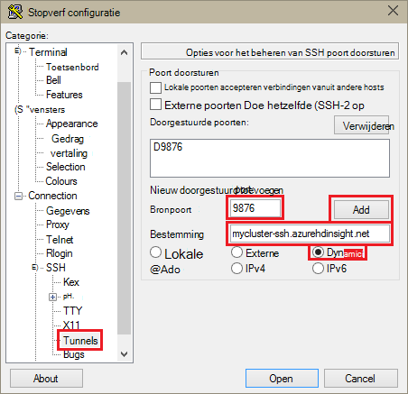
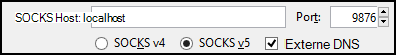

<properties
pageTitle="SSH Tunneling gebruiken voor toegang tot Ambari web UI, ResourceManager, JobHistory, NameNode, Oozie en andere gebruikersinterface van web"
description="Informatie over het gebruik van een tunnel SSH om te bladeren veilig webresources die worden gehost op uw knooppunten Linux gebaseerde HDInsight."
services="hdinsight"
documentationCenter=""
authors="Blackmist"
manager="jhubbard"
editor="cgronlun"/>

<tags
ms.service="hdinsight"
ms.devlang="na"
ms.topic="article"
ms.tgt_pltfrm="na"
ms.workload="big-data"
ms.date="10/17/2016"
ms.author="larryfr"/>

# SSH Tunneling gebruiken voor toegang tot Ambari web UI, JobHistory NameNode, Oozie en andere gebruikersinterface van web

Linux gebaseerde HDInsight clusters toegang bieden tot Ambari web UI via Internet, maar sommige functies van de gebruikersinterface zijn niet. Bijvoorbeeld: het web UI voor andere diensten die zijn opgehaald door Ambari. Voor de volledige functionaliteit van het web Ambari UI, moet u een tunnel SSH aan de kop cluster gebruiken.

## Wat is een tunnel SSH vereist?

Verscheidene van de menu's in Ambari wordt niet volledig vullen zonder een tunnel SSH, zoals ze zijn afhankelijk van websites en services die worden aangeboden door andere Hadoop services worden uitgevoerd op het cluster. Deze websites zijn vaak niet beveiligd, zodat u niet veilige om weer te geven ze rechtstreeks op internet. Soms wordt door de service de website uitgevoerd op een ander clusterknooppunt zoals Zookeeper knooppunt.

Hier volgen de services die Ambari web UI worden gebruikt, die niet toegankelijk zonder een tunnel SSH:

* JobHistory,
* NameNode,
* Thread stapels,
* Oozie web UI
* HBase diamodel en logboeken UI

Als u scriptacties om aan te passen uw cluster gebruikt, moeten de services en hulpprogramma's die u hebt geïnstalleerd, waarbij u een web UI kennismaakt een tunnel SSH. Als u kleurtoon met de actie voor een Script installeert, moet u bijvoorbeeld een tunnel SSH gebruiken voor toegang tot de kleurtoon web UI.

## Wat is een tunnel SSH?

[Secure Shell (SSH) tunneling](https://en.wikipedia.org/wiki/Tunneling_protocol#Secure_Shell_tunneling) stuurt verkeer naar een poort op uw lokale computer, via een SSH-verbinding met uw HDInsight cluster hoofd knooppunt, waar het verzoek vervolgens is opgelost alsof afkomstig het hoofd knooppunt is verzonden. Het antwoord is vervolgens terug via de tunnel bij uw werkstation verzonden.

## Vereisten voor

Wanneer u een tunnel SSH voor web-verkeer is toegestaan, hebt u het volgende:

* Een SSH-client. Voor Linux en Unix onderzoeken of Macintosh OS X, de `ssh` opdracht wordt geleverd bij het besturingssysteem. Voor Windows raden [stopverf](http://www.chiark.greenend.org.uk/~sgtatham/putty/download.html)

    > [AZURE.NOTE] Als u wilt een client SSH anders dan gebruiken `ssh` of stopverf, Zie de documentatie voor de client op het tot stand brengen van een tunnel SSH.

* Een webbrowser die kan worden geconfigureerd voor gebruik van een SOCKS-proxy

## Een tunnel met de opdracht SSH maken

Gebruik de volgende opdracht uit om te maken van een SSH tunnel gebruik van de `ssh` opdracht. __Gebruikersnaam__ vervangen door een gebruiker SSH voor uw cluster HDInsight en __CLUSTERNAAM__ vervangen door de naam van uw cluster HDInsight

    ssh -C2qTnNf -D 9876 USERNAME@CLUSTERNAME-ssh.azurehdinsight.net

Hiermee maakt u een verbinding die verkeer door naar lokale poort 9876 aan het cluster via SSH stuurt. De opties zijn:

* **D 9876** - de lokale poort die verkeer via de tunnel stuurt.

* **C** - comprimeren zorgen dat alle gegevens, omdat webverkeer hoofdzakelijk tekst is.

* **2** - dwingen SSH om te proberen protocol uitsluitend versie 2.

* **q** - stille modus.

* **T** - uitschakelen pseudo-tty-toewijzing, want we zojuist een poort doorstuurt.

* **n** - voorkomen dat het lezen van STDIN, want we zojuist een poort doorstuurt.

* **N** - een externe opdracht, niet uitgevoerd omdat we zojuist een poort doorstuurt.

* **f** - uitvoeren op de achtergrond.

Als u het cluster met een SSH-sleutel hebt geconfigureerd, moet u mogelijk gebruiken de `-i` parameter en geef het pad naar de persoonlijke SSH-sleutel.

Wanneer de opdracht is voltooid, wordt verkeer verzonden naar poort 9876 op de lokale computer worden gerouteerd via wordt Secure Sockets Layer (SSL) aan het cluster knooppunt head en er afkomstig lijken te zijn.

## Stopverf met een tunnel maken

Gebruik de volgende stappen uit om te maken van een SSH tunnel stopverf gebruiken.

1. Open stopverf en voert u de verbindingsgegevens van uw. Als u niet bekend met stopverf bent, raadpleegt u [Gebruik SSH met Linux gebaseerde Hadoop op HDInsight vanuit Windows](hdinsight-hadoop-linux-use-ssh-windows.md) voor meer informatie over hoe u dit product gebruiken met HDInsight.

2. Klik in de sectie **categorie** aan de linkerkant van het dialoogvenster **verbinding**uitvouwen, **SSH**uitvouwen en selecteer vervolgens **Tunnels**.

3. De onderstaande informatie opgeven in het formulier **Opties SSH poort doorschakelen bepalen** :

    * **Bronpoort** - de poort op de client die u wilt doorsturen. Bijvoorbeeld **9876**.

    * **Bestemming** - de SSH adres voor het cluster Linux gebaseerde HDInsight. Bijvoorbeeld: **mijncluster-ssh.azurehdinsight.net**.

    * **Dynamische** - Hiermee dynamische SOCKS-proxy-mailroutering.

    

4. Klik op **toevoegen** om de instellingen en klik vervolgens op **openen** om te openen van een verbinding SSH.

5. Wanneer u wordt gevraagd, meld u aan bij de server. Hiermee wordt een sessie SSH tot stand brengen en de tunnel inschakelen.

## De tunnel vanuit uw browser gebruiken

> [AZURE.NOTE] De stappen in deze sectie gebruikt de FireFox-browser, zoals deze vrij beschikbaar voor Linux, Unix, Macintosh OS X en Windows-systemen is. Als u ook werkt andere moderne browsers die ondersteuning bieden voor een SOCKS-proxy.

1. Configureer de browser om het **localhost:9876** gebruiken als een **SOCKS v5** -proxy. Hier ziet u hoe de instellingen van Firefox eruit. Als u een andere poort dan 9876 gebruikt, kunt u de poort wijzigen met de sjabloon die u hebt gebruikt:

    

    > [AZURE.NOTE] Selecteren van de **Externe DNS** , worden Domain Name System (DNS) aanvragen opgelost met behulp van het cluster HDInsight. Als dit niet ingeschakeld, wordt DNS lokaal worden opgelost.

2. Controleer of dat verkeer wordt gerouteerd via de tunnel door een site, zoals [http://www.whatismyip.com/](http://www.whatismyip.com/) vising bij de proxy-instellingen uitgeschakeld in Firefox. Terwijl de instellingen zijn ingeschakeld, is het IP-adres voor een machine in het Microsoft Azure-datacenter.

##Controleer of met Ambari web UI

Zodra het cluster is gebracht, gebruikt u de volgende stappen om te bevestigen dat u toegang hebben tot service web UI vanaf het Ambari Web:

1. Ga in uw browser naar http://headnodehost:8080. De `headnodehost` -mailadres wordt verzonden via de tunnel naar het cluster en omgezet in de headnode die Ambari wordt uitgevoerd op. Wanneer u wordt gevraagd, typt u de naam van de gebruiker de beheerder (admin) en het wachtwoord voor uw cluster. U mogelijk gevraagd een tweede maal op het web Ambari UI. Als dat het geval is, voert u de gegevens opnieuw op.
    
    > [AZURE.NOTE] Wanneer u met het adres http://headnodehost:8080 verbinding maken met de cluster, maakt u verbinding rechtstreeks via de tunnel naar het hoofd knooppunt dat Ambari wordt uitgevoerd op via HTTP en communicatie is beveiligd met de tunnel SSH. Wanneer u verbinding maakt via internet zonder het gebruik van een tunnel, communicatie is een beveiligde HTTPS gebruiken. Gebruik voor de verbinding via internet met HTTPS wordt https://CLUSTERNAME.azurehdinsight.net, waar __CLUSTERNAAM__ is de naam van het cluster.

2. Selecteer in de gebruikersinterface van de Web Ambari HDFS in de lijst aan de linkerkant van de pagina.

    

3. Als de gegevens van de HDFS-service wordt weergegeven, selecteert u __Snelkoppelingen__. Een lijst met knooppunten hoofd wordt weergegeven. Selecteer een van de kop knooppunten en selecteer vervolgens __NameNode UI__.

    

    > [AZURE.NOTE] Als u een langzame internetverbinding hebt, of het hoofd knooppunt bezet is, krijgt u mogelijk een wachten-indicator in plaats van een menu wanneer u __Snelkoppelingen__selecteert. Zo ja, wacht een paar minuten of twee voor de gegevens van de server moet worden ontvangen en probeer het opnieuw de lijst.
    >
    > Als u een lagere monitor met een resolutie hebt of uw browser niet is gemaximaliseerd, kunnen sommige gegevens in het menu __Snelkoppelingen__ worden afgekapt door de rechterkant van het scherm. Zo ja, uitvouwen van het menu met de muis en het gebruik van de toets pijl-rechts om te schuiven van het scherm naar rechts om de rest van het menu weer te geven.

4. Een pagina van de volgende strekking moet worden weergegeven:

    

    > [AZURE.NOTE] Ziet u de URL voor deze pagina. Dit moet er ongeveer als __http://hn1-CLUSTERNAME.randomcharacters.cx.internal.cloudapp.net:8088/cluster__. Hiermee wordt gebruikt de interne FQDN-naam (Fully Qualified Domain Name) van het knooppunt en is niet toegankelijk zonder een tunnel SSH.

## Volgende stappen

U hebt geleerd hoe maken en gebruiken van een tunnel SSH, ziet u de volgende informatie op controle en beheer van uw cluster Ambari gebruiken:

* [HDInsight clusters beheren met behulp van Ambari](hdinsight-hadoop-manage-ambari.md)

Zie de volgende onderwerpen voor meer informatie over het gebruik van SSH met HDInsight:

* [SSH gebruiken met Linux gebaseerde Hadoop op HDInsight uit Linux, Unix of OS X](hdinsight-hadoop-linux-use-ssh-unix.md)

* [SSH gebruiken met Linux gebaseerde Hadoop op HDInsight vanuit Windows](hdinsight-hadoop-linux-use-ssh-windows.md)
