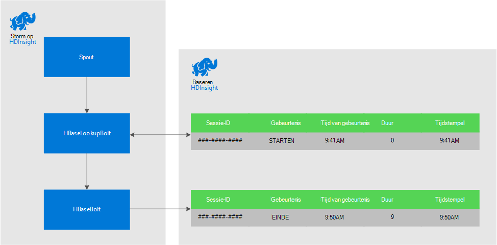
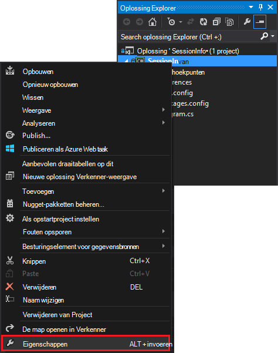
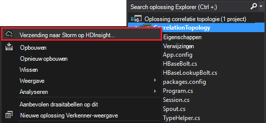

<properties
 pageTitle="Gebeurtenissen relateren na verloop van tijd met Storm en HBase op HDInsight"
 description="Leer hoe u relateren gebeurtenissen die op verschillende momenten binnenkomen via Storm en HBase op HDInsight."
 services="hdinsight"
 documentationCenter=""
 authors="Blackmist"
 manager="jhubbard"
 editor="cgronlun"
 tags="azure-portal"/>

<tags
 ms.service="hdinsight"
 ms.devlang="dotnet"
 ms.topic="article"
 ms.tgt_pltfrm="na"
 ms.workload="big-data"
 ms.date="10/27/2016"
 ms.author="larryfr"/>

# Gebeurtenissen relateren na verloop van tijd met Storm en HBase op HDInsight

Met behulp van een permanente gegevensopslag met Apache Storm, kunt u de gegevens die op verschillende momenten binnenkomen relateren. Bijvoorbeeld koppelen aan- en afmelden gebeurtenissen voor een gebruikerssessie om te berekenen hoe lang de sessie heeft geduurd.

In dit document leert u hoe u een eenvoudige C# Storm topologie die wordt bijgehouden aan- en afmelden gebeurtenissen voor gebruikerssessies met en de duur van de sessie berekend maakt. De topologie gebruikt HBase als een permanente gegevensopslag. HBase kunt u batch query's uitvoeren op de historische gegevens zodat het eindresultaat extra inzichten, zoals hoeveel sessies zijn gestart of beëindigd gedurende een bepaalde periode.

## Vereisten voor

- Visual Studio en de HDInsight hulpprogramma's voor Visual Studio: Zie [aan de slag met het HDInsight tools for Visual Studio](../HDInsight/hdinsight-hadoop-visual-studio-tools-get-started.md) voor informatie over de installatie.

- Apache Storm op HDInsight cluster (Windows-basis). Hiermee voert de topologie Storm, waarin binnenkomende gegevens worden verwerkt en op HBase opgeslagen.

    > [AZURE.IMPORTANT] Terwijl SCP.NET topologieën worden ondersteund op Linux gebaseerde Storm clusters na 10/28/2016 hebt gemaakt, werkt de HBase SDK voor .NET-pakket beschikbaar vanaf 10/28/2016 niet correct onder Linux.

- Apache HBase op HDInsight cluster (Linux of op basis van Windows). Dit is de gegevensopslag voor dit voorbeeld.

## Architectuur

Gebeurtenissen correleren, is een algemene id voor de gebeurtenisbron vereist. For example, een gebruikers-ID, sessie-ID of ander deel van de gegevens die een) unieke en b) opgenomen in alle gegevens die zijn verzonden naar Storm. In dit voorbeeld wordt de waarde GUID voor een sessie-ID.

In dit voorbeeld bestaat uit twee HDInsight clusters:

-   HBase: permanente gegevensopslag voor historische gegevens

-   Storm: gebruikt voor het nemen van binnenkomende gegevens

De gegevens willekeurig wordt gegenereerd door de topologie Storm en bestaat uit de volgende items:

-   Sessionid: een GUID die deze identificeert op elke sessie

-   Gebeurtenis: een begin of einde gebeurtenis. In dit voorbeeld cijfergroepen START altijd vóór het einde

-   Tijd: de tijd van de gebeurtenis.

Deze gegevens wordt verwerkt en die zijn opgeslagen in HBase.

### Topologie van storm

Wanneer een sessie wordt gestart, is een gebeurtenis **starten** ontvangen door de topologie en geregistreerd in HBase. Wanneer een **END** -gebeurtenis wordt ontvangen, wordt de topologie opgehaald van de gebeurtenis **BEGINT** en berekent de tijd tussen de twee gebeurtenissen. Deze waarde **duur** wordt vervolgens opgeslagen in HBase samen met de gegevens van de gebeurtenis **BEËINDIGEN** .

> [AZURE.IMPORTANT] Terwijl deze topologie ziet u het patroon dat in eenvoudige, moeten een oplossing productie ondernemen ontwerpen voor de volgende scenario's:
>
> - Afmelden bij volgorde binnengekomen gebeurtenissen
> - Dubbele gebeurtenissen
> - Decoratieve gebeurtenissen

De topologie van de steekproef bestaat uit de volgende onderdelen:

-   Session.CS: een gebruikerssessie simuleert door te maken van een willekeurig sessie-ID, begin tijd en hoe lang de sessie duurt

-   Spout.CS: Hiermee maakt u 100 sessies, genereert een startgebeurtenis, de willekeurig time-out voor elke sessie wacht en vervolgens genereert een END-gebeurtenis. Vervolgens beëindigd herhalingen sessies om nieuwe te genereren.

-   HBaseLookupBolt.cs: Gebruik de sessie-ID opzoeken sessiegegevens uit HBase. Wanneer een END-gebeurtenis wordt verwerkt, vindt u de bijbehorende begin-gebeurtenis en de duur van de sessie berekend.

-   HBaseBolt.cs: Informatie in HBase opgeslagen.

-   TypeHelper.cs: Helpt bij het typeconversie bij het lezen van / naar HBase schrijven.

### HBase schema

In HBase, worden de gegevens opgeslagen in een tabel met de volgende schema/instellingen:

-   Rij-toets: de sessie-ID wordt gebruikt als de sleutel voor rijen in deze tabel

-   Kolom familie: de naam van de familie 'cf' is. Kolommen die zijn opgeslagen in deze reeks zijn:

    -   gebeurtenis: begin of einde

    -   tijd: de tijd in milliseconden waarop de gebeurtenis heeft plaatsgevonden

    -   duur: de lengte tussen begin- en EINDTIJD gebeurtenis

-   VERSIES: de familie 'cf' is ingesteld op 5 versies van elke rij behouden

    > [AZURE.NOTE] Versies zijn een logboek met vorige waarden die zijn opgeslagen voor een bepaalde rij-sleutel. Standaard retourneert HBase alleen de waarde voor de meest recente versie van een rij. In dit geval wordt dezelfde rij gebruikt voor alle gebeurtenissen (begin, einde.) met elke versie van een rij wordt aangegeven door de waarde tijdstempel. Hiermee beschikt u over een historische weergave van gebeurtenissen die zijn geregistreerd voor een specifieke-ID.

## Downloaden van het project

Voorbeeld van het project kan worden gedownload van [https://github.com/Azure-Samples/hdinsight-storm-dotnet-event-correlation](https://github.com/Azure-Samples/hdinsight-storm-dotnet-event-correlation).

Deze download bevat de volgende C#-projecten:

-   CorrelationTopology: C# Storm zoektopologie die willekeurig begin- en -gebeurtenissen voor gebruikerssessies met genereert. Elke sessie duurt tussen 1 en 5 minuten.

-   SessionInfo: C#-console-toepassing die wordt gemaakt van de tabel HBase en bevat voorbeeldquery om terug te keren informatie over de sessiegegevens van de opgeslagen.

## De tabel maken

1. Open het project **SessionInfo** in Visual Studio.

2. Klik in **Solution Explorer**met de rechtermuisknop op het project **SessionInfo** en selecteer **Eigenschappen**.

    

3. Selecteer **Instellingen**en stel vervolgens de volgende waarden:

    -   HBaseClusterURL: de URL voor uw cluster HBase. Bijvoorbeeld https://myhbasecluster.azurehdinsight.net

    -   HBaseClusterUserName: de beheerder/HTTP gebruikersaccount voor uw cluster

    -   HBaseClusterPassword: het wachtwoord voor de beheerder/HTTP-gebruikersaccount

    -   HBaseTableName: de naam van de tabel wilt gebruiken met dit voorbeeld

    -   HBaseTableColumnFamily: De familie kolomnaam

    

5. Voer de oplossing. Wanneer u wordt gevraagd, selecteert u de toets 'c' maken van de tabel op uw cluster HBase.

## Bouwen en implementeren van de topologie Storm

1.  Open de oplossing **CorrelationTopology** in Visual Studio.

2.  Klik met de rechtermuisknop op het project **CorrelationTopology** in **Solution Explorer**en selecteer Eigenschappen.

3.  Selecteer **Instellingen** en de onderstaande informatie opgeven in het eigenschappenvenster. De eerste 5 moet dezelfde waarden die worden gebruikt door het project **SessionInfo** :

    -   HBaseClusterURL: de URL voor uw cluster HBase. Bijvoorbeeld https://myhbasecluster.azurehdinsight.net

    -   HBaseClusterUserName: de beheerder/HTTP gebruikersaccount voor uw cluster

    -   HBaseClusterPassword: het wachtwoord voor de beheerder/HTTP-gebruikersaccount

    -   HBaseTableName: de naam van de tabel wilt gebruiken met dit voorbeeld. Dit moet de naam van de dezelfde tabel als die gebruikt in het project SessionInfo bevatten

    -   HBaseTableColumnFamily: De familie kolomnaam. Dit moet de naam van de dezelfde kolom familie als die gebruikt in het project SessionInfo bevatten

    > [AZURE.IMPORTANT] Wijzig de HBaseTableColumnNames, niet als de standaardinstellingen, worden de namen die wordt gebruikt door **SessionInfo** gegevens worden opgehaald.

4.  De eigenschappen van het opslaan en vervolgens het project maakt.

5.  In **Solution Explorer**, klik met de rechtermuisknop op het project en selecteer de optie **verzenden naar Storm op HDInsight**. Als u wordt gevraagd, voert u de referenties voor uw Azure-abonnement.

    

6.  Selecteer in het dialoogvenster **Topologie verzenden** , het Storm cluster die deze topologie wordt uitgevoerd.

    > [AZURE.NOTE] De eerste keer dat u een topologie indienen duurt een paar seconden om op te halen, de naam van uw clusters HDInsight.

7.  Zodra de topologie is geüpload en ingediend aan het cluster, wordt de **Storm topologie weergave** openen en weergeven van de actieve topologie. Selecteer de **CorrelationTopology** en gebruik de knop Vernieuwen boven rechtsboven op de pagina om de topologiegegevens te vernieuwen.

    

    Wanneer de topologie begonnen met het genereren van gegevens, wordt de waarde in de kolom **lichten** verhogen.

    > [AZURE.NOTE] Als de **Storm topologie weergave** niet automatisch wordt geopend, gebruikt u de volgende stappen uit om dit te openen:
    >
    > 1. Vouw **Azure**in **Solution Explorer**en vouw vervolgens uit **HDInsight**.
    >
    > 2. Klik met de rechtermuisknop het Storm cluster waarop de topologie wordt uitgevoerd in en selecteer **Weergave Storm topologieën**

## Query de gegevens

Nadat de gegevens heeft is gegenereerd, gebruikt u de volgende stappen om query's in de gegevens.

1. Ga terug naar het project **SessionInfo** . Als u niet wordt uitgevoerd, start u een nieuw exemplaar van dit.

2. Wanneer u wordt gevraagd, selecteert u **s** om te zoeken naar startgebeurtenis. U wordt gevraagd een begin- en -tijd om te definiëren, een tijdsbereik - invoeren worden alleen gebeurtenissen tussen deze twee keer geretourneerd.

    De volgende indeling gebruiken bij het invoeren van de begin- en eindtijden: uu: mm en 'ben' of 'pm'. Bijvoorbeeld: 23:20 uur.

    Aangezien de topologie NET is gestart, gebruik een begintijd van voordat deze is geïmplementeerd en een eindtijd van nu. Dit moet meestal de begin-gebeurtenissen die zijn gegenereerd tijdens het gestart vastleggen. Wanneer de query wordt uitgevoerd, ziet u een lijst met items ongeveer als volgt uit:

        Session e6992b3e-79be-4991-afcf-5cb47dd1c81c started at 6/5/2015 6:10:15 PM. Timestamp = 1433527820737

Zoeken naar einde gebeurtenissen werkt hetzelfde als START gebeurtenissen. EINDE gebeurtenissen worden echter willekeurig gegenereerd tussen 1 en 5 minuten na de gebeurtenis starten. Mogelijk moet u dus een paar tijdsbereik probeert om te zoeken naar de gebeurtenissen einde. EINDE gebeurtenissen bevat ook de duur van de sessie - het verschil tussen de gebeurtenis begintijd en eindtijd van de gebeurtenis. Hier volgt een voorbeeld van gegevens voor einde gebeurtenissen:

    Session fc9fa8e6-6892-4073-93b3-a587040d892e lasted 2 minutes, and ended at 6/5/2015 6:12:15 PM

> [AZURE.NOTE] Terwijl de tijdwaarden die u invoert in de lokale tijd, is de tijd van de query geretourneerd UTC.

##De topologie stoppen

Wanneer u klaar bent voor de topologie stoppen, terug naar het project **CorrelationTopology** in Visual Studio. In de **Weergave van Storm topologie**, selecteert u de topologie en gebruik vervolgens de knop **beëindigen** boven aan de weergave van de topologie.

##Uw cluster verwijderen

[AZURE.INCLUDE [delete-cluster-warning](../../includes/hdinsight-delete-cluster-warning.md)]

##Volgende stappen

Zie voor meer Storm voorbeelden [voorbeeld topologieën voor Storm op HDInsight](hdinsight-storm-example-topology.md).
 
