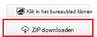
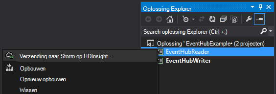
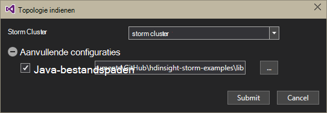
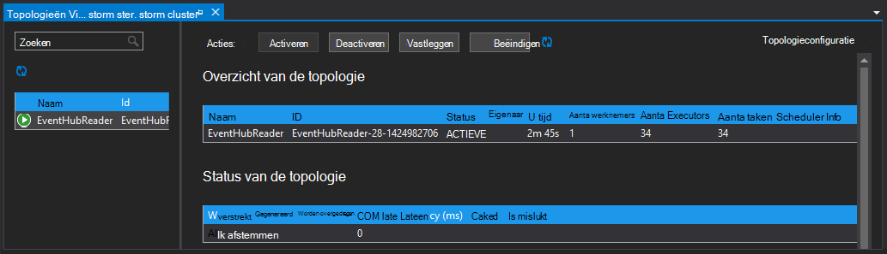

<properties
   pageTitle="Gebeurtenissen van gebeurtenis Hubs met Storm op HDInsight | Microsoft Azure"
   description="Leer hoe u de gegevens van de gebeurtenis Hubs verwerken met een C# Storm topologie in Visual Studio met behulp van de hulpmiddelen HDInsight voor Visual Studio hebt gemaakt."
   services="hdinsight,notification hubs"
   documentationCenter=""
   authors="Blackmist"
   manager="jhubbard"
   editor="cgronlun"/>

<tags
   ms.service="hdinsight"
   ms.devlang="dotnet"
   ms.topic="article"
   ms.tgt_pltfrm="na"
   ms.workload="big-data"
   ms.date="10/27/2016"
   ms.author="larryfr"/>

# Procesgebeurtenissen van Azure gebeurtenis Hubs met Storm op HDInsight (C#)

Azure gebeurtenis Hubs kunt u grote hoeveelheden gegevens uit websites, apps en apparaten van proces. De gebeurtenis Hubs spout kunt u eenvoudig te gebruiken Apache Storm op HDInsight om deze gegevens in realtime te analyseren. U kunt ook gegevens aan de gebeurtenis Hubs van Storm schrijven met behulp van de gebeurtenis Hubs bout.

In deze zelfstudie leert u hoe u met de Visual Studio-sjablonen geïnstalleerd met HDInsight Tools voor Visual Studio twee topologieën die met Azure gebeurtenis Hubs werken maken.

* **EventHubWriter**: willekeurig wordt gegenereerd gegevens en naar gebeurtenis Hubs geschreven

* **EventHubReader**: leest gegevens van de gebeurtenis Hubs en de gegevens in de logboeken Storm

> [AZURE.NOTE] Terwijl de stappen in dit document, is afhankelijk van een Windows-ontwikkelomgeving met Visual Studio, kan het gecompileerd project worden verzonden naar een Linux- of Windows gebaseerde HDInsight cluster. Alleen Linux gebaseerde clusters gemaakt na 10/28/2016 ondersteuning SCP.NET topologieën.
>
> Als u wilt een C#-topologie met een cluster Linux gebaseerde gebruikt, moet u het pakket Microsoft.SCP.Net.SDK NuGet gebruikt door uw project naar versie 0.10.0.6 of hoger bijwerken. De versie van het pakket moet ook overeenkomen met de primaire versie van Storm geïnstalleerd op HDInsight. Bijvoorbeeld Storm voor HDInsight versies 3.3 en 3.4 Storm versie gebruiken 0.10.x, terwijl de HDInsight 3.5 met Storm 1.0.x.
> 
> C# topologieën op Linux gebaseerde clusters moeten .NET 4.5 gebruik en zwart gebruiken om uit te voeren op het cluster HDInsight. De meeste dingen werken, echter checkt u het document [Zwart compatibiliteit](http://www.mono-project.com/docs/about-mono/compatibility/) mogelijke compatibiliteitsproblemen.
>
> Zie voor een Java-versie van dit project, die ook werkt op een cluster Linux- of Windows, [procesgebeurtenissen van Azure gebeurtenis Hubs met Storm op HDInsight (Java)](hdinsight-storm-develop-java-event-hub-topology.md).

## Vereisten voor

* Een [Apache Storm op HDInsight cluster](hdinsight-apache-storm-tutorial-get-started.md)

* Een [Hub voor Azure gebeurtenis](../event-hubs/event-hubs-csharp-ephcs-getstarted.md)

* De [SDK van Azure .NET](http://azure.microsoft.com/downloads/)

* De [HDInsight Tools voor Visual Studio](hdinsight-hadoop-visual-studio-tools-get-started.md)

## Voltooid project

U kunt een volledige versie van het project dat is gemaakt in deze zelfstudie uit GitHub downloaden: [eventhub-storm-hybride](https://github.com/Azure-Samples/hdinsight-dotnet-java-storm-eventhub). U moet echter nog steeds de configuratie-instellingen opgeven door de stappen in deze zelfstudie te volgen.

## Gebeurtenis Hubs spout en bout

De gebeurtenis Hubs spout en bolt zijn Java-onderdelen waarmee u kunt eenvoudig werken met gebeurtenis Hubs van Apache Storm. Hoewel deze onderdelen zijn geschreven in Java, wordt de HDInsight's voor Visual Studio kunt u hybride topologieën die mengt u C# en Java-onderdelen maken.

De spout en bout zijn verdeeld als één Java archief (.jar)-bestand met de naam **eventhubs-storm-spout-#.#-jar-with-dependencies.jar**, waar #. # is de versie van het bestand.

### Download het bestand .jar

De meest recente versie van het oppervlak-bestand is opgenomen in het project [HDInsight Storm voorbeelden](https://github.com/hdinsight/hdinsight-storm-examples) onder de map **bibliotheek/eventhubs** . Gebruik een van de volgende manieren het bestand te downloaden.

> [AZURE.NOTE] De spout en bout zijn ingediend voor opname in het project Apache Storm. Zie voor meer informatie [STORM-583: aanvankelijke inchecken voor storm-gebeurtenis hubs](https://github.com/apache/storm/pull/336/files) in GitHub.

* **Een ZIP-bestand downloaden**: Selecteer in de site [HDInsight Storm voorbeelden](https://github.com/hdinsight/hdinsight-storm-examples) **Downloaden ZIP** in het rechterdeelvenster een ZIP-bestand met het project te downloaden.

    

    Nadat het bestand is gedownload, kunt u het archief halen, en wordt het bestand in de map **bibliotheek** .

* **Klonen het project**: als u [cijfer](http://git-scm.com/) is geïnstalleerd, gebruikt u de volgende opdracht uit de opslagplaats lokaal klonen en vervolgens het bestand niet vinden in de map **bibliotheek** .

        git clone https://github.com/hdinsight/hdinsight-storm-examples

## Gebeurtenis Hubs configureren

Gebeurtenis Hubs is de gegevensbron voor dit voorbeeld. Gebruik de informatie in de sectie __maken een gebeurtenis Hub__ van het document [aan de slag met Hubs gebeurtenis](../event-hubs/event-hubs-csharp-ephcs-getstarted.md) .

3. Nadat de hub gebeurtenis is gemaakt, het EventHub-blad in de Portal Azure weergeven en selecteert u __gedeeld access beleidsregels__. Gebruik de vermelding __+ toevoegen__ om toe te voegen van de volgende beleidsitems:

  	| Naam | Machtigingen |
  	| ----- | ----- |
  	| schrijver | Verzenden |
  	| lezer | Luisteren |

    

5. Selecteer het beleid __reader__ en __schrijver__ . Kopieer en sla de waarde van de __Primaire sleutel__ voor beide beleidsregels, zoals deze wordt later gebruikt.

## De EventHubWriter configureren

1. Als u de nieuwste versie van de hulpmiddelen HDInsight hebt niet voor Visual Studio hebt geïnstalleerd, raadpleegt u [aan de slag met HDInsight Tools for Visual Studio](hdinsight-hadoop-visual-studio-tools-get-started.md).

2. Download de oplossing vanuit [eventhub-storm-hybride](https://github.com/Azure-Samples/hdinsight-dotnet-java-storm-eventhub). Open de oplossing en even duren om de code voor het project __EventHubWriter__ .

4. Open het bestand __App.config__ in het project __EventHubWriter__ . Gebruik de informatie van de gebeurtenis Hub die u eerder hebt geconfigureerd in de waarde voor de volgende toetsen te vullen:

  	| Toets | Waarde |
  	| ----- | ----- |
  	| EventHubPolicyName | schrijver (als u gebruikt een andere naam voor het beleid met de machtiging _verzenden_ , in plaats daarvan deze gebruiken.) |
  	| EventHubPolicyKey | De sleutel voor het beleid schrijver |
  	| EventHubNamespace | De naamruimte waarin de Hub van de gebeurtenis |
  	| EventHubName | De naam van de gebeurtenis Hub |
  	| EventHubPartitionCount | Het aantal partities in de Hub van de gebeurtenis |

4. Opslaan en sluit het bestand **App.config** .

## De EventHubReader configureren

1. Het project __EventHubReader__ opent en voert u een paar momoents om de code.

2. Open het __App.config__ voor de __EventHubWriter__. Gebruik de informatie van de gebeurtenis Hub die u eerder hebt geconfigureerd in de waarde voor de volgende toetsen te vullen:

  	| Toets | Waarde |
  	| ----- | ----- |
  	| EventHubPolicyName | lezer (als u gebruikt een andere naam voor het beleid met de machtiging _beluisteren_ in plaats daarvan deze gebruiken.) |
  	| EventHubPolicyKey | De sleutel voor het beleid reader |
  	| EventHubNamespace | De naamruimte waarin de Hub van de gebeurtenis |
  	| EventHubName | De naam van de gebeurtenis Hub |
  	| EventHubPartitionCount | Het aantal partities in de Hub van de gebeurtenis |

3. Opslaan en sluit het bestand **App.config** .

## De topologieën implementeren

1. Met de rechtermuisknop op het project **EventHubReader** uit **Solution Explorer**, en selecteer de optie **verzenden naar Storm op HDInsight**.

    

2. Selecteer uw **Storm Cluster**in het scherm **Topologie indienen** . **Aanvullende configuraties**uitvouwen, selecteer **Java bestandspaden** **…** en selecteer de map waarin het **eventhubs-storm-spout-0.9-jar-with-dependencies.jar** bestand dat u eerder hebt gedownload. Klik tot slot op **verzenden**.

    

3. Wanneer de topologie is verzonden, wordt de **Storm topologieën Viewer** wordt weergegeven. Selecteer de topologie **EventHubReader** in het linkerdeelvenster om weer te geven van statistieken voor de topologie. Op dit moment moet niets gebeuren omdat er geen gebeurtenissen zijn geschreven met gebeurtenis Hubs nog.

    

4. Met de rechtermuisknop op het project **EventHubWriter** uit **Solution Explorer**, en selecteer de optie **verzenden naar Storm op HDInsight**.

2. Selecteer uw **Storm Cluster**in het scherm **Topologie indienen** . **Aanvullende configuraties**uitvouwen, selecteer **Java bestandspaden** **…** en selecteer de map waarin het **eventhubs-storm-spout-0.9-jar-with-dependencies.jar** bestand dat u eerder hebt gedownload. Klik tot slot op **verzenden**.

5. Wanneer de topologie is ingediend, vernieuwt u de lijst topologie in de **Storm topologieën Viewer** om te bevestigen dat beide topologieën op het cluster worden uitgevoerd.

6. Selecteer de topologie **EventHubReader** in **Storm topologieën Viewer**.

4. Dubbelklik op de component __LogBolt__ in de grafiekweergave. Hiermee opent u de pagina __Overzicht van onderdelen__ voor de bout.

3. Selecteer een van de koppelingen in de kolom __poort__ in de sectie __Executors__ . Vastgelegde door het onderdeel informatie wordt weergegeven. De geregistreerde gegevens is vergelijkbaar met het volgende:

        2016-10-20 13:26:44.186 m.s.s.b.ScpNetBolt [INFO] Processing tuple: source: com.microsoft.eventhubs.spout.EventHubSpout:7, stream: default, id: {5769732396213255808=520853934697489134}, [{"deviceId":3,"deviceValue":1379915540}]
        2016-10-20 13:26:44.234 m.s.s.b.ScpNetBolt [INFO] Processing tuple: source: com.microsoft.eventhubs.spout.EventHubSpout:7, stream: default, id: {7154038361491319965=4543766486572976404}, [{"deviceId":3,"deviceValue":459399321}]
        2016-10-20 13:26:44.335 m.s.s.b.ScpNetBolt [INFO] Processing tuple: source: com.microsoft.eventhubs.spout.EventHubSpout:6, stream: default, id: {513308780877039680=-7571211415704099042}, [{"deviceId":5,"deviceValue":845561159}]
        2016-10-20 13:26:44.445 m.s.s.b.ScpNetBolt [INFO] Processing tuple: source: com.microsoft.eventhubs.spout.EventHubSpout:7, stream: default, id: {-2409895457033895206=5479027861202203517}, [{"deviceId":8,"deviceValue":2105860655}]

## De topologieën stoppen

Als u wilt stoppen met het topologieën, selecteert u elke topologie in de **Storm topologie Viewer**en kies **verwijderen**.

## Uw cluster verwijderen

[AZURE.INCLUDE [delete-cluster-warning](../../includes/hdinsight-delete-cluster-warning.md)]

## Notities

### Plaatst controlepunten

De EventHubSpout regelmatig controlepunten de status naar het knooppunt Zookeeper, dat wordt opgeslagen van de huidige tijd voor berichten in de wachtrij lezen. Hiermee wordt het onderdeel ontvangen van berichten op het opgeslagen weer in de volgende scenario's:

* Het exemplaar van onderdeel mislukt en wordt gestart.

* U vergroten of verkleinen van het cluster door het toevoegen of verwijderen van knooppunten.

* De topologie is afgebroken en opnieuw wordt gestart **met dezelfde naam**.

U kunt ook exporteren en importeren in de permanente controlepunten WASB (de Azure opslag die worden gebruikt door uw cluster HDInsight.) De scripts hiervoor bevinden zich op de Storm HDInsight-cluster bij **c:\apps\dist\storm-0.9.3.2.2.1.0-2340\zkdatatool-1.0\bin**.

>[AZURE.NOTE] Het versienummer weergegeven in het pad kan afwijken, zoals de versie van Storm geïnstalleerd op het cluster in de toekomst kan veranderen.

De scripts in deze map zijn:

* **stormmeta_import.cmd**: alle Storm metagegevens uit de container cluster standaard opslag te importeren in Zookeeper.

* **stormmeta_export.cmd**: alle Storm metagegevens exporteren vanuit Zookeeper aan de container cluster standaard opslag.

* **stormmeta_delete.cmd**: alle Storm metagegevens uit Zookeeper verwijderen.

Exporteren die een import, u kunt om controlepunt gegevens wanneer u moet het cluster verwijderen, maar wilt gaan met de verwerking van het huidige weer in de hub wanneer u een nieuw cluster weer online naar voren haalt.

> [AZURE.NOTE] Aangezien de gegevens aan de standaard-opslag container blijft behouden, de nieuwe cluster **moet** hetzelfde opslag-account en container gebruiken als het vorige cluster.

## Volgende stappen

In dit document, hebt u geleerd hoe gebruikt u de Java gebeurtenis Hubs Spout en bout uit een topologie C# om te werken met gegevens in de Hub van Azure-gebeurtenis. Zie de volgende onderwerpen voor meer informatie over het maken van C# topologieën.

* [Ontwikkel C# topologieën voor Apache Storm op HDInsight gebruik van Visual Studio](hdinsight-storm-develop-csharp-visual-studio-topology.md)

* [SCP programming handleiding](hdinsight-storm-scp-programming-guide.md)

* [Voorbeeld topologieën voor Storm op HDInsight](hdinsight-storm-example-topology.md)
 
