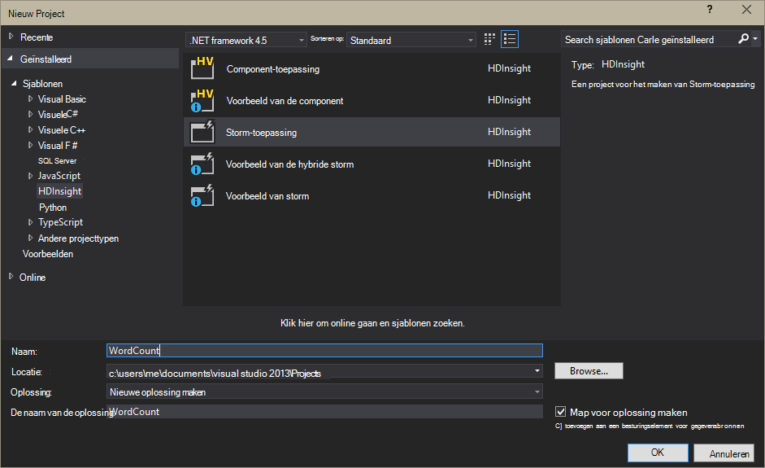

<properties
    pageTitle="Inleiding tot Apache Storm op HDInsight | Microsoft Azure"
    description="Bekijk de inleiding voor Apache Storm, en leer hoe u Storm op HDInsight kunt gebruiken om realtimegegevens analytics oplossingen in de cloud te maken."
    services="hdinsight"
    documentationCenter=""
    authors="Blackmist"
    manager="jhubbard"
    editor="cgronlun"
    tags="azure-portal"/>

<tags
   ms.service="hdinsight"
   ms.devlang="na"
   ms.topic="get-started-article"
   ms.tgt_pltfrm="na"
   ms.workload="big-data"
   ms.date="10/11/2016"
   ms.author="larryfr"/>

#Inleiding tot Apache Storm op HDInsight: realtime analytics voor Hadoop

Apache Storm op HDInsight kunt u met [Apache Hadoop](http://hadoop.apache.org)gedistribueerde, realtime analytics-oplossingen maken in de Azure-omgeving.

##Wat is Apache Storm?

Apache Storm is een berekening verdeelde, fouttolerantie, open source-systeem waarmee u kunt het verwerken van gegevens in realtime met Hadoop. Storm oplossingen biedt gegarandeerd verwerking van gegevens, ook met de mogelijkheid op opnieuw afspelen gegevens die de eerste keer is niet is verwerkt.

##Waarom Storm op HDInsight gebruiken?

Apache Storm op HDInsight is een beheerde cluster geïntegreerd in de Azure-omgeving. Biedt de volgende belangrijke voordelen:

* Wordt uitgevoerd als een beheerde service met een SLA van 99,9% tijden

* Gebruik van de taal van uw keuze: biedt ondersteuning voor Storm onderdelen geschreven in **Java**, **C#**en **Python**

    * Een combinatie van de programmeertaal ondersteunt: lezen van gegevens met behulp van Java en vervolgens verwerken met C#
    
        > [AZURE.NOTE] C# topologieën worden alleen ondersteund op Windows gebaseerde HDInsight clusters.

    * De **Trident** Java-interface gebruiken om te maken van Storm topologieën die ondersteuning bieden voor 'zodra precies' verwerking van berichten, "transacties" gegevensopslag permanente en een aantal veelvoorkomende stream analytics-bewerkingen

* Ingebouwde functies voor schaal-omhoog en omlaag schaal bevat: de schaal van een cluster HDInsight zonder invloed uitgevoerd Storm topologieën aanpassen

* Integreren met andere Azure services, met inbegrip van de gebeurtenis-Hub, Azure Virtual Network SQL-Database, blobopslag en DocumentDB

    * De mogelijkheden van meerdere HDInsight clusters combineren met behulp van Azure Virtual Network: analytische pijpleidingen met HDInsight, HBase of Hadoop clusters maken

Zie voor een lijst met bedrijven die Apache Storm voor hun realtime analytics-oplossingen, [Bedrijven gebruik Apache Storm](https://storm.apache.org/documentation/Powered-By.html).

Als u wilt aan de slag met Storm, raadpleegt u [aan de slag met Storm op HDInsight][gettingstarted].

###Gebruiksgemak inrichting

U kunt een nieuwe Storm op HDInsight cluster inrichten in minuten. Geef de naam van het cluster, de grootte, beheerdersaccount en het opslag-account. Azure maakt het cluster, met inbegrip van de steekproef topologieën en een web-Beheerdashboard.

> [AZURE.NOTE] U kunt ook Storm clusters inrichten met behulp van de [Azure CLI](../xplat-cli-install.md) of [Azure PowerShell](../powershell-install-configure.md).

Binnen 15 minuten van de aanvraag, hebt u een nieuwe Storm cluster uitvoert en klaar voor uw eerste realtime analytics pijplijn.

###Gebruiksgemak

__Voor Linux gebaseerde Storm op HDInsight clusters__, u kunt verbinding maken met het cluster met SSH en gebruik de `storm` opdracht om te starten en topologieën beheren. U kunt ook Ambari gebruiken om de Storm-service en de gebruikersinterface Storm bewaken en beheren van actieve topologieën te bewaken.

Zie [aan de slag met Apache Storm op Linux gebaseerde HDInsight](hdinsight-apache-storm-tutorial-get-started-linux.md)voor meer informatie over het werken met Storm Linux gebaseerde clusters.

__Voor Windows gebaseerde Storm op HDInsight clusters__, met de hulpmiddelen HDInsight voor Visual Studio kunt u maken C# en hybride C# / Java topologieën, en deze aan uw Storm op HDInsight cluster verzenden.  

HDInsight Tools voor Visual Studio bevat ook een interface waarmee u kunt controleren en Storm topologieën op een cluster beheren.

Zie voor een voorbeeld van het gebruik van de HDInsight-hulpmiddelen voor het maken van een toepassing voor de Storm, [ontwikkelen C# Storm topologieën met de hulpmiddelen HDInsight voor Visual Studio](hdinsight-storm-develop-csharp-visual-studio-topology.md).

Zie [aan de slag met het HDInsight Tools for Visual Studio](../HDInsight/hdinsight-hadoop-visual-studio-tools-get-started.md)voor meer informatie over de hulpmiddelen HDInsight voor Visual Studio.

Elke Storm op HDInsight cluster bevat ook een web gebaseerde Storm Dashboard waarmee u verzenden, controleren en beheren van Storm topologieën uitgevoerd op de cluster.

Zie voor meer informatie over het gebruik van het Dashboard Storm [distribueren en beheren van Apache Storm topologieën op HDInsight](hdinsight-storm-deploy-monitor-topology.md).

Kunt u bovendien eenvoudige integratie met Azure gebeurtenis Hubs tot en met de **Gebeurtenis Hub Spout**storm op HDInsight. De meest recente versie van dit onderdeel is beschikbaar op [https://github.com/hdinsight/hdinsight-storm-examples/tree/master/lib/eventhubs](https://github.com/hdinsight/hdinsight-storm-examples/tree/master/lib/eventhubs). Zie de volgende documenten voor meer informatie over het gebruik van dit onderdeel.

* [Een C#-topologie die gebruikmaakt van Azure gebeurtenis Hubs ontwikkelen](hdinsight-storm-develop-csharp-event-hub-topology.md)

* [Een Java-topologie die gebruikmaakt van Azure gebeurtenis Hubs ontwikkelen](hdinsight-storm-develop-java-event-hub-topology.md)

###Betrouwbaarheid

Apache Storm altijd zorgt ervoor dat elk binnenkomend bericht volledig verwerkt wordt, zelfs wanneer de gegevensanalyse zijn verdeeld over honderden knooppunten.

Het **knooppunt Nimbus** vergelijkbare functionaliteit biedt tot de Hadoop JobTracker en taken wilt toewijzen aan andere knooppunten in het cluster via **Zookeeper**. Zookeeper knooppunten verstrekt afhankelijk voor het cluster en communicatie tussen Nimbus en het proces **toezichthouder** op de knooppunten werknemer. Als één verwerkingsknooppunt uitvalt, het knooppunt Nimbus geïnformeerd en het toewijzen van de taak en de bijbehorende gegevens naar een ander knooppunt.

De standaard-configuratie voor Apache Storm is slechts één Nimbus knooppunt hebben. Storm op HDInsight wordt uitgevoerd twee Nimbus knooppunten. Als het primaire knooppunt mislukt, wordt het cluster HDInsight overschakelen naar de secundaire knooppunt terwijl het primaire knooppunt is hersteld.

###Schaal

Maar u het aantal knooppunten in het cluster tijdens het maken opgeven kunt, kunt u groter of kleiner van het cluster zodat deze overeenkomen met werkbelasting. Alle HDInsight clusters kunnen u het aantal knooppunten in het cluster, zelfs tijdens het verwerken van gegevens wijzigen.

> [AZURE.NOTE] Om te profiteren van nieuwe knooppunten toegevoegd via schaalbaarheid, moet u opnieuw topologieën gestart voordat het formaat van een cluster verhoogd.

###Ondersteuning

Storm op HDInsight wordt geleverd voor enterprise-niveau 24 x 7 support. Storm op HDInsight, heeft ook een SLA van 99,9%. Dat betekent dat we garanderen dat het cluster externe connectivity ten minste 99,9% van de tijd hebben.

##Algemene gebruik dozen voor realtime analytics

Hier volgen enkele veelvoorkomende scenario's waarvoor u Apache storm op HDInsight kunt gebruiken. Lees [hoe bedrijven Storm gebruikt](https://storm.apache.org/documentation/Powered-By.html)voor informatie over echte scenario's.

* Internet van dingen (IoT)
* Fraude detectie
* Sociale analytics
* Extraheren, transformeren, laden (ETL)
* Netwerk bewaken
* Zoeken
* Mobiele betrokkenheid

##Hoe wordt de gegevens in HDInsight Storm verwerkt?

Apache Storm wordt uitgevoerd **topologieën** in plaats van de MapReduce taken die u mogelijk kent uit HDInsight of Hadoop. Een Storm op HDInsight cluster bevat twee typen knooppunten: head knooppunten die **Nimbus** en werknemer knooppunten waarop **toezichthouder**worden uitgevoerd.

* **Nimbus**: vergelijkbaar met de JobTracker in Hadoop, deze is verantwoordelijk voor het distribueren van de code in het cluster, taken toewijzen aan virtuele machines en monitoring voor is mislukt. HDInsight biedt twee Nimbus knooppunten, dus er geen potentieel risico voor Storm op HDInsight is

* **Toezichthouder**: de toezichthouder voor elke werknemer knooppunt is verantwoordelijk voor het starten en stoppen **werknemer processen** op het knooppunt.

* **Werkproces**: een subset van een **topologie**is uitgevoerd. Een actieve topologie is verdeeld over veel werknemer bedrijfsprocessen binnen het cluster.

* **Topologie**: Hiermee definieert u een grafiek van de berekening waarmee **streams** worden verwerkt. In tegenstelling tot MapReduce taken, topologieën uitgevoerd totdat u deze afsluit.

* **Stream**: een niet-afhankelijk verzameling **tupels**. Streams worden geproduceerd door **spouts** en **bolts**en ze worden verbruikt door **bolts**.

* **Tupel**: een benoemd bereik van dynamisch getypte.

* **Spout**: gegevens uit een gegevensbron gebruiken en genereert een of meer **streams**.

    > [AZURE.NOTE] In veel gevallen gegevens uit een wachtrij, zoals Kafka, Azure Service Bus wachtrijen of gebeurtenis hubs gelezen. De wachtrij zorgt ervoor dat de gegevens behouden blijft als er een storing.

* **Bout**: verbruikt **streams**, verwerking uitvoeren met **tupels**en **streams**kunnen verzenden. Er zijn ook bouten die verantwoordelijk is voor het schrijven van gegevens naar externe opslag, zoals een wachtrij, HDInsight, HBase, een blob of andere gegevensopslag.

* **Apache Thrift**: een kader software voor de serviceontwikkeling van scalable meertalige-. U kunt maken van de services die tussen C++, Java Python, PHP, Ruby, Erlang, Perl, Haskell, C#, cacao, JavaScript, Node.js, Smalltalk en andere talen werken.

    * **Nimbus** is een Thrift-service en een **topologie** is de definitie van een Thrift, zodat het ontwikkelen van topologieën met een verscheidenheid aan programming talen mogelijk is.

Zie voor meer informatie over Storm onderdelen, de [Storm zelfstudie] [ apachetutorial] bij apache.org.

##Welke talen kan ik gebruiken?

De Storm op HDInsight cluster biedt ondersteuning voor C#, Java en Python.

### C & #35;

De HDInsight's voor Visual Studio toestaan .NET-ontwikkelaars ontwerpen en implementeren van een topologie in C#. U kunt ook hybride topologieën die werken met Java en C#-onderdelen maken.

Zie [ontwikkelen C# topologieën voor Apache Storm op HDInsight gebruik van Visual Studio](hdinsight-storm-develop-csharp-visual-studio-topology.md)voor meer informatie.

###Java

De meeste Java voorbeelden er worden op normaal Java of Trident. Trident is een hoog niveau abstractie waardoor het eenvoudiger dingen zoals joins af wijzen, aggregaties, groeperen en filteren. Echter Trident worden verwerkt in batches van tupels, terwijl een onbewerkte Java-oplossing een stream één tupel tegelijk verwerkt.

Zie voor meer informatie over Trident, de [Trident zelfstudie](https://storm.apache.org/documentation/Trident-tutorial.html) bij apache.org.

Zie de [lijst met voorbeeld Storm topologieën](hdinsight-storm-example-topology.md) of de voorbeelden storm-starter op uw cluster HDInsight voor voorbeelden van Java en Trident topologieën.

De voorbeelden storm-starter bevinden zich in de map __/usr/hdp/current/storm-client/contrib/storm-starter__ op Linux gebaseerde clusters en de map **%storm_home%\contrib\storm-starter** op clusters op basis van Windows.

##Wat zijn enkele algemene ontwikkeling patronen?

###Gegarandeerd verwerking

Storm kan verschillende detailniveaus gegarandeerd verwerking bieden. Bijvoorbeeld: een eenvoudige Storm-toepassing kunt verwerking van de kleinste-eens garanderen en Trident precies kunt garanderen-eenmaal verwerken.

Voor meer informatie raadpleegt u [servicegaranties op gegevensverwerking](https://storm.apache.org/about/guarantees-data-processing.html) in apache.org.

###IBasicBolt

Het patroon van het lezen van een invoer tupel, dat nul of meer tupels, en klik vervolgens acking de invoer tupel direct aan het einde van de methode execute is veelvoorkomende en Storm biedt de [IBasicBolt](https://storm.apache.org/apidocs/backtype/storm/topology/IBasicBolt.html) -interface voor het automatiseren van dit patroon.

###Joins

Deelnemen aan twee stromen van gegevens vindt, varieert tussen toepassingen. U kunt elke tupel uit meerdere streams samenvoegen in één nieuwe stream bijvoorbeeld of u kunt alleen batches van tupels voor een specifieke venster samenvoegen. In beide gevallen deelnemen aan kunt u doen met behulp van [fieldsGrouping](http://javadox.com/org.apache.storm/storm-core/0.9.1-incubating/backtype/storm/topology/InputDeclarer.html#fieldsGrouping%28java.lang.String,%20backtype.storm.tuple.Fields%29), namelijk een manier om te definiëren hoe tupels worden doorgestuurd naar Bouten.

In het volgende voorbeeld Java fieldsGrouping gebruikt om te leiden tupels die afkomstig van onderdelen '1', '2' en '3' naar de bout **MyJoiner zijn** .

    builder.setBolt("join", new MyJoiner(), parallelism) .fieldsGrouping("1", new Fields("joinfield1", "joinfield2")) .fieldsGrouping("2", new Fields("joinfield1", "joinfield2")) .fieldsGrouping("3", new Fields("joinfield1", "joinfield2"));

###Batchen

Batchen kan worden uitgevoerd als verschillende manieren. Met de topologie van een eenvoudige Storm Java, u mogelijk Gebruik eenvoudige teller batch X aantal tupels voordat u dat ze, of een interne tijdsinstellingen zogenaamd een tupel"maatstreepjes" uitzenden van een batch elke X seconden.

Zie voor een voorbeeld van het gebruik van de maatstreepjes tupels [sensorgegevens analyseren met Storm en HBase op HDInsight](hdinsight-storm-sensor-data-analysis.md).

Als u Trident gebruikt, is gebaseerd op het verwerken van batches van tupels.

###In cache opslaan

In het geheugen caching wordt vaak gebruikt, zoals een methode voor versnellen processing omdat deze vaak blijft activa in het geheugen gebruikt. Omdat een topologie is verdeeld over meerdere knooppunten en meerdere processen binnen elke knooppunt, moet u overwegen [fieldsGrouping](http://javadox.com/org.apache.storm/storm-core/0.9.1-incubating/backtype/storm/topology/InputDeclarer.html#fieldsGrouping%28java.lang.String,%20backtype.storm.tuple.Fields%29) om ervoor te zorgen dat tupels met de velden die worden gebruikt voor het opzoeken van de cache altijd worden doorgestuurd naar dezelfde stappen. Zo voorkomt u dupliceren van cache posten alle processen.

###Bovenste N streaming

Wanneer uw topologie is afhankelijk van het berekenen van een 'bovenste N'-waarde, zoals de bovenste 5 trends op Twitter, moet u de waarde van de bovenste N parallel berekenen en vervolgens de uitvoer van die berekeningen samenvoegen met een algemene waarde. Dit kunt doen met behulp van [fieldsGrouping](http://javadox.com/org.apache.storm/storm-core/0.9.1-incubating/backtype/storm/topology/InputDeclarer.html#fieldsGrouping%28java.lang.String,%20backtype.storm.tuple.Fields%29) route door veld toe aan de parallelle bouten (die de gegevens door veldwaarde partities) en vervolgens doorsturen naar een bout die globaal de bovenste N-waarde bepaalt.

Zie voor een voorbeeld hiervan, in het voorbeeld [RollingTopWords](https://github.com/nathanmarz/storm-starter/blob/master/src/jvm/storm/starter/RollingTopWords.java) .

##Welk soort logboekregistratie Storm gebruiken?

Storm wordt Apache Log4j om logboekgegevens. Standaard een grote hoeveelheid gegevens wordt geregistreerd en het kan moeilijk zijn om te sorteren door de gegevens. U kunt een configuratiebestand logboekregistratie opnemen als onderdeel van de topologie van uw Storm aan een besturingselement voor logboekregistratie van gedrag.

Zie voor een topologie die laat zien hoe gegevens vastleggen configureren, [Java gebaseerde WordCount](hdinsight-storm-develop-java-topology.md) voorbeeld voor Storm op HDInsight.

##Volgende stappen

Meer informatie over realtime analytics-oplossingen met Apache Storm in HDInsight:

* [Aan de slag met Storm op HDInsight][gettingstarted]

* [Voorbeeld topologieën voor Storm op HDInsight](hdinsight-storm-example-topology.md)

[stormtrident]: https://storm.apache.org/documentation/Trident-API-Overview.html
[samoa]: http://yahooeng.tumblr.com/post/65453012905/introducing-samoa-an-open-source-platform-for-mining
[apachetutorial]: https://storm.apache.org/documentation/Tutorial.html
[gettingstarted]: hdinsight-apache-storm-tutorial-get-started-linux.md
