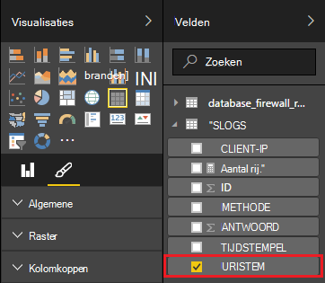

<properties
 pageTitle="Apache Storm gebruiken met Power BI | Microsoft Azure"
 description="Maak een Power BI-rapport met gegevens uit een C#-topologie uitgevoerd op een cluster Apache Storm in HDInsight."
 services="hdinsight"
 documentationCenter=""
 authors="Blackmist"
 manager="jhubbard"
 editor="cgronlun"
    tags="azure-portal"/>

<tags
 ms.service="hdinsight"
 ms.devlang="dotnet"
 ms.topic="article"
 ms.tgt_pltfrm="na"
 ms.workload="big-data"
 ms.date="10/27/2016"
 ms.author="larryfr"/>

# Power BI gebruiken voor het visualiseren van gegevens uit een topologie Apache Storm

Power BI kunt u gegevens visueel weergeven als rapporten. Met de Visual Studio-sjablonen voor Storm op HDInsight, kunt u eenvoudig gebruikt store gegevens uit een topologie optreden op een Storm Apache op HDInsight cluster SQL Azure wordt aangegeven, en klikt u vervolgens de gegevens visualiseren met Power BI.

In dit document leert u hoe u Power BI gebruiken voor het maken van een rapport van gegevens gegenereerd door een topologie Apache Storm en opgeslagen in Azure SQL-Database.

> [AZURE.NOTE] Terwijl de stappen in dit document, is afhankelijk van een Windows-ontwikkelomgeving met Visual Studio, kan het gecompileerd project worden verzonden naar een Linux- of Windows gebaseerde HDInsight cluster. Alleen Linux gebaseerde clusters gemaakt na 10/28/2016 ondersteuning SCP.NET topologieën.
>
> Als u wilt een C#-topologie met een cluster Linux gebaseerde gebruikt, moet u het pakket Microsoft.SCP.Net.SDK NuGet gebruikt door uw project naar versie 0.10.0.6 of hoger bijwerken. De versie van het pakket moet ook overeenkomen met de primaire versie van Storm geïnstalleerd op HDInsight. Bijvoorbeeld Storm voor HDInsight versies 3.3 en 3.4 Storm versie gebruiken 0.10.x, terwijl de HDInsight 3.5 met Storm 1.0.x.
> 
> C# topologieën op Linux gebaseerde clusters moeten .NET 4.5 gebruik en zwart gebruiken om uit te voeren op het cluster HDInsight. De meeste dingen werken, echter checkt u het document [Zwart compatibiliteit](http://www.mono-project.com/docs/about-mono/compatibility/) mogelijke compatibiliteitsproblemen.
>
> Zie voor een Java-versie van dit project, die ook werkt op een cluster Linux- of Windows, [procesgebeurtenissen van Azure gebeurtenis Hubs met Storm op HDInsight (Java)](hdinsight-storm-develop-java-event-hub-topology.md).

## Vereisten voor

- Een Azure-abonnement. Zie [Azure krijgen gratis proefversie](https://azure.microsoft.com/documentation/videos/get-azure-free-trial-for-testing-hadoop-in-hdinsight/).

* Azure Active Directory-gebruiker met [Power BI](https://powerbi.com) -toegang

* Visual Studio (één van de volgende versies)

    * Visual Studio 2012 met [4 bijwerken](http://www.microsoft.com/download/details.aspx?id=39305)

    * Visual Studio 2013 met [4 bijwerken](http://www.microsoft.com/download/details.aspx?id=44921) of [Visual Studio-2013-Community](http://go.microsoft.com/fwlink/?linkid=517284&clcid=0x409)

    * [Visual Studio-2015](https://www.visualstudio.com/downloads/download-visual-studio-vs.aspx)

* De HDInsight's voor Visual Studio: Zie [aan de slag met het HDInsight Tools for Visual Studio](../HDInsight/hdinsight-hadoop-visual-studio-tools-get-started.md) voor informatie over installatiegegevens.

## Werkwijze

In dit voorbeeld bevat de topologie van een C# Storm dat willekeurig wordt gegenereerd logboekgegevens Internet Information Services (IIS). Deze gegevens vervolgens naar een SQL-Database is geschreven en van daaruit wordt gebruikt voor het genereren van rapporten in Power BI.

Hier volgt een lijst met de bestanden die de belangrijkste functionaliteit van dit voorbeeld implementeren.

* **SqlAzureBolt.cs**: schrijft informatie geproduceerd in de topologie Storm met SQL-Database.

* **IISLogsTable.sql**: de Transact-SQL-instructies voor het genereren van de database die de gegevens zijn opgeslagen in.

> [AZURE.WARNING] U moet de tabel in SQL-Database maken voordat u begint met de topologie op uw cluster HDInsight.

## Het voorbeeld downloaden

Download het [HDInsight C# Storm Power BI-voorbeeld](https://github.com/Azure-Samples/hdinsight-dotnet-storm-powerbi). Als u wilt downloaden, zich splitsen/klonen met [cijfer](http://git-scm.com/)of gebruikt u de koppeling **downloaden** om te downloaden van een .zip van het archief.

## Een database maken

1. Voer de stappen in het document [SQL-Database zelfstudie](../sql-database/sql-database-get-started.md) om een nieuwe SQL-Database te maken.

2. Als u verbinding maken met de database door de stappen in het document [in verbinding maken met een SQL-Database met Visual Studio](../sql-database/sql-database-connect-query.md) verbinding maken met de database.

4. Klik met de rechtermuisknop op de database in Object Explorer en maak een __Nieuwe Query__. Plak de inhoud van het bestand __IISLogsTable.sql__ is opgenomen in het gedownloade project in het queryvenster en gebruikt u Ctrl + Shift + E de query uit te voeren. U moet een bericht dat de-opdracht(en) is voltooid.

    Zodra deze is voltooid, wordt er een nieuwe tabel met de naam __IISLOGS__ in de database.

## De steekproef configureren

1. Selecteer in de [portal van Azure](https://portal.azure.com)uw SQL-database. Selecteer __tekenreeksen voor databaseverbinding weergeven__in de sectie __Essentials__ van het blad SQL-database. In de lijst die wordt weergegeven, door de gegevens __ADO.NET (SQL-verificatie)__ te kopiëren.

1. Open in het voorbeeld in Visual Studio. Open het bestand **App.config** **Solution Explorer**en zoek de volgende vermelding:

        <add key="SqlAzureConnectionString" value="##TOBEFILLED##" />
    
    Vervang de waarde __# TOBEFILLED ##__ door de verbindingsreeks van de database in de vorige stap hebt gekopieerd. Vervang __{uw\_username}__ en __{uw\_wachtwoord}__ met de gebruikersnaam en wachtwoord voor de database.

2. Opslaan en sluit de bestanden.

## Implementeren van de steekproef

1. Met de rechtermuisknop op het project **StormToSQL** uit **Solution Explorer**, en selecteer de optie **verzenden naar Storm op HDInsight**. Selecteer het cluster HDInsight in het dialoogvenster van de vervolgkeuzelijst **Storm Cluster** .

    > [AZURE.NOTE] Het duurt een paar seconden voor de vervolgkeuzelijst **Storm Cluster** vullen met de namen van servers.
    >
    > Als u wordt gevraagd, voert u de aanmeldingsreferenties voor uw Azure-abonnement. Als u meer dan één abonnement hebt, moet u zich aanmelden bij de database met uw Storm op HDInsight cluster.

2. Wanneer de topologie is verzonden, wordt de Storm topologieën voor het cluster moet worden weergegeven. Selecteer het item SqlAzureWriterTopology in de lijst met informatie over de actieve topologie kunnen bekijken.

    

    U kunt deze weergave Zie informatie over de topologie of dubbelklikt u op posten (zoals de SqlAzureBolt) als u wilt zien van de informatie die specifiek zijn voor een onderdeel van de topologie.

3. Nadat de topologie heeft uitgevoerd voor een paar minuten, terug te keren naar de SQL-queryvenster die u hebt gebruikt om de database te maken. Vervang de bestaande overzichten door het volgende.

        select * from iislogs;
    
    Gebruik Ctrl + Shift + E om uit te voeren van de query en u ontvangt resultaten ongeveer als volgt uit.
    
        1   2016-05-27 17:57:14.797 255.255.255.255 /bar    GET 200
        2   2016-05-27 17:57:14.843 127.0.0.1   /spam/eggs  POST    500
        3   2016-05-27 17:57:14.850 123.123.123.123 /eggs   DELETE  200
        4   2016-05-27 17:57:14.853 127.0.0.1   /foo    POST    404
        5   2016-05-27 17:57:14.853 10.9.8.7    /bar    GET 200
        6   2016-05-27 17:57:14.857 192.168.1.1 /spam   DELETE  200

    Dit is de gegevens die uit de topologie Storm is geschreven.

## Een rapport maken

1. Verbinding maken met de [Azure SQL Database-connector](https://app.powerbi.com/getdata/bigdata/azure-sql-database-with-live-connect) voor Power BI.

2. Binnen __Databases__, selecteer __ophalen__.

3. Selecteer __Azure SQL-Database__en selecteer vervolgens __verbinding maken__.

4. Voer de gegevens verbinding maken met uw Azure SQL-Database. U kunt dit vinden door te bezoeken van de [Azure-portal](https://portal.azure.com) en uw SQL-database te selecteren.

    > [AZURE.NOTE] U kunt ook het vernieuwingsinterval en aangepaste filters instellen met behulp van __Geavanceerde opties inschakelen__ in het dialoogvenster verbinding maken.

5. Nadat u verbinding hebt gemaakt, ziet u een nieuwe gegevensset met dezelfde naam als de database die u verbinding met. Selecteer de gegevensset moet beginnen met het ontwerpen van een rapport.

3. Vouw het fragment __IISLOGS__ uit __velden__. Schakel het selectievakje voor __URISTEM__. Hiermee maakt u een nieuw rapport waarin is URI (/ foo, / staaf-, enzovoort) geregistreerd in de database.

    

5. Sleep vervolgens de __methode__ aan het rapport. Het rapport wordt bijgewerkt zodat de lijst is en de bijbehorende HTTP-methode gebruikt voor het HTTP-verzoek.

    

4. Selecteer het pictogram van de __velden__ uit de kolom __Visualisaties__ en selecteer vervolgens de pijl-omlaag naast de __methode__ in de sectie __waarden__ . Selecteer in de lijst die wordt weergegeven, __tellen__. Hiermee wijzigt u het rapport voor een overzicht van een telling van hoe vaak een specifieke URI is geopend.

    

6. Selecteer vervolgens de __gestapeld kolomdiagram__ om te wijzigen hoe de gegevens worden weergegeven.

    

7. Nadat u het rapport hebt hoe u deze wilt, gebruikt u het fragment __Opslaan__ in het menu Voer een naam en sla het rapport.

## De topologie stoppen

De topologie blijft uitgevoerd totdat u deze stoppen of de Storm op HDInsight cluster verwijdert. Voer de volgende stappen uit als u wilt stoppen de topologie.

1. Ga terug naar de topologie-viewer in Visual Studio, en selecteert u de topologie.

2. Selecteer de knop **beëindigen** om te stoppen de topologie.

    

## Uw cluster verwijderen

[AZURE.INCLUDE [delete-cluster-warning](../../includes/hdinsight-delete-cluster-warning.md)]

## Volgende stappen

In dit document, hebt u geleerd hoe u gegevens uit een topologie Storm verzenden met SQL-Database en de gegevens visualiseren met Power BI. Zie de volgende onderwerpen voor informatie over het werken met andere Azure technologieën Storm op HDInsight gebruiken:

* [Voorbeeld topologieën voor Storm op HDInsight](hdinsight-storm-example-topology.md)
