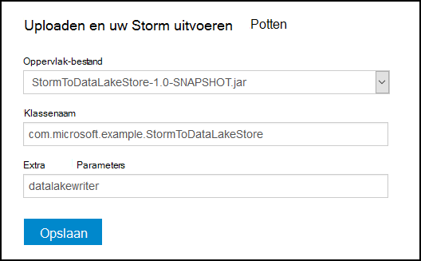
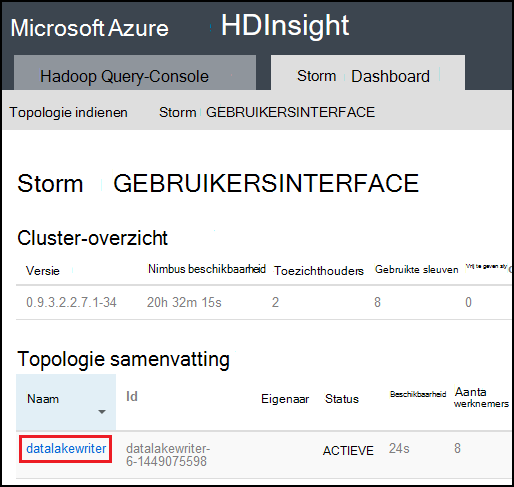

<properties
pageTitle="Gebruik Azure Lake gegevensopslag met Apache Storm op Azure HDInsight"
description="Leer hoe u het schrijven van gegevens naar Azure Lake gegevensopslag uit de topologie van een Apache Storm op HDInsight. In dit document en de bijbehorende voorbeeld wordt getoond hoe de component HdfsBolt ernaar te schrijven Lake gegevensopslag kan worden gebruikt."
services="hdinsight"
documentationCenter="na"
authors="Blackmist"
manager="jhubbard"
editor="cgronlun"/>

<tags
ms.service="hdinsight"
ms.devlang="na"
ms.topic="article"
ms.tgt_pltfrm="na"
ms.workload="big-data"
ms.date="09/06/2016"
ms.author="larryfr"/>

#Gebruik Azure Lake gegevensopslag met Apache Storm met HDInsight

Azure Lake gegevensopslag is een HDFS compatibele cloudopslagservice vindt u veel doorvoer, beschikbaarheid, levensduur en betrouwbaarheid voor uw gegevens. In dit document leert u hoe u de topologie van een Java gebaseerde Storm gebruiken bij het wegschrijven van gegevens naar Azure Lake gegevensopslag met het onderdeel [HdfsBolt](http://storm.apache.org/javadoc/apidocs/org/apache/storm/hdfs/bolt/HdfsBolt.html) , die is opgegeven als onderdeel van Apache Storm.

> [AZURE.IMPORTANT] De voorbeeld-topologie die in dit document worden gebruikt, is afhankelijk van onderdelen die zijn opgenomen in Storm op HDInsight clusters, en kunnen worden gewijzigd voor gebruik met Azure Lake gegevensopslag gebruikt in combinatie met andere clusters Apache Storm.

##Vereisten voor

* [Java JDK 1.7](https://www.oracle.com/technetwork/java/javase/downloads/jdk7-downloads-1880260.html) of hoger
* [Maven 3.x](https://maven.apache.org/download.cgi)
* Een Azure-abonnement
* Een Storm op HDInsight cluster versie 3,2. Als u wilt een nieuwe Storm op HDInsight cluster maken, voer de stappen in het document [HDInsight gebruiken met Lake gegevensopslag Azure gebruiken](../data-lake-store/data-lake-store-hdinsight-hadoop-use-portal.md) . De stappen in dit document begeleidt u bij het maken van een nieuwe HDInsight cluster en Azure Lake gegevensopslag.  

    > [AZURE.IMPORTANT] Wanneer u het cluster HDInsight maakt, moet u __Storm__ selecteert als het clustertype en __3,2__ als de versie. Het besturingssysteem kan Windows of Linux zijn.  

###Omgevingsvariabelen configureren

De volgende omgevingsvariabelen kunnen worden ingesteld wanneer u Java en de JDK op uw ontwikkelwerkstation installeert. U moet echter controleren die ze bestaat en dat ze de juiste waarden voor uw systeem bevatten.

* __JAVA_HOME__ - verwijzen naar de map waarin de Java runtime-omgeving (JRE) is geïnstalleerd. Bijvoorbeeld in een Unix- of Linux verdeling gebruikt, moet er een waarde die vergelijkbaar is met `/usr/lib/jvm/java-7-oracle`. Klik in Windows heeft deze een waarde die vergelijkbaar is met `c:\Program Files (x86)\Java\jre1.7`.

* __Pad__ - moet bevatten de volgende paden:

    * __JAVA\_HOME__ (of het equivalente pad)
    
    * __JAVA\_HOME\bin__ (of het overeenkomstige pad)
    
    * De map waarin Maven is geïnstalleerd

##Topologie-implementatie

In het voorbeeld gebruikt in dit document is geschreven in Java en gebruik de volgende onderdelen:

* __TickSpout__: de gegevens die worden gebruikt door andere onderdelen in de topologie gegenereerd.

* __PartialCount__: telt de gebeurtenissen die zijn gegenereerd door TickSpout.

* __FinalCount__: aggregaties gegevens uit PartialCount tellen.

* __ADLStoreBolt__: schrijft gegevens naar Azure Lake gegevensopslag met het onderdeel [HdfsBolt](http://storm.apache.org/javadoc/apidocs/org/apache/storm/hdfs/bolt/HdfsBolt.html) .

Het project met deze topologie is beschikbaar als een download van [https://github.com/Azure-Samples/hdinsight-storm-azure-data-lake-store](https://github.com/Azure-Samples/hdinsight-storm-azure-data-lake-store).

###Lidmaatschap ADLStoreBolt

De ADLStoreBolt is de naam die wordt gebruikt voor het exemplaar HdfsBolt in de zoektopologie die gegevens worden geschreven naar Lake van Azure-gegevens. Dit is niet een speciale versie van HdfsBolt gemaakt door Microsoft. Dit is echter afhankelijk op waarden van de systeemconfiguratie core-site, evenals Hadoop-onderdelen die deel uitmaken van Azure HDInsight naar communicatie met gegevens Lake.

Specifiek, wanneer u een cluster HDInsight maakt, kunt u koppelen deze met een Azure-gegevensopslag Lake. Dit automatisch vermeldingen in core-site voor Lake gegevensopslag u hebt geselecteerd, die worden gebruikt door onderdelen zoals hadoop-client en hadoop-hdfs voor communicatie met Lake gegevensopslag.

> [AZURE.NOTE] Microsoft code naar de Apache Hadoop en Storm projecten waarmee communicatie met Azure Lake gegevensopslag en Azure Blob storage heeft toegevoegd, maar deze functionaliteit mogelijk niet opgenomen al dan niet standaard in andere Hadoop en Storm onderzoeken.

De configuratie voor HdfsBolt in de topologie is als volgt:

    // 1. Create sync and rotation policies to control when data is synched
    //    (written) to the file system and when to roll over into a new file.
    SyncPolicy syncPolicy = new CountSyncPolicy(1000);
    FileRotationPolicy rotationPolicy = new FileSizeRotationPolicy(0.5f, Units.KB);
    // 2. Set the format. In this case, comma delimited
    RecordFormat recordFormat = new DelimitedRecordFormat().withFieldDelimiter(",");
    // 3. Set the directory name. In this case, '/stormdata/'
    FileNameFormat fileNameFormat = new DefaultFileNameFormat().withPath("/stormdata/");
    // 4. Create the bolt using the previously created settings,
    //    and also tell it the base URL to your Data Lake Store.
    // NOTE! Replace 'MYDATALAKE' below with the name of your data lake store.
    HdfsBolt adlsBolt = new HdfsBolt()
        .withFsUrl("adl://MYDATALAKE.azuredatalakestore.net/")
        .withRecordFormat(recordFormat)
        .withFileNameFormat(fileNameFormat)
        .withRotationPolicy(rotationPolicy)
        .withSyncPolicy(syncPolicy);
    // 4. Give it a name and wire it up to the bolt it accepts data
    //    from. NOTE: The name used here is also used as part of the
    //    file name for the files written to Data Lake Store.
    builder.setBolt("ADLStoreBolt", adlsBolt, 1)
      .globalGrouping("finalcount");
      
Als u bekend bent met behulp van HdfsBolt, ziet u dat dit alle redelijk standaard configuratie, behalve voor de URL is. De URL bevat het pad naar de hoofdsite van uw Azure-gegevensopslag Lake.

Aangezien schrijven naar Lake gegevensopslag HdfsBolt gebruikt, en alleen een URL-wijziging is, moet u mogelijk zijn om te maken van een bestaande zoektopologie die gegevens worden geschreven naar HDFS of WASB met HdfsBolt en het wachtwoord gemakkelijk wijzigen als u wilt gebruiken Azure Lake gegevensopslag.

##Bouwen en de topologie Inpakken

1. Het voorbeeldproject naar uw ontwikkelomgeving downloaden vanuit [https://github.com/Azure-Samples/hdinsight-storm-azure-data-lake-store](https://github.com/Azure-Samples/hdinsight-storm-azure-data-lake-store
) .

2. Open het `StormToDataLake\src\main\java\com\microsoft\example\StormToDataLakeStore.java` bestand in een editor en vinden van de regel met `.withFsUrl("adl://MYDATALAKE.azuredatalakestore.net/")`. Wijzig __MYDATALAKE__ op de naam van de Azure-gegevens Lake Store, u hebt gebruikt bij het maken van uw server HDInsight.

3. Een opdracht van prompt, terminal of shell-sessie, mappen wijzigen in de hoofdmap van het gedownloade project en voer de volgende opdrachten voor bouwen en inpakken van de topologie.

        mvn compile
        mvn package
    
    Zodra de opbouwen en de verpakking is voltooid, wordt er een nieuwe map met de naam `target`, die een bestand met de naam bevat `StormToDataLakeStore-1.0-SNAPSHOT.jar`. Dit document bevat de gecompileerd topologie.

##Implementeren en uitvoeren op Linux gebaseerde HDInsight

Als u een Storm Linux gebaseerde op HDInsight cluster hebt gemaakt, gebruikt u de onderstaande stappen om te implementeren en uitvoeren van de topologie.

1. Gebruik de volgende opdracht uit de topologie kopiëren naar het cluster HDInsight. __Gebruiker__ vervangen door de SSH-gebruikersnaam die u hebt gebruikt bij het maken van het cluster. __CLUSTERNAAM__ vervangen door de naam van het cluster.

        scp target\StormToDataLakeStore-1.0-SNAPSHOT.jar USER@CLUSTERNAME-ssh.azurehdinsight.net:StormToDataLakeStore-1.0-SNAPSHOT.jar
    
    Voer het wachtwoord gebruikt bij het maken van de gebruiker SSH voor het cluster wanneer hierom wordt gevraagd. Als u een openbare sleutel in plaats van een wachtwoord hebt gebruikt, moet u mogelijk gebruikt u de `-i` -parameter voor het opgeven van het pad naar het overeenkomende persoonlijke sleutel.
    
    > [AZURE.NOTE] Als u een Windows-client voor de ontwikkeling gebruikt, hebt u geen een `scp` opdracht. Als dat zo is, kunt u `pscp`, die verkrijgbaar is bij [http://www.chiark.greenend.org.uk/~sgtatham/putty/download.html](http://www.chiark.greenend.org.uk/~sgtatham/putty/download.html)is.

2. Zodra de upload is voltooid, gebruikt u de volgende verbinding maken met de HDInsight cluster via SSH. __Gebruiker__ vervangen door de SSH-gebruikersnaam die u hebt gebruikt bij het maken van het cluster. __CLUSTERNAAM__ vervangen door de naam van het cluster.

        ssh USER@CLUSTERNAME-ssh.azurehdinsight.net

    Voer het wachtwoord gebruikt bij het maken van de gebruiker SSH voor het cluster wanneer hierom wordt gevraagd. Als u een openbare sleutel in plaats van een wachtwoord hebt gebruikt, moet u mogelijk gebruikt u de `-i` -parameter voor het opgeven van het pad naar het overeenkomende persoonlijke sleutel.
    
    > [AZURE.NOTE] Als u een Windows-client voor de ontwikkeling gebruikt, volgt u de informatie in [verbinding maken met Linux gebaseerde HDInsight via SSH vanuit Windows](hdinsight-hadoop-linux-use-ssh-windows.md) voor informatie voor de stopverf-client verbinding maakt met het cluster gebruiken.
    
3. Zodra u verbinding hebt, gebruikt u de volgende starten van de topologie:

        storm jar StormToDataLakeStore-1.0-SNAPSHOT.jar com.microsoft.example.StormToDataLakeStore datalakewriter
    
    Hiermee start u de topologie met een beschrijvende naam `datalakewriter`.

##Implementeren en uitvoeren op Windows gebaseerde HDInsight

1. Open een webbrowser en Ga naar HTTPS://CLUSTERNAME.azurehdinsight.net, waar __CLUSTERNAAM__ de naam van uw cluster HDInsight is. Wanneer u wordt gevraagd, geef de naam van de gebruiker beheerder (`admin`) en het wachtwoord dat u voor dit account gebruikt wanneer het cluster is gemaakt.

2. Vanuit het Dashboard Storm, selecteert u __Bladeren__ in de vervolgkeuzelijst __Jar-bestand__ en selecteer vervolgens het bestand StormToDataLakeStore-1.0-SNAPSHOT.jar uit de `target` directory. Gebruik de volgende waarden voor de andere items in het formulier:

    * Klassenaam: com.microsoft.example.StormToDataLakeStore
    * Aanvullende Parameters: datalakewriter
    
    

3. Selecteer de knop __verzenden__ om te uploaden en start de topologie. Informatie van de volgende strekking moet worden weergegeven in het resultaatveld onder de knop __verzenden__ zodra de topologie is begonnen met:

        Process exit code: 0
        Currently running topologies:
        Topology_name        Status     Num_tasks  Num_workers  Uptime_secs
        -------------------------------------------------------------------
        datalakewriter       ACTIVE     68         8            10        

##De uitvoergegevens weergave

Er zijn verschillende manieren om de gegevens te bekijken. In deze sectie gebruiken we de Azure-Portal en de `hdfs` opdracht de gegevens moeten worden weergegeven.

> [AZURE.NOTE] U mag de topologieën om uit te voeren voor enkele minuten voordat u controleert de uitvoergegevens, zodat de gegevens naar meerdere bestanden op Azure Lake gegevensopslag heeft zijn gesynchroniseerd.

* __In de [Portal van Azure](https://portal.azure.com)__: Selecteer In de portal de Azure Lake gegevensopslag die u met HDInsight gebruikt.

    > [AZURE.NOTE] Als u niet de gegevensopslag Lake naar Azure portal dashboard vastmaakt, kunt u deze kunt vinden door te __Bladeren__ onderaan in de lijst aan de linkerkant, klikt u vervolgens __Lake gegevensopslag__, selecteren en ten slotte de store.
    
    Selecteer in de pictogrammen boven aan de Lake gegevensopslag, __Data Explorer__.
    
    
    
    Selecteer vervolgens de map __stormdata__ . Een lijst met tekstbestanden moet worden weergegeven.
    
    
    
    Selecteer een van de bestanden om weer te geven van de inhoud ervan.

* __Uit het cluster__: als u verbinding hebt met het HDInsight cluster via SSH (Linux cluster) of extern bureaublad (Windows-cluster), kunt u de volgende handelingen uit om de gegevens te bekijken. __DATALAKE__ vervangen door de naam van uw Lake gegevensopslag

        hdfs dfs -cat adl://DATALAKE.azuredatalakestore.net/stormdata/*.txt

    Hiermee wordt de tekstbestanden die zijn opgeslagen in de adreslijst, weergeven en de volgende strekking concatenate:
    
        406000000
        407000000
        408000000
        409000000
        410000000
        411000000
        412000000
        413000000
        414000000
        415000000
        
##De topologie stoppen

Storm topologieën uitgevoerd totdat gestopt, of het cluster is verwijderd. Als u wilt stoppen met het topologieën, gebruikt u de volgende informatie.

__Voor Linux gebaseerde HDInsight__:

Gebruik de volgende opdracht uit een SSH-sessie met het cluster:

    storm kill datalakewriter

__Voor HDInsight op basis van Windows__:

1. Vanuit het Dashboard Storm (https://CLUSTERNAME.azurehdinsight.net), selecteert u de koppeling __Storm UI__ boven aan de pagina.

2. Zodra de gebruikersinterface Storm wordt geladen, selecteert u de koppeling __datalakewriter__ .

    

3. Selecteer __verwijderen__ in de sectie __Topologie acties__ en selecteer vervolgens OK in het dialoogvenster dat wordt weergegeven.

    

## Uw cluster verwijderen

[AZURE.INCLUDE [delete-cluster-warning](../../includes/hdinsight-delete-cluster-warning.md)]

##Volgende stappen

U hebt geleerd hoe Storm gebruiken om te schrijven naar Azure Lake gegevensopslag, kennismaken met andere [Storm voorbeelden voor het HDInsight](hdinsight-storm-example-topology.md).
