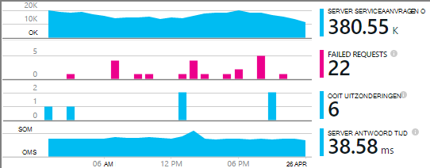

<properties
    pageTitle="Voorbeeld van MyDriving Azure IoT: bouwen | Microsoft Azure"
    description="Een app die is een volledig demonstratie van hoe u een systeem IoT ontwerpen met behulp van Microsoft Azure, met inbegrip van de Stream analyses en Machine Learning gebeurtenis Hubs maken."
    services=""
    documentationCenter=".net"
    suite=""
    authors="harikmenon"
    manager="douge"/>

<tags
    ms.service="multiple"
    ms.workload="tbd"
    ms.tgt_pltfrm="ibiza"
    ms.devlang="dotnet"
    ms.topic="article"
    ms.date="03/25/2016"
    ms.author="harikm"/>


# <a name="build-and-deploy-the-mydriving-solution-to-your-environment"></a>Bouw en implementeer de oplossing MyDriving in uw omgeving

MyDriving is een Internet van dingen (IoT)-oplossing die gegevens uit uw auto worden verzameld, verwerkt met behulp van machine learning en gepresenteerd op uw mobiele telefoon. De back-end bestaat uit allerlei services van Microsoft Azure. De clients is Android-, iOS- of Windows 10-telefoons.

We hebben gemaakt de oplossing MyDriving zodat u een aan de slag met bij het maken van uw eigen IoT-systeem. In de [bibliotheek van MyDriving op GitHub](https://github.com/Azure-Samples/MyDriving)krijgt u resourcemanager Azure-scripts implementeren van de architectuur van de back-enddatabase naar uw eigen Azure-account. Vanaf dat punt, kunt u de verschillende services configureren, wijzigen van de query's als u wilt aansluiten op uw eigen gegevens, enzovoort. U vindt deze scripts--samen met code voor de mobiele app, het project Azure App Service API en meer--in de bibliotheek MyDriving.

Als u de app nog niet hebt geprobeerd, kijkt u naar de [Get-handleiding](iot-solution-get-started.md).

Er is een gedetailleerd overzicht van de architectuur in de [Naslaggids voor het MyDriving](http://aka.ms/mydrivingdocs). Maak een soortgelijke project in het overzicht, er zijn verschillende stukken die we ingesteld en dat u maximaal wilt instellen:

* Een **client-app** wordt uitgevoerd op een Android-, iOS- en Windows 10-telefoon. We het platform Xamarin gebruiken om te delen veel van de code die is opgeslagen op GitHub onder `src/MobileApp`. De app voert werkelijk twee verschillende functies uit:
 * Doorgegeven telemetrielogboek van het apparaat van de ingebouwde diagnostische gegevens (OBD) en van een eigen locatie van het systeem cloud back-end-service.
 * Het is een gebruikersinterface waar gebruikers over hun reizen opgenomen wegen zoeken kunnen.
* Een **cloudservice** ingests van de gegevens wegen reis in realtime en verwerkt deze. De belangrijkste werklast van het maken van deze service is te kiezen, voorzien en wire omhoog tal van Azure services. Enkele van de onderdelen nodig scripts om te filteren en proces de binnenkomende gegevens heeft. We een resourcemanager Azure-sjabloon gebruiken voor het configureren van alle onderdelen.
* Een **app mobile-service** is de webservice achter het deel van de gebruikersinterface van de app apparaat. De belangrijkste taak is om de database met de gegevens die zijn opgeslagen, verwerkte query's mogelijk. De code is ingeschakeld GitHub onder `src/MobileAppService`.
* **Visual Studio met Xamarin** is onze ontwikkelomgeving. Xamarin, die als een onderdeel van Visual Studio en als een zelfstandig geïntegreerde ontwikkelomgeving (IDE) bestaat, wordt gebruikt voor het maken van de apparaatcode platforms. Als de iOS-code, is het nodig is om een exemplaar van Xamarin op een computer OS X. Indien nodig, kan dit als een agent, beheerd met Visual Studio worden uitgevoerd.
* **Eenheid testen** van de apps apparaat wordt uitgevoerd in Xamarin Test Cloud.
* **GitHub** is de bibliotheek waar we alle code, scripts en sjablonen opslaan.
* **Visual Studio Team Services** is een cloudservice die wordt gebruikt om de continue opbouwen en test van de web-apps voor service en het apparaat te beheren.
* **HockeyApp** wordt gebruikt voor het distribueren van versies van de apparaatcode. Ook worden verzameld vastlopen-en gebruiksrapporten en feedback van gebruikers.
* **Visual Studio toepassing inzichten** bewaakt de mobiele webservice.

Dus kijken hoe we instellen dat alle. Houd er rekening mee dat veel van de stappen optioneel zijn.

## <a name="sign-up-for-accounts"></a>Registreren voor accounts

-   [Visual Studio ontwikkelaar Essentials](https://www.visualstudio.com/products/visual-studio-dev-essentials-vs.aspx). Dit gratis programma biedt eenvoudig toegang tot veel speciale tools voor ontwikkelaars en services, met inbegrip van Visual Studio, Visual Studio Team Services en Azure. Hebt u een creditcard $25/ maand Azure voor twaalf maanden. Het bevat ook abonnementen op Pluralsight training en Xamarin voor hoger onderwijs. U kunt ook aanmelden afzonderlijk voor gratis lagen van [Azure](https://azure.com) en [Visual Studio Team Services](https://www.visualstudio.com/products/visual-studio-team-services-vs.aspx), maar deze bieden geen Azure tegoeden.

-   [HockeyApp](https://rink.hockeyapp.net/) (optioneel), voor het beheren van test verdeling van mobiele apps en telemetrielogboek verzamelen.

-   [Xamarin](https://xamarin.com/) (vereist), voor het maken van de mobiele app en foutopsporing wordt uitgevoerd en tests uitvoeren op [Xamarin Test Cloud](https://xamarin.com/test-cloud).

-   [GitHub](https://github.com/Azure-Samples/MyDriving/) (optioneel), gratis openbare opslagplaatsen voor uw eigen code (privé opslagplaatsen zijn betaald) maken. U kunt ook het eenvoudige abonnement gebruiken in Visual Studio Team Services voor privé opslagplaatsen.

-   [Power BI](https://powerbi.microsoft.com/) (optioneel), rijke visualisaties van gegevens maken in het hele systeem.

> [AZURE.NOTE] U kunt een GitHub-account voor toegang tot de MyDriving-code in [de bibliotheek GitHub MyDriving](https://github.com/Azure-Samples/MyDriving)niet nodig hebt.

## <a name="install-development-tools"></a>Ontwikkeling's installeren

De volgende instellingen zijn voor het ontwikkelen van de volledige oplossing: een iOS, Android en Windows 10 Mobile-app platforms met een Azure back-end.

Als alternatief, kunt u Xamarin Studio op Mac of Windows ontwikkelen van de mobiele apps als u niet werkt op de Azure back-end.

Er is een [langere beschrijving van deze instelling](https://msdn.microsoft.com/library/mt613162.aspx).

### <a name="windows-development-machine"></a>Windows development-computer

Het centrale hulpmiddel in Windows is Visual Studio, voor het werken met de MyDriving-app voor Android en Windows, de App Service API project en microservice uitbreidingen.

Xamarin, cijfer emulators en andere handige onderdelen zijn alle geïntegreerd met Visual Studio.

Installeren:

-   [Visual Studio-2015 met Xamarin](https://www.visualstudio.com/products/visual-studio-community-vs) (alle versies--Community is gratis).

-   [SQLite voor universele Windows-Platform](https://visualstudiogallery.msdn.microsoft.com/4913e7d5-96c9-4dde-a1a1-69820d615936). Vereist voor het maken van de Windows 10 Mobile-code.

-   [Azure SDK voor Visual Studio-2015](https://go.microsoft.com/fwlink/?linkid=518003&clcid=0x409). Krijgt u de SDK voor apps in Azure wordt aangegeven, samen met de opdrachtregel hulpmiddelen voor het beheren van Azure worden uitgevoerd.

-   [Azure-Service stof SDK](http://www.microsoft.com/web/handlers/webpi.ashx?command=getinstallerredirect&appid=MicrosoftAzure-ServiceFabric). Vereist voor het maken van de extensie [microservice](../service-fabric/service-fabric-get-started.md) .

Zorg ook dat u de juiste Visual Studio-extensies hebben. Controleer dat onder **Hulpmiddelen voor**u **Android, iOS, Xamarin ziet...**. Zo niet, open het Configuratiescherm en selecteer **programma's en onderdelen** > **Microsoft** > **Visual Studio-2015** > **wijzigen**. Selecteer onder **platforms ontwikkeling**, **C\#/.Net (Xamarin)**. Terwijl u er bent, moet u controleren dat **Cijfer voor Windows** is geïnstalleerd.

### <a name="mac-development-machine"></a>Mac ontwikkeling machine

De Mac (Yosemite of hoger) is vereist als u wilt laten groeien voor iOS. Hoewel we Visual Studio met Xamarin op Windows gebruikt ontwikkelen en beheren van alle code, geeft Xamarin een agent die is geïnstalleerd op een Mac te maken en meld u aan de iOS-code wordt gebruikt.


(Als alternatief, kunt u Xamarin Studio rechtstreeks op de Mac ontwikkelen van apps platforms.)

U hoeft niet op de Mac als u niet wilt opnemen iOS als een doelplatform.

Installeren:

-   [Xamarin Studio voor iOS](https://developer.xamarin.com/guides/ios/getting_started/installation/mac/). U kunt ook Visual Studio en Xamarin op een Mac met een virtuele Windows-computer instellen. Zie [installatie, installeren, en controles voor Mac-gebruikers](https://msdn.microsoft.com/library/mt488770.aspx) op MSDN.

-   [Hulpmiddelen voor de ontwikkeling van Azure](https://azure.microsoft.com/downloads/) (optioneel).

Inschakelen van externe aanmelding op de Mac. Open **Systeemvoorkeuren** > **delen**, en selecteer vervolgens **Externe aanmelding**.

Wanneer u een iOS-project in Visual Studio in Windows opent, vraagt de invoegtoepassing Xamarin u om de ID van de Mac.

## <a name="fetch-the-github-repository"></a>De bibliotheek GitHub ophalen

Een lokale kopie van [de bibliotheek GitHub MyDriving](https://github.com/Azure-Samples/MyDriving) ophalen met behulp van de knop **Downloaden ZIP** in GitHub, Visual Studio of een ander cijfer-client.

Het bestand naar een map met de padnaam van een korte, bijvoorbeeld C: pak\\code.

U kunt ook als u wilt up-to-date te houden met of bijdragen aan onze code, klonen de opslagplaats als volgt:

**cijfer klonen https://github.com/Azure-Samples/MyDriving.git**

## <a name="get-a-bing-maps-api-key"></a>U een Bing maps API-sleutel

[Registreren voor een Bing Maps API-sleutel](https://msdn.microsoft.com/library/ff428642.aspx).

U moet deze vervangen op regel 22 in `src/MobileApps/MyDriving/MyDriving.Utils/Logger.cs`.


## <a name="build-the-demo-app"></a>De demo-app maken

Deze oplossingen in Visual Studio openen:

-   src\MobileApps\MyDriving.sln

-   src\MobileAppService\MyDrivingService.sln

-   src\Extensions\ServiceFabric\VINLookUpApplication\VINLookUpApplication.sln

Hier krijgt u aanwijzingen voor:

-   Sommige mogelijk onbetrouwbare projecten vertrouwen. Kies om deze te openen als u wilt verdergaan.

-   Modus voor ontwikkelaars instellen als u op een nieuwe computer met Windows 10 werkt.

-   Geef uw referenties Xamarin.

-   Verbinding maken met de Xamarin Mac. Als u een Mac, met de rechtermuisknop op het project iOS in Visual Studio en selecteer vervolgens **verwijderen project**niet hebt.

Bouw die tabellen opnieuw de oplossing.

Als u problemen ondervindt bij het samenstellen van, probeert u de oplossingen voor quirks die we hebt gevonden:

-   *VINLookupApplication project wordt niet geladen*: Zorg ervoor dat u de [SDK van Azure voor Visual Studio-2015](https://go.microsoft.com/fwlink/?linkid=518003&clcid=0x409)hebt geïnstalleerd.

-   *Service stof project niet maken*: de interface-projecten eerst bouwen en zorg ervoor dat u de Service stof SDK hebt geïnstalleerd.

-   *Android-app niet maken*:

    -   Open **Extra** > **Android** > **Android SDK Manager**en zorg ervoor dat Android 6 (API 23) / SDK Platform is geïnstalleerd.

    -   Deze map verwijderen en klik vervolgens opnieuw opbouwen:<br/>
        `%LocalAppData%\Xamarin\zips`

## <a name="get-to-know-the-code"></a>Kennismaking met de code

In de oplossing vindt u het:

-   Azure extensies: Service stof.

-   Azure HDInsight: Scripts voor het verwerken van reis-gegevens in Azure wordt aangegeven.

-   Mobiele Apps: De apparaat-apps.

-   MobileAppsService/MyDrivingService: Het web terug beëindigen.

-   Power BI: De rapportdefinitie.

-   Scripts:

    -   Resourcemanager: sjablonen maken van de Azure resources.

    -   PowerShell: Uitvoeren van Scripts de resourcemanager-sjablonen.

    -   Azure SQL-Database: Foutopsporing databases.

-   SQL-Database: CreateTables: schemadefinities.

-   Azure Stream Analytics: Query's die de binnenkomende gegevensstroom transformeren.

## <a name="run-the-apps-in-development-mode"></a>De apps uitgevoerd in de ontwikkeling-modus

Actie ondernemen om te uitvoeren van de apps, op basis van het apparaat dat u gebruikt:

-  Back-end: Set-MyDrivingService als het opstartproject en druk op F5 om uit te voeren van de back-enddatabase-webservice. Een weergave van de API-vermelding in de browser wordt geopend.

-  Mobiele clients: de [mobiele apps in Xamarin worden ontwikkeld](https://developer.xamarin.com/guides/cross-platform/deployment,_testing,_and_metrics/debugging_with_xamarin/).
 -  Android: Zie voor meer informatie [Android foutopsporing in Xamarin](http://developer.xamarin.com/guides/android/deployment,_testing,_and_metrics/debugging_with_xamarin_android/).

 -  iOS: Zie voor meer informatie [Foutopsporing in iOS](http://developer.xamarin.com/guides/ios/deployment,_testing,_and_metrics/debugging_in_xamarin_ios/).

 -  Windows Phone: Zie voor meer informatie [Xamarin + Windows Phone](https://developer.xamarin.com/guides/cross-platform/windows/phone/).

## <a name="upload-the-mobile-app-to-hockeyapp"></a>De mobiele app uploaden naar HockeyApp

HockeyApp beheert de distributie van uw Android-, iOS- of Windows-app om te testen van gebruikers, gebruikers van nieuwe releases de hoogte te stellen. Deze verzamelt ook handig foutenrapporten, feedback van gebruikers met schermafbeeldingen en gebruik de doelstellingen.

[Begin met het uploaden van](http://support.hockeyapp.net/kb/app-management-2/how-to-create-a-new-app) uw app opbouwen. Meld u aan bij [HockeyApp](https://rink.hockeyapp.net) van uw computer ontwikkeling. Klik op het dashboard voor ontwikkelaars, klikt u op **Nieuwe App**en sleep vervolgens de en-klare bestanden naar het venster. (Hoger gebruikt, kunt u automatiseren uw service opbouwen hiervoor.)

U bent nu in uw app-dashboard.


Herhaal het proces voor elk platform die op uw app wordt uitgevoerd. Vervolgens kunt u het volgende doen:

-  Gebruik de [app-ID](http://support.hockeyapp.net/kb/app-management-2/how-to-find-the-app-id) uit het dashboard vastlopen gegevens en feedback verzenden vanuit uw app. Werk in MyDriving, de id's in src/MobileApps/MyDriving/MyDriving.Utils/Logger.cs.

-  [Testgebruikers uitnodigen](http://support.hockeyapp.net/kb/app-management-2/how-to-invite-beta-testers). Krijgt u een URL voor het inhuren van testers gebruikers. Ze moeten kunnen registreren voor uw team, kunt u de app downloaden en u feedback sturen.

-  Als u liever een meer geopende bètaversie, stelt u de verdeling publiek. Klik op **App beheren** > **verdeling** > **downloaden = openbare**. Iedereen kan nu kunt u de app downloaden en u feedback sturen en ze te zien krijgt een melding wanneer u een nieuwe versie posten. Krijgt u mogelijk enkele foutenrapporten hiertegen te.

    

-  [Koppeling foutenrapporten naar Visual Studio Team Services](http://support.hockeyapp.net/kb/third-party-bug-trackers-services-and-webhooks/how-to-use-hockeyapp-with-visual-studio-team-services-vsts-or-team-foundation-server-tfs). Klik op **App beheren** > **Visual Studio teamservices**. HockeyApp kunt werkitems automatisch maken in Team Services wanneer er foutenrapporten of wanneer feedback wordt ontvangen.

Meer informatie bij de [HockeyApp-site](https://hockeyapp.net).

## <a name="test-the-mobile-app-on-xamarin-test-cloud"></a>De mobiele app van Xamarin Test wolk testen

[Xamarin Test Cloud](https://developer.xamarin.com/guides/testcloud/introduction-to-test-cloud/) automatiseert UI testen op reële apparaten in de cloud. Met behulp van het kader NUnit, moet u tests die uw app via de gebruikersinterface uitvoeren schrijven.

Als u wilt gebruiken Xamarin, kunt u de [Xamarin.UITests](https://developer.xamarin.com/guides/testcloud/uitest/intro-to-uitest/) SDK opnemen in uw app, dat wordt geleverd als een pakket NuGet. U vindt deze in de app demo en heeft opgenomen wanneer u nieuwe Testprojecten met de sjablonen Xamarin maakt.


Een voorbeeld test-project is opgenomen in de app in de bibliotheek. In [MyDriving](https://github.com/Azure-Samples/MyDriving/tree/master/src/MobileAppService), kijkt u onder [src](https://github.com/Azure-Samples/MyDriving/tree/master/src)/MobileApps/[MyDriving](https://github.com/Azure-Samples/MyDriving/tree/master/src/MobileApps/MyDriving)/MyDriving.UITests/.

Als u een opbouwen Visual Studio Team Services gebruikt, is het gemakkelijk te schrijven Xamarin UI-controles en laat u ze als onderdeel van uw opbouwen.

## <a name="deploy-azure-services"></a>Azure services implementeren

Als u wilt uitvoeren van een automatische implementatie van Azure-services en Team Services opbouwen services, raadpleegt u de gedetailleerde instructies in **scripts/README.md**.

Microsoft Azure biedt een schat aan de verschillende services die u gebruiken kunt om cloud-toepassingen te maken. Hoewel veel afzonderlijk (zoals App Service/Web Apps) kunnen worden gebruikt, zijn de rijen op hun best wanneer ze onderling aan een geïntegreerde systeem, zoals verbonden bent dat we gebruiken in MyDriving formulier.

Is het mogelijk te maken en Azure services handmatig verbinding, maar het is veel sneller en meer betrouwbare gebruik van Azure resourcemanager sjablonen. [Resourcemanager](../azure-resource-manager/resource-group-overview.md) automatiseert de implementatie van een oplossing van resources en de onderlinge verbindingen ertussen aanbrengt.

U vindt de sjabloon voor het systeem MyDriving in de bibliotheek GitHub onder [scripts/ARM](https://github.com/Azure-Samples/MyDriving/tree/master/scripts/ARM). Deze biedt een uitgebreide en beknopt weergave van hoe de verschillende services in onze architectuur onderling. Kunnen alle dit in de [Naslaggids voor het MyDriving](http://aka.ms/mydrivingdocs)gedetailleerd uitgelegd, maar u kunt veel meer NET door te lezen tot en met de sjabloon zelf.

> [AZURE.NOTE] Meest Azure services hebben een gekoppeld kosten, afhankelijk van de prijzen laag. Als u geen ervaring met Azure hebt, kunt u [het afwezigheidsbericht gratis uitproberen](https://azure.microsoft.com/free/). Als u niet wilt gebruiken van bepaalde onderdelen in het systeem MyDriving, wel u deze om te voorkomen dat kosten verwijderen. De sectie 'Schatten operationele kosten' verderop in dit artikel bevat een overzicht van de normale service onkosten.

### <a name="edit-the-template"></a>De sjabloon bewerken

Als u wilt aanpassen van de implementatie wellicht overbodige om onderdelen te verwijderen of om toe te voegen anderen, moet u eerst een kopieën van scenario Maak\_complete.params.json en scenario\_complete.json waarin te wijzigen.

Kunt u het scenario\_complete.params.json-bestand moet overschrijven verschillende standaardwaarden, zoals de service SKU of het opslag herhaling type, zoals wordt beschreven in de volgende tabel. De standaardwaarden selecteert u de opties van het laagste kosten.

| **Parameter**         | **Beschrijving**                | **Standaardwaarde** |
|--------|---------|-------|
| IoT Hub SKU           | Laag voor Azure IoT Hub-service | F1                |
| Accounttype opslag  | Replicatie-opslagtype       | Standaard LRS      |
| SQL-Service doelstelling | Bij gelijktijdigheid slot verbruik   | DW100             |
| Hostingprovider abonnement SKU      | Serviceplan voor App-Service   | F1                |

In scenario\_complete.json:

-   Zoeken naar "baseName" en wijzig deze naar een naam die u liever.

-   Zoeken naar 'Maken'. Elk van deze secties Hiermee maakt u een resource.

-   Stel sqlServerAdminLogin en sqlServerAdminPassword geschikt waarden.

-   Voordat u een sectie waarmee een resource verwijdert, moet u controleren of er doelcellen door de naam ergens anders in het bestand te zoeken. Houd er rekening mee dat elke sectie die wordt gemaakt van een service een *dependsOn* sectie met bijbehorende afhankelijkheden bevat.

Hier ziet u wat de sjabloon configureert. Er zijn gegevens in de [Naslaggids voor het](http://aka.ms/mydrivingdocs).

| **Service**                 | **Beschrijving en details**  
|---|----
| Opslag-accounts            | De sjabloon wordt gemaakt van drie accounts:                                                                                                                                                                       
|| -Een SQL-database die geaggregeerde telemetrielogboek ontvangt van Stream Analytics en fungeert als de back-store voor Azure-Service voor App-tabellen waarbij deze gegevens via API-eindpunten.                      
|| -Blobopslag die worden bij elkaar opgeteld historische gegevens uit een andere taak van de Stream analyses, kan worden verwerkt door HDInsight.                                                                                         
|| -Een SQL-database die resultaten verwerkt door HDInsight voor gebruik met Power BI ontvangt.                                                                                                                 
| Azure IoT Hub                     | Een verbinding tot stand tweerichtingsvertrouwensrelatie tussen elk verbonden apparaat. In de oplossing MyDriving, wordt de mobiele app fungeert als een gateway veld gegevens te verzenden naar Azure IoT Hub. Azure IoT Hub fungeert vervolgens als invoer voor Stream Analytics. |
| Azure gebeurtenis Hubs                   | Een uitvoer voor een Stream Analytics-taak die de uitvoer extensies die zijn gemaakt met Azure-Service stof wachtrijen.                                                                                               
| Azure SQL datawarehouse          |                                                                                                                                                                                                            
| Stream Analytics taken | Invoer en uitvoer van verbinding met een query, die wordt gebruikt om samen te voegen zowel realtime en historische gegevens voor de App Service API's, Azure Machine Learning extensions en Power BI.                               
| Machine Learning-werkruimte  | Bevat experimenten, R-code en API-service.                                                                                                                                                              
| Azure gegevens Factory                | Geplande Machine Learning-bijscholing.                                                                                                                                                                     
| Service stof hostingprovider plannen | Voor uitbreidingen.                                                                                                                                                                                            
| App-Service ("mobiele App")  | Host de Mobile-Apps API-project dat eindpunten voor de mobiele app biedt. De API-code moet worden geïmplementeerd op App-Service van Visual Studio.                                                         
| Waarschuwingsregels                 | Stuurt dat u per e-mail sturen als de app-antwoorden fouten aangeven.                                                                                                                                            
| Toepassing inzichten        | Voor het controleren van prestaties van de API's in de App-Service. U moet de verbinding configureert in Visual Studio.                                                                                          
| Azure belangrijke kluis                   | Voor het opslaan van het web service cluster certificaat.                                                                                                                                                                

### <a name="run-the-template"></a>De sjabloon uitvoeren

In **scripts/README.md**, zijn er gedetailleerde instructies voor het uitvoeren van de sjabloon.

Als u wilt het inrichten van deze services in uw eigen Azure-account via het script, voer een van de volgende:

-   PowerShell gebruiken:

    ```

    cd scripts/PowerShell;
    deploy.ps1 *location* *resourceGroupName*
    ```

 -   *locatie* is de [Azure locatie](https://azure.microsoft.com/regions/), zoals `North Europe` of `West US`. Gebruik `Get-AzureLocation` om te zoeken van een lijst met beschikbare locaties.

 -   *resourceGroupName* is de naam die u wilt verlenen aan de groep die alle resources moeten behoren. Wanneer u klaar met de resources bent, kunt u deze allemaal tegelijk verwijderen door deze groep verwijderen.

-   DeploymentScripts/Bash/deploy.sh uitvoeren met we vaker doen.

-   Open en maak de Visual Studio-oplossing DeploymentScripts/VS/DeployARM.sln.

Houd er rekening mee dat telkens wanneer de sjabloon wordt uitgevoerd, dat wordt een nieuwe set resources gemaakt met de nieuwe namen. Verwijderen van de bronnen, gaat u naar de portal en de resourcegroep verwijderen.

Als het script om welke reden dan ook is mislukt, kunt u deze opnieuw uitvoeren.

Het script kunt u de optie van het configureren van continue integratie in Visual Studio Team Services. Als u een Team Services-project hebt ingesteld, hebt u een URL: https://yourAccountName.visualstudio.com. Wanneer u wordt gevraagd, voert u de volledige URL. U kunt deze geven de naam van een nieuwe of bestaande voor een Team Services-project.

## <a name="set-up-build-and-test-definitions-in-visual-studio-team-services"></a>Opbouwen instellen en testen van definities in Visual Studio Team Services

We Team Services gebruiken voor dit project voornamelijk voor de opbouwen en functies testen. Maar deze ook biedt ondersteuning voor bronnen met uitstekende samenwerking, zoals Taakbeheer met kanbanborden, code controleren geïntegreerd met taken en een besturingselement voor gegevensbronnen en geregeld genereert. Dit werkt naadloos samen met andere hulpprogramma's zoals GitHub, Xamarin HockeyApp en natuurlijk Visual Studio ook. U kunt deze openen via de webservice-interface of via Visual Studio, als dat handiger is te allen tijde.

De stappen in de definities van opbouwen en release gebruik tal van invoegtoepassing services die beschikbaar in het Team Services [Marketplace zijn](https://marketplace.visualstudio.com/VSTS). Naast het eenvoudige hulpprogramma's wilt uitvoeren opdracht lijnen of kopiëren van bestanden, zijn er services die roepen builds door Xamarin, Android en andere leveranciers en die verbinding maken met HockeyApp.


### <a name="build-definitions"></a>Definities maken

We hebben opbouwen definities voor elk van de belangrijkste doelen. We hebben ook variaties voor de functie en regressie testen. Die dit ontstaat:

-   MyDriving.Services (de back-enddatabase web-app voor de mobiele app)

-   MyDriving.Xamarin.Android

    -   MyDriving.Xamarin.Android-functie

    -   MyDriving.Xamarin.Android-regressie

-   MyDriving.Xamarin.iOS

    -   MyDriving.Xamarin.iOS-functie

    -   MyDriving.Xamarin.iOS-regressie

-   MyDriving.Xamarin.UWP

    -   MyDriving.Xamarin.UWP-functie

    -   MyDriving.Xamarin.UWP-regressie

Als u zien van de volledige details van onze configuratie wilt, raadpleegt u sectie 4.7 van de [MyDriving Naslaggids voor het](http://aka.ms/mydrivingdocs), "Opbouwen en configuratie van de Release." Ze volgen hetzelfde algemene patroon. Het script:

1.  Het pakket NuGet herstelt. We behouden niet gecompileerd code in de bibliotheek, zodat de eerste stappen van elke opbouwen zijn de vereiste NuGet-pakketten herstellen uit.

2.  Hiermee activeert u de licentie. Het bouwen wordt uitgevoerd in de cloud, dus waarbij we een licentie--nodig met name voor de Xamarin opbouwen service--we hebben onze licentie op de huidige opbouwen computer te activeren. We deactiveer vervolgens deze direct daarna, zodat ze kunnen worden gebruikt op een andere computer.

3.  Genereert met behulp van de desbetreffende service. We Xamarin-versies gebruiken voor de mobiele apps en Visual Studio bouwt voor de back-enddatabase-webservice.

4.  Hiermee wordt getest.

5.  Wordt uitgevoerd tests. We uitvoeren de mobiele app tests in Xamarin Test Cloud.

6.  Het resultaat opbouwen worden gepubliceerd naar de doellocatie.

De trigger voor de primaire versies is ingesteld op doorlopend integratie. Het bouwen is dat wil zeggen elke keer code is ingecheckt op de basispagina vertakking uitvoeren.


### <a name="release-definitions"></a>Release definities

Release definities zijn ingesteld op ongeveer dezelfde manier.

Voor de webservice instellen we implementatie als een Azure WebApp:


En we de release-trigger ingesteld op doorlopend implementatie. Dat wil zeggen elke inchecken gevolgd door een voltooide build resultaten in een update naar de web-app.


Mobiele apps voor implementeren we naar HockeyApp:


## <a name="explore-telemetry-by-using-application-insights"></a>Telemetrielogboek met behulp van de toepassing inzichten te verkennen

[Toepassing inzichten](../application-insights/app-insights-overview.md) verzamelt telemetrielogboek over de prestaties en het gebruik van uw webservices. De toepassing inzichten SDK stuurt telemetrielogboek van de service aan iedere resource van toepassing inzichten in Azure wordt aangegeven.

Blader naar de resource van toepassing inzichten die de sjabloon is ingesteld. Er, vindt u grafieken van de prestaties van uw [mobiele App Service project](https://github.com/Azure-Samples/MyDriving/tree/master/src/MobileAppService). Ze serveraanvragen en reactietijden, fouten, worden weergegeven en uitzondering worden geteld. Er zijn ook grafieken afhankelijkheid antwoord vaak--dat wil zeggen oproepen naar de database en REST API's zoals Machine Learning. Als er sprake is van prestatieproblemen, kunt u zult zien welk deel van uw systeem wordt veroorzaakt door ze.



Als er een webservice die u met de hand hebt ingesteld, is het is eenvoudig om de dezelfde grafieken. Klik op het web service blad, klik op **Extra** > **extensies** > **toevoegen**. Selecteer de **toepassing inzichten**.


De functie werkt door het opzetten van uw toepassing met de toepassing inzichten SDK.

U kunt aangepaste telemetrielogboek (of instrument een toepassing die ergens buiten Azure wordt uitgevoerd) door toe te [voegen van de toepassing inzichten SDK](../application-insights/app-insights-asp-net.md) ontwikkeling tegelijk toevoegen. Dit is handig log metrisch die afhankelijk van de toepassing, zoals duur van de gebruikers gemiddelde reis of totale reiskosten zijn. Met de rechtermuisknop op het project in Visual Studio, en selecteer vervolgens **Toevoegen toepassing inzichten**.


Toepassing inzichten stuurt waarschuwingsberichten als deze ongebruikelijke aantallen mislukt antwoorden ziet. U kunt ook uw eigen waarschuwingen op diverse cijfers, zoals antwoord tijden instellen.

Just om te controleren of dat uw webservice is altijd up-to-date en uitgevoerd, kunt u instellen [beschikbaarheid tests](../application-insights/app-insights-monitor-web-app-availability.md). Deze tests ping uw site vanuit verschillende locaties overal ter wereld elke 15 minuten. Nogmaals, krijgt u een e-mailbericht als er een probleem is lijkt.

## <a name="estimate-operational-costs"></a>Operationele kostenprognose

Het is opmerkelijk goedkoop een app zoals dit op kleine schaal uitvoeren. Veel van de services hebben gratis op instapniveau lagen, zodat de ontwikkeling en de kleine werking weinig kosten. En natuurlijk uw eigen apps hoeft te gebruiken van alle functies gedemonstreerd in MyDriving.

Hier ziet u een ruw schatting van onze kosten bij het instellen van de configuratie ontwikkeling voor MyDriving. We Bedenk ook enkele alternatieven die we hebben gedaan *niet* gebruiken. Deze informatie kan handig zijn als u uw eigen kosten schatting.

We wordt ervan uitgegaan dat:

-   Een team niet meer dan vijf (plus naleving belanghebbenden).

-   Uitgevoerd voor informatie over een maand.

-   100 gebruikers met vier reizen per dag.

>[AZURE.NOTE] Als u geen ervaring met Azure hebt, ziet een [gratis-account](https://azure.microsoft.com/free/).

| **Onderdeel-service**  | **Notities** | **Kosten/maand** |
|--------|--------|----------------|
| [Visual Studio 2015 Community](https://www.visualstudio.com/products/visual-studio-community-vs) met [Xamarin](https://visualstudiogallery.msdn.microsoft.com/dcd5b7bd-48f0-4245-80b6-002d22ea6eee) <br/>Meerdere platforms ontwikkelaar-omgeving| Visual Studio-Community. (Moet [Visual Studio Professional](https://www.visualstudio.com/vs-2015-product-editions) voor [Xamarin.Forms](https://xamarin.com/forms), voor het ontwerpen van meerdere platforms van een één codebasis.)  | $0   |
| [Azure IoT Hub](https://azure.microsoft.com/pricing/details/iot-hub/) <br/>Twee richtingen gegevensverbinding met apparaten | 8000 berichten + 0,5 KB/bericht vrij te geven. | $0             |
| [Stream Analytics](https://azure.microsoft.com/pricing/details/stream-analytics/)  <br/>   Stroom van grote hoeveelheden gegevensverwerking                                                                                                                                                              | Kosten van $0.031 per eenheid per uur, streaming terwijl ingeschakeld. U kiest u het aantal streaming eenheden die u wilt. meer om uit te breiden. | $23            |
| [Machine Learning](https://azure.microsoft.com/documentation/services/machine-learning/)<br/> Geavanceerde antwoorden                                                                                                                                                                              |  $10/zeer/maand. <br/>                                                                                                                                                                                 + 3-uurs experiment \* $1 / experimenteren uur. <br/>                                                                                                                                                           + 3.5-uurs API CPU \* $2 / productie CPU uur. <br/>                                                                                                                                                          API CPU-tijd wordt ervan uitgegaan 5 min/dag omschakeling Hoewel dit met meer invoergegevens toenemen zou.                   <br/>                                                                                                                                                                     + 2 min/dag scoren te verwerken 400 reizen/dag.  | $20            |
| [App-Service](https://azure.microsoft.com/pricing/details/app-service/)  <br/> Host voor mobiele back-end                                                                                                                                                                              | Trapsgewijs B1--productie Webapps. | $56            |
| [Visual Studio teamservices](https://azure.microsoft.com/pricing/details/visual-studio-team-services/)  <br/> Samenstelt, testen van eenheden en beheer van de release; Taakbeheer | Privé agenten, vijf gebruikers.| $0             |
| [Toepassing inzichten](https://azure.microsoft.com/pricing/details/application-insights/) <br/>Cmdlets voor controle van prestaties en het gebruik van WCF-services en sites| Gratis laag.  | $0             |
| [HockeyApp](http://hockeyapp.net/pricing/) <br/> Verdeling van de bèta-apps, plus verzamelen van feedback, gebruik en vastlopen gegevens                                                                                                                                      | Twee gratis apps voor nieuwe gebruikers.<br/> $30/ maand daarna.  | $0    |
| [Xamarin](https://store.xamarin.com/)<br/> Code op een uniform platform voor meerdere apparaten | Gratis proefversie. <br/>$25/ maand daarna.| $0    |
| [SQL-Database](https://azure.microsoft.com/pricing/details/sql-database/) voor Azure App-Service| Eenvoudige laag; Eén databasemodel. | $5             |
| [Service stof](https://azure.microsoft.com/pricing/details/service-fabric/) (optioneel)  | Een lokale cluster uitvoeren. | $0             |
| [Power BI](https://powerbi.microsoft.com/pricing/)<br/> Veelzijdige wordt weergegeven en het onderzoek van gegevensstroom en statische gegevens| Gratis laag: 1 GB, 10.000 rijen/uur, dagelijks vernieuwen. <br/> $10/gebruikers/maand voor [hoger limieten](https://powerbi.microsoft.com/documentation/powerbi-power-bi-pro-content-what-is-it/), meer verbindingsopties, samenwerking.    | $0             |
| [Opslag](https://azure.microsoft.com/pricing/details/storage/)   | L (lokaal overtollige) &lt; 100 G $0.024/GB.  | $3             |
| [Gegevens Factory](https://azure.microsoft.com/pricing/details/data-factory/)                                                                                                                       | $0,60 per activiteit \* (8 tot en met 5 FOC).| $2             |
| [HDInsight](https://azure.microsoft.com/pricing/details/hdinsight/) <br/>  Cluster op aanvraag voor dagelijkse bijscholing   | Drie A3 knooppunten op $ 0,32/uur voor 1 uur dagelijks * 31 dagen. | $30            |
| [Gebeurtenis Hubs](https://azure.microsoft.com/pricing/details/event-hubs/)  | Eenvoudige met $11/ maand doorvoer eenheid + $0.028 ingress. | $11            |
| OBD-dongle  || $12            |
| **Totaal**|    | **$157**       |

Zie voor meer informatie:

-   Overzicht van [Azure-servicequota en -limieten](../azure-subscription-service-limits.md#iot-hub-limits)

-   Azure [Rekenmachine prijzen](https://azure.microsoft.com/pricing/calculator/)

## <a name="send-us-your-feedback"></a>Stuur ons uw feedback

Omdat we hebben gemaakt MyDriving om u te helpen aan de slag met uw eigen IoT-systemen, horen we zeker graag van u hoe u ook de werkstroom werkt. Laat het ons weten als:

-  U ondervindt problemen of uitdagingen.

-  Er is een extensiepunt dat u meer geschikt is voor uw scenario.

-  U vinden een efficiënte manier voor het uitvoeren van bepaalde behoeften.

-  U hebt andere suggesties voor het verbeteren van MyDriving of deze documentatie.

Bestand een probleem op GitHub om feedback te geven, of kan het beter hieronder (en-us edition).

We hoor graag van u!

## <a name="next-steps"></a>Volgende stappen

Wij raden de [Naslaggids voor het MyDriving](http://aka.ms/mydrivingdocs), dat een uitgebreide beschrijving van het ontwerp van het systeem en de bijbehorende onderdelen.
