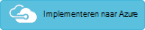

<properties
    pageTitle="Optimalisatie van uw omgeving met de oplossing Service stof in Log Analytics | Microsoft Azure"
    description="U kunt de oplossing Service stof Beoordeel de risico's en de status van uw Service stof toepassingen, micro-services, knooppunten en clusters."
    services="log-analytics"
    documentationCenter=""
    authors="niniikhena"
    manager="jochan"
    editor=""/>

<tags
    ms.service="log-analytics"
    ms.workload="na"
    ms.tgt_pltfrm="na"
    ms.devlang="na"
    ms.topic="article"
    ms.date="09/21/2016"
    ms.author="nini"/>


# <a name="service-fabric-solution-in-log-analytics"></a>Service stof oplossing in Log Analytics

> [AZURE.SELECTOR]
- [Resourcemanager](log-analytics-service-fabric-azure-resource-manager.md)
- [PowerShell](log-analytics-service-fabric.md)

In dit artikel wordt beschreven hoe de oplossing Service stof in Log Analytics gebruiken om te identificeren en oplossen van problemen in uw cluster Service stof.

Diagnostisch hulpprogramma Azure-gegevens uit uw Service stof VMs, de oplossing Service stof gebruikt door het verzamelen van deze gegevens uit uw tabellen Azure af. Log Analytics leest vervolgens Service stof framework gebeurtenissen, inclusief **Betrouwbare servicegebeurtenissen**, **Acteur gebeurtenissen**, **Operationele gebeurtenissen**en **aangepaste ETW gebeurtenissen**. Met het dashboard oplossing bent u aantal aanzienlijke problemen en relevante gebeurtenissen weergeven in uw omgeving Service stof.

Als u wilt beginnen met de oplossing, moet u uw cluster Service stof verbinden met een logboek Analytics-werkruimte. Hier volgen drie scenario's u rekening moet houden:

1. Als u nog niet geïmplementeerd uw cluster Service stof, gebruik u de stappen in ***een Service stof Cluster Deploy verbonden met een logboek Analytics-werkruimte*** kunt implementeren van een nieuw cluster en hebt geconfigureerd voor het rapport op Log Analytics.

2. Als u nodig hebt voor het verzamelen van prestatiemeteritems van uw hosts gebruik van andere oplossingen OMS zoals beveiliging op uw Service stof Cluster, volgt u de stappen in ***een Service stof Cluster met een werkruimte OMS met VM extensie geïnstalleerd verbonden Deploy.***

3. Als u uw Service stof cluster en wilt deze verbinden met Log Analytics al hebben geïnstalleerd, volgt u de stappen in ***een bestaand opslag-account toevoegen aan Log Analytics.***


##<a name="deploy-a-service-fabric-cluster-connected-to-a-log-analytics-workspace"></a>Een Service stof Cluster verbonden met een logboek Analytics-werkruimte implementeren.
Deze sjabloon, gebeurt het volgende:


1. Implementeert een Azure-Service stof cluster al is verbonden met een logboek Analytics-werkruimte. U hebt de optie voor een nieuwe werkruimte maken tijdens het implementeren van de sjabloon of de naam van een al bestaande Log Analytics-werkruimte invoer.
2. De diagnostische opslag-account toevoegt aan de Log Analytics-werkruimte.
3. Schakelt de oplossing Service stof in uw werkruimte Log Analytics.

[](https://portal.azure.com/#create/Microsoft.Template/uri/https%3A%2F%2Fraw.githubusercontent.com%2Fazure%2Fazure-quickstart-templates%2Fmaster%2Fservice-fabric-oms%2F%2Fazuredeploy.json)


Wanneer u de bovenstaande deploy-knop hebt geselecteerd, ontvangt u op de Azure-portal met parameters die u kunt bewerken. Zorg ervoor dat u een nieuwe resourcegroep maken als u een nieuwe naam van de Log Analytics-werkruimte input: 


Ga akkoord met de juridische voorwaarden en druk op 'Maken' om te beginnen de implementatie. Wanneer de implementatie is voltooid, ziet u de nieuwe werkruimte en cluster gemaakt en de WADServiceFabric * gebeurtenis, WADWindowsEventLogs en WADETWEvent tabellen toegevoegd:


##<a name="deploy-a-service-fabric-cluster-connected-to-an-oms-workspace-with-vm-extension-installed"></a>Een Service stof Cluster verbonden met een werkruimte OMS met VM extensie geïnstalleerd implementeren.
Deze sjabloon, gebeurt het volgende:

1. Implementeert een Azure-Service stof cluster al is verbonden met een logboek Analytics-werkruimte. U kunt een nieuwe werkruimte maken of een bestaande eigenschap te gebruiken.
2. Hiermee voegt u de diagnostische opslag-accounts naar de werkruimte Log Analytics.
3. Schakelt de oplossing Service stof in de werkruimte Log Analytics.
4. De MMA agentextensie in elke VM schaal instellen in uw cluster Service stof is geïnstalleerd. Met de MMA-agent is geïnstalleerd, bent u kunnen zien prestatiegegevens over uw knooppunten.


[](https://portal.azure.com/#create/Microsoft.Template/uri/https%3A%2F%2Fraw.githubusercontent.com%2Fazure%2Fazure-quickstart-templates%2Fmaster%2Fservice-fabric-vmss-oms%2F%2Fazuredeploy.json)


De benodigde invoerparameters na de bovenstaande dezelfde stappen en een implementatie starten. Nogmaals ziet u de nieuwe werkruimte, cluster en af tabellen alle gemaakt:


###<a name="viewing-performance-data"></a>Prestatiegegevens weergeven

Perf gegevens uit uw knooppunten weergeven:
</br>
- Start de werkruimte Log analyses van de Azure-portal.


- Ga naar instellingen in het linkerdeelvenster en selecteer gegevens >> Windows prestatie-items >> 'De geselecteerde items toevoegen': 

- Gebruik de volgende query's naar dieper belangrijke gegevens over uw knooppunten in Log zoeken:
</br>

    een. De gemiddelde CPU-gebruik van alle uw knooppunten in het laatste één uur om te zien welke knooppunten hebt problemen met elkaar vergelijken en op welke tijdsinterval knooppunt had een Prikker:

    ``` Type=Perf ObjectName=Processor CounterName="% Processor Time"|measure avg(CounterValue) by Computer Interval 1HOUR. ```

    


    b. Vergelijkbare lijndiagrammen voor beschikbare geheugen weergeven op elk knooppunt bij deze query:

    ```Type=Perf ObjectName=Memory CounterName="Available MBytes Memory" | measure avg(CounterValue) by Computer Interval 1HOUR.```

    Als u wilt bekijken van een lijst met alle knooppunten, met de exacte gemiddelde waarde voor beschikbaar megabytes (MB) voor elk knooppunt, gebruikt u deze query:

    ```Type=Perf (ObjectName=Memory) (CounterName="Available MBytes") | measure avg(CounterValue) by Computer ```

    


    c. In de zaak die u inzoomen op een specifiek knooppunt wilt hand van de standaarduurtarieven gemiddelde, minimum, maximum en 75 percentiel CPU-gebruik, bent u kunnen dit doen met behulp van deze query (vervangen veld Computer):

    ```Type=Perf CounterName="% Processor Time" InstanceName=_Total Computer="BaconDC01.BaconLand.com"| measure min(CounterValue), avg(CounterValue), percentile75(CounterValue), max(CounterValue) by Computer Interval 1HOUR```

    

    Lees meer informatie over prestatiegegevens in Log Analytics [hier]. (https://blogs.technet.microsoft.com/msoms/tag/metrics/)


##<a name="adding-an-existing-storage-account-to-log-analytics"></a>Een bestaand opslag-account toevoegen aan Log Analytics

Deze sjabloon worden uw bestaande opslag-accounts gewoon toegevoegd aan een nieuw of bestaand Log Analytics-werkruimte.
</br>

[](https://portal.azure.com/#create/Microsoft.Template/uri/https%3A%2F%2Fraw.githubusercontent.com%2FAzure%2Fazure-quickstart-templates%2Fmaster%2Foms-existing-storage-account%2Fazuredeploy.json)

>[AZURE.NOTE] Als u met een al bestaande Log Analytics-werkruimte werkt, selecteert u bij het selecteren van een resourcegroep, 'Gebruik bestaande' en zoek naar de resourcegroep met de werkruimte OMS. Maak een nieuwe één als anders.


Nadat deze sjabloon is geïmplementeerd, is mogelijk om de opslag-account dat is verbonden met uw Log Analytics-werkruimte weer te geven. In dit geval ik één meer opslagruimte account toegevoegd aan de Exchange-werkruimte die ik heb boven gemaakt.


## <a name="view-service-fabric-events"></a>Service stof gebeurtenissen weergeven

Zodra de implementaties zijn voltooid en de oplossing Service stof is ingeschakeld in uw werkruimte, selecteert u de **Service stof** -tegel in de portal Log Analytics aan het dashboard Service stof starten. Het dashboard bevat de kolommen in de volgende tabel. Elke kolom toont de bovenste tien gebeurtenissen met tellen van die kolom vergelijkingscriteria voor de opgegeven periode. U kunt een zoekopdracht log vindt u de hele lijst door te klikken op **alle** rechts onder aan elke kolom of door te klikken op de kolomkop waarop u kunt uitvoeren.

| **Service stof gebeurtenis** | **Beschrijving** |
| --- | --- |
| Aantal aanzienlijke problemen | Een weergave van problemen, zoals RunAsyncFailures RunAsynCancellations en knooppunt filterkeuzelijsten. |
| Operationele gebeurtenissen | Aantal aanzienlijke operationele gebeurtenissen zoals toepassing upgrade en implementaties. |
| Betrouwbare servicegebeurtenissen | Aantal aanzienlijke betrouwbaar servicegebeurtenissen, zoals een Runasyncinvocations. |
| Acteur gebeurtenissen | Aantal aanzienlijke acteur-gebeurtenissen die zijn gegenereerd door uw micro-services, zoals uitzonderingen die door een acteur-methode, acteur activeringen en deactivations, enzovoort. |
| Toepassingsgebeurtenissen | Alle aangepaste ETW-gebeurtenissen gegenereerd door uw toepassingen. |


De volgende tabel ziet u methoden voor het verzamelen van gegevens en andere informatie over hoe gegevens worden verzameld Service stof.

| platform | Directe Agent | SCOM agent | Azure-opslag | SCOM vereist? | SCOM agent gegevens die per management groep worden verzonden | frequentie van de siteverzameling |
|---|---|---|---|---|---|---|
|Windows||| |            ||10 minuten |


>[AZURE.NOTE] U kunt het bereik van deze gebeurtenissen in de oplossing Service stof wijzigen door te klikken op **gegevens op basis van laatste 7 dagen** aan de bovenkant van het dashboard. U kunt ook gebeurtenissen die zijn gegenereerd binnen de laatste zeven dagen, 1 dag of zes uren weergeven. Of, kunt u **aangepaste** om op te geven van een aangepast datumbereik.


## <a name="next-steps"></a>Volgende stappen

- Gebruik [Zoekopdrachten in het logboek in Log Analytics](log-analytics-log-searches.md) gedetailleerde Service stof gebeurtenisgegevens moeten worden weergegeven.
