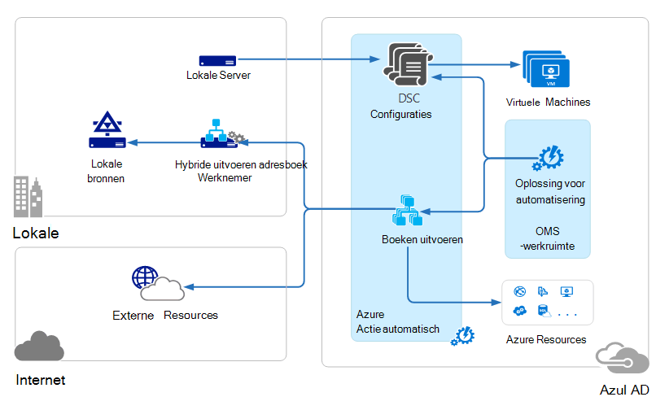

<properties 
   pageTitle="Bewerkingen Management Suite Kantoorbeheersysteem architectuur | Microsoft Azure"
   description="Microsoft bewerkingen Management Suite Kantoorbeheersysteem is Microsofts cloudgebaseerde IT-oplossing waarmee u beheren kunt en beveiligen van uw on-premises en cloud infrastructuur.  In dit artikel worden de verschillende services van opgenomen in OMS geïdentificeerd en bevat koppelingen naar hun gedetailleerde inhoud."
   services="operations-management-suite"
   documentationCenter=""
   authors="bwren"
   manager="jwhit"
   editor="tysonn" />
<tags 
   ms.service="operations-management-suite"
   ms.devlang="na"
   ms.topic="get-started-article"
   ms.tgt_pltfrm="na"
   ms.workload="infrastructure-services"
   ms.date="10/27/2016"
   ms.author="bwren" />

# OMS architectuur

[Bewerkingen Management Suite Kantoorbeheersysteem](https://azure.microsoft.com/documentation/services/operations-management-suite/) is een verzameling cloudgebaseerde services voor het beheren van uw on-premises en cloud omgevingen.  Dit artikel worden de verschillende on-premises en cloud-onderdelen van OMS en hun computer architectuur van hoog niveau cloud.  U kunt ook verwijzen naar de documentatie voor elke service voor meer informatie.

## Log Analytics

Alle gegevens die worden verzameld door [Log Analytics](https://azure.microsoft.com/documentation/services/log-analytics/) wordt opgeslagen in de bibliotheek OMS die wordt gehost in Azure wordt aangegeven.  Verbonden bronnen genereren gegevens die worden verzameld in de opslagplaats OMS.  Er zijn drie soorten verbonden bronnen die worden ondersteund.

- Een agent die is geïnstalleerd op een [Windows](../log-analytics/log-analytics-windows-agents.md) - of [Linux](../log-analytics/log-analytics-linux-agents.md) -computer direct op OMS aangesloten.
- Een systeem Center Operations Manager (SCOM) management groep [verbonden met Log Analytics](../log-analytics/log-analytics-om-agents.md) .  SCOM agenten gaat u verder met het communiceren met management-servers die evenementen en prestatiegegevens naar Log Analytics doorsturen.
- Een [account van Azure opslag](../log-analytics/log-analytics-azure-storage.md) dat gegevens van [Azure diagnostische gegevens](../cloud-services/cloud-services-dotnet-diagnostics.md) uit een werknemer rol, Webrol of VM in Azure wordt aangegeven verzamelt.

Gegevensbronnen definiëren de gegevens die Log Analytics van verbonden bronnen verzamelt, inclusief gebeurtenislogboeken en van prestatiemeteritems.  Oplossingen functionaliteit toevoegen aan OMS en kunnen eenvoudig worden toegevoegd aan uw werkruimte vanuit de [Galerie met oplossingen OMS](../log-analytics/log-analytics-add-solutions.md).  Sommige oplossingen mogelijk moet een directe verbinding Log analyses van SCOM agenten terwijl de anderen kunnen vragen om een extra agent zijn geïnstalleerd.

Log Analytics heeft een web gebaseerde portal waarmee u kunt OMS-bronnen beheren, toevoegen en configureren van OMS-oplossingen, en bekijken en analyseren van gegevens in de bibliotheek OMS.

## Azure automatisering

[Azure automatisering runbooks](http://azure.microsoft.com/documentation/services/automation) worden uitgevoerd in de cloud Azure en resources die in Azure, in andere cloudservices of toegankelijk zijn vanuit de openbare Internet zijn kunt gebruiken.  U kunt ook on-premises implementatie machines opgeven in uw lokale gegevens-beheercentrum met behulp van [Hybride Runbook werknemer](../automation/automation-hybrid-runbook-worker.md) zodat runbooks toegang lokale bronnen tot.

[DSC configuraties](../automation/automation-dsc-overview.md) die zijn opgeslagen in Azure automatisering kunnen rechtstreeks worden toegepast op Azure virtuele machines.  Andere fysieke en virtuele machines kunt configuraties aanvragen van de Azure automatisering DSC halen-server.

Azure automatisering heeft een OMS-oplossing met statistieken en koppelingen naar het starten van de Azure-portal voor alle bewerkingen.

## Azure back-up maken

Beveiligde gegevens in [Azure back-up](http://azure.microsoft.com/documentation/services/backup) is opgeslagen in een back-kluis zich bevindt in een bepaalde geografische regio.  De gegevens worden gerepliceerd binnen dezelfde regio en, afhankelijk van het type kluis, kan ook worden gerepliceerd naar een andere regio voor verdere redundantie.

Azure back-up heeft drie fundamentele scenario's.

- Windows-computer met Azure back-up-agent.  Hiermee kunt u naar de back-bestanden en mappen van een Windows server of -client rechtstreeks naar uw Azure back-kluis.  
- System Center Data Protection Manager (DPM) of Microsoft Azure back-Server. Hiermee kunt u gebruikmaken van DPM of Microsoft Azure back-Server om back-up maken van bestanden en mappen naast toepassing werkbelastingen zoals SQL en SharePoint naar de lokale opslag en vervolgens worden gerepliceerd naar uw Azure back-kluis.
- Azure virtuele machines uitbreidingen.  Hiermee kunt u naar de back-up maken van Azure virtuele machines naar uw Azure back-kluis.

Azure back-up heeft een OMS-oplossing met statistieken en koppelingen naar het starten van de Azure-portal voor alle bewerkingen.

## Herstel van Azure-Site

[Azure Site herstel](http://azure.microsoft.com/documentation/services/site-recovery) orchestrates herhaling, failover en failback van virtuele machines en fysieke servers. Replicatiegegevens worden uitgewisseld tussen hosts Hyper-V, VMware hypervisors en fysieke servers in de primaire en secundaire datacenters of tussen de datacenter en Azure opslag.  Site-herstel slaat metagegevens op kluizen zich bevindt in een bepaalde geografische Azure regio. Geen gerepliceerde gegevens worden opgeslagen door de service sites worden hersteld.

Azure Site herstel heeft drie fundamentele replicatie-scenario's.

**Replicatie van Hyper-V virtuele machines**
- Als Hyper-V virtuele machines worden beheerd in VMM wolken, kunt u op een secundaire Datacenter of op Azure opslag repliceren.  Replicatie naar Azure is via een beveiligde internetverbinding.  Replicatie met een secundaire datacenter is via het LAN.
- Als Hyper-V virtuele machines niet worden beheerd door VMM, kunt u met Azure storage alleen repliceren.  Replicatie naar Azure is via een beveiligde internetverbinding.
 
**Replicatie van VMWare virtuele machines**
- U kunt VMware virtuele machines repliceren met een secundaire datacenter VMware uitgevoerd of op Azure opslag.  Replicatie naar Azure kan plaatsvinden via een site-naar-site VPN of Azure ExpressRoute of via een beveiligde internetverbinding. Replicatie met een secundaire datacenter plaatsvindt via het kanaal InMage Scout data.
 
**Replicatie van fysieke Windows en Linux-servers** 
- U kunt de fysieke servers repliceren met een secundaire datacenter of op Azure opslag. Replicatie naar Azure kan plaatsvinden via een site-naar-site VPN of Azure ExpressRoute of via een beveiligde internetverbinding. Replicatie met een secundaire datacenter plaatsvindt via het kanaal InMage Scout data.  Azure herstel van de Site is een OMS-oplossing die sommige statistieken weergeeft, maar u moet de Azure-portal gebruiken voor alle bewerkingen.

## Volgende stappen

- Meer informatie over [Log Analytics](http://azure.microsoft.com/documentation/services/log-analytics).
- Meer informatie over [Azure automatisering](https://azure.microsoft.com/documentation/services/automation).
- Meer informatie over [Azure back-up](http://azure.microsoft.com/documentation/services/backup).
- Meer informatie over het [herstellen van Azure-Site](http://azure.microsoft.com/documentation/services/site-recovery).
