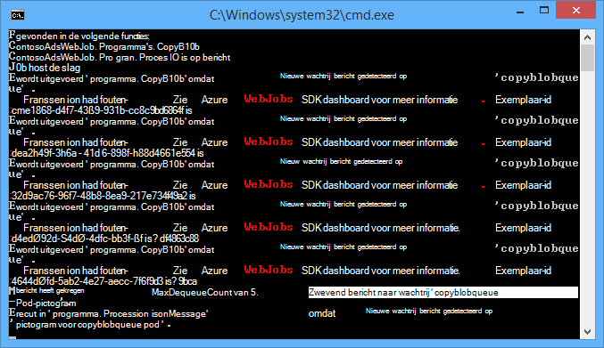
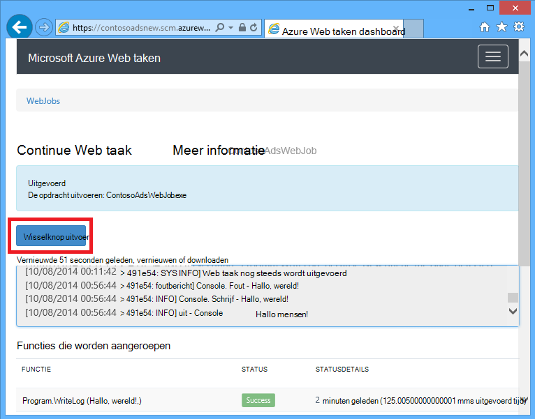
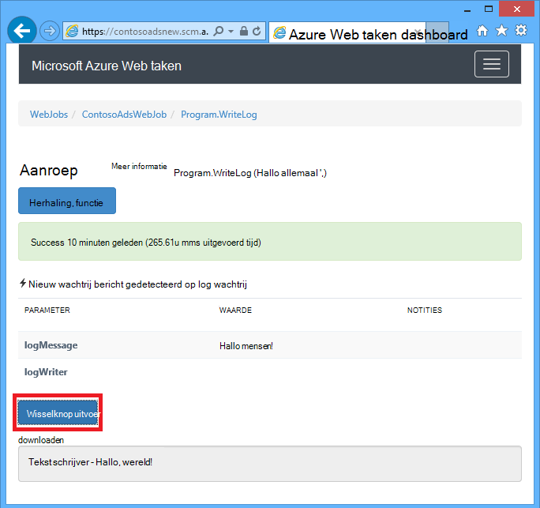
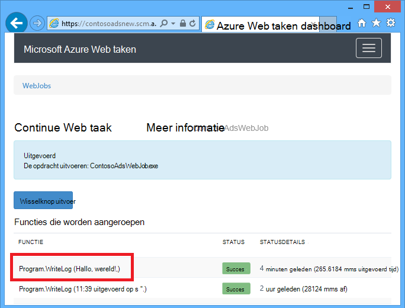
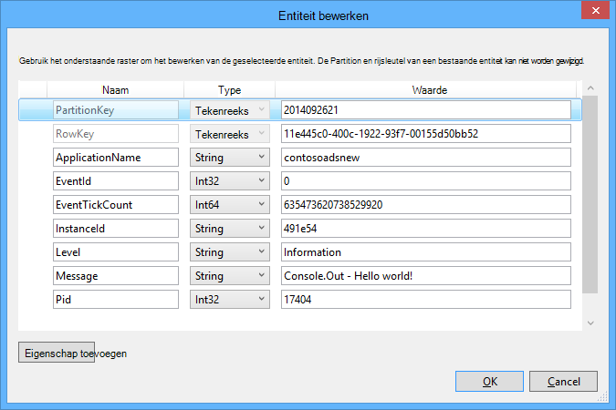
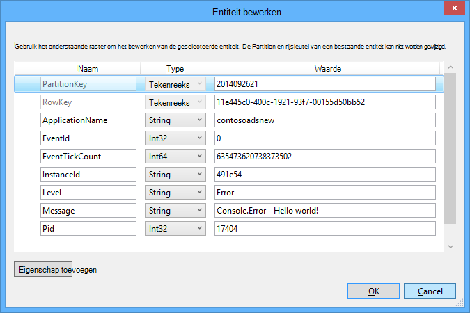

<properties
    pageTitle="Aan de slag met wachtrij opslagruimte en Visual Studio verbonden services (WebJob projecten) | Microsoft Azure"
    description="Hoe u aan de slag met Azure wachtrij opslag in een project WebJob nadat de verbinding met een opslag-account gebruik van Visual Studio services verbonden."
    services="storage"
    documentationCenter=""
    authors="TomArcher"
    manager="douge"
    editor=""/>

<tags
    ms.service="storage"
    ms.workload="web"
    ms.tgt_pltfrm="vs-getting-started"
    ms.devlang="na"
    ms.topic="article"
    ms.date="07/18/2016"
    ms.author="tarcher"/>

# Aan de slag met Azure wachtrij opslagruimte en Visual Studio verbonden services (WebJob projecten)

[AZURE.INCLUDE [storage-try-azure-tools-queues](../../includes/storage-try-azure-tools-queues.md)]

## Overzicht

In dit artikel wordt beschreven hoe aan de slag met Azure wachtrij opslag in een project Visual Studio Azure WebJob nadat u hebt gemaakt of een account Azure opslag waarnaar wordt verwezen met behulp van het dialoogvenster Visual Studio **Verbonden Services toevoegen** . Wanneer u een opslag-account aan een project WebJob toevoegt met behulp van het dialoogvenster Visual Studio, **Verbonden Services toevoegen** , de juiste Azure opslag NuGet-pakketten zijn geïnstalleerd, de juiste .NET-verwijzingen worden toegevoegd aan het project en verbindingstekenreeksen met de voor de opslag-account in het bestand App.config worden bijgewerkt.  

In dit artikel vindt u voorbeelden C#-code die wordt aangegeven hoe de versie van Azure WebJobs SDK 1.x met de wachtrij Azure storage-service.

Azure wachtrij opslag is een service voor het opslaan van grote aantallen van berichten die toegankelijk is vanuit een willekeurige plaats in de wereld via geverifieerde oproepen via HTTP of HTTPS. Een enkele wachtrij bericht kan maximaal 64 KB groot zijn en een wachtrij miljoenen berichten, tot aan de limiet van de totale capaciteit van een opslag-account kan bevatten. Zie [aan de slag met Azure wachtrij opslagruimte met .NET](storage-dotnet-how-to-use-queues.md) voor meer informatie. Zie voor meer informatie over ASP.NET, [ASP.NET](http://www.asp.net).

## Hoe u een functie te activeren wanneer een bericht wachtrij wordt ontvangen

U schrijft een functie die de WebJobs SDK belt wanneer een wachtrij bericht is ontvangen, gebruikt u het kenmerk **QueueTrigger** . De attribuutconstructor kent een tekenreeksparameter waarmee de naam van de wachtrij worden gecontroleerd. Om te zien hoe de naam van de wachtrij dynamisch instellen, raadpleegt u [hoe u de configuratie-opties instellen](#how-to-set-configuration-options).

### Berichten van tekenreeks wachtrij plaatsen

De wachtrij bevat in het volgende voorbeeld wordt een Tekenreeksbericht, de zodat **QueueTrigger** wordt toegepast op de tekenreeksparameter van een met de naam **logMessage** waarin de inhoud van het bericht wachtrij. De functie [wordt een logboek aan het Dashboard](#how-to-write-logs).

        public static void ProcessQueueMessage([QueueTrigger("logqueue")] string logMessage, TextWriter logger)
        {
            logger.WriteLine(logMessage);
        }

Naast de **tekenreeks**mogelijk de parameter een matrix van bytes, een **CloudQueueMessage** -object of een POCO die u definieert.

### POCO [(normaal oude CLR-Object](http://en.wikipedia.org/wiki/Plain_Old_CLR_Object)) berichten in de wachtrij

In het volgende voorbeeld wordt bevat het bericht wachtrij JSON voor een object **BlobInformation** , waaronder een eigenschap **BlobName** . De SDK deserializes automatisch het object.

        public static void WriteLogPOCO([QueueTrigger("logqueue")] BlobInformation blobInfo, TextWriter logger)
        {
            logger.WriteLine("Queue message refers to blob: " + blobInfo.BlobName);
        }

De SDK gebruikt de [Newtonsoft.Json NuGet pakket](http://www.nuget.org/packages/Newtonsoft.Json) serialiseren en terugconverteren van berichten. Als u berichten in wachtrij plaatsen in een programma dat niet wordt gebruikt de WebJobs SDK maakt, kunt u de code zoals in het volgende voorbeeld om te maken van een POCO wachtrij-bericht dat de SDK kan worden geparseerd schrijven.

        BlobInformation blobInfo = new BlobInformation() { BlobName = "log.txt" };
        var queueMessage = new CloudQueueMessage(JsonConvert.SerializeObject(blobInfo));
        logQueue.AddMessage(queueMessage);

### Asynchrone functies

De volgende asynchrone functie [schrijft een logboek aan het Dashboard](#how-to-write-logs).

        public async static Task ProcessQueueMessageAsync([QueueTrigger("logqueue")] string logMessage, TextWriter logger)
        {
            await logger.WriteLineAsync(logMessage);
        }

Asynchrone functies duurt een [annulering token](http://www.asp.net/mvc/overview/performance/using-asynchronous-methods-in-aspnet-mvc-4#CancelToken), zoals wordt weergegeven in het volgende voorbeeld dat een blob gekopieerd. (Zie de sectie [BLOB's](#how-to-read-and-write-blobs-and-tables-while-processing-a-queue-message) voor een uitleg van de tijdelijke aanduiding van **queueTrigger** ,.)

        public async static Task ProcessQueueMessageAsyncCancellationToken(
            [QueueTrigger("blobcopyqueue")] string blobName,
            [Blob("textblobs/{queueTrigger}",FileAccess.Read)] Stream blobInput,
            [Blob("textblobs/{queueTrigger}-new",FileAccess.Write)] Stream blobOutput,
            CancellationToken token)
        {
            await blobInput.CopyToAsync(blobOutput, 4096, token);
        }

## Het kenmerk QueueTrigger met werkt typen

U kunt **QueueTrigger** gebruiken met de volgende typen:

* **tekenreeks**
* Een POCO type serienummer als JSON
* **byte]**
* **CloudQueueMessage**

## Peiling algoritme

De SDK implementeert een willekeurig exponentiële back-uitschakelen algoritme om te verkleinen van het effect van idle-wachtrij polling op opslag transactiekosten.  Wanneer een bericht wordt gevonden, de SDK Wacht twee seconden ingedrukt en klikt u vervolgens Hiermee wordt gecontroleerd op een ander bericht; Wanneer het bericht niet is gevonden wacht ongeveer vier seconden voordat u probeert het opnieuw. Na het volgende mislukte pogingen om een bericht wachtrij, blijft de wachttijd om uit te breiden tot de maximale wachttijd, namelijk een minuut worden bereikt. [De maximale wachttijd kan worden geconfigureerd](#how-to-set-configuration-options).

## Meerdere exemplaren

Als uw web-app wordt uitgevoerd op meerdere exemplaren, een doorlopend WebJobs wordt uitgevoerd op elke computer en elke computer wordt wachten triggers en probeert uit te voeren functies. In sommige gevallen die dit kan leiden tot sommige functies tweemaal verwerking van dezelfde gegevens, dus functies moet idempotency is ingeschakeld (geschreven zodat herhaaldelijk bellen met de dezelfde invoergegevens niet dubbele resultaten wilt produceren).  

## Parallelle uitvoering

Als er meerdere functies luisteren op verschillende wachtrijen, wordt de SDK aangeroepen ze parallel wanneer berichten worden tegelijk ontvangen.

Dit geldt ook als meerdere berichten worden ontvangen voor één wachtrij. Standaard de SDK krijgt een reeks 16 berichten tegelijk en voert de functie die ze parallel verwerkt. [De batchgrootte kan worden geconfigureerd](#how-to-set-configuration-options). Wanneer het nummer dat wordt verwerkt, wordt onmiddellijk omlaag helft van de batchgrootte, wordt de SDK ontvangt van een andere batch en start de verwerking van deze berichten. Het maximum aantal gelijktijdige berichten wordt verwerkt per functie dus één anderhalf maal de batchgrootte. Deze beperking geldt afzonderlijk voor elke functie die beschikt over een **QueueTrigger** -kenmerk. Als u niet dat parallelle uitvoering voor berichten ontvangen op één wachtrij wilt, moet u de batchgrootte ingesteld op 1.

## Wachtrij of wachtrij bericht metagegevens

U kunt de berichteigenschappen van het volgende openen door parameters toe te voegen aan de methodehandtekening:

* **DateTimeOffset** expirationTime
* **DateTimeOffset** insertionTime
* **DateTimeOffset** nextVisibleTime
* **tekenreeks** queueTrigger (bevat berichttekst)
* **tekenreeks** -id
* **tekenreeks** popReceipt
* **int** dequeueCount

Als u werken met de Azure opslag API rechtstreeks wilt, kunt u ook een parameter **CloudStorageAccount** toevoegen.

Het volgende voorbeeld schrijft al deze metagegevens naar een logboek van de toepassing INFO. In het voorbeeld bevatten zowel logMessage als queueTrigger de inhoud van het bericht wachtrij.

        public static void WriteLog([QueueTrigger("logqueue")] string logMessage,
            DateTimeOffset expirationTime,
            DateTimeOffset insertionTime,
            DateTimeOffset nextVisibleTime,
            string id,
            string popReceipt,
            int dequeueCount,
            string queueTrigger,
            CloudStorageAccount cloudStorageAccount,
            TextWriter logger)
        {
            logger.WriteLine(
                "logMessage={0}\n" +
            "expirationTime={1}\ninsertionTime={2}\n" +
                "nextVisibleTime={3}\n" +
                "id={4}\npopReceipt={5}\ndequeueCount={6}\n" +
                "queue endpoint={7} queueTrigger={8}",
                logMessage, expirationTime,
                insertionTime,
                nextVisibleTime, id,
                popReceipt, dequeueCount,
                cloudStorageAccount.QueueEndpoint,
                queueTrigger);
        }

Hier volgt een voorbeeldlogboek geschreven door de voorbeeldcode:

        logMessage=Hello world!
        expirationTime=10/14/2014 10:31:04 PM +00:00
        insertionTime=10/7/2014 10:31:04 PM +00:00
        nextVisibleTime=10/7/2014 10:41:23 PM +00:00
        id=262e49cd-26d3-4303-ae88-33baf8796d91
        popReceipt=AgAAAAMAAAAAAAAAfc9H0n/izwE=
        dequeueCount=1
        queue endpoint=https://contosoads.queue.core.windows.net/
        queueTrigger=Hello world!

## Correcte afsluiten

Een functie die wordt uitgevoerd in een doorlopend WebJob kunt akkoord gaan als u een parameter **CancellationToken** waarmee het besturingssysteem op de hoogte stellen van de functie als de WebJob wordt worden beëindigd. U kunt deze melding gebruiken om ervoor te zorgen dat de functie niet onverwachte beëindiging op een manier die gegevens in een inconsistente status blijven.

Het volgende voorbeeld wordt getoond hoe om aanstaande WebJob beëindiging in een functie te controleren.

    public static void GracefulShutdownDemo(
                [QueueTrigger("inputqueue")] string inputText,
                TextWriter logger,
                CancellationToken token)
    {
        for (int i = 0; i < 100; i++)
        {
            if (token.IsCancellationRequested)
            {
                logger.WriteLine("Function was cancelled at iteration {0}", i);
                break;
            }
            Thread.Sleep(1000);
            logger.WriteLine("Normal processing for queue message={0}", inputText);
        }
    }

**Notitie:** Het Dashboard mogelijk niet correct weergegeven de status en de uitvoer van functies die u hebt afgesloten.

Zie voor meer informatie [WebJobs correcte afsluiten](http://blog.amitapple.com/post/2014/05/webjobs-graceful-shutdown/#.VCt1GXl0wpR).   

## Het maken van een bericht wachtrij tijdens het verwerken van een bericht wachtrij

U schrijft een functie die Hiermee maakt u een nieuw bericht in de wachtrij, gebruikt u het kenmerk **wachtrij** . Net als **QueueTrigger**, geeft u in de naam van de wachtrij als een tekenreeks of u kunt [de naam van de wachtrij dynamisch instellen](#how-to-set-configuration-options).

### Berichten van tekenreeks wachtrij plaatsen

Het volgende voorbeeld niet asynchrone Hiermee maakt u een nieuw bericht in de wachtrij in de wachtrij met de naam "outputqueue" met dezelfde inhoud als het bericht dat in de wachtrij met de naam 'inputqueue' de wachtrij. (Van asynchrone functies gebruiken **IAsyncCollector<T> ** zoals verderop in dit gedeelte.)

        public static void CreateQueueMessage(
            [QueueTrigger("inputqueue")] string queueMessage,
            [Queue("outputqueue")] out string outputQueueMessage )
        {
            outputQueueMessage = queueMessage;
        }

### POCO [(normaal oude CLR-Object](http://en.wikipedia.org/wiki/Plain_Old_CLR_Object)) berichten in de wachtrij

Als u wilt maken van een wachtrij-bericht dat een POCO in plaats van een tekenreeks bevat, geeft u het type POCO als een uitvoerparameter aan de **wachtrij** attribuutconstructor.

        public static void CreateQueueMessage(
            [QueueTrigger("inputqueue")] BlobInformation blobInfoInput,
            [Queue("outputqueue")] out BlobInformation blobInfoOutput )
        {
            blobInfoOutput = blobInfoInput;
        }

De SDK serialiseert automatisch het object naar JSON. Een bericht wachtrij wordt altijd gemaakt, zelfs als het object null is.

### Meerdere berichten maken of in asynchrone functies

Als u wilt maken van meerdere berichten, Controleer het parametertype voor de wachtrij uitvoer **ICollector<T> ** of **IAsyncCollector<T>**, zoals weergegeven in het volgende voorbeeld.

        public static void CreateQueueMessages(
            [QueueTrigger("inputqueue")] string queueMessage,
            [Queue("outputqueue")] ICollector<string> outputQueueMessage,
            TextWriter logger)
        {
            logger.WriteLine("Creating 2 messages in outputqueue");
            outputQueueMessage.Add(queueMessage + "1");
            outputQueueMessage.Add(queueMessage + "2");
        }

Elk bericht wachtrij wordt gemaakt onmiddellijk wanneer de methode **Add** wordt genoemd.

### Typen die het kenmerk wachtrij met werkt

U kunt het kenmerk **wachtrij** op de volgende parametertypen gebruiken:

* **out tekenreeks** (Hiermee maakt u wachtrij bericht als parameterwaarde geen null-is wanneer de functie eindigt)
* **out byte]** (werkt als **tekenreeks**)
* **out CloudQueueMessage** (werkt als **tekenreeks**)
* **out POCO** (een serialiseerbaar type, maakt u een bericht met een null-object als de parameter is null wanneer de functie eindigt)
* **ICollector**
* **IAsyncCollector**
* **CloudQueue** (voor het maken van berichten handmatig rechtstreeks met de API Azure opslag)

### WebJobs SDK kenmerken in de hoofdtekst van een functie gebruiken

Als u werken in uw functie wilt voordat u een kenmerk WebJobs SDK zoals **wachtrij**, **Blob**of **tabel**gebruikt, kunt u de **IBinder** -interface.

Het volgende voorbeeld wordt een bericht invoer wachtrij en Hiermee maakt u een nieuw bericht met dezelfde inhoud in een wachtrij uitvoer. De naam van de uitvoer wachtrij is ingesteld door code in de hoofdtekst van de functie.

        public static void CreateQueueMessage(
            [QueueTrigger("inputqueue")] string queueMessage,
            IBinder binder)
        {
            string outputQueueName = "outputqueue" + DateTime.Now.Month.ToString();
            QueueAttribute queueAttribute = new QueueAttribute(outputQueueName);
            CloudQueue outputQueue = binder.Bind<CloudQueue>(queueAttribute);
            outputQueue.AddMessage(new CloudQueueMessage(queueMessage));
        }

De interface **IBinder** kan ook worden gebruikt met de kenmerken van de **tabel** en **Blob** .

## Hoe u kunt lezen en schrijven BLOB's en tabellen tijdens het verwerken van een bericht wachtrij

De kenmerken **Blob** en **tabel** kunnen u lezen en schrijven BLOB's en tabellen. In de voorbeelden in deze sectie zijn van toepassing op BLOB's. Lees [hoe u met Azure-blobopslag met de SDK WebJobs](../app-service-web/websites-dotnet-webjobs-sdk-storage-blobs-how-to.md)voor voorbeelden van code zien hoe u het activeren van processen wanneer BLOB's worden gemaakt of bijgewerkt, en voor voorbeelden van code die lezen en schrijven van tabellen, raadpleegt u [het gebruik van Azure-tabelopslag met de SDK WebJobs](../app-service-web/websites-dotnet-webjobs-sdk-storage-tables-how-to.md).

### Berichten in wachtrij plaatsen tekenreeks activeert blob bewerkingen

Voor een wachtrij-bericht met een tekenreeks is **queueTrigger** een tijdelijke aanduiding die u kunt gebruiken in het **Blob** -kenmerk **blobPath** parameter dat de inhoud van het bericht bevat.

Het volgende voorbeeld wordt de **Stream** -objecten te lezen en schrijven BLOB's. Het bericht wachtrij is de naam van een blob zich in de container textblobs. Een kopie van de blob met '-nieuwe ' toegevoegd aan de naam is gemaakt in dezelfde container.

        public static void ProcessQueueMessage(
            [QueueTrigger("blobcopyqueue")] string blobName,
            [Blob("textblobs/{queueTrigger}",FileAccess.Read)] Stream blobInput,
            [Blob("textblobs/{queueTrigger}-new",FileAccess.Write)] Stream blobOutput)
        {
            blobInput.CopyTo(blobOutput, 4096);
        }

De attribuutconstructor **Blob** kent een **blobPath** -parameter waarmee de container en de naam van de blob. Zie voor meer informatie over deze tijdelijke aanduiding voor [het gebruik van Azure-blobopslag met de SDK WebJobs](../app-service-web/websites-dotnet-webjobs-sdk-storage-blobs-how-to.md).

Wanneer het kenmerk wordt verfraaid een **Stream** -object, geeft een andere constructor parameter de **FileAccess** als lezen, schrijven of alleen-lezen/schrijven.

Het volgende voorbeeld wordt een object **CloudBlockBlob** een blob verwijderen. Het bericht wachtrij is de naam van de blob.

        public static void DeleteBlob(
            [QueueTrigger("deleteblobqueue")] string blobName,
            [Blob("textblobs/{queueTrigger}")] CloudBlockBlob blobToDelete)
        {
            blobToDelete.Delete();
        }

### POCO [(normaal oude CLR-Object](http://en.wikipedia.org/wiki/Plain_Old_CLR_Object)) berichten in de wachtrij

Voor een POCO als JSON in het bericht wachtrij opgeslagen, kunt u tijdelijke aanduidingen die naameigenschappen van het object in de **wachtrij** -kenmerk **blobPath** parameter. U kunt ook wachtrij metagegevens eigenschapnamen gebruiken als tijdelijke aanduidingen. Zie [wachtrij of wachtrij bericht metagegevens](#get-queue-or-queue-message-metadata).

Het volgende voorbeeld wordt een blob naar een nieuwe blob met de extensie verschillende gekopieerd. Het bericht wachtrij is een **BlobInformation** -object met **BlobName** en **BlobNameWithoutExtension** eigenschappen. De eigenschapnamen worden gebruikt als tijdelijke aanduidingen in het pad blob voor de kenmerken **Blob** .

        public static void CopyBlobPOCO(
            [QueueTrigger("copyblobqueue")] BlobInformation blobInfo,
            [Blob("textblobs/{BlobName}", FileAccess.Read)] Stream blobInput,
            [Blob("textblobs/{BlobNameWithoutExtension}.txt", FileAccess.Write)] Stream blobOutput)
        {
            blobInput.CopyTo(blobOutput, 4096);
        }

De SDK gebruikt de [Newtonsoft.Json NuGet pakket](http://www.nuget.org/packages/Newtonsoft.Json) serialiseren en terugconverteren van berichten. Als u berichten in wachtrij plaatsen in een programma dat niet wordt gebruikt de WebJobs SDK maakt, kunt u de code zoals in het volgende voorbeeld om te maken van een POCO wachtrij-bericht dat de SDK kan worden geparseerd schrijven.

        BlobInformation blobInfo = new BlobInformation() { BlobName = "boot.log", BlobNameWithoutExtension = "boot" };
        var queueMessage = new CloudQueueMessage(JsonConvert.SerializeObject(blobInfo));
        logQueue.AddMessage(queueMessage);

Als u werken in uw functie wilt voordat u een blob binden aan een object, kunt u het kenmerk in de hoofdtekst van de functie, zoals wordt weergegeven in [gebruiken WebJobs SDK kenmerken in de hoofdtekst van een functie](#use-webjobs-sdk-attributes-in-the-body-of-a-function)is ingesteld.

###U het kenmerk Blob met kunt typen

Het kenmerk **Blob** kan worden gebruikt met de volgende typen:

* **Stream** (lezen of schrijven, opgegeven met de parameter van de constructor FileAccess)
* **TextReader**
* **TextWriter**
* **tekenreeks** (alleen)
* **out tekenreeks** (schrijven; Hiermee maakt u een blob alleen als de tekenreeksparameter niet-null wanneer de functie retourneert)
* POCO (lezen)
* out POCO (schrijven; altijd een blob maakt, wordt gemaakt als null-object als POCO parameter null is wanneer de functie retourneert)
* **CloudBlobStream** (schrijven)
* **ICloudBlob** (lezen of schrijven)
* **CloudBlockBlob** (lezen of schrijven)
* **CloudPageBlob** (lezen of schrijven)

##Hoe u omgaat met poison berichten

Berichten waarvan de inhoud wordt door een functie mislukt heten *poison berichten*. Wanneer de functie mislukt, wordt het bericht wachtrij wordt niet verwijderd en uiteindelijk wordt opgehaald nogmaals veroorzaakt door de cyclus worden herhaald. De SDK kan automatisch de cyclus worden onderbroken na een beperkt aantal iteraties of u deze handmatig kunt doen.

### Verwerken van automatische verontreinigde berichten

De SDK wordt een functie maximaal 5 keer aanroep aan een bericht wachtrij verwerken. Als het vijfde uitproberen mislukt, wordt het bericht wordt verplaatst naar een poison wachtrij. U kunt zien hoe u het maximum aantal pogingen om opnieuw te configureren in [het configuratieopties instellen](#how-to-set-configuration-options).

De poison wachtrij heet *{originalqueuename}*-poison. Een functie op berichten uit de poison wachtrij door ze logboekregistratie of het verzenden van een melding dat handmatige aandacht nodig is, kunt u schrijven.

Functie, in het volgende voorbeeld de **CopyBlob** mislukt wanneer een bericht wachtrij bevat de naam van een blob die niet bestaat. In dat geval wordt het bericht uit de wachtrij copyblobqueue verplaatst naar de wachtrij copyblobqueue poison. De **ProcessPoisonMessage** meldt zich dan de verontreinigd bericht.

        public static void CopyBlob(
            [QueueTrigger("copyblobqueue")] string blobName,
            [Blob("textblobs/{queueTrigger}", FileAccess.Read)] Stream blobInput,
            [Blob("textblobs/{queueTrigger}-new", FileAccess.Write)] Stream blobOutput)
        {
            blobInput.CopyTo(blobOutput, 4096);
        }

        public static void ProcessPoisonMessage(
            [QueueTrigger("copyblobqueue-poison")] string blobName, TextWriter logger)
        {
            logger.WriteLine("Failed to copy blob, name=" + blobName);
        }

De volgende afbeelding ziet console-uitvoer van deze functies wanneer een poison-bericht wordt verwerkt.

### Verwerken van handmatige verontreinigde berichten

U kunt het aantal keren die een bericht is opgenomen omhoog voor verwerking krijgen door toe te voegen een parameter **int** **dequeueCount** aan uw functie met de naam. U kunt vervolgens de wachtrij halen tellen in de functiecode en voert uw eigen poison afhandeling van berichten wanneer het getal groter is dan een drempelwaarde, zoals wordt weergegeven in het volgende voorbeeld.

        public static void CopyBlob(
            [QueueTrigger("copyblobqueue")] string blobName, int dequeueCount,
            [Blob("textblobs/{queueTrigger}", FileAccess.Read)] Stream blobInput,
            [Blob("textblobs/{queueTrigger}-new", FileAccess.Write)] Stream blobOutput,
            TextWriter logger)
        {
            if (dequeueCount > 3)
            {
                logger.WriteLine("Failed to copy blob, name=" + blobName);
            }
            else
            {
            blobInput.CopyTo(blobOutput, 4096);
            }
        }

## Hoe u de configuratie-opties instellen

U kunt het type **JobHostConfiguration** gebruiken voor het instellen van de volgende configuratieopties:

* Stel de SDK verbindingstekenreeksen in code.
* **QueueTrigger** configureren van instellingen zoals maximum aantal in wachtrij.
* Wachtrijnamen krijgen van de configuratie.

###Set SDK verbindingstekenreeksen in code

Instellen van de SDK verbindingstekenreeksen in code kunt u uw eigen namen van de tekenreeks verbindingen in de van configuratiebestanden of omgevingsvariabelen, zoals wordt weergegeven in het volgende voorbeeld.

        static void Main(string[] args)
        {
            var _storageConn = ConfigurationManager
                .ConnectionStrings["MyStorageConnection"].ConnectionString;

            var _dashboardConn = ConfigurationManager
                .ConnectionStrings["MyDashboardConnection"].ConnectionString;

            var _serviceBusConn = ConfigurationManager
                .ConnectionStrings["MyServiceBusConnection"].ConnectionString;

            JobHostConfiguration config = new JobHostConfiguration();
            config.StorageConnectionString = _storageConn;
            config.DashboardConnectionString = _dashboardConn;
            config.ServiceBusConnectionString = _serviceBusConn;
            JobHost host = new JobHost(config);
            host.RunAndBlock();
        }

### QueueTrigger-instellingen configureren

U kunt de volgende instellingen die van toepassing zijn op de wachtrij berichtverwerking configureren:

- Het maximum aantal berichten die tegelijk kunnen worden uitgevoerd parallel zijn opgenomen (de standaardinstelling is 16).
- Het maximum aantal pogingen voordat een bericht wachtrij wordt verzonden naar een poison wachtrij (de standaardinstelling is 5).
- Het maximale aantal wachttijd voordat het polling opnieuw wanneer een wachtrij leeg is (de standaardinstelling is 1 minuut).

Het volgende voorbeeld ziet u hoe deze instellingen configureren:

        static void Main(string[] args)
        {
            JobHostConfiguration config = new JobHostConfiguration();
            config.Queues.BatchSize = 8;
            config.Queues.MaxDequeueCount = 4;
            config.Queues.MaxPollingInterval = TimeSpan.FromSeconds(15);
            JobHost host = new JobHost(config);
            host.RunAndBlock();
        }

### Waarden instellen voor WebJobs SDK constructor parameters in code

Soms wilt u de naam van een wachtrij, een blob naam of de container opgeven of een tabel een naam in de code in plaats van vaste-code deze. U wilt bijvoorbeeld de naam van de wachtrij voor **QueueTrigger** in een variabele van bestand of de omgeving configuratie opgeven.

U kunt dit doen door doorgeven in een **NameResolver** -object met het type **JobHostConfiguration** . U speciale tijdelijke aanduidingen omgeven door percentage (%) positief of negatief in WebJobs SDK kenmerk constructor parameters opnemen, en uw code **NameResolver** Hiermee geeft u de werkelijke waarden moet worden gebruikt in plaats van de tijdelijke aanduidingen.

Stel dat u wilt een wachtrij met de naam logqueuetest in de testomgeving en één benoemde logqueueprod in productie gebruiken. In plaats van de naam van een hard gecodeerde wachtrij, die u wilt opgeven van de naam van een vermelding in de verzameling **appSettings** die de naam van de werkelijke wachtrij kan hebben. Als de sleutel **appSettings** logqueue, kan uw functie uitzien zoals in het volgende voorbeeld.

        public static void WriteLog([QueueTrigger("%logqueue%")] string logMessage)
        {
            Console.WriteLine(logMessage);
        }

Uw klas **NameResolver** kan de naam van de wachtrij vervolgens ophalen uit **appSettings** , zoals wordt weergegeven in het volgende voorbeeld:

        public class QueueNameResolver : INameResolver
        {
            public string Resolve(string name)
            {
                return ConfigurationManager.AppSettings[name].ToString();
            }
        }

U kunt de klasse **NameResolver** in doorgeven aan het object **JobHost** zoals wordt weergegeven in het volgende voorbeeld.

        static void Main(string[] args)
        {
            JobHostConfiguration config = new JobHostConfiguration();
            config.NameResolver = new QueueNameResolver();
            JobHost host = new JobHost(config);
            host.RunAndBlock();
        }

**Notitie:** Wachtrij, tabel en blob namen worden omgezet, elke keer een functie wordt genoemd, maar alleen wanneer de toepassing wordt gestart, blob container namen worden omgezet. U kunt de naam van de container blob niet wijzigen, terwijl de taak wordt uitgevoerd.

## Hoe u handmatig een functie activeren

Als u wilt activeren handmatig een functie, gebruikt u de methode **belt** of het **CallAsync** op het object **JobHost** en het kenmerk **NoAutomaticTrigger** van de functie, zoals wordt weergegeven in het volgende voorbeeld.

        public class Program
        {
            static void Main(string[] args)
            {
                JobHost host = new JobHost();
                host.Call(typeof(Program).GetMethod("CreateQueueMessage"), new { value = "Hello world!" });
            }

            [NoAutomaticTrigger]
            public static void CreateQueueMessage(
                TextWriter logger,
                string value,
                [Queue("outputqueue")] out string message)
            {
                message = value;
                logger.WriteLine("Creating queue message: ", message);
            }
        }

## Logboeken schrijven

Het Dashboard ziet u Logboeken op twee plaatsen: de pagina voor de WebJob en de pagina voor een specifieke WebJob aanroep.

Uitvoer van Console-methoden die u in een functie of in de methode **Main() belt** wordt weergegeven in de Dashboard-pagina voor de WebJob, niet in de pagina voor het oproepen van een bepaalde methode. Uitvoer van het TextWriter-object dat u van een parameter in uw methodehandtekening krijgt wordt weergegeven in de Dashboard-pagina voor het oproepen van een methode.

Console-uitvoer niet kan worden gekoppeld aan een bepaalde methodeaanroep omdat de Console één thread, is terwijl er veel functies kunnen worden uitgevoerd op hetzelfde moment. Daarom heb ik de SDK biedt de aanroep van elke functie met een eigen unieke log schrijverobject.

U schrijft [toepassing traceringslogboeken](web-sites-dotnet-troubleshoot-visual-studio.md#logsoverview)door **Console.Out** (Hiermee maakt u Logboeken dat is gemarkeerd als INFO) en **Console.Error** (Hiermee maakt u Logboeken als fout gemarkeerd) te gebruiken. Een alternatief is via [doelcellen of TraceSource](http://blogs.msdn.com/b/mcsuksoldev/archive/2014/09/04/adding-trace-to-azure-web-sites-and-web-jobs.aspx), waarmee uitgebreid, waarschuwing en kritiek niveaus naast Info en -fout. Toepassing traceringslogboeken worden weergegeven in de logboekbestanden web app, Azure-tabellen, of Azure BLOB's afhankelijk van hoe u uw Azure web-app configureren. Geldt ook voor alle Console-uitvoer, de meest recente 100 toepassingslogboeken ook worden weergegeven in de dashboardpagina voor de WebJob, niet naar de pagina voor de aanroep van een functie.

Console-uitvoer wordt weergegeven in het Dashboard alleen als het programma wordt uitgevoerd in een WebJob Azure niet als het programma lokaal wordt uitgevoerd of in sommige andere omgeving.

U kunt logboekregistratie uitschakelen door in te stellen van de Dashboard-verbindingsreeks op null. Lees [hoe u het configuratie-opties instellen](#how-to-set-configuration-options)voor meer informatie.

Het volgende voorbeeld ziet verschillende manieren om te schrijven Logboeken:

        public static void WriteLog(
            [QueueTrigger("logqueue")] string logMessage,
            TextWriter logger)
        {
            Console.WriteLine("Console.Write - " + logMessage);
            Console.Out.WriteLine("Console.Out - " + logMessage);
            Console.Error.WriteLine("Console.Error - " + logMessage);
            logger.WriteLine("TextWriter - " + logMessage);
        }

Klik in het Dashboard WebJobs SDK de uitvoer van het object **TextWriter** wordt weergegeven wanneer u gaat u naar de pagina voor een specifieke functie-aanroep en selecteer **Wisselknop uitvoer**:

In het Dashboard WebJobs SDK uitvoeren de meest recente 100 regels van Console weergeven van wanneer u naar de pagina voor de WebJob (niet voor de functie-aanroep gaat) en selecteert u **De wisselknop uitvoer**.

In een doorlopend WebJob weergegeven toepassingslogboeken aan de in/gegevens/taken/continue /*{webjobname}*/job_log.txt in het bestandssysteem van de web-app.

        [09/26/2014 21:01:13 > 491e54: INFO] Console.Write - Hello world!
        [09/26/2014 21:01:13 > 491e54: ERR ] Console.Error - Hello world!
        [09/26/2014 21:01:13 > 491e54: INFO] Console.Out - Hello world!

In een Azure blob de toepassing Logboeken zien er zo uit: 2014-09-26T21:01:13,Information,contosoadsnew,491e54,635473620738373502,0,17404,17,Console.Write - Hallo, wereld!, 2014-09-26T21:01:13,Error,contosoadsnew,491e54,635473620738373502,0,17404,19,Console.Error - Hallo, wereld!, 2014-09-26T21:01:13,Information,contosoadsnew,491e54,635473620738529920,0,17404,17,Console.Out - Hallo, wereld!,

En in een Azure-tabel de logboeken **Console.Out** en **Console.Error** er als volgt uit:

##Volgende stappen

In dit artikel biedt voorbeelden van de code die wordt aangegeven hoe u omgaat met veelvoorkomende scenario's voor het werken met Azure wachtrijen. Zie voor meer informatie over het gebruik van Azure WebJobs en de SDK WebJobs [Azure WebJobs documentatie resources](http://go.microsoft.com/fwlink/?linkid=390226).
