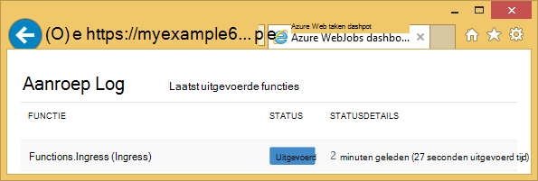
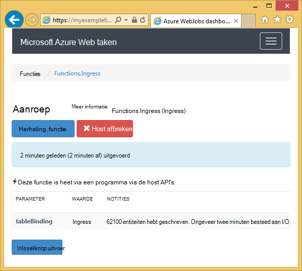
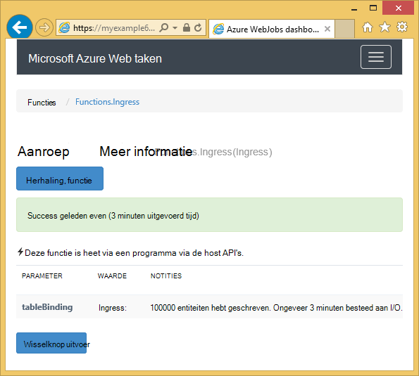

<properties
    pageTitle="Aan de slag met Azure opslagruimte en Visual Studio verbonden services (WebJob projecten)"
    description="Hoe u aan de slag met Azure-tabelopslag in een project Azure WebJobs in Visual Studio nadat de verbinding met een opslag-account gebruik van Visual Studio services verbonden"
    services="storage"
    documentationCenter=""
    authors="TomArcher"
    manager="douge"
    editor=""/>

<tags
    ms.service="storage"
    ms.workload="web"
    ms.tgt_pltfrm="vs-getting-started"
    ms.devlang="na"
    ms.topic="article"
    ms.date="07/18/2016"
    ms.author="tarcher"/>

# Aan de slag met Azure opslag (Azure WebJob projecten)

[AZURE.INCLUDE [storage-try-azure-tools-tables](../../includes/storage-try-azure-tools-tables.md)]

## Overzicht

In dit artikel vindt u voorbeelden C#-code die wordt aangegeven hoe de versie van Azure WebJobs SDK 1.x met de Azure tabel storage-service. Voorbeelden van de code gebruiken de versie [WebJobs SDK](../app-service-web/websites-dotnet-webjobs-sdk.md) 1.x.

De tabel Azure storage-service kunt u voor de opslag van grote hoeveelheden gestructureerde gegevens. De service is een NoSQL gegevensopslag die geverifieerde oproepen van binnen en buiten de Azure cloud accepteert. Azure tabellen zijn geschikt om gestructureerde, niet-relationele gegevens op te slaan.  Zie [aan de slag met Azure-tabelopslag met .NET](storage-dotnet-how-to-use-tables.md#create-a-table) voor meer informatie.

Enkele van de codefragmenten weergeven het kenmerk **tabel** is gebruikt in functies die worden genoemd handmatig, dat wil zeggen niet via een van de kenmerken trigger.

## Entiteiten toevoegen aan een tabel

U kunt entiteiten toevoegen aan een tabel met het kenmerk **tabel** met een **ICollector<T> ** of **IAsyncCollector<T> ** parameter waar **T** Hiermee geeft u het schema van de entiteiten die u wilt toevoegen. De attribuutconstructor kent een tekenreeksparameter waarmee de naam van de tabel.

In het volgende voorbeeld wordt de **persoon** entiteiten toegevoegd aan een tabel met de naam *Ingress*.

        [NoAutomaticTrigger]
        public static void IngressDemo(
            [Table("Ingress")] ICollector<Person> tableBinding)
        {
            for (int i = 0; i < 100000; i++)
            {
                tableBinding.Add(
                    new Person() {
                        PartitionKey = "Test",
                        RowKey = i.ToString(),
                        Name = "Name" }
                    );
            }
        }

Meestal het type die u met **ICollector gebruikt** is afgeleid van **TableEntity** of **ITableEntity**implementeert, maar deze niet hoeft te worden. Een van de volgende **persoon** klassen werken met de code die wordt weergegeven in de voorgaande **Ingress** -methode.

        public class Person : TableEntity
        {
            public string Name { get; set; }
        }

        public class Person
        {
            public string PartitionKey { get; set; }
            public string RowKey { get; set; }
            public string Name { get; set; }
        }

Als u werken met de Azure opslag API rechtstreeks wilt, kunt u een parameter **CloudStorageAccount** toevoegen aan de methodehandtekening.

## Realtime bewaken

Omdat ingress gegevensfuncties vaak grote hoeveelheden gegevens verwerken, vindt u het dashboard WebJobs SDK realtime controlegegevens. De sectie **Aanroep Log** weergegeven als de functie nog actief is.

De pagina **Details van de aanroep** van de functie voortgang (aantal entiteiten geschreven) rapporten terwijl deze wordt uitgevoerd en hebt u de mogelijkheid om af te breken deze.

Wanneer de functie is voltooid, wordt in de pagina **Details van de aanroep** van het aantal rijen geschreven rapporten.

## Hoe u kunt meerdere entiteiten lezen uit een tabel

Als u wilt lezen van een tabel, gebruikt u het kenmerk **tabel** met een **IQueryable<T> ** parameter waarop type **T** is afgeleid van **TableEntity** of **ITableEntity**implementeert.

Het volgende voorbeeld worden gelezen en alle rijen uit de tabel **Ingress** Logboeken:

        public static void ReadTable(
            [Table("Ingress")] IQueryable<Person> tableBinding,
            TextWriter logger)
        {
            var query = from p in tableBinding select p;
            foreach (Person person in query)
            {
                logger.WriteLine("PK:{0}, RK:{1}, Name:{2}",
                    person.PartitionKey, person.RowKey, person.Name);
            }
        }

### Een enkele entiteit lezen van een tabel

Er is een attribuutconstructor **tabel** met twee aanvullende parameters waarmee u de partition en rijsleutel opgeven wanneer u wilt koppelen aan een entiteit één tabel.

Het volgende voorbeeld wordt een tabelrij voor een **persoon** entiteit op basis van partition sleutel en rij sleutelwaarden ontvangen in een bericht wachtrij:  

        public static void ReadTableEntity(
            [QueueTrigger("inputqueue")] Person personInQueue,
            [Table("persontable","{PartitionKey}", "{RowKey}")] Person personInTable,
            TextWriter logger)
        {
            if (personInTable == null)
            {
                logger.WriteLine("Person not found: PK:{0}, RK:{1}",
                        personInQueue.PartitionKey, personInQueue.RowKey);
            }
            else
            {
                logger.WriteLine("Person found: PK:{0}, RK:{1}, Name:{2}",
                        personInTable.PartitionKey, personInTable.RowKey, personInTable.Name);
            }
        }

De klas **persoon** in dit voorbeeld beschikt niet over willen implementeren **ITableEntity**.

## Het gebruik van de API voor .NET-opslag rechtstreeks naar het werken met een tabel

U kunt ook het kenmerk **tabel** met een object **CloudTable** gebruiken voor meer flexibiliteit bij het werken met een tabel.

Het volgende voorbeeld wordt een object **CloudTable** één enkele entiteit toevoegen aan de tabel *Ingress* gebruikt.

        public static void UseStorageAPI(
            [Table("Ingress")] CloudTable tableBinding,
            TextWriter logger)
        {
            var person = new Person()
                {
                    PartitionKey = "Test",
                    RowKey = "100",
                    Name = "Name"
                };
            TableOperation insertOperation = TableOperation.Insert(person);
            tableBinding.Execute(insertOperation);
        }

Zie [aan de slag met Azure-tabelopslag met .NET](storage-dotnet-how-to-use-tables.md)voor meer informatie over het gebruik van het object **CloudTable** .

## Verwante onderwerpen bestrijkt het wachtrijen how-to artikel

Voor informatie over hoe u omgaat met de verwerking van de tabel is geactiveerd op een bericht wachtrij of voor WebJobs SDK scenario's die niet specifiek zijn voor de verwerking van een tabel, raadpleegt u [dat aan de slag met Azure wachtrij opslagruimte en Visual Studio verbonden services (WebJob projecten)](vs-storage-webjobs-getting-started-queues.md).

## Volgende stappen

In dit artikel biedt voorbeelden van de code die wordt aangegeven hoe u omgaat met veelvoorkomende scenario's voor het werken met Azure tabellen. Zie voor meer informatie over het gebruik van Azure WebJobs en de SDK WebJobs [Azure WebJobs documentatie resources](http://go.microsoft.com/fwlink/?linkid=390226).
