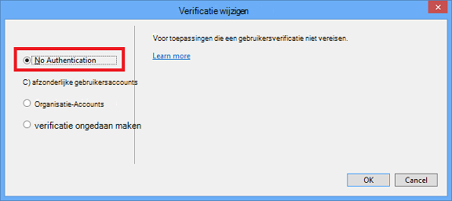

<properties
    pageTitle="Maken van afbeeldingen in korting"
    description="Dit artikel wordt uitgelegd hoe u afbeeldingen maakt in korting op basis van de richtlijnen voor het Azure opslagplaatsen instellen."
    services=""
    solutions=""
    documentationCenter=""
    authors="kenhoff"
    manager="ilanas"
    editor="tysonn"/>

<tags
    ms.service="contributor-guide"
    ms.devlang=""
    ms.topic="article"
    ms.tgt_pltfrm=""
    ms.workload=""
    ms.date="06/25/2015"
    ms.author="kenhoff" />

# <a name="create-images-in-markdown"></a>Maken van afbeeldingen in korting

## <a name="image-folder-creation-and-link-syntax"></a>Afbeelding van de map maken en de koppeling syntaxis

Voor een nieuw artikel moet u een map maken in de volgende locatie:

    /articles/<service-directory>/media/<article-name>/

Bijvoorbeeld:

    /articles/app-service/media/app-service-enterprise-multichannel-apps/

Nadat u de map en de toegevoegde afbeeldingen toe hebt gemaakt, gebruikt u de volgende syntaxis om te maken van afbeeldingen in uw document:

```

```
Voorbeeld:

Zie [de korting-sjabloon](../markdown%20templates/markdown-template-for-new-articles.md) voor een voorbeeld.  De afbeelding van de verwijzing koppelingen in deze sjabloon korting zijn ontworpen om te worden onder aan de sjabloon.

## <a name="guidelines-specific-to-azuremicrosoftcom"></a>Richtlijnen die specifiek zijn voor azure.microsoft.com

Schermafbeeldingen wordt momenteel aangeraden als het is niet mogelijk om op te nemen Reproductiestappen. Schrijf uw inhoud zodat de inhoud staan zonder de schermafbeeldingen indien nodig.

Gebruik de volgende richtlijnen bij het maken en inclusief art-bestanden:
- Kan geen art-bestanden delen in documenten. Kopieer het bestand dat u nodig hebt en deze toevoegen aan de map media voor uw specifieke onderwerp. Delen tussen bestanden wordt afgeraden omdat het is eenvoudig verwijderen afgeschaft inhoud en afbeeldingen die de cessies‑retrocessies schoon blijft.

- Bestandsindelingen: .png bestanden - gebruiken ze zijn van betere kwaliteit en voor het behoud van de kwaliteit tijdens het lokalisatie. Overige bestandsindelingen volgt te werk als u ook de kwaliteit niet behouden. De indeling .jpeg is toegestaan, maar niet de voorkeur.  Geen geanimeerde GIF-bestanden.

- Gebruik rood opgevuld vierkantje van de standaardbreedte die beschikbaar zijn in Paint (5 px) aan te wijzen aan bepaalde elementen in schermafbeeldingen.  

    Voorbeeld:

    

- Als dat relevant is, je mag rustig bijsnijden van afbeeldingen, zodat de gebruikersinterface-elementen in volledige grootte wordt weergegeven. Zorg ervoor dat de context, maar uitgeschakeld voor gebruikers is.

- Geen witruimte op randen van schermafbeeldingen. Als u een schermafbeelding op een manier die witte achtergrond aan de randen verlaat bijsnijden, moet u een rand één pixel grijze rond de afbeelding toevoegen.  Als Paint, gebruikt u de lichtere grijs in de standaard-kleurenpalet (0xC3C3C3). Als u enkele andere afbeelding app gebruikt, is de RGB-kleur R195, G195, 195. U kunt eenvoudig een grijze rand rond een afbeelding toevoegen in Visio--als volgt, selecteer de afbeelding, selecteert u lijn en zorgen dat het de juiste kleur is ingesteld, en wijzig vervolgens de lijndikte in 1-1/2 pt.  Schermafbeeldingen moet een grijze rand 1 pixel breed hebben, zodat de witte gebieden van de schermafbeelding doen niet Vervagen naar de webpagina.

    Voorbeeld:

    
    
    Zie [AddACOMBorder hulpprogramma - automatiseren van het proces van het toevoegen van de rand van de vereiste 1 pixel grijze naar ACOM afbeeldingen](https://github.com/Azure/Azure-CSI-Content-Tools/tree/master/Tools/AddACOMImageBorder)voor een hulpmiddel voor het automatiseren van het proces van het de vereiste rand toevoegen aan afbeeldingen.

- Conceptuele afbeeldingen met een spatie hoeft u niet een grijze rand.  

    Voorbeeld:

    

- Probeer om niet te maken van een afbeelding te breed.  Afbeeldingen wordt automatisch aangepast als ze te lang zijn. Echter de formaat wijzigt soms wordt overeenkomst, zodat het is raadzaam dat u de breedte van de afbeeldingen naar 780 beperken px en handmatig tabelgrootte wijzigen afbeeldingen voordat het wordt ingediend indien nodig.

- Uitvoer van de opdracht weergeven in schermafbeeldingen.  Als uw artikel stappen waar de gebruiker binnen een shell werkt bevat, is het handig om weer te geven van de opdrachtuitvoer in schermafbeeldingen. In dit geval de breedte van uw shell tot ongeveer 72 tekens in het algemeen beperken zorgt ervoor dat de afbeelding binnen de 780 px breedte richtlijn blijft. Het vensterformaat alvorens een schermafbeelding van uitvoer, zodat alleen de relevante opdracht en uitvoer (u kunt ook met een lege regel aan beide zijden) wordt weergegeven.

- Hele schermopnamen van windows indien mogelijk. Bij het nemen van een schermafbeelding van een browservenster, de grootte van het browservenster naar 780 px breed of minder en behouden de hoogte van het browservenster als korte mogelijk zodat uw toepassing in het venster past.

    Voorbeeld:

    

- Wees voorzichtig met welke gegevens in schermafbeeldingen weergegeven.  Ontdek interne bedrijfsgegevens en persoonlijke gegevens niet.

- In conceptuele kunst of -diagrammen, gebruikt u de officiële pictogrammen in de Cloud en Enterprise symbool en pictogram. Een openbare set is beschikbaar binnen http://aka.ms/CnESymbols.

- Persoonlijke of vertrouwelijke informatie in schermafbeeldingen vervangen door een tijdelijke aanduiding voor tekst tussen punthaken. Dit geldt ook voor gebruikersnamen, abonnement-id's en andere verwante info. Persoonlijke namen kunnen worden vervangen door een [goedgekeurde fictious naam](https://aka.ms/ficticiousnames)(werknemer alleen-lezen-koppeling). Gebruik niet de tip Kleurkrijt of markering in Paint onzichtbaar maken of vervagen persoonlijke of vertrouwelijke informatie.

  De volgende afbeelding is juist bijgewerkt als u wilt vervangen van de werkelijke **abonnements-ID** met tijdelijke aanduiding voor informatie over:

  

### <a name="contributors-guide-links"></a>Inzenders de handleiding voor koppelingen

- [Van overzichtsartikel](./../README.md)
- [Index van artikelen](./contributor-guide-index.md)
