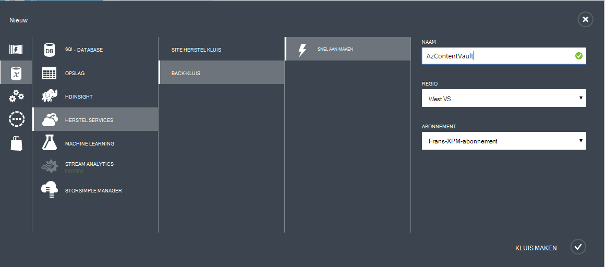
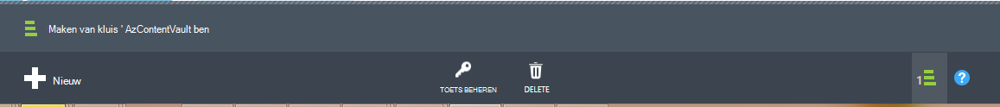

## Een back-kluis maken
Als u wilt back-up van bestanden en gegevens van Windows Server of Data Protection Manager (DPM) naar Azure of back-ups van IaaS VMs naar Azure, moet u een back-kluis maken in de geografische regio waar u de gegevens op te slaan.

De volgende stappen wordt u begeleid bij het maken van de kluis gebruikt voor het opslaan van back-ups.

1. Meld u aan bij de [Management Portal](https://manage.windowsazure.com/)
2. Klik op **Nieuw** > **Gegevensservices** > **Herstel Services** > **Kluis back-up** en kiest u **Snelle maken**.

    

3. Typ een beschrijvende naam voor de back-kluis voor de parameter **naam** . Dit moet uniek zijn voor elk abonnement.

4. Selecteer het geografische gebied voor de back-kluis voor de parameter **regio** . De keuze bepaalt de geografische regio waarnaar u uw back-upgegevens wordt gestuurd. Als u een geografische regio dicht bij uw locatie kiest, kunt u het netwerklatentie verkleinen wanneer een back-up naar Azure.

5. Klik op **Kluis maken** om de werkstroom te voltooien. Het kan even duren voordat de back-kluis moet worden gemaakt. U kunt u de status controleren door de meldingen onderaan in de portal controleren.

    

6. Nadat u de back-kluis hebt gemaakt, een bericht verschijnt dat de kluis is gemaakt. De kluis wordt ook weergegeven in de bronnen voor herstel Services als **actief**.

    

### Azure back-up - opslag redundantieopties

>[AZURE.IMPORTANT] De beste tijd om uw opslagruimte redundantie optie identificeren is direct na kluis maken en voordat computers om de zijn geregistreerd. Nadat een item naar de kluis is geregistreerd, wordt de optie van opslag redundantie is vergrendeld en kan niet worden gewijzigd.

Uw zakelijke behoeften, moeten de back-up van Azure backend-opslag redundante opslag bepalen. Als u Azure als een eindpunt primaire back-up opslaan gebruikt (bijvoorbeeld u een back-up naar Azure vanaf een Windows Server), moet u rekening houden met geografische-redundante opslag-optie kiezen (de standaardinstelling). Dit wordt gezien onder de optie **configureren** van uw back-up-kluis.

#### Geografische-redundante opslag (GRS)
GRS onderhoudt zes kopieën van uw gegevens. Met GRS, uw gegevens drie keer binnen de primaire regio is gerepliceerd en tevens driemaal in een secundaire gebied honderden van mijl weg van het primaire regio leveren van het hoogste niveau van levensduur worden gerepliceerd. Bij een storing bij de primaire regio, door gegevens te slaan in GRS, Azure back-up zorgt ervoor dat uw gegevens duurzame in twee afzonderlijke regio's.

#### Lokaal redundante opslag (LRS)
Lokaal redundante opslag (LRS) onderhoudt drie kopieën van uw gegevens. LRS wordt drie keer binnen één voorziening in één regio gerepliceerd. LRS beveiligt uw gegevens van problemen met de normale hardware, maar niet vanuit het mislukken van een hele Azure faciliteit.

Als u Azure als een eindpunt tertiaire back-up opslaan gebruikt (bijvoorbeeld u SCDPM gebruikt om een lokale back-up on-premises implementatie & Azure gebruikt voor uw bewaarbeleid langdurig kopiëren), moet u rekening houden lokaal redundante opslag van de optie **configureren** van uw back-up-kluis te kiezen. Hierdoor wordt de kosten voor het opslaan van gegevens in Azure wordt aangegeven, terwijl een lager niveau van de levensduur voor uw gegevens die geschikt voor tertiaire exemplaren zijn mogelijk.

