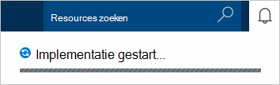

1.  Meld u aan bij de [portal van Azure](https://portal.azure.com/).
2.  In de Jumpbar, klikt u op **Nieuw**, klikt u op **gegevens + opslagruimte**en klik vervolgens op **DocumentDB (NoSQL)**.

      

3. Geef in het blad **Nieuw account** op de gewenste configuratie voor het account DocumentDB.

    

    - Voer een naam voor het account DocumentDB in het vak **ID** .  Wanneer de **ID** is gevalideerd, wordt een groen vinkje weergegeven in het vak **ID** . De waarde **ID** wordt de hostnaam van de in de URI. De **ID** kan alleen kleine letters, cijfers bevatten en de '-' karakter en moet liggen tussen 3 en 50 tekens bevatten. Houd er rekening mee dat *documents.azure.com* wordt toegevoegd aan de naam van het die u kiest, het resultaat van de plaats waar uw DocumentDB account eindpunt verandert.

    - Selecteer in het vak **NoSQL API** **DocumentDB**.  

    - Selecteer het Azure abonnement die u wilt gebruiken voor het account DocumentDB voor **abonnement**. Als uw account slechts één abonnement heeft, is dat account al dan niet standaard geselecteerd.

    - Selecteer in de **Resourcegroep**of een resourcegroep voor uw account DocumentDB maken.  Standaard is een nieuwe resourcegroep gemaakt. Zie [met behulp van de Azure portal als u wilt uw Azure resources beheren](../articles/azure-portal/resource-group-portal.md)voor meer informatie.

    - Met **locatie** kunt u de geografische locatie waarin u voor het hosten van uw account DocumentDB opgeven. 

4.  Nadat de nieuwe opties voor het account van DocumentDB zijn geconfigureerd, klikt u op **maken**. Wilt controleren van de status van de implementatie, schakelt u de hub meldingen.  

      

    

5.  Nadat het account DocumentDB is gemaakt, is het gereed voor gebruik met de standaardinstellingen. De standaard-consistentie van het DocumentDB-account is ingesteld op de **sessie**.  U kunt de standaard-consistentie aanpassen door te klikken op **Standaard consistentie** in het menu van de resource. Zie voor meer informatie over de consistentie niveaus aangeboden door DocumentDB, [consistentie niveaus in DocumentDB](../articles/documentdb/documentdb-consistency-levels.md).

      

      

[How to: Create a DocumentDB account]: #Howto
[Next steps]: #NextSteps
[documentdb-manage]:../articles/documentdb/documentdb-manage.md
