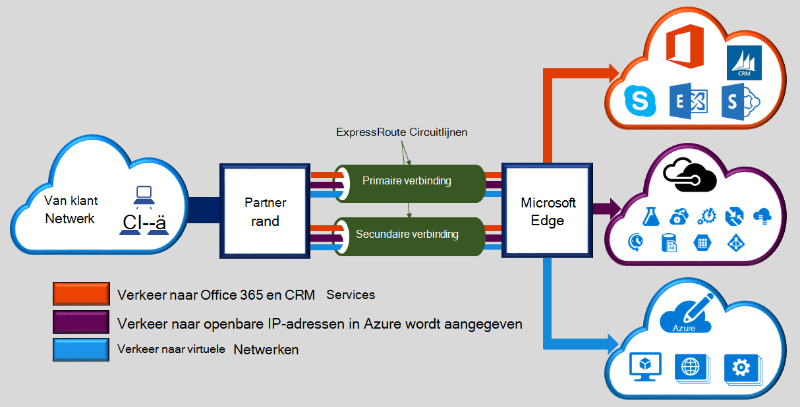

Microsoft Azure ExpressRoute kunt u uw on-premises implementatie-netwerken uitbreiden naar het Microsoft cloud via een speciale privé verbinding vergemakkelijkt door een provider connectivity. U kunt verbindingen met Microsoft cloudservices, zoals Microsoft Azure, Office 365 en CRM Online tot stand te brengen met ExpressRoute. Connectiviteit kan afkomstig zijn uit een de toepassing te (VPN IP)-netwerk, een Ethernet-netwerk met een punt of een virtuele cross-verbinding via een provider connectivity in de inrichting van een collega locatie. ExpressRoute verbindingen gaan niet via de openbare Internet. Hierdoor ExpressRoute verbindingen om te bieden meer betrouwbaarheid, snellere snelheden lagere vertragingstijden en hoger beveiliging dan de normale verbindingen via Internet.  

